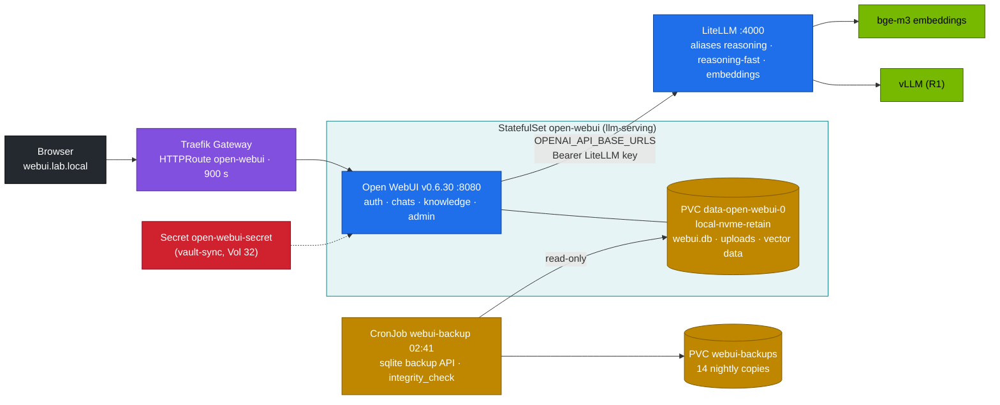

# Volume 27 — Open WebUI for Reasoning Models: A Hardened Chat Front End, Visible Thinking, Built-In RAG, and Tested Backups

> **Module 03 · Part VII — Applications** · Prev: [26 FSDP & ZeRO-3](26-distributed-deepspeed-zero3-and-fsdp.md) · Next: [28 LiteLLM gateway](28-litellm-proxy-gateway-load-balancing.md)

| | |
|---|---|
| **You will build** | Open WebUI as the team's chat front end for the Spark. It talks only to LiteLLM, shows R1's thinking as a collapsible block, admits new users only after admin approval, keeps sessions across restarts, uses the lab's bge-m3 for document RAG, and has a nightly SQLite backup that you restore in a drill |
| **Hardware** | spark-01 |
| **Time** | 75 min |
| **Risk** | Low. The restore drill replaces the database with last night's copy. Take a manual backup first (§5.6) |
| **Lab files** | [`k8s/apps/open-webui.yaml`](lab/k8s/apps/open-webui.yaml), [`k8s/ops/webui-backup.yaml`](lab/k8s/ops/webui-backup.yaml), [`k8s/apps/litellm.yaml`](lab/k8s/apps/litellm.yaml), [`k8s/apps/bge-m3.yaml`](lab/k8s/apps/bge-m3.yaml) |

---

## 1. Why a front end needs engineering too

Open WebUI is the fastest way to give people a ChatGPT-like experience on your own hardware. Run with defaults, it's also an open sign-up page that forgets its signing key on restart, keeps every chat in one unbacked SQLite file, and talks to model servers directly. Production use needs:

| Concern | Default | Lab setting |
|---|---|---|
| Who can sign up | anyone. The first user becomes admin | `DEFAULT_USER_ROLE=pending`: new users wait for approval |
| Session signing key | generated at start, outside the PVC | `WEBUI_SECRET_KEY` from a Secret (Vault-synced). Logins survive restarts |
| Model access | whatever the backend lists | only LiteLLM aliases (`reasoning`, `reasoning-fast`). Per-group visibility in the admin panel |
| Long answers | client timeout 300 s | `AIOHTTP_CLIENT_TIMEOUT=900` (matches Vol 21) |
| Data | `webui.db` on a PVC | `local-nvme-retain` PVC + nightly online backup, integrity-checked, 14 kept |
| Embeddings for uploads | built-in CPU model | the lab's `bge-m3` via LiteLLM alias `embeddings` |

---

## 2. Architecture — HLD



---

## 3. LLD

### 3.1 Environment variables in the manifest

| Variable | Value | Purpose |
|---|---|---|
| `OPENAI_API_BASE_URLS` / `OPENAI_API_KEYS` | `http://litellm.llm-serving:4000/v1` / the LiteLLM key | the only backend |
| `ENABLE_OLLAMA_API` | false | no direct Ollama path that bypasses LiteLLM |
| `WEBUI_URL` | `http://webui.lab.local` | links in emails and OAuth callbacks |
| `RAG_EMBEDDING_ENGINE` / `RAG_OPENAI_API_BASE_URL` / `RAG_EMBEDDING_MODEL` | `openai` / LiteLLM / `embeddings` | document embeddings on the GB10 via bge-m3 |
| `DEFAULT_USER_ROLE` | `pending` | approval workflow |
| `AIOHTTP_CLIENT_TIMEOUT` | 900 | long reasoning streams |
| `WEBUI_SECRET_KEY` | from `open-webui-secret` | stable JWT signing |

### 3.2 Why a StatefulSet

One replica, a stable pod name (`open-webui-0`) and a `volumeClaimTemplate` that gives a PVC (`data-open-webui-0`) that outlives the pod. Open WebUI's default SQLite database doesn't support multiple writers. For more than one replica, switch to PostgreSQL (`DATABASE_URL`, `POSTGRES_IMAGE` is pinned in `versions.env`) and a shared vector store.

### 3.3 How thinking is shown

vLLM's reasoning parser streams `delta.reasoning_content` before `delta.content` (Vol 21). LiteLLM passes it through, and Open WebUI renders it as a collapsible **"Thought for N seconds"** block above the answer. If a backend has no parser, Open WebUI also recognises raw `<think>…</think>` in the content.

### 3.4 Backup design

| Choice | Reason |
|---|---|
| SQLite **online backup API** (not `cp`) | consistent snapshot while the app writes. A file copy can capture a half-written page |
| source opened `mode=ro` | the backup can't modify the live database |
| `PRAGMA integrity_check` on the copy | a backup you haven't checked isn't a backup |
| separate Retain PVC, keep 14 | survives deleting the app. Bounded size |

---

## 4. Integrations

- **Vol 21**: same Gateway and timeouts. Open WebUI is just another client on the path.
- **Vol 28**: give Open WebUI its own LiteLLM virtual key with a budget instead of the master key.
- **Vol 29**: Open WebUI's built-in RAG is for ad-hoc uploads. The repository-wide index lives in Qdrant.
- **Vol 32**: `open-webui-secret` and the LiteLLM key come from Vault through `vault-sync`.

---

## 5. Lab

### 5.1 Deploy with a real secret

```bash
cd "03-DeepSeek/lab"
kubectl apply -k k8s/apps
kubectl -n llm-serving create secret generic open-webui-secret --from-literal=secret-key="$(openssl rand -hex 32)" \
  --dry-run=client -o yaml | kubectl apply -f -
kubectl -n llm-serving rollout restart sts/open-webui
kubectl -n llm-serving rollout status sts/open-webui --timeout=10m
curl -s http://webui.lab.local/health                     # {"status":true}
```

### 5.2 Admin account and approval workflow

1. Open `http://webui.lab.local` and sign up. The first account becomes **admin**.
2. In a private window, sign up a second user. Expected: an "account activation pending" screen.
3. As admin: **Admin Panel → Users** → set the new user to *user*.

### 5.3 Models and visibility

**Admin Panel → Settings → Connections** shows the LiteLLM connection. **Workspace → Models** lists `reasoning`, `reasoning-fast`, `reasoning-sglang` and `embeddings`. Hide `embeddings` from chat, and restrict `reasoning` (the 32B) to a group if you want to ration it.

### 5.4 Watch thinking stream

Ask `reasoning-fast`: *"A training run saves a checkpoint every 7 steps. How many checkpoints exist after 100 steps? Explain briefly."* Expected: a "Thinking…" block that streams and then collapses to "Thought for N seconds", followed by the answer **14**. Cross-check the timing with `stream_probe.py` through the same Gateway (Vol 21).

### 5.5 Document RAG with bge-m3

**Workspace → Knowledge → +**: create "DeepSeek lab" and upload `03-DeepSeek/21-ingress-and-realtime-streaming-gateways.md`. In a new chat, type `#` and pick the collection, then ask: *"What request timeout does the LiteLLM HTTPRoute use?"* Expected: **900 s**, with a citation to the uploaded file. Confirm the embeddings went to the GB10:

```bash
kubectl -n llm-serving logs deploy/bge-m3 | grep -c 'POST /v1/embeddings'
```

### 5.6 Back up, then prove you can restore

```bash
kubectl apply -f k8s/ops/webui-backup.yaml
kubectl -n llm-serving create job --from=cronjob/webui-backup webui-backup-now
kubectl -n llm-serving logs -f job/webui-backup-now
```

```text
webui-20261002T150412Z.db 1032192 bytes, integrity: ok
```

Restore drill: delete a chat in the UI, then roll the database back to the backup.

```bash
B=$(kubectl -n llm-serving logs job/webui-backup-now | awk '/integrity: ok/{print $1}')
kubectl -n llm-serving scale sts open-webui --replicas=0
kubectl -n llm-serving apply -f - <<EOF
apiVersion: batch/v1
kind: Job
metadata: {name: webui-restore, namespace: llm-serving}
spec:
  backoffLimit: 0
  template:
    spec:
      restartPolicy: Never
      containers:
        - name: restore
          image: python:3.12-slim
          command: ["sh", "-c", "cp /data/webui.db /data/webui.db.before-restore && cp /backups/$B /data/webui.db && ls -l /data"]
          resources: {requests: {cpu: 100m, memory: 64Mi}, limits: {memory: 128Mi}}
          volumeMounts: [{name: data, mountPath: /data}, {name: backups, mountPath: /backups, readOnly: true}]
      volumes:
        - {name: data, persistentVolumeClaim: {claimName: data-open-webui-0}}
        - {name: backups, persistentVolumeClaim: {claimName: webui-backups}}
EOF
kubectl -n llm-serving wait --for=condition=complete job/webui-restore --timeout=2m
kubectl -n llm-serving scale sts open-webui --replicas=1
```

Expected: after logging in again, the deleted chat is back. Record how long the restore took. That's your recovery time for the chat service.

### 5.7 Sessions survive a restart

Stay logged in, then `kubectl -n llm-serving delete pod open-webui-0`. When the pod returns, refresh: you're still logged in, because the signing key comes from the Secret.

---

## 6. Verify

| Check | Expected |
|---|---|
| health | `/health` → `{"status":true}` |
| sign-up | second user is `pending` until approved |
| thinking | collapsible block, then the answer |
| RAG | answer cites the uploaded file. bge-m3 log shows embedding calls |
| backup | `integrity: ok`. File in `webui-backups` |
| restore | deleted chat reappears |

---

## 7. Troubleshooting

| Symptom | Cause | Fix |
|---|---|---|
| no models in the picker | wrong LiteLLM key, or LiteLLM down | `kubectl -n llm-serving logs sts/open-webui | grep -i openai`. Check the key Secret |
| answer stops after ~5 min | `AIOHTTP_CLIENT_TIMEOUT` (or another hop) too short | 900 everywhere (Vol 21) |
| thinking shown as plain text | backend lacks a reasoning parser | `--reasoning-parser=deepseek_r1` on vLLM (D01) |
| everyone logged out after a restart | `WEBUI_SECRET_KEY` unset or changed | set it from the Secret. Don't rotate it casually |
| RAG upload fails `embedding` error | `embeddings` alias missing, or bge-m3 not ready | `kubectl get deploy bge-m3`. Check the LiteLLM model list |
| `database is locked` | two replicas on SQLite | one replica, or PostgreSQL |
| backup Job Pending | PVC bound to another node (two-Spark cluster) | schedule the Job on the node holding `data-open-webui-0` |

---

## 8. Scale-out path

| One Spark | Production |
|---|---|
| SQLite + nightly backup | PostgreSQL (HA) with PITR. Uploads in object storage. A shared vector DB (Qdrant/pgvector) |
| local accounts with approval | SSO via OIDC (`ENABLE_OAUTH_SIGNUP`, `OAUTH_*`) and group mapping from the IdP |
| one replica | several replicas behind the Gateway, Redis for websockets/sessions |

---

## 9. Checklist

- [ ] New users can't use the GPU until an admin approves them.
- [ ] Thinking renders separately from the answer.
- [ ] Uploaded documents are embedded on the Spark, not on a CPU fallback.
- [ ] I restored the chat database from a backup and know how long it took.
