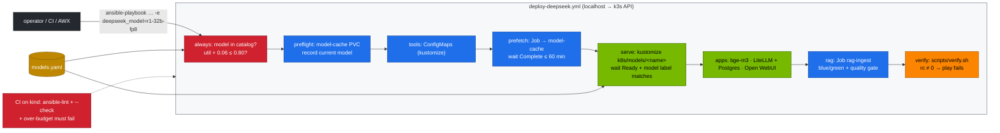

# Volume 31 — One-Click Deployment with Ansible: The Whole DeepSeek Stack from the Catalog, Pre-Flight Guards, Check Mode, Tags and Rollback

> **Module 03 · Part VIII — Automation and operations** · Prev: [30 Tool calling & agents](30-tool-calling-and-agentic-json.md) · Next: [32 Vault secrets](32-hashicorp-vault-secrets-integration.md)

| | |
|---|---|
| **You will build** | One idempotent playbook that takes the 02 platform to a verified DeepSeek stack: tools, weights, the chosen model, embeddings, LiteLLM with its database, Open WebUI and a quality-gated RAG index. It refuses unknown models and over-budget memory before touching the cluster, shows what would change in check mode, switches or rolls back the model with one tag, and is linted and dry-run in CI against a kind cluster |
| **Hardware** | control node (01-Ansible lab) + spark-01 |
| **Time** | 60 min (plus download time on the first run) |
| **Risk** | Medium. A real run replaces the served model (`Recreate`, ~minutes of downtime). Use `--check` first |
| **Lab files** | [`ansible/deploy-deepseek.yml`](lab/ansible/deploy-deepseek.yml), [`models.yaml`](lab/models.yaml), [`scripts/verify.sh`](lab/scripts/verify.sh), [`.github/workflows/deepseek-lab-ci.yml`](../.github/workflows/deepseek-lab-ci.yml) |

---

## 1. Why a playbook when scripts exist

`serve-model.sh` is good for one person at a terminal. An operations team needs more:

| Need | How the playbook meets it |
|---|---|
| one source of truth | reads the same `models.yaml` catalog as the scripts and CI |
| refuse bad input early | asserts the model exists and that `util + embeddings ≤ budget` **before** any API call |
| preview | `--check --diff` uses server-side dry runs. Nothing changes |
| partial runs | tags: `tools`, `prefetch`, `serve`, `apps`, `rag`, `verify` |
| rollback | prints the currently served model and the exact command to return to it |
| evidence | ends with `verify.sh`. A failed check fails the play |
| tested | `ansible-lint` (production profile) and a check-mode run on kind in CI |

It builds on the 01-Ansible module: same control node, collections (`kubernetes.core`), kubeconfig and Vault.

---

## 2. Architecture — HLD



---

## 3. LLD

### 3.1 Variables

| Variable | Default | Meaning |
|---|---|---|
| `deepseek_model` | `r1-7b` | catalog name to serve |
| `deepseek_with_apps` | true | bge-m3, LiteLLM + Postgres, Open WebUI |
| `deepseek_with_rag` | true | run the RAG ingest (needs apps) |
| `deepseek_skip_prefetch` | false | skip the download step when weights are known to be cached |
| `deepseek_util_budget` | 0.80 | max sum of `--gpu-memory-utilization` for chat + embeddings |
| `deepseek_embed_util` | 0.06 | bge-m3's share |
| `kubeconfig` | `$KUBECONFIG`, else `01-Ansible/lab/.cache/kubeconfig-spark-lab.yaml` | cluster credentials |

### 3.2 Tasks, tags and idempotency

| Task | Tag | Changes on a second identical run? |
|---|---|---|
| catalog + budget asserts | `always` | never (asserts) |
| PVC present, current model | `preflight` | no (reads) |
| ConfigMaps | `tools` | no, unless tool files changed |
| delete + recreate prefetch Job | `prefetch` | **yes**: Job templates are immutable, so it re-runs (fast when cached). Use `-e deepseek_skip_prefetch=true` |
| vLLM overlay | `serve` | no, unless the model changed |
| wait Ready + label = model | `serve` | — (skipped in check mode) |
| apps | `apps` | no |
| RAG ingest | `rag` | **yes**: builds a new collection by design (Vol 29) |
| verify | `verify` | never (`changed_when: false`) |

### 3.3 The two guards

```yaml
- assert: deepseek_model in catalog_names                      # typo → clear message with the valid names
- assert: model.util + embed_util ≤ deepseek_util_budget       # 0.70 + 0.06 ≤ 0.80 ✓  ;  0.95 + 0.06 ✗
```

Both are tagged `always`, so even `--tags serve` checks them.

---

## 4. Integrations

- **01-Ansible**: run from `01-Ansible/lab` so its `ansible.cfg`, collections and kubeconfig apply. Vault lookups (Vol 32) work the same way.
- **Vol 15**: the catalog. Adding a model there makes it deployable here with no playbook change.
- **Vol 29**: the `rag` tag runs the gated ingest. A failed gate fails the play.
- **CI**: `deepseek-lab-ci.yml` lints the playbook, runs it in check mode on kind, and asserts the budget guard fires.

---

## 5. Lab

```bash
cd "01-Ansible/lab"
export KUBECONFIG=$PWD/.cache/kubeconfig-spark-lab.yaml
PB="../../03-DeepSeek/lab/ansible/deploy-deepseek.yml"
```

### 5.1 Lint and syntax

```bash
ansible-playbook --syntax-check "$PB"
ansible-lint "$PB"            # Passed … profile 'production'
```

### 5.2 Preview with check mode

```bash
ansible-playbook "$PB" --check --diff -e deepseek_model=r1-32b-fp8
```

```text
TASK [Show the change] ****
ok: [localhost] => msg: 'vLLM: r1-7b → r1-32b-fp8  (rollback: --tags serve -e deepseek_model=r1-7b)'
…
PLAY RECAP ****
localhost : ok=12  changed=5  unreachable=0  failed=0  skipped=3
```

### 5.3 The guards

```bash
ansible-playbook "$PB" --check -e deepseek_model=r1-70b                 # unknown → lists the catalog
ansible-playbook "$PB" --check -e deepseek_model=r1-32b -e deepseek_util_budget=0.6
```

Expected: both fail at the first tasks with readable messages. No API calls were made.

### 5.4 Full deployment

```bash
time ansible-playbook "$PB" -e deepseek_model=r1-32b-fp8
```

Expected: the final `Result` shows the last lines of `verify.sh` with `0 failed`. Record the wall time of the first run (download-bound) and of an immediate second run:

```bash
time ansible-playbook "$PB" -e deepseek_model=r1-32b-fp8 -e deepseek_skip_prefetch=true --skip-tags rag
```

| Run | Wall time (**record yours**) | `changed=` |
|---|---|---|
| first (downloads) | | |
| second (idempotent, no prefetch/rag) | | expect 0–1 |

### 5.5 Switch and roll back the model

```bash
ansible-playbook "$PB" --tags serve -e deepseek_model=r1-7b -e deepseek_skip_prefetch=true
# the "Show the change" line printed the rollback command; run it:
ansible-playbook "$PB" --tags serve -e deepseek_model=r1-32b-fp8 -e deepseek_skip_prefetch=true
```

Make sure the target's weights are cached first (they are if it was served before). Otherwise drop `deepseek_skip_prefetch`.

### 5.6 Record runs (optional)

With the 01-Ansible lab's ARA callback enabled, every task, its duration and its result are stored. Open ARA and compare the first and second runs from §5.4.

---

## 6. Verify

| Check | Expected |
|---|---|
| lint | 0 failures, production profile |
| check mode | completes, `failed=0`, wait/verify skipped |
| guards | both refuse before touching the cluster |
| real run | `verify.sh` all PASS. `kubectl -n llm-serving get deploy vllm -L model` shows the requested model |
| rollback | the previous model is back via `--tags serve` |

---

## 7. Troubleshooting

| Symptom | Cause | Fix |
|---|---|---|
| `couldn't resolve module/action 'kubernetes.core.k8s'` | collection missing | `ansible-galaxy collection install -r requirements.yml -p ./collections` in 01 lab |
| `Failed to import the required Python library (kubernetes)` | Python client missing | `pip install kubernetes` (01 `requirements.txt`) |
| `kustomize` lookup fails | no `kubectl`/`kustomize` binary on PATH | install kubectl. The lookup shells out to it |
| `Invalid kube-config file` | wrong `KUBECONFIG` | export it, or check the default path |
| play hangs at "Wait for vLLM" | model too big, OOM loop, or download inside the pod | `kubectl -n llm-serving describe pod -l app=vllm`. The task gives up after 45 min |
| `Job … field is immutable` | an old Job with the same name | the play deletes prefetch/rag Jobs first. For others: `kubectl delete job …` |
| RAG task fails | quality gate failed (Vol 29) | read `kubectl -n llm-serving logs job/rag-ingest`. The alias still points at the old index |

---

## 8. Scale-out path

| One Spark | Fleet |
|---|---|
| `hosts: localhost`, one kubeconfig | inventory of clusters. Same play per cluster with `serial` and a canary group |
| manual runs | AWX/AAP job templates with RBAC and approvals, or GitOps (Argo CD) for the manifests with Ansible for the out-of-cluster steps |
| verify.sh | post-deploy eval gate (Vol 40) and SLO checks before promoting the next cluster |

---

## 9. Checklist

- [ ] One command takes the 02 platform to a verified DeepSeek stack.
- [ ] Bad model names and over-budget memory are refused before anything changes.
- [ ] I can preview with `--check` and switch or roll back with `--tags serve`.
- [ ] The playbook is linted and dry-run in CI.
