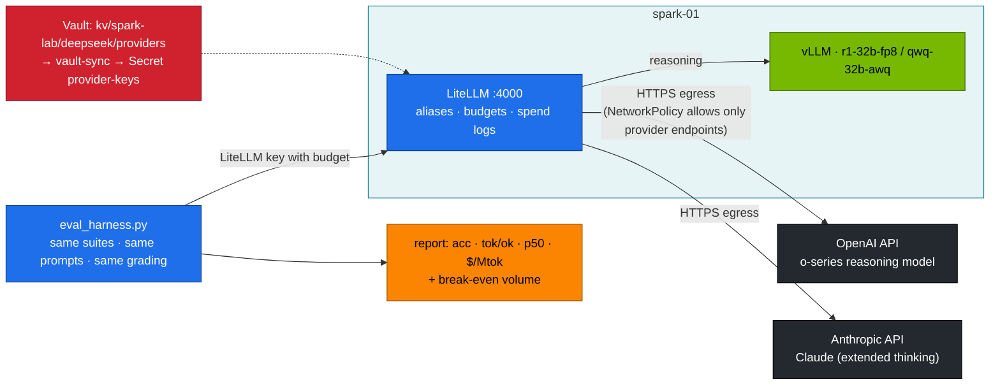

# Volume 37 — DeepSeek on the Spark vs Hosted Reasoning APIs (OpenAI o-series, Anthropic Claude): Same Harness, Real Economics, and a Hybrid Router

> **Module 03 · Part IX — Model comparisons** · Prev: [36 DeepSeek vs Mistral](36-deepseek-vs-mistral-and-mixtral.md) · Next: [38 DCGM, Prometheus & Grafana](38-dcgm-prometheus-and-grafana-telemetry.md)

| | |
|---|---|
| **You will build** | A like-for-like comparison between reasoning models on your Spark (R1-Distill-Qwen-32B FP8, QwQ-32B) and hosted frontier reasoning APIs, run through the same LiteLLM gateway with the same eval harness. You'll compute your local cost per million tokens from measured power and amortised hardware, the break-even volume against an API price you supply, and the latency and accuracy gaps. Then you'll configure a hybrid route: local first, escalate to an API only on failure |
| **Hardware** | spark-01 + outbound HTTPS to the providers you test |
| **Time** | 2 h |
| **Risk** | **Data leaves your network** when you call a hosted API. Use the lab's synthetic eval data only, never internal documents, unless your policy allows it. API calls cost money: set a LiteLLM budget first |
| **Lab files** | [`tools/eval_harness.py`](lab/tools/eval_harness.py), [`scripts/compare-models.sh`](lab/scripts/compare-models.sh), [`k8s/apps/litellm.yaml`](lab/k8s/apps/litellm.yaml), [`tools/stream_probe.py`](lab/tools/stream_probe.py), [`k8s/ops/vault-sync.yaml`](lab/k8s/ops/vault-sync.yaml) |

---

## 1. Why compare with hosted models at all

Self-hosting is a decision with trade-offs, and leadership will ask for numbers:

| Dimension | Local DeepSeek on the Spark | Hosted frontier reasoning API |
|---|---|---|
| Quality on hard reasoning | strong for its size. Distills trail the largest models | typically the state of the art |
| Data governance | nothing leaves the box | prompts and outputs go to the provider (check retention terms) |
| Cost model | fixed: hardware + power. Marginal cost ≈ 0 until capacity runs out | variable: per input/output token, reasoning tokens usually billed as output |
| Latency | no network hop. Bounded by one GB10's decode speed | network + provider queueing. Often faster decode |
| Capacity | one box: tens of tok/s per stream, a few hundred aggregate | elastic, subject to rate limits |
| Control | pinned weights (Vol 33), any sampling, offline | provider updates models on its own schedule |
| Visibility of reasoning | full `reasoning_content` | varies by provider: some return summaries or nothing, only token counts |

The point of this volume is to replace opinions with **your measured numbers** on **your workload class**.

---

## 2. Architecture — HLD



---

## 3. LLD

### 3.1 Adding providers to LiteLLM (not enabled by default)

Store keys in Vault and sync them to a Secret `provider-keys` (add an entry to `SYNC_MAP`, Vol 32). Then extend `litellm-config` with entries like the following. Use the model IDs from each provider's current documentation, because names and versions change often:

```yaml
- model_name: api-reasoning-openai
  litellm_params: {model: openai/<o-series-model-id>, api_key: os.environ/OPENAI_API_KEY}
- model_name: api-reasoning-claude
  litellm_params: {model: anthropic/<claude-model-id>, api_key: os.environ/ANTHROPIC_API_KEY}
```

…and in the Deployment:

```yaml
env:
  - name: OPENAI_API_KEY
    valueFrom: {secretKeyRef: {name: provider-keys, key: openai}}
  - name: ANTHROPIC_API_KEY
    valueFrom: {secretKeyRef: {name: provider-keys, key: anthropic}}
```

Give the benchmark key a **budget** (`max_budget`) so a runaway loop can't run up a bill (Vol 28).

### 3.2 Making the comparison fair

| Rule | Why |
|---|---|
| same suites, prompts and graders | the harness sends identical requests to every alias |
| generous `max_tokens` for everyone (e.g. 16K) | reasoning models need room. Truncation is a harness artefact, not a model property |
| provider-recommended sampling | some reasoning APIs fix or ignore temperature. LiteLLM's `drop_params: true` drops unsupported params instead of failing |
| count all output tokens | hidden reasoning is still billed. The harness reads `usage.completion_tokens` |
| several runs | hosted models are non-deterministic too. Report the spread |

### 3.3 The economics

The harness computes local cost per 1M output tokens from what you measured:

```text
local $/hour  = power_W / 1000 × $/kWh  +  hw_price / (hw_years × 8760 × duty)
local $/Mtok  = local $/hour ÷ (aggregate tok/s × 3600) × 10⁶
```

For hosted aliases, pass `--hosted --api-price-out P`. The report's `$/Mtok` column is then the provider's price instead of your power and hardware.

Break-even against an API price `P` ($ per 1M output tokens):

```text
fixed $/month        = hw_price / (hw_years × 12) + power_W/1000 × hours_used × $/kWh
break-even Mtok/month = fixed $/month ÷ P
capacity Mtok/month   = aggregate tok/s × 3600 × hours_used ÷ 10⁶
```

If your monthly volume is above break-even **and** below capacity, local is cheaper. If it's above capacity, you need more Sparks or a hybrid.

---

## 4. Integrations

- **Vol 28**: providers become LiteLLM aliases with budgets. Spend logs record API cost per key.
- **Vol 32**: provider keys live in Vault, never in a ConfigMap or Git.
- **02 Vol 12/06**: if `llm-serving` has a default-deny egress NetworkPolicy, allow LiteLLM to reach only the providers' endpoints (port 443).
- **Vol 35**: the routing table gains an "escalate" column.

---

## 5. Lab

### 5.1 Measure your Spark's power under load

Run a long eval locally and read wall power from your PDU or smart plug (or `nvidia-smi --query-gpu=power.draw --format=csv -l 5` for the GPU share only, which is an underestimate of wall power):

```bash
cd "03-DeepSeek/lab"
scripts/serve-model.sh r1-32b-fp8
kubectl -n llm-serving port-forward svc/vllm 8000 &
python3 tools/eval_harness.py --url http://localhost:8000 --model r1-32b-fp8 --suites math json \
  --concurrency 8 --max-tokens 16384 --out results/local-r1-32b-fp8.json
```

Record watts (**W**) and set the harness flags to your reality: `--power-w W --kwh-price … --hw-price … --hw-years 3 --duty …`.

### 5.2 Local reasoners through LiteLLM

```bash
KEY=<a LiteLLM virtual key with max_budget>         # Vol 28
API=http://api.lab.local
python3 tools/eval_harness.py --url $API --api-key $KEY --model reasoning --suites math json \
  --concurrency 8 --max-tokens 16384 --power-w W --out results/via-litellm-reasoning.json
```

### 5.3 Hosted APIs through the same gateway

After §3.1:

```bash
for alias in api-reasoning-openai api-reasoning-claude; do
  python3 tools/eval_harness.py --url $API --api-key $KEY --model $alias --suites math json \
    --concurrency 4 --max-tokens 16384 --hosted --api-price-out <provider $/Mtok output> --out results/$alias.json
done
python3 tools/eval_harness.py --report results/local-r1-32b-fp8.json results/api-reasoning-*.json
curl -s "$API/key/info?key=$KEY" -H "Authorization: Bearer <master>" | jq '.info.spend'
```

Fill in (**record yours**):

| | math acc | json acc | tok/ok | p50 s | $/Mtok (local or price) | $ for this run |
|---|---|---|---|---|---|---|
| r1-32b-fp8 (local) | | | | | | ≈ power only |
| hosted o-series | | | | | | from spend log |
| hosted Claude | | | | | | from spend log |

### 5.4 Latency profile

```bash
python3 tools/stream_probe.py --url $API --api-key $KEY --model reasoning --max-tokens 8192
python3 tools/stream_probe.py --url $API --api-key $KEY --model api-reasoning-claude --max-tokens 8192
```

Compare `ttfb`, `first answer` and ITL. Some hosted models don't stream their reasoning text, so `first reasoning` may be empty while `first answer` arrives later.

### 5.5 Break-even for your volume

```bash
python3 - <<'PY'
hw, years, watts, kwh, hours = 4000, 3, 200, 0.15, 24 * 30      # your values
api_price = 2.19                                                # $ per 1M output tokens (your provider)
tok_s = 60                                                      # aggregate tok/s from §5.1 report
fixed = hw / (years * 12) + watts / 1000 * hours * kwh
print(f"fixed cost   ${fixed:,.0f}/month")
print(f"break-even   {fixed / api_price:,.1f} M output tokens/month")
print(f"capacity     {tok_s * 3600 * hours / 1e6:,.1f} M output tokens/month (one Spark, 100% busy)")
PY
```

### 5.6 Hybrid route: local first, escalate on failure

Add the hosted alias as the last fallback for `reasoning` in `litellm-config`:

```yaml
fallbacks: [{"reasoning": ["reasoning-sglang", "reasoning-fast", "api-reasoning-claude"]}]
```

Apply, scale vLLM and SGLang to 0, and send a request to `reasoning`. It's answered by the API, and the spend log attributes the cost to the calling key. Restore local serving afterwards. Decide deliberately whether data-governance rules allow this fallback for each tenant (LiteLLM keys can be restricted per model).

---

## 6. Verify

| Check | Expected |
|---|---|
| fairness | same suites, prompts and `max_tokens` for all. Sampling per provider guidance |
| economics | local $/Mtok from *measured* watts. Break-even and capacity computed |
| spend | LiteLLM spend matches the provider's usage page within rounding |
| hybrid | `reasoning` survives local outage via the API, and only for keys allowed to use it |
| governance | a written note on what data may go to which provider |

---

## 7. Troubleshooting

| Symptom | Cause | Fix |
|---|---|---|
| `401` from provider through LiteLLM | key missing in the pod env, or wrong Secret key name | `kubectl -n llm-serving exec deploy/litellm -- env | grep -c API_KEY`. Check `provider-keys` |
| timeouts to the provider | egress blocked by NetworkPolicy or proxy | allow 443 to the provider. Set `HTTPS_PROXY` in LiteLLM if your network requires it |
| `400 Unsupported parameter: temperature` | some reasoning APIs reject sampling params | `drop_params: true` (already set) |
| accuracy near 0 for an API model | the answer format line ignored, or output truncated | check raw responses (`--limit 2`). Raise `max_tokens` |
| local looks "free" | duty or hardware cost set to 0 | use realistic amortisation. Include your time to operate it |
| unexpected API spend | fallback firing during local outages | spend logs per key. Remove the API fallback for keys that mustn't use it |

---

## 8. Scale-out path

| One Spark | Enterprise |
|---|---|
| manual benchmark | continuous eval on a schedule against both local and hosted models. Alerts on regressions |
| fallback on failure | confidence- or difficulty-based routing (small local model first, escalate when the task is hard), per-tenant policy |
| one box's capacity | more Sparks for steady load, API for bursts: the break-even math decides the mix |

---

## 9. Checklist

- [ ] I compared local and hosted reasoning models with identical requests and graders.
- [ ] My local $/Mtok comes from measured power and real amortisation.
- [ ] I know my break-even volume and my single-Spark capacity.
- [ ] Hosted fallback is enabled only where data policy allows it.
