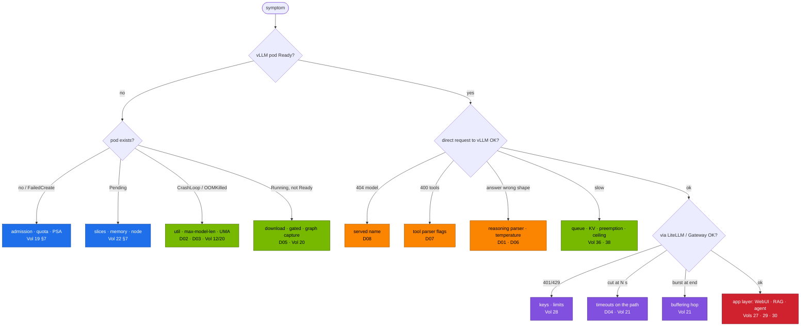

# Volume 39 — Master Troubleshooting Playbook: Triage by Layer, Eight Drills, a Live Triage Script and a Support Bundle

> **Module 03 · Part X — Operate and practise** · Prev: [38 Telemetry](38-dcgm-prometheus-and-grafana-telemetry.md) · Next: [40 Hands-on workbook](40-hands-on-exercises-workbook.md)

| | |
|---|---|
| **You will build** | A single place to start when anything in the DeepSeek stack misbehaves: a five-minute triage routine, a decision tree from symptom to layer, `llm-triage.sh` (a read-only live check that points at the drill or volume with the fix), a symptom index across serving, memory, gateway, apps, training, multi-node and day-2, and practice on all eight injected faults |
| **Hardware** | spark-01 |
| **Time** | 2 h (drills) |
| **Risk** | Low. Drills are reversible with `breakfix.sh reset` |
| **Lab files** | [`scripts/llm-triage.sh`](lab/scripts/llm-triage.sh), [`scripts/breakfix.sh`](lab/scripts/breakfix.sh), [`breakfix/`](lab/breakfix/), [`scripts/verify.sh`](lab/scripts/verify.sh), [`02 …/scripts/collect-diag.sh`](../02-Kubernetes/lab/scripts/collect-diag.sh), [`tools/stream_probe.py`](lab/tools/stream_probe.py) |

---

## 1. Why a playbook

LLM serving failures look alike from the outside ("it's slow", "it's empty", "it hangs") and have causes in very different layers: client parameters, gateway timeouts, engine flags, unified memory, weights, Kubernetes admission, the GPU. Without a routine, people restart things until something changes. This playbook makes the first ten minutes systematic:

1. **Observe** without changing anything (`llm-triage.sh`, dashboard, `stream_probe.py`).
2. **Locate** the layer with the decision tree.
3. **Confirm** with one targeted command.
4. **Fix** the smallest thing. **Verify** with `verify.sh`.
5. **Record** the symptom → cause → fix in your runbook (and in the gold sets: Vol 29, Vol 40).

---

## 2. Architecture — HLD

### 2.1 Decision tree



### 2.2 Where evidence lives

| Layer | First command | Deeper |
|---|---|---|
| Kubernetes | `kubectl -n llm-serving get deploy,pod -l app=vllm -o wide` | `describe`, events, `pod_template_check.py` (Vol 19) |
| engine | `kubectl -n llm-serving logs deploy/vllm --tail=200` | `/metrics`, `/v1/models`, args |
| client view | `stream_probe.py` at each hop | raw `curl -N` SSE |
| memory | `free -g`, `llm-triage.sh host` | dashboard UMA row, `model_math.py` |
| GPU | `nvidia-smi`, `dmesg | grep -i xid` | 02 Vol 19 Xid table |
| day-2 | `kubectl -n llm-serving get cronjobs,jobs` | Job logs, Vol 33 |

---

## 3. LLD

### 3.1 The eight drills

| ID | Inject | Symptom | Root cause | Fix | Volume |
|---|---|---|---|---|---|
| D01 | `breakfix.sh inject D01` | `<think>…</think>` inside `content` | no `--reasoning-parser` | add `deepseek_r1` parser | 05, 15 |
| D02 | `… D02` | vLLM won't start, memory error | util 0.95 on UMA | util ≤ budget (Vol 31 guard) | 12, 15 |
| D03 | `… D03` | start fails: KV can't hold one sequence | 131K context on r1-32b | lower `--max-model-len` or FP8 | 12, 15 |
| D04 | `… D04` | long answers cut at ~30 s via gateway | LiteLLM timeout 30 s | 900 s on every hop | 21, 28 |
| D05 | `… D05` | gated model never Ready | placeholder HF token | licence + token via Vault | 32 |
| D06 | prints a command | R1 loops, `finish_reason=length` | temperature 0 | 0.6, top-p 0.95 | 05, 34 |
| D07 | `… D07` | agent 400 / no `tool_calls` | tool flags removed | `--enable-auto-tool-choice --tool-call-parser` | 30 |
| D08 | prints a command | 404 model not found | HF repo id used as model | served name or LiteLLM alias | 15, 28 |

### 3.2 Symptom index

| Area | Symptom | Likely cause | Confirm | Fix |
|---|---|---|---|---|
| **start** | Pending: `Insufficient nvidia.com/gpu` | slices used by Kueue jobs + other engines | `kubectl describe node` allocatable vs requests | scale down. Keep quota + serving ≤ 4 (Vol 22) |
| | `FailedCreate … violates PodSecurity` | pod spec vs namespace PSA | `pod_template_check.py` | fix securityContext / namespace (Vol 19) |
| | startup > 30 min then restart | download inside pod, slow cache | prefetch Job logs | prefetch first (Vol 20) |
| | `no kernel image is available` | image without sm_121 | image tag | NGC DGX Spark image (Vol 15/17) |
| **memory** | OOMKilled after a big model switch | page cache + new weights | `free -g` before load | drop caches. Lower util (Vol 20) |
| | preemptions climbing | KV too small for concurrency × length | KV usage panel | lower `max-num-seqs`, FP8 KV, smaller context |
| | node NotReady during load | UMA exhausted, kubelet starved | `journalctl -u k3s` | budget guard. Reserve system memory (02 Vol 12) |
| **correctness** | thinking in content | D01 | args | parser |
| | answers truncated | client `max_tokens` | `finish_reason` | raise (8K–32K for R1) |
| | gibberish via a client, fine via curl | system prompt / temperature 0 | client request body | R1 settings (Vol 05) |
| | JSON breaks parsers | free-form output | Vol 30 §5.5 | `response_format` json_schema |
| **performance** | TTFT high | queue or long prompts | waiting gauge, prompt tokens | concurrency limits, prefix caching, spark-02 |
| | ITL far above `1/ceiling` | other GPU work, throttling | GPU row, throttle bits | isolate. Check airflow |
| | prefix cache ~0 % | dynamic text before the shared prefix | hit-rate panel | reorder the prompt (Vol 16) |
| **gateway** | 401 / 429 | key / limit | LiteLLM logs, `key/info` | key scope or limits (Vol 28) |
| | cut at fixed seconds | shortest timeout on the path | `stream_probe.py` per hop | 900 s everywhere (Vol 21) |
| | nothing, then the whole answer | buffering middleware | `BUFFERED` in probe | remove it from streaming routes |
| **apps** | WebUI: no models | wrong LiteLLM key in its DB | Admin → Connections | update key (Vol 27/28) |
| | RAG answers off-topic | index stale or gate disabled | `rag_demo.py eval` | re-ingest with gate (Vol 29) |
| | agent loops | unclear tool results | audit log | better errors. `--max-steps` (Vol 30) |
| **training** | Job Suspended forever | Kueue quota | `kubectl describe workload` | quota or priority (Vol 22) |
| | OOMKilled in SFT/FSDP | batch/seq vs memory | `lora_calc.py` | smaller batch, LoRA, ZeRO-3 NVMe (Vols 23, 26) |
| | NCCL hang (2×) | NIC/GID/hostNetwork | `NCCL_DEBUG=INFO` | CX-7 env vars (Vol 25/26) |
| **day-2** | `weights-verify` failed | snapshot changed | Job log | quarantine, re-download (Vol 33) |
| | secrets stale | Vault sealed / auth | `vault-sync` log | unseal, re-run setup (Vol 32) |
| | backup missing | CronJob failing | `BackupStale` alert | Job log. PVC space |

---

## 4. Integrations

- **Vol 38**: every alert names its first action, and those actions live here.
- **Vol 40**: the workbook's capstone is an unannounced drill solved with this playbook.
- **02 Vol 19**: platform-level diagnostics and the support bundle.

---

## 5. Lab

### 5.1 Baseline: a healthy triage

```bash
cd "03-DeepSeek/lab"
scripts/serve-model.sh r1-7b && kubectl apply -k k8s/apps
scripts/llm-triage.sh
```

Expected: all sections PASS or info. Save the output: it's your "known good".

### 5.2 Run every drill, timed

For each ID: inject, observe *only* with the triage script, the dashboard, logs and `stream_probe.py`, write your diagnosis, then check it.

```bash
for d in D01 D02 D03 D04 D05 D06 D07 D08; do
  echo "=== $d"; scripts/breakfix.sh inject $d
  read -rp "diagnose, then press enter for the answer… " _
  scripts/breakfix.sh answer $d; scripts/breakfix.sh reset $d
done
```

| Drill | Your time to diagnosis | Which signal gave it away |
|---|---|---|
| D01 | | |
| D02 | | |
| D03 | | |
| D04 | | |
| D05 | | |
| D06 | | |
| D07 | | |
| D08 | | |

Target: under 10 minutes each. D01, D05 and D07 are flagged directly by `llm-triage.sh`. D04 needs `stream_probe.py` at two hops.

### 5.3 Collect a support bundle

```bash
"../../02-Kubernetes/lab/scripts/collect-diag.sh" llm-serving batch observability
tar tzf diag-*.tar.gz | head
```

Attach the bundle and the `llm-triage.sh` output to any escalation.

### 5.4 Escalation template

```text
What:     <symptom as a user sees it>, since <time>, affecting <who>
Where:    model <label>, engine <vLLM image tag>, path <client → gateway → engine>
Evidence: llm-triage.sh output; stream_probe at each hop; dashboard screenshot; diag bundle
Tried:    <commands and results>
Ask:      <decision or help needed>
```

---

## 6. Verify

| Check | Expected |
|---|---|
| healthy triage | no FAIL on a healthy stack |
| drills | all eight diagnosed. Times recorded |
| bundle | `diag-*.tar.gz` contains `llm-serving` pod logs and describes |
| runbook | one new line in your own runbook per drill |

---

## 7. Troubleshooting the troubleshooting

| Symptom | Cause | Fix |
|---|---|---|
| `llm-triage.sh` can't exec into vLLM | pod not Running, or RBAC | use logs and describe. Run with an admin kubeconfig |
| metrics counters all 0 | fresh pod, no traffic yet | send a request first |
| host section skipped | not run on the Spark | run it on spark-01 over SSH |
| `breakfix.sh reset` didn't restore | another change was made meanwhile | `scripts/serve-model.sh <model>` re-applies the catalog overlay |

---

## 8. Scale-out path

| One Spark | Production |
|---|---|
| a script and a table | alert → runbook links in Alertmanager annotations. Automated diagnostics on page |
| drills by hand | game days and chaos experiments (kill the engine, fill the disk, rotate keys) on a schedule |
| one bundle | centralised logs and traces. Retention for post-incident review |

---

## 9. Checklist

- [ ] I follow observe → locate → confirm → fix → verify, without restarting first.
- [ ] I solved all eight drills, each in under 10 minutes.
- [ ] I can take any symptom to its layer with the decision tree.
- [ ] I can produce a support bundle and a crisp escalation.
