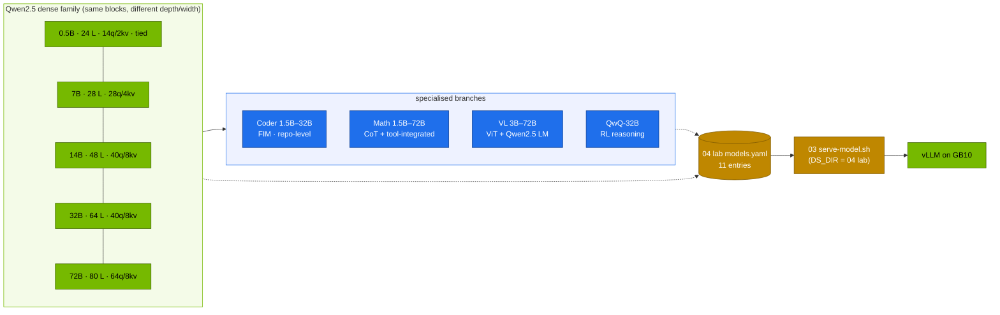

# Volume 01 — Qwen2.5 Architecture and Model Spectrum: Choosing the Right Qwen for One GB10

> **Module 04 · Part I — Architecture** · Next: [02 Attention engineering](02-attention-engineering-gqa-rope-and-dca.md) · Module map: [01 · Qwen ecosystem curriculum](01-qwen-ecosystem-master-curriculum.md)

| | |
|---|---|
| **You will build** | A measured map of the Qwen2.5 family on a DGX Spark. You'll get per-size parameters, KV cost per token, fit and concurrency at a given memory share, the bandwidth ceiling on decode speed, and what Qwen's tokenizer does to your token counts. Then you'll serve four sizes from one catalog and compare accuracy, latency and tokens per correct answer |
| **Hardware** | spark-01 (any machine with internet for the tokenizer step) |
| **Time** | 90 min (comparison runs unattended) |
| **Risk** | Low |
| **Lab files** | [`models.yaml`](lab/models.yaml), [`scripts/serve-model.sh`](lab/scripts/serve-model.sh), [`scripts/compare-models.sh`](lab/scripts/compare-models.sh), [`tools/token_stats.py`](lab/tools/token_stats.py), [`03 …/tools/model_math.py`](../03%20DeepSeek/lab/tools/model_math.py) |

---

## 1. Why the size choice is the first engineering decision

Qwen2.5 is a family of dense decoder-only transformers from 0.5B to 72B parameters, plus specialised branches: Coder (Vol 03), Math (Vol 04), VL (Vol 05), and the reasoning model QwQ. On one GB10, the size decides almost everything else:

| Size | Memory for BF16 weights | What it's good for on a Spark |
|---|---|---|
| 0.5B / 1.5B / 3B | 1–6 GiB | drafts for speculative decoding, classifiers, routers, edge-style tests, very high throughput |
| **7B** | 14 GiB | the workhorse: tools, JSON, RAG answers, with room for many concurrent 32K sequences |
| 14B | 28 GiB | better reasoning and writing. Still fits next to the apps stack |
| 32B | 61 GiB BF16 / ~15–18 GiB AWQ | the strongest that fits comfortably. AWQ keeps room for KV |
| 72B | ~135 GiB BF16 / ~40 GiB 4-bit | 4-bit on one Spark with a small KV budget, or two Sparks |

### 1.1 What the family shares

| Component | Qwen2.5 choice | Why it matters here |
|---|---|---|
| attention | **GQA** with QKV bias | KV cache = 2 × layers × KV heads × head_dim × bytes. Small for its size (Vol 02) |
| position | RoPE, base θ = **1,000,000** | long native context (32K). YaRN to 128K (Vol 02) |
| MLP | SwiGLU | standard. vLLM kernels are mature |
| norm | RMSNorm, pre-norm | — |
| tokenizer | byte-level BPE, ~151.6K entries (embedding rows padded to 151,936 or 152,064) | fewer tokens for Chinese and code (§5.2) |
| embeddings | tied for 0.5B–3B, untied from 7B up | small models save ~0.2–0.5B parameters |
| training data | ~18T tokens pre-training, then SFT + DPO/GRPO-style RL post-training | — |
| licence | Apache 2.0 for most sizes (3B and 72B use Qwen's own licences: check the model card) | matters for commercial use |

---

## 2. Architecture — HLD



---

## 3. LLD

### 3.1 The numbers that matter (`model_math.py`)

| Model | Params | Layers · q/kv heads | KV per token (BF16) | Weights BF16 | Decode ceiling (1 stream) |
|---|---|---|---|---|---|
| Qwen2.5-0.5B | 0.5 B | 24 · 14/2 | 12 KiB | 0.9 GiB | ≈ 263 tok/s |
| Qwen2.5-7B | 7.6 B | 28 · 28/4 | 56 KiB | 14.2 GiB | ≈ 18 tok/s |
| Qwen2.5-14B | 14.8 B | 48 · 40/8 | 192 KiB | 27.5 GiB | ≈ 9 tok/s |
| Qwen2.5-32B (AWQ) | 32.8 B | 64 · 40/8 | 256 KiB | 15.3 GiB | ≈ 16 tok/s |

The decode ceiling is 273 GB/s ÷ (bytes of active weights + KV read per token). Measured speed lands below it. Note how 4-bit AWQ makes the 32B *faster* than the BF16 14B on this bandwidth-bound GPU, at some accuracy cost (Vol 13).

### 3.2 Concurrency at the catalog's memory share (8K-token conversations)

| Entry | util | KV left | Sequences of 8K |
|---|---|---|---|
| qwen2.5-7b | 0.30 | ~19 GiB | ~42 |
| qwen2.5-14b | 0.40 | ~17 GiB | ~11 |
| qwen2.5-32b-awq | 0.40 | ~30 GiB | ~14 |

The 14B's 8 KV heads × 48 layers make its KV per token 3.4× the 7B's. That costs concurrency, not just weights.

### 3.3 The 04 catalog

| Name | Model | Notes |
|---|---|---|
| qwen2.5-0.5b | Qwen2.5-0.5B-Instruct | util 0.08 |
| qwen2.5-7b | Qwen2.5-7B-Instruct | tools (hermes) |
| qwen2.5-7b-128k | same weights | YaRN ×4 (Vol 02) |
| qwen2.5-14b | Qwen2.5-14B-Instruct | BF16 |
| qwen2.5-32b-awq | Qwen2.5-32B-Instruct-AWQ | awq_marlin |
| qwen2.5-coder-7b / -base / -32b-awq | Coder | Vol 03 |
| qwen2.5-math-7b | Math-7B-Instruct | 4K context (Vol 04) |
| qwen2.5-vl-7b | VL-7B-Instruct | images/video (Vol 05) |
| qwq-32b-awq | QwQ-32B-AWQ | reasoning parser |

Overlays are generated by 03's generator (`scripts/gen-overlays.sh`), and `scripts/serve-model.sh` runs 03's serve script against this catalog. Same probes, same smoke test, same Deployment.

---

## 4. Integrations

- **03 Vols 12, 15, 19**: memory math, the catalog mechanism, the base Deployment.
- **03 Vol 35**: DeepSeek distills vs QwQ vs Qwen instruct on the same Qwen2.5 base.
- **Vol 13**: quantisation choices for the bigger sizes.
- **Vol 20**: LiteLLM aliases for the sizes you keep.

---

## 5. Lab

### 5.1 Predict

```bash
cd "04 Qwen/lab"
M="../../03 DeepSeek/lab/tools/model_math.py"
python3 $M --compare qwen2.5-0.5b qwen2.5-7b qwen2.5-14b qwen2.5-32b
for a in "qwen2.5-7b --util 0.30" "qwen2.5-14b --util 0.40" "qwen2.5-32b --dtype awq --util 0.40"; do
  python3 $M $a --ctx 8192 | grep -E '^model|KV cache|decode ceiling'; done
```

### 5.2 Tokenizer economics

```bash
pip install "transformers==4.56.2"
HF_TOKEN=… python3 tools/token_stats.py
```

Expected pattern (**record yours**): on the Chinese sample, Qwen needs noticeably fewer tokens than Llama 3.1 and Mistral, and code and JSON are in the same range or better. Fewer tokens means more context per KV GiB and less decode time per answer. Run it on a sample of your own documents with `--file`.

### 5.3 Serve and compare four sizes

```bash
scripts/serve-model.sh list
SUITES="math json" MAX_TOKENS=4096 scripts/compare-models.sh qwen2.5-0.5b qwen2.5-7b qwen2.5-14b qwen2.5-32b-awq
```

| model | math acc | json acc | out tok | p50 s | tok/ok | tok/s |
|---|---|---|---|---|---|---|
| qwen2.5-0.5b | | | | | | |
| qwen2.5-7b | | | | | | |
| qwen2.5-14b | | | | | | |
| qwen2.5-32b-awq | | | | | | |

### 5.4 Check single-stream speed against the ceiling

```bash
scripts/serve-model.sh qwen2.5-7b
kubectl -n llm-serving port-forward svc/vllm 8000 &
python3 "../../03 DeepSeek/lab/tools/stream_probe.py" --url http://localhost:8000 --model qwen2.5-7b --max-tokens 512 \
  --prompt "Explain grouped-query attention in 250 words." | grep ITL
```

1000 ÷ ITL p50 should be below, and within reach of, the ≈18 tok/s ceiling from §3.1.

---

## 6. Verify

| Check | Expected |
|---|---|
| predictions | KV/token, fit and ceiling for four sizes recorded |
| tokenizer | chars/token table for your languages and formats |
| comparison | four-row table filled in |
| speed | measured single-stream tok/s below the ceiling, same order of magnitude |

---

## 7. Troubleshooting

| Symptom | Cause | Fix |
|---|---|---|
| `serve-model.sh` uses the DeepSeek catalog | called 03's script directly | use `04 Qwen/lab/scripts/serve-model.sh` (sets `DS_DIR`) |
| 14B slower than 32B-AWQ | expected: bandwidth-bound decode reads 2× the bytes | that's the point of §3.1. Choose by quality *and* speed |
| AWQ model load error | kernel support in the image | `--quantization=awq` fallback, or a newer vLLM image (Vol 13) |
| Llama tokenizer download fails | gated repo | `HF_TOKEN` with the licence accepted, or drop it from `--models` |

---

## 8. Scale-out path

| One Spark | More |
|---|---|
| ≤ 32B (AWQ) comfortably, 72B 4-bit tightly | 72B BF16 across two Sparks (TP=2, 03 Vol 14/34 LWS pattern) |
| one size at a time | 7B + 0.5B side by side (03 Vol 41 `k8s/multi` pattern) for routing or drafts |

---

## 9. Checklist

- [ ] I can state KV/token, weights and decode ceiling for any Qwen2.5 size.
- [ ] I know what Qwen's tokenizer saves on my data.
- [ ] I measured four sizes on the same suites and can justify which I'd deploy.
