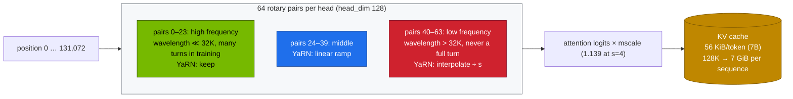

# Volume 02 — Attention Engineering in Qwen2.5: GQA, RoPE θ = 10⁶, YaRN to 128K, and What Dual Chunk Attention Adds

> **Module 04 · Part I — Architecture** · Prev: [01 Architecture & spectrum](01-qwen25-architecture-and-model-spectrum.md) · Next: [03 Qwen2.5-Coder](03-qwen25-coder-deep-dive.md)

| | |
|---|---|
| **You will build** | A quantitative understanding of how Qwen2.5 handles position and long context, and a 128K deployment that works. You'll compute which RoPE frequency pairs break past the 32K training length and how YaRN repairs exactly those, serve Qwen2.5-7B at 128K, prove retrieval at 16K–120K with a needle test, measure prefill cost as context grows, and see the failure without YaRN (drill Q01) |
| **Hardware** | spark-01 |
| **Time** | 90 min |
| **Risk** | Low |
| **Lab files** | [`tools/rope_yarn.py`](lab/tools/rope_yarn.py), [`k8s/models/qwen2.5-7b-128k`](lab/k8s/models/qwen2.5-7b-128k/kustomization.yaml), [`breakfix/Q01-128k-without-yarn`](lab/breakfix/Q01-128k-without-yarn/kustomization.yaml), [`03 …/tools/needle_test.py`](../03%20DeepSeek/lab/tools/needle_test.py) |

---

## 1. Why attention design decides what fits

Two numbers bound long-context serving on a GB10:

- **KV bytes per token**: set by the attention layout. GQA shares each K/V head across several query heads.
- **Usable positions**: set by how positions are encoded and what lengths the model saw in training.

| Mechanism | What Qwen2.5 does | Effect |
|---|---|---|
| GQA | 7B: 28 query heads share 4 K/V heads (7:1). 14B/32B: 40:8 | KV/token 7× smaller than MHA at 7B (56 KiB vs 392 KiB) |
| RoPE base θ | 1,000,000 (Qwen2 used 1,000,000 too, Llama 2 used 10,000) | slower-rotating low-frequency pairs, so 32K fits within the trained angles |
| native context | 32,768 tokens (config `max_position_embeddings`) | the trained range |
| YaRN | `rope_scaling: {type: yarn, factor: 4, original_max_position_embeddings: 32768}` | 128K with small quality loss on long inputs |
| DCA (Dual Chunk Attention) | used by Qwen2.5-*-1M (with sparse attention) | relative positions stay within the trained range by chunking. Targets 1M tokens |

---

## 2. Architecture — HLD



---

## 3. LLD

### 3.1 RoPE in one formula

For query/key pair `i` of `d/2`, at position `p`:

```text
θ_i = base^(−2i/d)            angle = p · θ_i          wavelength_i = 2π / θ_i
score(q_m, k_n) depends only on (m − n) · θ_i  → relative position, per frequency
```

A pair whose wavelength exceeds the training length never completed a full rotation in training. At unseen positions it produces angles the model has never been trained on, which is why plain extrapolation fails.

### 3.2 YaRN (NTK-by-parts) on Qwen2.5-7B, s = 4 (`rope_yarn.py`)

| Pair | Wavelength (tokens) | Turns in 32K | Regime | Max angle at 128K: unscaled → YaRN |
|---|---|---|---|---|
| 0 | 6 | 5,215 | keep | unchanged |
| 24 | 1,117 | 29.3 | ramp | 737 → 689 |
| 32 | 6,283 | 5.2 | ramp | 131 → 46 |
| 40 | 35,333 | 0.93 | interpolate | 23.3 → 5.8 |
| 63 | 5,063,256 | 0.006 | interpolate | 0.163 → 0.041 (= its trained max) |

24 pairs are kept, 16 ramped and 24 interpolated. After scaling, every pair that never completed a turn stays inside its trained angle range. The attention temperature `mscale = 0.1·ln 4 + 1 ≈ 1.139` compensates for the flatter attention distribution.

### 3.3 Static YaRN in vLLM

vLLM applies the scaling factor to **all** requests, short ones included. Qwen notes this may slightly affect short-text quality. Hence two catalog entries for the same weights:

| Entry | Context | YaRN | util | 128K sequences that fit |
|---|---|---|---|---|
| `qwen2.5-7b` | 32K | off | 0.30 | — |
| `qwen2.5-7b-128k` | 131,072 | factor 4 via `--hf-overrides` | 0.45 | ~5 (each 128K sequence is 7 GiB of KV) |

The overlay also turns on chunked prefill (`--max-num-batched-tokens 8192`), so a 128K prompt is processed in slices and doesn't stall other requests.

### 3.4 Where DCA fits

Dual Chunk Attention splits a long sequence into chunks and computes attention in three parts: intra-chunk, inter-chunk and successive-chunk. It remaps relative positions so no query-key distance exceeds what the model was trained on. Qwen2.5-7B/14B-Instruct-1M combine it with sparse attention to reach 1M tokens. On a single GB10 the limit is KV memory before it's the algorithm: 1M tokens × 56 KiB ≈ **56 GiB for one sequence** of the 7B. Treat 1M context as a two-Spark or datacenter exercise, and prefer RAG (Vol 18) for most "long document" needs.

---

## 4. Integrations

- **03 Vol 01**: MLA reaches small KV a different way (low-rank latent instead of shared heads). Compare 56 KiB (Qwen 7B, GQA) with DeepSeek-V3's 68.6 KiB at 671B.
- **03 Vol 08**: ring attention and context parallelism, for when one device's KV isn't enough.
- **Vol 18**: long-context stuffing vs retrieval, measured.

---

## 5. Lab

### 5.1 Compute the frequency regimes

```bash
cd "04 Qwen/lab"
python3 tools/rope_yarn.py
python3 tools/rope_yarn.py --factor 2 --target 131072      # under-scaled: the tool flags it
python3 tools/rope_yarn.py --factor 8 --target 262144
```

### 5.2 The failure first: drill Q01

```bash
scripts/serve-model.sh qwen2.5-7b
scripts/breakfix.sh inject Q01
kubectl -n llm-serving logs deploy/vllm --tail=50 | grep -i -E 'max_model_len|max_position'
scripts/breakfix.sh answer Q01 && scripts/breakfix.sh reset Q01
```

Expected: vLLM refuses to start because 131,072 is greater than the model's derived maximum of 32,768.

### 5.3 Serve 128K with YaRN

```bash
scripts/serve-model.sh qwen2.5-7b-128k
kubectl -n llm-serving logs deploy/vllm | grep -i -E 'rope|yarn|max_model_len|KV cache'
```

### 5.4 Needle test across the range

```bash
kubectl -n llm-serving port-forward svc/vllm 8000 &
python3 "../../03 DeepSeek/lab/tools/needle_test.py" --url http://localhost:8000 --model qwen2.5-7b-128k \
  --lengths 16000 32000 64000 120000 --depths 0.1 0.5 0.9 --max-tokens 64
```

| length (≈tokens) | depth 0.1 | 0.5 | 0.9 | TTFT (s) |
|---|---|---|---|---|
| 16K | | | | |
| 32K | | | | |
| 64K | | | | |
| 120K | | | | |

(**Record yours.**) TTFT grows superlinearly with length: prefill attention is O(n²). That's the cost side of "just put the whole document in the prompt".

### 5.5 Short-context cost of static YaRN

```bash
python3 "../../03 DeepSeek/lab/tools/eval_harness.py" --url http://localhost:8000 --model qwen2.5-7b-128k --suites math json --out results/7b-128k.json
scripts/serve-model.sh qwen2.5-7b
python3 "../../03 DeepSeek/lab/tools/eval_harness.py" --url http://localhost:8000 --model qwen2.5-7b --suites math json --out results/7b-32k.json
python3 "../../03 DeepSeek/lab/tools/eval_harness.py" --report results/7b-32k.json results/7b-128k.json
```

Expected: little or no difference on these short tasks. Whether it's "little" or "none" on *your* tasks is the reason to keep both entries.

---

## 6. Verify

| Check | Expected |
|---|---|
| regimes | 24 keep / 16 ramp / 24 interpolate at s = 4. The tool reports ✓ |
| Q01 | start failure explained and reset |
| 128K | needles found at 16K–120K (or misses analysed by depth) |
| prefill cost | TTFT vs length table |
| short tasks | 32K vs 128K entry compared on the same suites |

---

## 7. Troubleshooting

| Symptom | Cause | Fix |
|---|---|---|
| `max_model_len … greater than the derived max_model_len` | no rope scaling | the `qwen2.5-7b-128k` entry (Q01) |
| `unrecognized arguments: --rope-scaling` | flag removed in newer vLLM | `--hf-overrides '{"rope_scaling": {…}}'` as in the catalog |
| starts, but answers degrade past ~32K | `VLLM_ALLOW_LONG_MAX_MODEL_LEN=1` used instead of YaRN | remove it. Use YaRN |
| OOM or few sequences at 128K | 7 GiB KV per 128K sequence | raise util within budget, FP8 KV cache (`--kv-cache-dtype fp8`), or fewer concurrent long requests |
| one long prompt stalls everyone | chunked prefill off | the overlay sets it. Check `--max-num-batched-tokens` |

---

## 8. Scale-out path

| One Spark | More |
|---|---|
| 128K, a handful of sequences | FP8 KV doubles that. Two Sparks with context parallelism (03 Vol 08) |
| static YaRN | dynamic per-request scaling in engines that support it. Separate short/long deployments behind LiteLLM |
| 1M context is KV-bound | Qwen2.5-1M with DCA + sparse attention on multi-GPU nodes |

---

## 9. Checklist

- [ ] I can explain which RoPE pairs break past training length and why.
- [ ] I can configure YaRN and know its short-context trade-off.
- [ ] I measured retrieval and TTFT up to 120K on the Spark.
- [ ] I know when 1M-token context is a memory problem rather than a model problem.
