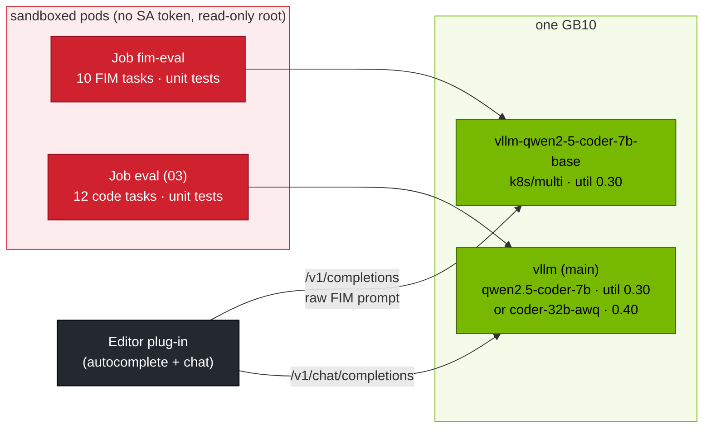

# Volume 03 — Qwen2.5-Coder on the Spark: Fill-in-the-Middle for Editors, Repository Context, and a Coding Stack You Can Measure

> **Module 04 · Part I — Architecture** · Prev: [02 Attention engineering](02-attention-engineering-gqa-rope-and-dca.md) · Next: [04 Qwen2.5-Math](04-qwen25-math-and-reasoning.md)

| | |
|---|---|
| **You will build** | A local coding assistant stack. The Coder **base** model serves editor completions with fill-in-the-middle (FIM) next to the Coder **instruct** model for chat. You'll measure FIM pass@1 on 10 executable tasks, compare it with asking the instruct model in plain words, run the 12-task code suite in a sandbox for 7B vs 32B-AWQ, and wire an editor plug-in to it |
| **Hardware** | spark-01 |
| **Time** | 90 min |
| **Risk** | Low. Model-written code only runs in sandboxed pods |
| **Lab files** | [`tools/fim_eval.py`](lab/tools/fim_eval.py), [`data/fim_tasks.jsonl`](lab/data/fim_tasks.jsonl), [`k8s/jobs/fim-eval.yaml`](lab/k8s/jobs/fim-eval.yaml), [`k8s/multi/qwen2.5-coder-7b-base`](lab/k8s/multi/qwen2.5-coder-7b-base/kustomization.yaml), [`03 …/k8s/jobs/eval.yaml`](../03%20DeepSeek/lab/k8s/jobs/eval.yaml) |

---

## 1. Why a code model is two models

Editors need two different things:

| Interaction | Shape | Latency target | Best model |
|---|---|---|---|
| inline completion (ghost text) | "here is the code before and after the cursor, fill the gap" | < 1 s for short fills | **base** model with FIM |
| chat ("explain", "refactor", "write a test") | conversation with instructions | seconds are fine | **instruct** model |

Qwen2.5-Coder (0.5B–32B) continues Qwen2.5 pre-training on ~5.5 trillion tokens of code-heavy data, with FIM and repository-level objectives. The base models are trained to fill gaps given special tokens. Sending those tokens through a chat template breaks them (drill Q02).

### 1.1 Special tokens

| Token | Use |
|---|---|
| `<\|fim_prefix\|>` `<\|fim_suffix\|>` `<\|fim_middle\|>` | FIM in PSM order: prefix, suffix, then the model writes the middle |
| `<\|fim_pad\|>` | padding/stop |
| `<\|repo_name\|>` `<\|file_sep\|>` | repository-level context: several files in one prompt |

```text
<|fim_prefix|>def is_prime(n):
    if n < 2:
        return False
<|fim_suffix|>    return True
<|fim_middle|>                ← the model continues here; stop at <|endoftext|> / <|fim_pad|> / <|file_sep|>
```

Repository-level prompt:

```text
<|repo_name|>spark-lab
<|file_sep|>scripts/lib.py
…file content…
<|file_sep|>scripts/serve.py
<|fim_prefix|>…<|fim_suffix|>…<|fim_middle|>
```

---

## 2. Architecture — HLD



---

## 3. LLD

### 3.1 Catalog entries

| Entry | Model | util | Notes |
|---|---|---|---|
| `qwen2.5-coder-7b-base` | Qwen2.5-Coder-7B | 0.30 | FIM. `smoke: none` (no chat smoke test for a base model) |
| `qwen2.5-coder-7b` | Qwen2.5-Coder-7B-Instruct | 0.30 | chat + hermes tool calling |
| `qwen2.5-coder-32b-awq` | Qwen2.5-Coder-32B-Instruct-AWQ | 0.40 | best quality on one Spark |

Running base + instruct together: 0.30 + 0.30 + bge-m3 0.06 = 0.66, within the 0.80 budget (03 Vol 41).

### 3.2 FIM request

```json
POST /v1/completions
{"model": "qwen2.5-coder-7b-base",
 "prompt": "<|fim_prefix|>{prefix}<|fim_suffix|>{suffix}<|fim_middle|>",
 "max_tokens": 256, "temperature": 0,
 "stop": ["<|endoftext|>", "<|fim_pad|>", "<|file_sep|>", "<|im_end|>"]}
```

### 3.3 What `fim_eval.py` measures

| Metric | Meaning |
|---|---|
| pass@1 | prefix + model middle + suffix + the task's asserts run clean (subprocess, 5 s timeout, `python -I`) |
| exact | middle matches the reference (whitespace-normalised). Strict. Many correct fills differ |
| p50 latency | what the editor user feels for a short fill |

`--mode chat` sends the same gap to an instruct model as a plain-language request and extracts the code block. It's the comparison that shows why FIM exists.

---

## 4. Integrations

- **03 Vol 13**: DeepSeek-Coder-V2-Lite (MoE) is the alternative coder. Use the same code suite to compare.
- **03 Vol 41**: the side-by-side pattern used for base + instruct.
- **Vol 13**: AWQ for the 32B coder.
- **Vol 17**: the instruct coder also does tool calling (hermes), for agents that edit files.

---

## 5. Lab

### 5.1 Base + instruct side by side

```bash
cd "04 Qwen/lab"
kubectl apply -k . && kubectl apply -k "../../03 DeepSeek/lab"            # ConfigMaps (tools, data)
scripts/serve-model.sh qwen2.5-coder-7b                                   # main: instruct
kubectl apply -k k8s/multi/qwen2.5-coder-7b-base
kubectl -n llm-serving rollout status deploy/vllm-qwen2-5-coder-7b-base --timeout=30m
```

### 5.2 FIM vs chat, measured

```bash
kubectl -n llm-serving port-forward svc/vllm-qwen2-5-coder-7b-base 8001:8000 &
kubectl -n llm-serving port-forward svc/vllm 8000 &
python3 tools/fim_eval.py --url http://localhost:8001 --model qwen2.5-coder-7b-base --mode fim --show
python3 tools/fim_eval.py --url http://localhost:8000 --model qwen2.5-coder-7b --mode chat
```

These run model-written code on your machine. For anything beyond this lab, use the Job:

```bash
yq '.spec.template.spec.containers[0].args[1] = "http://vllm-qwen2-5-coder-7b-base.llm-serving:8000"' k8s/jobs/fim-eval.yaml | kubectl apply -f -
kubectl -n llm-serving logs -f job/fim-eval
```

| model / mode | pass@1 | exact | p50 latency |
|---|---|---|---|
| coder-7b-base / fim | | | |
| coder-7b (instruct) / chat | | | |

(**Record yours.**) Expect FIM to win on latency by a wide margin (short output, no explanation) and to be competitive on pass@1.

### 5.3 Drill Q02 — FIM through the wrong door

```bash
scripts/breakfix.sh inject Q02     # prints a command: FIM prompt → instruct model
python3 tools/fim_eval.py --url http://localhost:8000 --model qwen2.5-coder-7b --mode fim --show | tail -4
scripts/breakfix.sh answer Q02
```

### 5.4 Code suite: 7B vs 32B-AWQ (sandboxed)

```bash
for m in qwen2.5-coder-7b qwen2.5-coder-32b-awq; do
  scripts/serve-model.sh $m
  kubectl -n llm-serving delete job eval --ignore-not-found
  yq ".spec.template.spec.containers[0].args[3] = \"$m\" | .spec.template.spec.containers[0].args += [\"--suites\",\"code\"]" \
    "../../03 DeepSeek/lab/k8s/jobs/eval.yaml" | kubectl apply -f -
  kubectl -n llm-serving wait --for=condition=complete job/eval --timeout=60m && kubectl -n llm-serving logs job/eval | grep -E '^code'
done
```

(The side-by-side base model must be removed first if the 32B needs its memory: `kubectl delete -k k8s/multi/qwen2.5-coder-7b-base`.)

### 5.5 Wire an editor

Any OpenAI-compatible editor plug-in works. For example, in Continue (`config.yaml`), point *autocomplete* at the base model and *chat* at the instruct model:

```yaml
models:
  - name: qwen-coder-chat
    provider: openai
    model: qwen2.5-coder-7b
    apiBase: http://api.lab.local/v1          # through LiteLLM (Vol 20) with a key
    roles: [chat, edit]
  - name: qwen-coder-fim
    provider: openai
    model: qwen2.5-coder-7b-base
    apiBase: http://<host>:8001/v1            # the base model's Service (port-forward or a route)
    roles: [autocomplete]
```

Check the plug-in's documentation for its current schema and how it formats FIM for Qwen models.

---

## 6. Verify

| Check | Expected |
|---|---|
| two deployments | `vllm` (instruct) and `vllm-qwen2-5-coder-7b-base` Ready. `svc/vllm` endpoints = instruct pod only |
| FIM | pass@1 recorded. Latency per fill well under a second for these small tasks (**record yours**) |
| Q02 | explained: chat template + FIM tokens = broken prompt |
| code suite | 7B vs 32B-AWQ recorded from the sandboxed Job |

---

## 7. Troubleshooting

| Symptom | Cause | Fix |
|---|---|---|
| completions continue past the gap into new functions | missing stop tokens | add `<\|endoftext\|>`, `<\|fim_pad\|>`, `<\|file_sep\|>` |
| FIM output repeats the suffix | instruct model or wrong token order | base model. PSM order: prefix, suffix, middle |
| base model fails `serve-model.sh` smoke test | base models don't chat | catalog `smoke: none` (already set) |
| 32B coder OOM | side-by-side base still running | remove the multi overlay first |
| editor shows nothing | plug-in calls chat for autocomplete | set the autocomplete role to the base model on `/v1/completions` |

---

## 8. Scale-out path

| One Spark | Team |
|---|---|
| 7B base + 7B instruct | 1.5B/3B base for sub-200 ms autocomplete + 32B instruct for chat, on separate GPUs |
| 10 FIM tasks | repository-level FIM benchmarks from your own codebase. Track pass@1 per release |
| port-forward | a dedicated Gateway route for completions with its own rate limits |

---

## 9. Checklist

- [ ] I can write a FIM and a repository-level prompt by hand.
- [ ] I measured FIM vs chat on executable tasks.
- [ ] My editor uses the base model for completion and the instruct model for chat.
- [ ] Model-written code only runs in sandboxed pods.
