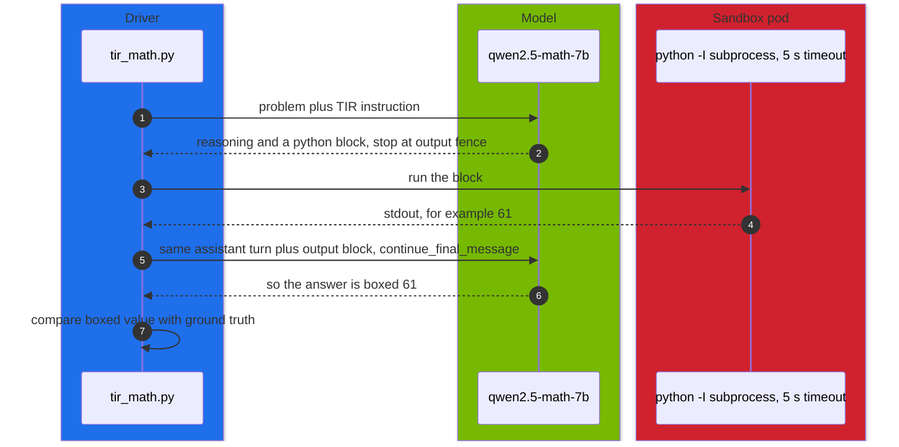

# Volume 04 — Qwen2.5-Math and Reasoning: Chain-of-Thought vs Tool-Integrated Reasoning, QwQ, and When Each Wins

> **Module 04 · Part I — Architecture** · Prev: [03 Qwen2.5-Coder](03-qwen25-coder-deep-dive.md) · Next: [05 Qwen2.5-VL](05-qwen2-vl-and-vision-language-processing.md)

| | |
|---|---|
| **You will build** | A measured comparison of three ways a Qwen model can do math on the same 40 problems: Qwen2.5-Math-7B with chain-of-thought (CoT), the same model with tool-integrated reasoning (TIR: it writes Python, a sandbox runs it, the output goes back into the conversation), and QwQ-32B's long RL-trained reasoning. You'll compare accuracy, tokens per problem and latency, and hit the Math model's 4K context limit on purpose |
| **Hardware** | spark-01 |
| **Time** | 90 min |
| **Risk** | Low. TIR runs model-written code: sandboxed Job only |
| **Lab files** | [`tools/tir_math.py`](lab/tools/tir_math.py), [`k8s/jobs/tir-eval.yaml`](lab/k8s/jobs/tir-eval.yaml), [`models.yaml`](lab/models.yaml) (`qwen2.5-math-7b`, `qwq-32b-awq`), [`03 …/data/math_word.jsonl`](../03%20DeepSeek/lab/data/math_word.jsonl), [`03 …/tools/eval_harness.py`](../03%20DeepSeek/lab/tools/eval_harness.py) |

---

## 1. Why tools change math

Language models are good at *setting up* a calculation and bad at *doing* long arithmetic token by token. Qwen2.5-Math was trained for both styles:

| Style | Prompt suffix (from the model card) | Strength | Weakness |
|---|---|---|---|
| **CoT** | "Please reason step by step, and put your final answer within \\boxed{}." | no runtime needed | arithmetic slips compound over long chains |
| **TIR** | "Please integrate natural language reasoning with programs to solve the problem above, and put your final answer within \\boxed{}." | exact arithmetic, symbolic algebra (sympy) | needs a safe code executor. More round trips |
| **long RL reasoning** (QwQ-32B) | none special. Thinks in `<think>` | self-checks, backtracks, broad problems | many tokens. Needs a bigger model |

Qwen2.5-Math-7B-Instruct has a **4,096-token context**, by design for math problems. That's plenty for a problem plus a TIR exchange, and a trap if you treat it as a general chat model (drill Q03).

---

## 2. Architecture — HLD



---

## 3. LLD

### 3.1 The TIR loop (`tir_math.py`)

| Step | Detail |
|---|---|
| generate | `stop: ["```output"]`, so the model pauses where it expects tool output |
| execute | the last ```python block in a fresh `python -I` subprocess, 5 s timeout, stdout capped at 1 KB |
| continue | the transcript is sent back as the *same* assistant turn with `continue_final_message: true, add_generation_prompt: false` (vLLM extensions) |
| stop | when `\boxed{…}` appears, or after `--max-rounds` (4) |
| score | last boxed value parsed as an integer vs the dataset's answer |

### 3.2 Context budget for the Math model

```text
prompt (system + problem)                ≈ 100–200 tokens
+ each round: model text + code + output ≈ 150–400 tokens
+ max_tokens of the next generation
must stay ≤ 4,096
```

The tool's default `--max-tokens 1024` leaves room for 3–4 rounds. `--max-tokens 4096` overflows on the first request (Q03).

### 3.3 Three contenders

| Entry | util | Expected tokens per problem | Notes |
|---|---|---|---|
| qwen2.5-math-7b (CoT) | 0.30 | low hundreds | fastest |
| qwen2.5-math-7b (TIR) | 0.30 | a bit more, plus code runs | exact arithmetic |
| qwq-32b-awq | 0.40 | thousands (thinking) | broadest, slowest |
| (reference) r1-7b from 03 | 0.30 | thousands | distilled reasoning on Qwen2.5-Math-7B's base |

---

## 4. Integrations

- **03 Vol 05**: R1 and GRPO. R1-Distill-Qwen-7B starts from Qwen2.5-Math-7B, so it's a natural fourth row.
- **03 Vol 30**: TIR is tool calling with exactly one tool (a Python sandbox), driven by the model's own text format.
- **Vol 10**: wrong answers from these runs become hard negatives for DPO.
- **Vol 16**: Qwen-Agent's `code_interpreter` is the general version of this sandbox.

---

## 5. Lab

### 5.1 CoT vs TIR on the same model

```bash
cd "04 Qwen/lab"
kubectl apply -k . && kubectl apply -k "../../03 DeepSeek/lab"
scripts/serve-model.sh qwen2.5-math-7b
for mode in cot tir; do
  kubectl -n llm-serving delete job tir-eval --ignore-not-found
  yq ".spec.template.spec.containers[0].args[5] = \"$mode\"" k8s/jobs/tir-eval.yaml | kubectl apply -f -
  kubectl -n llm-serving wait --for=condition=complete job/tir-eval --timeout=60m
  kubectl -n llm-serving logs job/tir-eval | tail -1
done
```

```text
model qwen2.5-math-7b mode cot: …/40 correct (…%), … completion tokens/problem, 0.0 code runs/problem, …s
model qwen2.5-math-7b mode tir: …/40 correct (…%), … completion tokens/problem, ~1 code runs/problem, …s
```

(**Record yours.**) Look at the per-problem lines: TIR should fix the problems where CoT's arithmetic slipped.

### 5.2 QwQ and the R1 distill on the same problems

```bash
for m in qwq-32b-awq; do
  scripts/serve-model.sh $m
  kubectl -n llm-serving port-forward svc/vllm 8000 & sleep 3
  python3 "../../03 DeepSeek/lab/tools/eval_harness.py" --url http://localhost:8000 --model $m --suites math \
    --max-tokens 16384 --out results/$m-math.json
  kill %1
done
```

Add the `r1-7b` result from 03 (`03 DeepSeek/lab/results/r1-7b.json`) if you have it:

| approach | correct /40 | tokens/problem | wall time |
|---|---|---|---|
| Math-7B CoT | | | |
| Math-7B TIR | | | |
| QwQ-32B-AWQ | | | |
| R1-Distill-Qwen-7B (03) | | | |

### 5.3 Drill Q03 — the 4K wall

```bash
kubectl -n llm-serving port-forward svc/vllm 8000 &      # with qwen2.5-math-7b serving
scripts/breakfix.sh inject Q03
python3 tools/tir_math.py --url http://localhost:8000 --model qwen2.5-math-7b --mode tir --max-tokens 4096 --limit 3
scripts/breakfix.sh answer Q03
```

Expected: HTTP 400 with "maximum context length is 4096 tokens". Model-written code runs locally in this one command, but the problems are this repo's own arithmetic. For anything else, use the Job.

---

## 6. Verify

| Check | Expected |
|---|---|
| CoT vs TIR | both modes completed in the sandbox Job. TIR ≥ CoT on these arithmetic-heavy items |
| contenders | table filled in, including tokens per problem |
| Q03 | 400 explained by prompt + max_tokens > 4,096 |

---

## 7. Troubleshooting

| Symptom | Cause | Fix |
|---|---|---|
| TIR never runs code | model wrote prose only, or the stop sequence wasn't honoured | check `stop: ["```output"]`. Some models need the exact TIR instruction text |
| the model restarts a new answer after the output | turn not continued | `continue_final_message: true, add_generation_prompt: false` (the tool sets them) |
| `TimeoutError` outputs | infinite loop in model code | 5 s timeout is the guard. The model usually recovers in the next round |
| no `\boxed{}` | `max_rounds` reached or truncated | raise `--max-rounds`. Check `max_tokens` against 4K |
| QwQ answers cut off | thinking exceeds `max_tokens` | 16K–32K for QwQ (03 Vol 05) |

---

## 8. Scale-out path

| One Spark | Production |
|---|---|
| subprocess sandbox in a locked-down pod | dedicated code-execution service (gVisor/Firecracker), per-request isolation, resource and network limits |
| 40 integer problems | MATH-500, AIME-style sets, symbolic checking (math-verify / sympy equivalence) |
| one model per approach | a router: Math-7B TIR for calculation-heavy tasks, a reasoner for open-ended ones |

---

## 9. Checklist

- [ ] I can run CoT and TIR on Qwen2.5-Math and explain the difference in results.
- [ ] I know the Math model's 4K budget and how TIR rounds consume it.
- [ ] I compared tokens per problem across CoT, TIR and long-reasoning models.
- [ ] Model-written code only runs in a sandbox.
