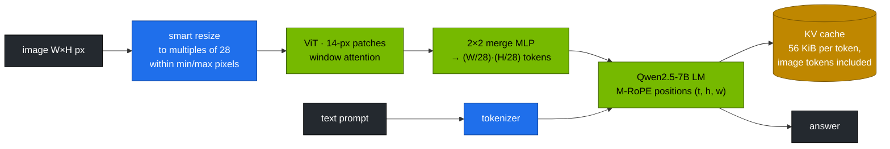

# Volume 05 — Qwen2.5-VL on the GB10: Dynamic Resolution, Vision-Token Math, and a Measurable Vision Workload

> **Module 04 · Part I — Architecture** · Prev: [04 Qwen2.5-Math](04-qwen25-math-and-reasoning.md) · Next: [06 ms-swift core](06-models-scope-ms-swift-framework-core.md)

| | |
|---|---|
| **You will build** | Qwen2.5-VL-7B served by vLLM with an explicit per-request image limit. You'll predict how many tokens an image costs from its pixel size and then confirm it from `usage`, score the model on four kinds of synthetic images with known answers (chart, label OCR, counting, table arithmetic), and measure how image resolution trades accuracy against latency and KV memory |
| **Hardware** | spark-01 |
| **Time** | 75 min |
| **Risk** | Low |
| **Lab files** | [`tools/vl_eval.py`](lab/tools/vl_eval.py), [`k8s/models/qwen2.5-vl-7b`](lab/k8s/models/qwen2.5-vl-7b/kustomization.yaml), [`tests/mock_vl.py`](lab/tests/mock_vl.py) |

---

## 1. Why vision changes the capacity plan

A text prompt costs tokens in proportion to its length. An **image** costs tokens in proportion to its *pixel area*, and those tokens live in the KV cache like any others. A phone screenshot can cost more than a page of text. Qwen2-VL introduced, and Qwen2.5-VL refined:

| Feature | What it means for you |
|---|---|
| **native dynamic resolution** | images aren't squashed to a fixed square. Token count follows the image size, within `min_pixels`/`max_pixels` |
| 14-px patches, **2×2 merge** | one LLM token per 28 × 28 px block |
| **M-RoPE** (multimodal RoPE) | rotary positions split into temporal, height and width parts, so the LM knows *where* in the image and *when* in a video a token is |
| ViT ~0.7B + Qwen2.5 LM | 7B-class LM plus a vision encoder (~1.3 GiB more weights in BF16) |
| Qwen2.5-VL additions | window attention in the ViT (faster on large images), absolute-time video encoding, document parsing and grounding with absolute coordinates |

---

## 2. Architecture — HLD



---

## 3. LLD

### 3.1 Vision-token math (`vl_eval.vision_tokens`)

```text
h', w' = round(H / 28)·28, round(W / 28)·28          (then rescaled to stay in [min_pixels, max_pixels])
tokens = (h' / 28) · (w' / 28)
```

| Image | Tokens | KV at 56 KiB/token |
|---|---|---|
| 512 × 512 | 324 | ~18 MiB |
| 1024 × 768 | 999 | ~55 MiB |
| 1920 × 1080 (screenshot) | 2,691 | ~147 MiB |
| 3840 × 2160 (4K) | 10,549 | ~577 MiB |
| 20 × 20 (icon, padded up to the minimum) | 4 | — |

### 3.2 Serving settings (catalog `qwen2.5-vl-7b`)

| Flag | Value | Why |
|---|---|---|
| `--gpu-memory-utilization` | 0.40 | weights ~17 GiB incl. vision encoder, plus KV for image-heavy prompts |
| `--max-model-len` | 32,768 | a few large images plus text |
| `--limit-mm-per-prompt` | `{"image": 4, "video": 1}` | caps how many images one request can carry. vLLM also uses it to size its profiling run |
| `--max-num-seqs` | 16 | image prefill is heavy. Fewer concurrent requests keeps TTFT sane |
| (optional) `--mm-processor-kwargs` | `{"max_pixels": 1003520}` | server-side cap on image tokens (here ≈1,280 per image) |

### 3.3 Request shape

```json
{"model": "qwen2.5-vl-7b", "messages": [{"role": "user", "content": [
  {"type": "image_url", "image_url": {"url": "data:image/png;base64,…"}},
  {"type": "text", "text": "What is the serial number after 'SN:'?"}]}]}
```

`image_url` can also be an `https://` URL the server can reach. Data URLs keep the lab self-contained and avoid the server fetching arbitrary URLs.

---

## 4. Integrations

- **Vol 19**: multimodal RAG uses this model to transcribe and to answer from page images.
- **Vol 20**: Open WebUI sends uploaded images to `qwen2.5-vl-7b` through LiteLLM. Image tokens count against key budgets.
- **Vol 01 §3**: same LM as Qwen2.5-7B, so the same 56 KiB/token KV math.

---

## 5. Lab

### 5.1 Serve

```bash
cd "04 Qwen/lab"
scripts/serve-model.sh qwen2.5-vl-7b
kubectl -n llm-serving logs deploy/vllm | grep -i -E 'limit_mm|multimodal|max_model_len|KV cache'
kubectl -n llm-serving port-forward svc/vllm 8000 &
```

### 5.2 Score four image tasks at 512 px

```bash
pip install "pillow>=10.4"
python3 tools/vl_eval.py --url http://localhost:8000 --model qwen2.5-vl-7b --n 5 --save /tmp/vl-512
```

```text
512×512 px → ≈324 vision tokens per image (Qwen2.5-VL 28-px blocks)
  bars   #0  want B        got B                    ok
  …
accuracy  bars …/5  serial …/5  count …/5  table …/5  total …/20
prompt tokens per request: median … (vision ≈324 + text)
latency p50 … ms
```

Check that `prompt tokens` ≈ 324 + a few dozen text tokens. Open `/tmp/vl-512/*.png` to see what the model saw.

### 5.3 Resolution vs accuracy vs latency

```bash
for s in 256 512 1024 1536; do python3 tools/vl_eval.py --url http://localhost:8000 --model qwen2.5-vl-7b --n 5 --size $s | tail -3; done
```

| size | vision tokens | total accuracy | median prompt tokens | p50 latency |
|---|---|---|---|---|
| 256 | 81 | | | |
| 512 | 324 | | | |
| 1024 | 1,369 | | | |
| 1536 | 3,025 | | | |

(**Record yours.**) Small text (the serial label, the table) usually needs more pixels than shapes and bars. Latency grows with vision tokens through prefill.

### 5.4 Prove the per-request image limit

```bash
python3 - <<'PY'
import base64, json, urllib.request, sys
sys.path.insert(0, "tools"); import vl_eval, random
png, q, _ = vl_eval.make("count", random.Random(1), 256)
img = {"type": "image_url", "image_url": {"url": "data:image/png;base64," + base64.b64encode(png).decode()}}
body = {"model": "qwen2.5-vl-7b", "max_tokens": 8, "messages": [{"role": "user", "content": [img] * 5 + [{"type": "text", "text": q}]}]}
req = urllib.request.Request("http://localhost:8000/v1/chat/completions", json.dumps(body).encode(), {"Content-Type": "application/json"})
try: print(urllib.request.urlopen(req).read()[:200])
except urllib.error.HTTPError as e: print(e.code, e.read()[:300])
PY
```

Expected: HTTP 400 because 5 images exceed `{"image": 4}`. That limit is your guard against one request filling the KV cache with screenshots.

---

## 6. Verify

| Check | Expected |
|---|---|
| token math | `usage.prompt_tokens` ≈ predicted vision tokens + text |
| accuracy | per-task scores at 512 px recorded |
| resolution sweep | table filled. You can name the smallest size that keeps OCR correct |
| limit | 5 images → 400 |

---

## 7. Troubleshooting

| Symptom | Cause | Fix |
|---|---|---|
| `At most 1 image(s) may be provided` | default per-prompt limit | `--limit-mm-per-prompt` (catalog sets 4) |
| OOM at start or during image bursts | many large images in flight | lower `max_pixels`, fewer seqs, raise util within budget |
| OCR misses small text | too few pixels per character | send larger images, or crop the region of interest |
| very slow first request | ViT and LM compile/warm-up | expected once. CUDA graphs are captured at start |
| `image_url` with http URL fails | the pod can't reach that host (NetworkPolicy, proxy) | send data URLs, or allow the egress deliberately |

---

## 8. Scale-out path

| One Spark | More |
|---|---|
| 7B VL with capped image size | 32B/72B VL on bigger memory or two Sparks. Encoder and LM on separate GPUs (disaggregated encode) |
| synthetic images | your own document and screenshot sets, with ground truth, in CI |
| data URLs | an object store with signed URLs and a fetch allow-list |

---

## 9. Checklist

- [ ] I can predict an image's token cost from its size.
- [ ] I know the resolution my use case needs, measured.
- [ ] The server limits images per request, and I've seen the guard work.
