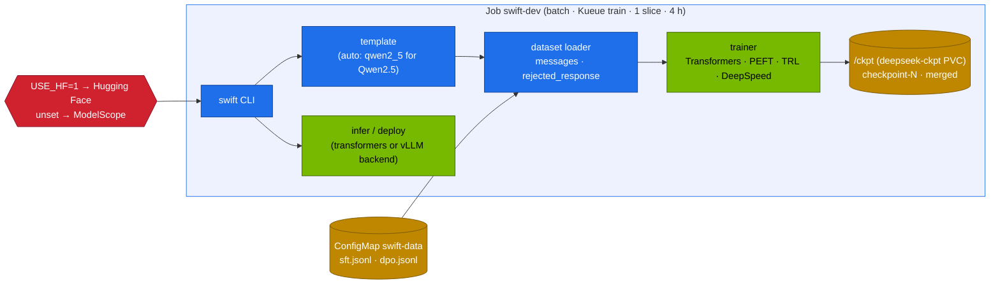

# Volume 06 — ms-swift (ModelScope SWIFT) Core: One CLI for Inference, Training, Alignment, Export and Deployment of Qwen Models

> **Module 04 · Part II — Training and alignment** · Prev: [05 Qwen2.5-VL](05-qwen2-vl-and-vision-language-processing.md) · Next: [07 Distributed SFT](07-distributed-sft-with-ms-swift.md)

| | |
|---|---|
| **You will build** | A working ms-swift environment on the Spark, run as a Kueue-admitted interactive Job, with pinned versions that don't fight the NGC image. You'll use the core commands (`infer`, `sft`, `rlhf`, `export`, `deploy`), the dataset formats each expects, and the switch that decides whether models come from Hugging Face or ModelScope (drill Q04) |
| **Hardware** | spark-01 |
| **Time** | 60 min |
| **Risk** | Low |
| **Lab files** | [`k8s/jobs/swift-dev.yaml`](lab/k8s/jobs/swift-dev.yaml), [`versions.env`](lab/versions.env) (`PIP_SWIFT`), [`tools/synth_data.py`](lab/tools/synth_data.py), [`scripts/breakfix.sh`](lab/scripts/breakfix.sh) (Q04) |

---

## 1. Why ms-swift for Qwen

ms-swift is Alibaba ModelScope's training and deployment framework. It's the reference toolchain for Qwen: model-specific chat templates, the Qwen VL/Audio/Omni variants and new Qwen releases are usually supported there first. It wraps the same libraries you used in 03 (Transformers, PEFT, TRL, DeepSpeed, vLLM) behind one CLI:

| Command | Does | 03 equivalent |
|---|---|---|
| `swift infer` | chat with a model or adapter (transformers or vLLM backend) | `curl` to vLLM |
| `swift sft` | supervised fine-tuning: LoRA, QLoRA, full, many PEFT variants | `sft_lora.py` (TRL) |
| `swift rlhf` | DPO, SimPO, ORPO, KTO, CPO, reward model, PPO, GRPO | `grpo_tiny.py` (TRL) |
| `swift pt` | continued pre-training | — |
| `swift export` | merge LoRA, quantise (AWQ/GPTQ/FP8), push to a hub | `merge_and_unload`, llm-compressor |
| `swift deploy` | OpenAI-compatible server (vLLM/SGLang/LMDeploy backends) | the catalog Deployment |
| `swift eval` | benchmark runs (EvalScope) | `eval_harness.py` |
| `swift web-ui` | Gradio UI over all of the above | — |

### 1.1 Version pins that coexist with NGC

| Package | Pin | Constraint it satisfies |
|---|---|---|
| ms-swift | 3.8.3 | 3.8.x requires `trl<0.21`, `datasets<4.0`, `transformers<4.57`, `peft<0.18` |
| trl | 0.20.0 | (03 uses 0.23.0, which is too new for ms-swift 3.8) |
| datasets | 3.6.0 | |
| transformers / peft / accelerate | 4.56.2 / 0.17.1 / 1.10.1 | same as 03 |

Installed with plain `pip` on top of `nvcr.io/nvidia/pytorch:25.09-py3`. None of them pins torch, so NVIDIA's build stays.

---

## 2. Architecture — HLD



---

## 3. LLD

### 3.1 Dataset formats

| Task | JSONL row |
|---|---|
| SFT (chat) | `{"messages": [{"role": "system", …}, {"role": "user", …}, {"role": "assistant", …}]}` |
| preference (DPO/SimPO/ORPO/CPO) | same `messages` (last assistant = **chosen**) + `"rejected_response": "…"` |
| KTO | `messages` + `"label": true/false` |
| multimodal | `messages` with `<image>` placeholders + `"images": ["path or url", …]` |

`synth_data.py` (Vol 10) writes exactly the SFT and preference shapes.

### 3.2 Arguments you'll use most

| Argument | Meaning |
|---|---|
| `--model` | HF repo id (with `USE_HF=1`), ModelScope id, or a local path |
| `--train_type` | `lora`, `full`, `longlora`, `adalora`, … |
| `--target_modules all-linear` | LoRA on every linear layer |
| `--template` | usually auto-detected from the model. Set it for custom checkpoints |
| `--torch_dtype bfloat16` | GB10 native |
| `--deepspeed zero2/zero3` | built-in DeepSpeed configs (Vol 07) |
| `--output_dir … --add_version false` | predictable paths (`checkpoint-N`) for automation |
| `--infer_backend vllm` | for `infer`/`deploy`/`sample` |

### 3.3 Where models come from

ms-swift defaults to **ModelScope** (modelscope.cn). With `USE_HF=1` it uses Hugging Face, which matches the rest of this curriculum (shared cache, Vault-held token, revision pins). Both hubs host Qwen weights. Pick one per environment and pin it.

---

## 4. Integrations

- **03 Vol 22**: the dev Job is a Kueue workload. It counts against the `train` quota and can be preempted.
- **03 Vol 23–24**: same PEFT concepts, different front end. Adapters are standard PEFT and serve the same way.
- **Vol 07–10**: SFT, alignment, PEFT variants and data in ms-swift.

---

## 5. Lab

### 5.1 Start the dev environment

```bash
cd "04 Qwen/lab"
kubectl apply -f "../../03 DeepSeek/lab/k8s/jobs/train-common.yaml"     # /ckpt PVC
kubectl apply -f k8s/jobs/swift-dev.yaml
kubectl -n batch wait --for=condition=ready pod -l job-name=swift-dev --timeout=20m
kubectl -n batch exec -it job/swift-dev -- bash
```

### 5.2 First commands inside

```bash
swift --help | head
python -c "import swift, trl, transformers; print(swift.__version__, trl.__version__, transformers.__version__)"
swift infer --model Qwen/Qwen2.5-0.5B-Instruct --stream true --max_new_tokens 128
#  <<< What is a GPU time-slice? Answer in two sentences.
```

### 5.3 A one-minute LoRA run

```bash
cat > /tmp/tiny.jsonl <<'EOF'
{"messages": [{"role": "user", "content": "Which lab serves models?"}, {"role": "assistant", "content": "The DGX Spark lab serves models with vLLM behind LiteLLM."}]}
{"messages": [{"role": "user", "content": "What is the GPU in a DGX Spark?"}, {"role": "assistant", "content": "A GB10 Grace Blackwell superchip with 128 GB of unified memory."}]}
EOF
swift sft --model Qwen/Qwen2.5-0.5B-Instruct --train_type lora --dataset /tmp/tiny.jsonl#200 \
  --num_train_epochs 1 --per_device_train_batch_size 4 --learning_rate 1e-4 --lora_rank 8 \
  --output_dir /ckpt/swift-tiny --add_version false --logging_steps 5 --save_steps 50 --report_to none
swift infer --adapters $(ls -d /ckpt/swift-tiny/checkpoint-* | sort -V | tail -1) --stream true
```

`dataset#200` samples 200 rows (with repetition here) from the file. That's handy for smoke runs.

### 5.4 Export and deploy

```bash
CK=$(ls -d /ckpt/swift-tiny/checkpoint-* | sort -V | tail -1)
swift export --adapters "$CK" --merge_lora true --output_dir /ckpt/swift-tiny-merged
swift deploy --model /ckpt/swift-tiny-merged --infer_backend vllm --port 8010 &
sleep 60; curl -s localhost:8010/v1/models | python -m json.tool | head
```

`swift deploy` is a quick check. Production serving stays on the catalog Deployment: publish the merged model into the cache (03 `publish-adapter.sh`) and serve it from there.

### 5.5 Drill Q04 — the hub switch

```bash
exit                                         # leave the dev pod
scripts/breakfix.sh inject Q04               # swift-sft without USE_HF
kubectl -n batch logs -f job/swift-sft | grep -iE 'modelscope|download|error' | head
scripts/breakfix.sh answer Q04 && scripts/breakfix.sh reset Q04
```

Clean up: `kubectl -n batch delete job swift-dev`.

---

## 6. Verify

| Check | Expected |
|---|---|
| versions | ms-swift 3.8.3, trl 0.20.0, transformers 4.56.2 in the pod. torch is NVIDIA's |
| infer | streamed answer from the 0.5B model |
| tiny SFT | `checkpoint-*` written. The adapter answers with the trained sentences |
| export | merged model loads in `swift deploy` |
| Q04 | ModelScope download attempt seen and explained |

---

## 7. Troubleshooting

| Symptom | Cause | Fix |
|---|---|---|
| `pip` resolver conflict on trl/datasets | 03's pins mixed in | use `PIP_SWIFT` from `versions.env` only |
| download from modelscope.cn hangs | `USE_HF` unset | `USE_HF=1` (Q04) |
| `template not found` for a local checkpoint | auto-detection failed | `--template qwen2_5` (or the base model's template) |
| `checkpoint-*` paths under `v0-2026…` | versioned output dir | `--add_version false` |
| dev pod Pending: workload not admitted | Kueue quota in use | wait, or delete other batch Jobs (03 Vol 22) |

---

## 8. Scale-out path

| One Spark | Cluster |
|---|---|
| one dev pod, one slice | ms-swift with DeepSpeed/FSDP over 2 Sparks (Vol 07). Megatron-SWIFT for large MoE |
| CLI by hand | the same commands as Jobs (Vols 07–08) from a pipeline (Argo Workflows/Kubeflow) |

---

## 9. Checklist

- [ ] I can install ms-swift on the NGC image without breaking torch.
- [ ] I know the dataset shapes for SFT and preference training.
- [ ] I ran infer → sft → export → deploy end to end.
- [ ] My jobs pull from the hub I chose, explicitly.
