# Volume 07 — Supervised Fine-Tuning with ms-swift: LoRA on One Spark, Full Fine-Tuning Across Two, and a Before/After You Can Trust

> **Module 04 · Part II — Training and alignment** · Prev: [06 ms-swift core](06-models-scope-ms-swift-framework-core.md) · Next: [08 DPO, SimPO & GRPO](08-advanced-alignment-dpo-simpo-and-grpo.md)

| | |
|---|---|
| **You will build** | The full SFT path for Qwen2.5-7B-Instruct with ms-swift. Verified synthetic data (Vol 10) goes into a ConfigMap. A Kueue-admitted LoRA Job trains on one Spark and merges. The result is served from the model cache and scored against the base model with 03's harness. Optionally, the same data is used for full-parameter SFT across two Sparks with DeepSpeed ZeRO-3 over the CX-7 link |
| **Hardware** | spark-01 (spark-02 for §5.5) |
| **Time** | 2 h (training ≈30–60 min) |
| **Risk** | Low |
| **Lab files** | [`k8s/jobs/swift-sft.yaml`](lab/k8s/jobs/swift-sft.yaml), [`k8s/jobs/swift-sft-2spark.yaml`](lab/k8s/jobs/swift-sft-2spark.yaml), [`tools/synth_data.py`](lab/tools/synth_data.py), [`03 …/scripts/publish-adapter.sh`](../03%20DeepSeek/lab/scripts/publish-adapter.sh), [`03 …/tools/eval_harness.py`](../03%20DeepSeek/lab/tools/eval_harness.py) |

---

## 1. Why a disciplined SFT loop

Fine-tuning is easy to start and easy to fool yourself with. The loop here has the four properties production needs:

| Property | How |
|---|---|
| data you can defend | generated by a teacher, **verified by computation**, deduplicated (Vol 10). Reviewed before use |
| repeatable runs | pinned versions, fixed seeds, Job manifests in Git, deterministic output paths |
| fair resource use | Kueue-admitted Jobs with priority `routine` (03 Vol 22) |
| an honest score | the same harness and suites as every other model, before and after (03 Vol 34–40) |

---

## 2. Architecture — HLD

```mermaid
flowchart LR
  T["teacher: qwen2.5-32b-awq"] --> G["synth_data.py<br/>generate → verify → dedup"]
  S["student: qwen2.5-0.5b"] -.->|"hard cases"| G
  G --> F[("data/synth/sft.jsonl<br/>dpo.jsonl")]
  F -->|"kubectl create configmap swift-data -n batch"| CM[("ConfigMap swift-data")]
  CM --> J1["Job swift-sft (1 Spark)<br/>LoRA r16 · all-linear · bf16"]
  CM --> J2["Job swift-2spark (2×)<br/>full · DeepSpeed ZeRO-3 · NCCL/RoCE"]
  J1 --> CK[("/ckpt/swift-sft-merged")]
  CK -->|"publish-adapter.sh"| MC[("model-cache /models/adapters/…")]
  MC --> V["vLLM: serve merged model"]
  V --> E["eval_harness math + json<br/>base vs fine-tuned"]
  classDef gpu fill:#76b900,stroke:#3d6000,color:#000
  classDef ctrl fill:#1f6feb,stroke:#0b3d91,color:#fff
  classDef store fill:#bf8700,stroke:#7a5600,color:#fff
  classDef obs fill:#fb8500,stroke:#9a5000,color:#000
  class T,S,V gpu
  class G,J1,J2 ctrl
  class F,CM,CK,MC store
  class E obs
```



---

## 3. LLD

### 3.1 `swift-sft.yaml` (one Spark)

| Argument | Value | Note |
|---|---|---|
| model | Qwen/Qwen2.5-7B-Instruct | `USE_HF=1` |
| train_type | lora, rank 16, α 32, `all-linear` | ~40 M trainable (03 `lora_calc.py`) |
| batch | 4 × grad-accum 4 = 16 sequences/step, max length 2,048 | |
| lr / epochs | 1e-4 / 2 | |
| precision | bf16 + gradient checkpointing | |
| output | `/ckpt/swift-sft/checkpoint-N` → `swift export --merge_lora` → `/ckpt/swift-sft-merged` | |
| resources | 1 slice, 48Gi limit, Kueue `train`/`routine` | |

### 3.2 `swift-sft-2spark.yaml` (two Sparks)

| Setting | Value |
|---|---|
| ranks | Indexed Job, 2 completions, one pod per Spark (anti-affinity), hostNetwork |
| launch | ms-swift reads `NNODES=2`, `NODE_RANK=$JOB_COMPLETION_INDEX`, `MASTER_ADDR=192.168.100.11`, `NPROC_PER_NODE=1` and runs torchrun itself |
| parallelism | `--deepspeed zero3` (built-in config): params, grads and optimizer state sharded across both Sparks |
| fabric | `NCCL_IB_HCA=rocep1s0f1,roceP2p1s0f1`, `NCCL_IB_GID_INDEX=3`, `IPC_LOCK` (as 03 Vol 26) |
| memory | 7B full FT ≈ 114 GiB of state, ≈ 57 GiB per Spark + activations |

### 3.3 Measuring the effect

The synthetic data teaches arithmetic word problems ending in `ANSWER: <integer>`, the same format 03's `math` suite grades. So the before/after on `math` is a direct read of what SFT taught, and `json` checks that nothing unrelated broke.

---

## 4. Integrations

- **Vol 10**: produces `sft.jsonl` and `dpo.jsonl`.
- **Vol 08**: starts from `/ckpt/swift-sft-merged`.
- **03 Vols 23, 26**: the TRL/PEFT and FSDP/ZeRO-3 versions of the same ideas. Compare runtimes.
- **03 Vol 33/40**: the release gate applies to fine-tuned models too.

---

## 5. Lab

### 5.1 Data

```bash
cd "04 Qwen/lab"
scripts/serve-model.sh qwen2.5-32b-awq                                   # teacher
kubectl -n llm-serving port-forward svc/vllm 8000 &
python3 tools/synth_data.py --url http://localhost:8000 --teacher qwen2.5-32b-awq -n 400 --out data/synth
head -2 data/synth/sft.jsonl          # dpo.jsonl needs a student model: Vol 10 §5.3
kubectl -n batch create configmap swift-data --from-file=sft.jsonl=data/synth/sft.jsonl \
  --from-file=dpo.jsonl=data/synth/dpo.jsonl --dry-run=client -o yaml | kubectl apply -f -
```

Read 20 rows before training. Verification guarantees the arithmetic, not that the wording is sensible. ConfigMaps are limited to 1 MiB, which is fine for a few thousand rows. Larger sets go on the `/ckpt` PVC.

### 5.2 Baseline

```bash
scripts/serve-model.sh qwen2.5-7b
kill %1; kubectl -n llm-serving port-forward svc/vllm 8000 &      # port-forwards follow a pod: re-open after each switch
python3 "../../03 DeepSeek/lab/tools/eval_harness.py" --url http://localhost:8000 --model qwen2.5-7b --suites math json --out results/base-7b.json
```

### 5.3 Train (one Spark)

```bash
kubectl apply -f "../../03 DeepSeek/lab/k8s/jobs/train-common.yaml"
kubectl -n llm-serving scale deploy vllm --replicas=0            # free memory for training
kubectl apply -f k8s/jobs/swift-sft.yaml
kubectl -n batch logs -f job/swift-sft | grep -E "trainable|'loss'|train_runtime|last checkpoint|Successfully"
```

**Record:** trainable params, loss at start and end, `train_runtime`.

### 5.4 Serve the merged model and compare

```bash
"../../03 DeepSeek/lab/scripts/publish-adapter.sh" swift-sft-merged qwen2.5-7b-sft
scripts/serve-model.sh qwen2.5-7b
kubectl -n llm-serving set env deploy/vllm MODEL=/models/adapters/qwen2.5-7b-sft SERVED_NAME=qwen2.5-7b-sft
kubectl -n llm-serving rollout status deploy/vllm
kill %1; kubectl -n llm-serving port-forward svc/vllm 8000 &
python3 "../../03 DeepSeek/lab/tools/eval_harness.py" --url http://localhost:8000 --model qwen2.5-7b-sft --suites math json \
  --gate results/base-7b.json --tolerance 0.02 --out results/sft-7b.json
python3 "../../03 DeepSeek/lab/tools/eval_harness.py" --report results/base-7b.json results/sft-7b.json
```

| | math acc | json acc | out tok |
|---|---|---|---|
| Qwen2.5-7B-Instruct | | | |
| + LoRA SFT (merged) | | | |

The gate line tells you whether `json` (unrelated to the training data) regressed.

### 5.5 (2×) Full fine-tuning across two Sparks

```bash
kubectl apply -f k8s/jobs/swift-sft-2spark.yaml
kubectl -n batch get pods -l job-name=swift-2spark -o wide
kubectl -n batch logs -f -l job-name=swift-2spark --prefix | grep -E 'NCCL INFO.*NET|ZeRO|loss|train_runtime'
```

Compare `train_runtime` and loss with the LoRA run, and per-rank memory with 03 Vol 26's FSDP numbers.

---

## 6. Verify

| Check | Expected |
|---|---|
| data | `sft.jsonl` rows reviewed. ConfigMap `swift-data` in `batch` |
| training | `swift-sft` Complete. Merged model at `/ckpt/swift-sft-merged` |
| serving | `qwen2.5-7b-sft` answers through vLLM |
| effect | math accuracy up. json within the gate tolerance |
| (2×) | two ranks, NET/IB transport, loss falling |

---

## 7. Troubleshooting

| Symptom | Cause | Fix |
|---|---|---|
| `ConfigMap … too long` | > 1 MiB of data | put data on the `/ckpt` PVC and point `--dataset` at it |
| OOM in `swift-sft` | vLLM still holding memory, or batch too big | scale vLLM to 0. Lower batch, raise grad-accum |
| loss flat at the start | lr too low, or wrong template (prompt tokens not masked) | check the template line in the log. lr 1e-4 for LoRA |
| merged model answers like base | wrong checkpoint exported | `last checkpoint:` line. Export that one |
| 2× ranks hang at init | MASTER_ADDR or fabric env | 03 Vol 26 §7 |
| json accuracy dropped | over-fitting a narrow dataset | fewer epochs, mix in general chat data, lower rank |

---

## 8. Scale-out path

| One Spark | More |
|---|---|
| LoRA 7B in ≈ an hour | full FT of 7B on two Sparks. 32B LoRA/QLoRA on one |
| ConfigMap data | dataset registry + versioned shards on object storage |
| manual before/after | the release gate in CI on every training run |

---

## 9. Checklist

- [ ] My training data is verified, deduplicated and reviewed.
- [ ] I trained, merged, served and scored a LoRA SFT end to end.
- [ ] I can show the fine-tune helped the target task and didn't break an unrelated one.
- [ ] (2×) I ran full SFT across two Sparks with ZeRO-3.
