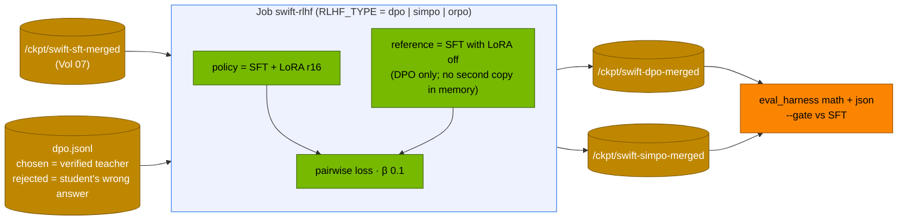

# Volume 08 — Preference Alignment with ms-swift: DPO, SimPO and ORPO on Your Own Hard Cases, and Where GRPO Fits

> **Module 04 · Part II — Training and alignment** · Prev: [07 SFT](07-distributed-sft-with-ms-swift.md) · Next: [09 PEFT variants](09-parameter-efficient-tuning-peft.md)

| | |
|---|---|
| **You will build** | Preference training on top of Volume 07's SFT model, using pairs mined from the model's own mistakes (chosen = verified teacher solution, rejected = the student's wrong answer). You'll train DPO and SimPO with the same data and budget, read the training signals that tell you it's working (reward margins, preference accuracy), and score all three models (SFT, +DPO, +SimPO) behind the release gate |
| **Hardware** | spark-01 |
| **Time** | 2 h |
| **Risk** | Low |
| **Lab files** | [`k8s/jobs/swift-rlhf.yaml`](lab/k8s/jobs/swift-rlhf.yaml) (`RLHF_TYPE`), [`tools/synth_data.py`](lab/tools/synth_data.py) (`dpo.jsonl`), [`03 …/tools/eval_harness.py`](../03%20DeepSeek/lab/tools/eval_harness.py) |

---

## 1. Why preference training after SFT

SFT teaches the model *what a good answer looks like*. Preference training teaches it *which of two answers is better*. That's the signal that pushes down specific failure modes, such as the arithmetic slips your student model actually makes:

| Method | Needs a reference model? | Objective (per pair: chosen y_w, rejected y_l) | Notes |
|---|---|---|---|
| **DPO** | yes (frozen copy, or the base with LoRA disabled) | −log σ(β·[(log π(y_w) − log π_ref(y_w)) − (log π(y_l) − log π_ref(y_l))]) | the standard. β ≈ 0.1 |
| **SimPO** | no | −log σ((β/\|y_w\|)·log π(y_w) − (β/\|y_l\|)·log π(y_l) − γ) | length-normalised, reference-free, has a margin γ |
| **ORPO** | no | SFT loss + λ·odds-ratio term | can replace SFT + DPO with one stage |
| KTO | no pairs needed | per-example "good/bad" labels | for thumbs-up/down data |
| **GRPO** | no reward model | group-relative advantage on sampled answers scored by rules | online RL. Run it with TRL in 03 Vols 05/25, or `swift rlhf --rlhf_type grpo` |

---

## 2. Architecture — HLD



---

## 3. LLD

### 3.1 The Job (`swift-rlhf.yaml`)

| Argument | Value |
|---|---|
| `--rlhf_type` | `$RLHF_TYPE` (default `dpo`) |
| `--model` | `/ckpt/swift-sft-merged` |
| `--train_type lora` | rank 16, `all-linear` |
| `--beta` | 0.1 |
| lr / epochs | 5e-6 / 2 (preference training uses much smaller steps than SFT) |
| batch | 2 × grad-accum 8 |
| output | `/ckpt/swift-$RLHF_TYPE` → merged `/ckpt/swift-$RLHF_TYPE-merged` |

### 3.2 Signals to watch in the log (TRL-style names)

| Metric | Healthy |
|---|---|
| `rewards/chosen` | rises or stays flat |
| `rewards/rejected` | falls |
| `rewards/margins` | grows from ~0 |
| `rewards/accuracies` | climbs towards 0.8–1.0 (fraction of pairs where chosen > rejected) |
| `logps/chosen` | must not collapse. A large drop means the model is unlearning good answers (lower lr or β) |

SimPO logs its own reward and margin terms. The interpretation is the same.

### 3.3 Data requirements

| Requirement | Why |
|---|---|
| pairs share the same prompt | the loss compares two answers to one question |
| chosen is genuinely better | verified answers guarantee that here |
| rejected is a *plausible* mistake | pairs from the model's own errors teach the most. Random junk teaches little |
| a few hundred pairs minimum | fewer can work for format behaviours. Accuracy behaviours need more |

---

## 4. Integrations

- **Vol 07**: the SFT model is the starting point and the baseline for the gate.
- **Vol 10**: produces `dpo.jsonl`. More student failures give more pairs.
- **03 Vols 05, 25**: GRPO with TRL and vLLM rollouts. The online alternative to these offline methods.

---

## 5. Lab

### 5.1 Pairs from the student's mistakes

```bash
cd "04 Qwen/lab"
# teacher on the main vLLM, student 0.5B next to it (03's side-by-side pattern, built from 04's catalog)
scripts/serve-model.sh qwen2.5-32b-awq
kubectl -n llm-serving port-forward svc/vllm 8000 &
# run the student anywhere it fits; on one Spark the simplest is a second run after switching:
python3 tools/synth_data.py --url http://localhost:8000 --teacher qwen2.5-32b-awq \
  --student-url http://localhost:8000 --student qwen2.5-32b-awq -n 50 --out /tmp/selfcheck   # sanity: few pairs
```

The cleaner setup gives the student its own endpoint. Serve `qwen2.5-0.5b` side by side (a `k8s/multi` overlay like Vol 03's), then:

```bash
python3 tools/synth_data.py --url http://localhost:8000 --teacher qwen2.5-32b-awq \
  --student-url http://localhost:8001 --student qwen2.5-0.5b -n 600 --out data/synth
wc -l data/synth/dpo.jsonl
kubectl -n batch create configmap swift-data --from-file=sft.jsonl=data/synth/sft.jsonl \
  --from-file=dpo.jsonl=data/synth/dpo.jsonl --dry-run=client -o yaml | kubectl apply -f -
```

### 5.2 DPO, then SimPO

```bash
kubectl -n llm-serving scale deploy vllm --replicas=0
for t in dpo simpo; do
  kubectl -n batch delete job swift-rlhf --ignore-not-found
  yq "(.spec.template.spec.containers[0].env[] | select(.name == \"RLHF_TYPE\")).value = \"$t\"" k8s/jobs/swift-rlhf.yaml | kubectl apply -f -
  kubectl -n batch wait --for=condition=complete job/swift-rlhf --timeout=3h
  kubectl -n batch logs job/swift-rlhf | grep -E "rewards/(margins|accuracies)|train_runtime" | tail -4
done
```

| method | final rewards/accuracies | final margin | train_runtime |
|---|---|---|---|
| DPO | | | |
| SimPO | | | |

### 5.3 Score SFT vs DPO vs SimPO behind the gate

```bash
for m in sft dpo simpo; do
  "../../03 DeepSeek/lab/scripts/publish-adapter.sh" swift-$m-merged qwen2.5-7b-$m 2>/dev/null || true
done
scripts/serve-model.sh qwen2.5-7b
for m in sft dpo simpo; do
  kubectl -n llm-serving set env deploy/vllm MODEL=/models/adapters/qwen2.5-7b-$m SERVED_NAME=qwen2.5-7b-$m
  kubectl -n llm-serving rollout status deploy/vllm --timeout=20m
  kubectl -n llm-serving port-forward svc/vllm 8000 >/dev/null & pf=$!; sleep 3
  python3 "../../03 DeepSeek/lab/tools/eval_harness.py" --url http://localhost:8000 --model qwen2.5-7b-$m --suites math json \
    --out results/$m-7b.json $( [[ $m != sft ]] && echo --gate results/sft-7b.json )
  kill $pf
done
python3 "../../03 DeepSeek/lab/tools/eval_harness.py" --report results/sft-7b.json results/dpo-7b.json results/simpo-7b.json
```

(`publish-adapter.sh` for `swift-sft-merged` already ran in Vol 07.)

---

## 6. Verify

| Check | Expected |
|---|---|
| pairs | `dpo.jsonl` has hundreds of rows, each with a verified chosen answer |
| training | `rewards/accuracies` rising. `logps/chosen` not collapsing |
| results | three-row report. DPO/SimPO pass the gate vs SFT on json, and show any math change |

---

## 7. Troubleshooting

| Symptom | Cause | Fix |
|---|---|---|
| `rewards/accuracies` stuck at ~0.5 | pairs too easy or noisy, or lr too low | more and harder pairs. Check that chosen ≠ rejected text |
| accuracy hits 1.0 fast, eval gets worse | over-optimisation (log-probs of chosen collapse) | lower lr or epochs, raise β (DPO) |
| SimPO answers get very short or long | length term vs margin γ | keep defaults first. Tune γ only with evidence |
| `rejected_response` KeyError | dataset row missing the field | `synth_data.py` only writes pairs when the student was wrong |
| OOM | vLLM still up, or batch too large | scale vLLM to 0. Lower the batch |

---

## 8. Scale-out path

| One Spark | Production |
|---|---|
| synthetic arithmetic pairs | pairs from user feedback, red-team findings and production failures, reviewed |
| offline DPO/SimPO | iterative/online DPO and GRPO with fresh samples each round (vLLM rollouts, 03 Vol 25) |
| two methods compared once | an alignment pipeline with the release gate and safety evals at every step |

---

## 9. Checklist

- [ ] I can write the DPO and SimPO objectives and say what β and γ do.
- [ ] My preference pairs come from real, verified mistakes.
- [ ] I read margins and preference accuracy during training.
- [ ] I compared SFT, DPO and SimPO on the same suites behind a gate.
