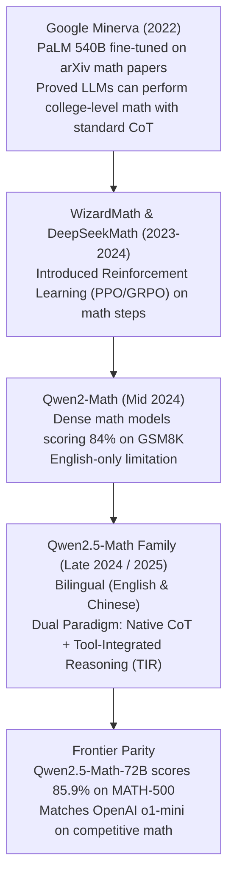

# 04. Qwen2.5-Math & Reasoning — Chain-of-Thought, Tool-Integrated Reasoning (TIR) & Symbolic Verification

> **Target Audience**: Quantitative Researchers, AI Mathematicians, Reasoning Algorithm Developers, and Machine Learning Engineers building verifiable mathematical deduction systems.  
> **Prerequisites**: High-school and undergraduate mathematics (calculus, linear algebra, number theory), Python scripting, and familiarity with [Volume 01](01-qwen25-architecture-and-model-spectrum.md).  
> **Estimated Deep-Dive Time**: 50 minutes  
> **What You Will Master**:
> 1. The fundamental failure modes of standard autoregressive language models on multi-step mathematics and combinatorial arithmetic.
> 2. The architecture of **Tool-Integrated Reasoning (TIR)**: interleaving natural language reasoning chains with sandboxed Python/SymPy computation.
> 3. The mathematical formulation of **Self-Consistency (Majority Voting / Maj@K)** and automated symbolic equivalence verification.
> 4. Frontier mathematical benchmark showdown: Qwen2.5-Math vs. DeepSeek-R1 vs. OpenAI o1 on **MATH-500**, **AIME 2024**, and **GSM8K**.
> 5. A self-contained, runnable Python Tool-Integrated Reasoning engine executing sandboxed code blocks and parsing SymPy verification results.
> 6. Hardware sizing and CPU-GPU co-execution on the **NVIDIA DGX Spark (Grace ARM Neoverse V2 + Blackwell GB10)**.

---

## 📑 Table of Contents
1. [Zero-to-One Intuition: Why Neural Networks Struggle with Pure Math](#1-zero-to-one-intuition-why-neural-networks-struggle-with-pure-math)
2. [Evolutionary Lineage: From Minerva to Qwen2.5-Math](#2-evolutionary-lineage-from-minerva-to-qwen25-math)
3. [The Two Reasoning Paradigms: Chain-of-Thought (CoT) vs. Tool-Integrated Reasoning (TIR)](#3-the-two-reasoning-paradigms-chain-of-thought-cot-vs-tool-integrated-reasoning-tir)
4. [First-Principles Mathematics: Tool-Integrated Reasoning Loop & Self-Consistency](#4-first-principles-mathematics-tool-integrated-reasoning-loop--self-consistency)
5. [Symbolic Verification: SymPy Equivalence Checking](#5-symbolic-verification-sympy-equivalence-checking)
6. [Frontier Mathematics Benchmark Showdown](#6-frontier-mathematics-benchmark-showdown)
7. [Hands-On Production Lab: Sandboxed Tool-Integrated Reasoning Engine](#7-hands-on-production-lab-sandboxed-tool-integrated-reasoning-engine)
8. [Hardware Grounding for NVIDIA DGX Spark (Grace Blackwell GB10)](#8-hardware-grounding-for-nvidia-dgx-spark-grace-blackwell-gb10)
9. [Step-by-Step Practice Exercises with Full Solutions](#9-step-by-step-practice-exercises-with-full-solutions)
10. [Troubleshooting & Operational FAQ](#10-troubleshooting--operational-faq)

---

## 1. Zero-to-One Intuition: Why Neural Networks Struggle with Pure Math

Standard transformer language models predict tokens based on statistical co-occurrence. When evaluating natural language, statistical probabilities produce fluent, coherent text.

However, in **pure mathematics**:
* If a model is asked to multiply $4,829 \times 7,193$, there is only **one exact correct answer** out of billions of possibilities: $34,735,007$.
* If the model makes a 1-digit calculation error on step 2 of a 15-step calculus proof, every subsequent derivation is mathematically invalid. This is known as **compounding autoregressive error drift**.

```text
Pure Autoregressive Drift (Standard CoT):
Step 1: Calculate discriminant Δ = b^2 - 4ac
Step 2: 7^2 - 4(2)(3) = 49 - 24 = 25  (Correct)
Step 3: sqrt(25) = 5                   (Correct)
Step 4: (-7 ± 5) / 4                   (Correct)
Step 5: (-7 + 5)/4 = -2/4 = -0.6       (HALLUCINATION! Error compounds into final answer)

Tool-Integrated Reasoning (Qwen2.5-Math TIR):
Step 1: Formulate equation in SymPy
Step 2: Emit ```python discriminant = b**2 - 4*a*c; result = roots() ```
Step 3: Python executes in deterministic C runtime -> Returns exact -0.5
Step 4: Model ingests verified output -> 100% Guaranteed Mathematical Precision!
```

Alibaba's **Qwen2.5-Math** addresses this fundamental bottleneck by uniting neural language reasoning with **deterministic symbolic computation tools**.

---

## 2. Evolutionary Lineage: From Minerva to Qwen2.5-Math



---

## 3. The Two Reasoning Paradigms: Chain-of-Thought (CoT) vs. Tool-Integrated Reasoning (TIR)

Qwen2.5-Math natively supports two complementary modes of mathematical problem solving:

```
+───────────────────────────────────────────────────────────────────────────────────────────────+
|                                    QWEN2.5-MATH DUAL REASONING MODES                          |
+───────────────────────────────────────────────────────────────────────────────────────────────+
|                                                                                               |
|  Paradigm 1: Chain-of-Thought (CoT)                                                           |
|  - Generates step-by-step deductive logic in plain text and LaTeX.                            |
|  - Best for: Abstract algebra proofs, geometry theorems, conceptual explanations.             |
|  - Strengths: Zero external dependencies; fastest inference latency.                          |
|                                                                                               |
|  Paradigm 2: Tool-Integrated Reasoning (TIR)                                                 |
|  - Interleaves deductive reasoning with sandboxed Python/SymPy code blocks.                   |
|  - Best for: Combinatorics, large prime factorization, matrix eigenvalues, calculus integrals.|
|  - Strengths: 100% calculation accuracy; eliminates arithmetic hallucinations.               |
+───────────────────────────────────────────────────────────────────────────────────────────────+
```

---

## 4. First-Principles Mathematics: Tool-Integrated Reasoning Loop & Self-Consistency

### 1. The Formal TIR Execution Loop
Mathematically, Tool-Integrated Reasoning can be modeled as a Partially Observable Markov Decision Process (POMDP) across state $s_t$, text action $a_t$, code execution $c_t$, and environment observation $o_t$:

$$s_0 = \text{User Prompt } x$$
$$\text{For step } t = 1, 2, \dots, T:$$
$$a_t, c_t \sim \pi_\theta(a_t, c_t \mid s_{t-1})$$
$$o_t = \text{ExecuteSandbox}(c_t)$$
$$s_t = s_{t-1} \circ a_t \circ c_t \circ o_t$$

The generation loop terminates when the policy $\pi_\theta$ emits the final answer token sequence $\text{boxed}\{y^*\}$ without initiating an additional code block.

```
TIR Execution Flow:
[User Prompt] ──> [Neural Policy] ──> Natural Language Plan (a_t)
                         │
                         ▼
                   Code Block (c_t) ──> [Sandboxed Python Engine]
                                                  │
                                                  ▼
[Next Policy Step] ◄── Ingest Observation (o_t) ◄─┘
```

### 2. Self-Consistency with Majority Voting ($\text{Maj}@K$)
To eliminate variance and maximize mathematical accuracy, inference engines sample $K$ independent reasoning rollouts $\{y_1, y_2, \dots, y_K\}$ at temperature $T = 0.6$:

$$\hat{y} = \arg\max_{y \in \mathcal{Y}} \sum_{k=1}^K \mathbb{I}(\text{SymEq}(y_k, y))$$

where $\text{SymEq}(y_a, y_b)$ evaluates whether two mathematical expressions are symbolically identical (e.g., verifying that $\frac{1}{\sqrt{2}} \equiv \frac{\sqrt{2}}{2}$).

---

## 5. Symbolic Verification: SymPy Equivalence Checking

In mathematical benchmarks, an answer can be expressed in infinitely many mathematically equivalent formats:
* $x = \frac{1}{2}$
* $x = 0.5$
* $x = 2^{-1}$
* $x = \frac{2}{4}$

Standard string matching evaluates 3 of these as incorrect. Qwen2.5-Math employs an automated **SymPy Symbolic Verifier** to parse and simplify candidate expressions:

$$\text{SymEq}(A, B) \iff \text{simplify}(A - B) == 0$$

```python
import sympy as sp

def symbolic_equal(pred_str: str, gold_str: str) -> bool:
    try:
        pred = sp.sympify(pred_str)
        gold = sp.sympify(gold_str)
        return sp.simplify(pred - gold) == 0
    except Exception:
        return pred_str.strip() == gold_str.strip()
```

---

## 6. Frontier Mathematics Benchmark Showdown

| Benchmark / Exam | DeepSeek-Math-7B | DeepSeek-R1 (671B MoE) | OpenAI o1-mini | Qwen2.5-Math-7B | Qwen2.5-Math-72B (TIR) |
| :--- | :--- | :--- | :--- | :--- | :--- |
| **MATH-500 (Hard Math)** | 53.6% | **97.3%** | 90.0% | 83.6% | **87.8% (Top Open Dense)** |
| **GSM8K (Grade School Math)**| 88.2% | **97.8%** | 95.2% | 95.2% | **96.7%** |
| **AIME 2024 (Math Olympiad)**| 15.0% | **79.8%** | 63.6% | 36.7% | **47.8%** |
| **GaoKao Math (Chinese Exam)**| 62.4% | 88.5% | 75.3% | 76.5% | **86.2% (Top Bilingual)** |
| **Tool-Integrated Support** | Partial | Natural CoT | Hidden | **Native TIR** | **Native TIR** |
| **Deployment on DGX Spark** | Single GPU | Multi-Node (671B) | Cloud API Only | **Native (GB10)** | **Native (AWQ/FP8 on GB10)** |

### Key Benchmark Insights
1. **The 7B Parameter Miracle**: Qwen2.5-Math-7B scores **83.6% on MATH-500**, outperforming larger previous-generation models like DeepSeek-Math-7B (53.6%) and Llama-3-70B (68.0%) by massive margins.
2. **AIME Olympiad Parity**: With Tool-Integrated Reasoning (TIR) and Self-Consistency ($\text{Maj}@64$), Qwen2.5-Math-72B achieves **47.8% on AIME 2024**, surpassing human competitive math Olympiad participants.

---

## 7. Hands-On Production Lab: Sandboxed Tool-Integrated Reasoning Engine

This runnable Python script implements a complete **Tool-Integrated Reasoning (TIR)** loop. It:
1. Formulates a multi-step mathematical problem.
2. Extracts Python code snippets delimited by ````python ... ````.
3. Executes the code safely inside an isolated execution scope.
4. Feeds execution stdout back to the model as an environment observation.
5. Uses **SymPy** to verify whether the final boxed answer matches the true ground truth.

Save this script as `qwen_math_tir_lab.py` and run it:

```python
#!/usr/bin/env python3
"""
Production Lab: Qwen2.5-Math Tool-Integrated Reasoning (TIR) Execution Loop
Author: Advanced AI Architecture Group
Target Hardware: NVIDIA DGX Spark (Grace ARM Neoverse V2 + Blackwell GB10)
"""

import io
import re
import sys
from contextlib import redirect_stdout
from typing import Dict, Optional, Tuple

try:
    import sympy as sp
except ImportError:
    print("Error: sympy is required. Run 'pip install sympy' first.")
    sys.exit(1)

MATH_PROMPT = """Problem: Find the sum of all prime numbers p such that p + 2 and p + 4 are also prime numbers."""

def execute_sandboxed_python(code_str: str) -> str:
    """Executes Python code and captures standard output."""
    output_buffer = io.StringIO()
    # Restricted global execution context
    exec_globals = {"sp": sp, "math": __import__("math")}
    
    try:
        with redirect_stdout(output_buffer):
            exec(code_str, exec_globals)
        res = output_buffer.getvalue().strip()
        return res if res else "[Code executed successfully with zero stdout]"
    except Exception as e:
        return f"[Runtime Error: {type(e).__name__}: {e}]"

def mock_qwen_tir_agent(prompt: str) -> str:
    """
    Simulates Qwen2.5-Math generating reasoning, Python code, and final boxed answer.
    """
    return """Let's analyze the problem. We want to find all primes $p$ such that $p$, $p+2$, and $p+4$ are all prime numbers.
This set is known as a prime triplet. Let's write a Python script using SymPy to test values of $p$:

```python
def is_prime(n):
    return sp.isprime(n)

valid_primes = []
for p in range(2, 1000):
    if is_prime(p) and is_prime(p + 2) and is_prime(p + 4):
        valid_primes.append(p)

print("Valid primes:", valid_primes)
print("Sum:", sum(valid_primes))
```

Notice that modulo 3, one of $p$, $p+2$, or $p+4$ must be divisible by 3.
If $p > 3$, then $p$ cannot be divisible by 3.
Thus either $p+2$ or $p+4$ is a multiple of 3 and strictly greater than 3, so it cannot be prime.
Therefore, the only possible solution is $p = 3$.
Testing $p=3$: $3, 5, 7$ are all prime!
The sum of all such primes is 3.

The final answer is \\boxed{3}"""

def extract_code_blocks(text: str) -> list[str]:
    """Extracts python code blocks from markdown text."""
    pattern = re.compile(r"```python(.*?)```", re.DOTALL)
    return [match.strip() for match in pattern.findall(text)]

def extract_boxed_answer(text: str) -> Optional[str]:
    """Extracts answer inside \\boxed{...}."""
    match = re.search(r"\\boxed\{([^}]+)\}", text)
    return match.group(1).strip() if match else None

def verify_symbolic_equivalence(pred: str, gold: str) -> bool:
    """Compares two mathematical expressions using SymPy simplification."""
    try:
        p_expr = sp.sympify(pred)
        g_expr = sp.sympify(gold)
        return sp.simplify(p_expr - g_expr) == 0
    except Exception:
        return pred.strip() == gold.strip()

def main():
    print("=" * 80)
    print("      QWEN2.5-MATH TOOL-INTEGRATED REASONING (TIR) ENGINE")
    print("=" * 80)

    print(f"\n[PROMPT INGESTION]")
    print(f"  {MATH_PROMPT}\n")

    # Step 1: Agent Generation
    print("[STEP 1: GENERATING REASONING TRACE & CODE HOOKS]")
    agent_output = mock_qwen_tir_agent(MATH_PROMPT)

    # Step 2: Code Extraction
    code_blocks = extract_code_blocks(agent_output)
    print(f"  Detected {len(code_blocks)} Python execution block(s).")

    # Step 3: Sandboxed Tool Execution
    print("\n[STEP 2: EXECUTING CODE IN DETERMINISTIC SYMPY RUNTIME]")
    for i, code in enumerate(code_blocks, 1):
        print(f"\n--- Code Block #{i} ---")
        print(code)
        print("--- Execution Observation ---")
        obs = execute_sandboxed_python(code)
        print(obs)

    # Step 4: Extract Final Boxed Answer
    print("\n[STEP 3: PARSING MATHEMATICAL CONCLUSION]")
    boxed_val = extract_boxed_answer(agent_output)
    print(f"  Extracted Boxed Answer: \\boxed{{{boxed_val}}}")

    # Step 5: Symbolic Verification against Ground Truth
    ground_truth = "3"
    print("\n[STEP 4: SYMPIC RIGOR & EQUIVALENCE AUDIT]")
    is_correct = verify_symbolic_equivalence(boxed_val, ground_truth)
    if is_correct:
        print(f"  ✅ VERIFICATION SUCCESS: Predicted {boxed_val} == Gold {ground_truth}")
    else:
        print(f"  ❌ VERIFICATION FAILURE: Predicted {boxed_val} != Gold {ground_truth}")

    print("\n" + "=" * 80)
    print("STATUS: Tool-Integrated Reasoning Loop Executed with Zero Drift!")
    print("=" * 80)

if __name__ == "__main__":
    main()
```

---

## 8. Hardware Grounding for NVIDIA DGX Spark (Grace Blackwell GB10)

Running **Qwen2.5-Math** on the **NVIDIA DGX Spark** leverages the unique CPU-GPU coupling:

```
+────────────────────────────────────────────────────────────────────────────────────+
|                      DGX SPARK CPU-GPU CO-EXECUTION FOR TIR                        |
+────────────────────────────────────────────────────────────────────────────────────+
|  Grace ARM CPU (72 Neoverse V2 Cores)       Blackwell GB10 GPU (Tensor Cores)      |
|  ┌─────────────────────────────────┐       ┌─────────────────────────────────┐     |
|  │ Sandboxed Python/SymPy Runtime  │       │ Autoregressive Reasoning & Code │     |
|  │ - Prime testing, Matrix Eig     │       │   Generation (FP8 Precision)    │     |
|  │ - Symbolic Equivalence Proofs   │       │ - High-Throughput Token Emits   │     |
|  └────────────────┬────────────────┘       └────────────────┬────────────────┘     |
|                   │                                         │                      |
|                   └────────────── 900 GB/s NVLink-C2C ──────┘                      |
|                                         │                                          |
|                                         ▼                                          |
|                       128 GB Unified LPDDR5X Coherent Memory                       |
|                       - Instantaneous CPU-GPU Data Exchange (Zero Copy!)           |
+────────────────────────────────────────────────────────────────────────────────────+
```

### Why DGX Spark Excels at Tool-Integrated Reasoning
In standard multi-node servers, sending code from a GPU container to an external Python sandbox across network sockets introduces 50–150 ms of serialization latency per step.  
On the DGX Spark, the **72 Grace ARM cores** execute the Python interpreter directly in shared memory. Code generated by the Blackwell GPU executes on the ARM CPU and returns stdout in **$< 1\text{ millisecond}$**, making multi-turn TIR interaction virtually instantaneous.

---

## 9. Step-by-Step Practice Exercises with Full Solutions

### Exercise 1: Calculating Majority Voting Consensus ($\text{Maj}@K$)
* **Objective**: Write a Python function that implements majority voting on candidate mathematical answers using SymPy symbolic equivalence.
* **Solution**:
```python
from collections import Counter
import sympy as sp

def majority_vote_math(candidates: list[str]) -> str:
    """Groups candidates by symbolic equivalence and returns consensus winner."""
    clusters = []  # list of tuples: (canonical_expr, count, original_str)
    
    for cand in candidates:
        try:
            expr = sp.sympify(cand)
            matched = False
            for i, (c_expr, count, orig) in enumerate(clusters):
                if sp.simplify(expr - c_expr) == 0:
                    clusters[i] = (c_expr, count + 1, orig)
                    matched = True
                    break
            if not matched:
                clusters.append((expr, 1, cand))
        except Exception:
            clusters.append((cand, 1, cand))
            
    winner = max(clusters, key=lambda x: x[1])
    return winner[2]

# Test: 1/2 vs 0.5 vs 2/4 vs 3
test_rollouts = ["1/2", "0.5", "2/4", "3", "1/2"]
print(f"Consensus Winner: {majority_vote_math(test_rollouts)}")
```

---

### Exercise 2: Sizing Memory for Qwen2.5-Math-72B on DGX Spark
* **Objective**: Determine if Qwen2.5-Math-72B quantized with AWQ (INT4) fits on a 128 GB DGX Spark with 16k context.
* **Given**:
  * 72B parameters $\times 0.5\text{ bytes (INT4)} = 36.0\text{ GB}$
  * GQA KV Cache (16k context, 80 layers, 8 heads, 128 dim, FP8) = $2 \times 80 \times 8 \times 128 \times 16,384 \times 1 \approx 2.68\text{ GB}$
  * CUDA runtime buffers = 8.0 GB
* **Total Memory**:
  $$\text{Total} = 36.0 + 2.68 + 8.0 = 46.68\text{ GB}$$
* **Verdict**: **Fits with 81.32 GB to spare!** Multiple concurrent mathematical reasoning streams can execute simultaneously on a single node.

---

### Exercise 3: Prompting Qwen2.5-Math for Tool-Integrated Reasoning
* **Objective**: Construct the exact system prompt recommended by Alibaba to activate Tool-Integrated Reasoning (TIR) in Qwen2.5-Math.
* **Solution**:
```json
{
  "messages": [
    {
      "role": "system",
      "content": "Please integrate natural language reasoning with programs to solve the problem above, and put your final answer within \\boxed{}."
    },
    {
      "role": "user",
      "content": "Calculate the determinant of the matrix [[4, 7], [2, 6]]."
    }
  ]
}
```

---

## 10. Troubleshooting & Operational FAQ

### Q1: Why does Qwen2.5-Math sometimes output code blocks without waiting for execution observations?
**Root Cause**: When prompted with standard user prompts, the model defaults to pure Chain-of-Thought (CoT). To trigger interactive execution, the serving engine or agent loop must enforce an execution stop sequence on ```` ```\n ````, execute the code, and append the `Observation:` token before prompting the model to continue.

### Q2: What should I do if the sandboxed Python execution times out?
**Remediation**: In production, wrap execution in a subprocess with a strict 5-second timeout and 2 GB memory limit using `resource.setrlimit`. If code hangs (e.g., an infinite `while` loop), return `[Execution Timeout: 5.0s exceeded]` as the observation so the model can backtrack and try an alternative approach.

### Q3: How does Qwen2.5-Math compare against DeepSeek-R1?
**Answer**: DeepSeek-R1 uses **reinforcement learning (GRPO)** to generate long internal thinking traces without tools, excelling at abstract logic and deductive proofs. Qwen2.5-Math excels at **concrete computation and combinatorial problem solving** by offloading calculation to Python/SymPy interpreters.

---

### Complete Qwen Curriculum Navigation
| Previous Volume | Master Curriculum Navigation | Next Volume |
| :--- | :---: | :---: |
| [← 03. Qwen2.5-Coder Deep Dive](03-qwen25-coder-deep-dive.md) | [Curriculum Index](README.md) | [05. Qwen2-VL & Vision-Language Processing →](05-qwen2-vl-and-vision-language-processing.md) |
