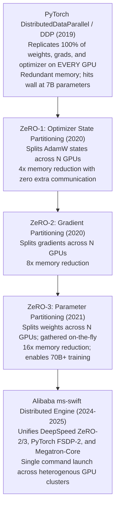

# 07. Distributed SFT with ms-swift — Multi-GPU, DeepSpeed ZeRO-2/3 & Megatron Backend

> **Target Audience**: Large-Scale Training Engineers, MLOps Cluster Operators, AI Infrastructure Architects, and Research Scientists scaling fine-tuning runs across multi-GPU nodes.  
> **Prerequisites**: Deep understanding of PyTorch backpropagation, gradient accumulation, and parameter sizing ([Volume 01](01-qwen25-architecture-and-model-spectrum.md), [DeepSeek Volume 26](../DeepSeek/26-distributed-deepspeed-zero3-and-fsdp.md)).  
> **Estimated Deep-Dive Time**: 50 minutes  
> **What You Will Master**:
> 1. The first-principles mathematical derivation of the **$16\times$ training memory explosion** during full-parameter SFT.
> 2. The mechanics of **DeepSpeed ZeRO-1, ZeRO-2, and ZeRO-3** memory partitioning and communication volume ($3\Psi$ overhead).
> 3. Configuring and launching multi-GPU and multi-node SFT runs using **Alibaba `ms-swift`** with DeepSpeed and Megatron backends.
> 4. Activation memory management: selective activation recomputation, gradient checkpointing, and FlashAttention-2.
> 5. A self-contained, runnable Python lab generating production DeepSpeed configs and validating multi-GPU memory partition math.
> 6. Exploiting the **900 GB/s NVLink-C2C** bus for zero-latency ZeRO-Offload on the **NVIDIA DGX Spark (Grace Blackwell GB10)**.

---

## 📑 Table of Contents
1. [Zero-to-One Intuition: The $16\times$ Training Memory Explosion](#1-zero-to-one-intuition-the-16-training-memory-explosion)
2. [Evolutionary Lineage: From DDP to ZeRO and Megatron](#2-evolutionary-lineage-from-ddp-to-zero-and-megatron)
3. [First-Principles Mathematics: ZeRO Memory Partitioning Formulas](#3-first-principles-mathematics-zero-memory-partitioning-formulas)
4. [Activation Memory & Gradient Checkpointing](#4-activation-memory--gradient-checkpointing)
5. [Comparative Trade-Off Matrix: Distributed Backends in ms-swift](#5-comparative-trade-off-matrix-distributed-backends-in-ms-swift)
6. [Hands-On Production Lab: DeepSpeed ZeRO-3 Configuration & Launch](#6-hands-on-production-lab-deepspeed-zero-3-configuration--launch)
7. [Hardware Grounding for NVIDIA DGX Spark (Grace Blackwell GB10)](#7-hardware-grounding-for-nvidia-dgx-spark-grace-blackwell-gb10)
8. [Step-by-Step Practice Exercises with Full Solutions](#8-step-by-step-practice-exercises-with-full-solutions)
9. [Troubleshooting & Operational FAQ](#9-troubleshooting--operational-faq)

---

## 1. Zero-to-One Intuition: The $16\times$ Training Memory Explosion

Engineers transitioning from LLM **inference** to **training** frequently experience shock when their hardware crashes with an Out-of-Memory (OOM) error:
* To *serve* **Qwen2.5-32B** at FP16 precision, you need **64 GB** of VRAM.
* To *train* **Qwen2.5-32B** with standard full-parameter Supervised Fine-Tuning (SFT), you need over **512 GB** of VRAM!

Why does training consume **$8\times$ more memory** than serving?

```text
Inference Memory (Serving):
[ Model Weights: 2 bytes/param ] ──> Total: 64 GB

Training Memory (Full SFT with AdamW):
[ Weights (BF16): 2 bytes ] + [ Gradients (BF16): 2 bytes ]
+ [ AdamW FP32 Master Weights: 4 bytes ]
+ [ AdamW FP32 Momentum (m):   4 bytes ]
+ [ AdamW FP32 Variance (v):   4 bytes ]
─────────────────────────────────────────────────────────────
Total State per Parameter: 16 BYTES! (16 * 32.5B = 520 GB!)
```

On a single discrete 80GB GPU, full-parameter fine-tuning of a 32B or 72B model is physically impossible without distributed memory partitioning.

---

## 2. Evolutionary Lineage: From DDP to ZeRO and Megatron



---

## 3. First-Principles Mathematics: ZeRO Memory Partitioning Formulas

Let a model have $\Psi$ parameters. In standard mixed-precision training (BF16 forward/backward, FP32 AdamW optimizer), total static state memory is:

$$\text{Mem}_{\text{static}} = 16 \Psi \text{ bytes}$$

Across a cluster of $N_{\text{GPUs}}$:

### 1. ZeRO-Stage 1 (Optimizer State Partitioning: $P_{os}$)
Optimizer states ($12 \Psi$ bytes) are split evenly across all $N$ GPUs. Weights ($2\Psi$) and gradients ($2\Psi$) remain replicated on every GPU:
$$\text{Mem}_{\text{ZeRO-1}} = 2\Psi + 2\Psi + \frac{12\Psi}{N} = 4\Psi + \frac{12\Psi}{N}$$

### 2. ZeRO-Stage 2 (Gradient & Optimizer Partitioning: $P_{os+g}$)
Both optimizer states and gradients are partitioned across all $N$ GPUs:
$$\text{Mem}_{\text{ZeRO-2}} = 2\Psi + \frac{2\Psi}{N} + \frac{12\Psi}{N} = 2\Psi + \frac{14\Psi}{N}$$

### 3. ZeRO-Stage 3 (Full Parameter Partitioning: $P_{os+g+p}$)
Weights, gradients, and optimizer states are all partitioned across all $N$ GPUs. During forward and backward passes, the required layer weights are gathered dynamically via `AllGather` and deleted immediately after computation:
$$\text{Mem}_{\text{ZeRO-3}} = \frac{2\Psi + 2\Psi + 12\Psi}{N} = \frac{16\Psi}{N}$$

```
Memory Distribution for Qwen2.5-32B (520 GB Total State) Across 8 GPUs:
+────────────────────────────────────────────────────────────────────────────+
| Strategy     | Memory per GPU (Weights + Grads + Opt) | Savings vs DDP     |
+────────────────────────────────────────────────────────────────────────────+
| DDP          | 520.0 GB                               | 0.0% (OOM Crash!)  |
| ZeRO-1       | 130.0 GB + 65.0 GB = 195.0 GB          | 62.5% reduction    |
| ZeRO-2       | 65.0 GB + 22.8 GB  = 87.8 GB           | 83.1% reduction    |
| ZeRO-3       | 520.0 GB / 8       = 65.0 GB           | 87.5% reduction!   |
+────────────────────────────────────────────────────────────────────────────+
```

### Communication Volume Overhead of ZeRO-3
In standard DDP, training requires a single `AllReduce` of gradients after the backward pass, transferring **$2\Psi$ bytes** per step.  
In ZeRO-3:
* Forward pass: `AllGather` weights $\to \Psi$ bytes transferred.
* Backward pass: `AllGather` weights $\to \Psi$ bytes transferred.
* Backward pass: `ReduceScatter` gradients $\to \Psi$ bytes transferred.
$$\text{Communication}_{\text{ZeRO-3}} = \Psi + \Psi + \Psi = 3\Psi \text{ bytes per step}$$
ZeRO-3 increases inter-GPU network communication by **only 50% ($3\Psi$ vs $2\Psi$)** while slashing memory per GPU by a factor of $N$!

---

## 4. Activation Memory & Gradient Checkpointing

Even if static weights and optimizer states are sharded, **activation memory** $\Phi_{\text{act}}$ can easily cause an OOM when sequence length $S$ reaches 8,192 or 32,768 tokens:

$$\Phi_{\text{act}} = L \times S \times B \times d_{\text{model}} \times \left(34 + 5 \frac{H_q}{H_{kv}}\right) \text{ bytes}$$

### Gradient Checkpointing (Activation Recomputation)
Instead of storing all intermediate activations during the forward pass:
1. The engine stores only the input tensors at the boundary of each transformer block.
2. During the backward pass, the forward pass for that specific block is **recomputed on-the-fly**.
3. **Trade-off**: Recomputation adds ~25% more FLOPs, but reduces activation memory by **over 80%**, enabling full-context 32k fine-tuning.

---

## 5. Comparative Trade-Off Matrix: Distributed Backends in ms-swift

| Distributed Engine | Memory Efficiency | Communication Overhead | Setup Complexity | Best Use Case |
| :--- | :--- | :--- | :--- | :--- |
| **DDP (Standard PyTorch)** | Poor ($16\Psi$ on every GPU)| Lowest ($2\Psi$) | Zero (Default) | Small models (0.5B to 3B) |
| **DeepSpeed ZeRO-2** | Medium ($2\Psi + 14\Psi/N$) | Lowest ($2\Psi$) | Low | LoRA / QLoRA across multi-GPU |
| **DeepSpeed ZeRO-3** | **Maximum ($16\Psi/N$)** | Medium ($3\Psi$) | Medium (JSON config)| **Full SFT of 14B / 32B / 72B** |
| **PyTorch FSDP-2** | **Maximum ($16\Psi/N$)** | Medium ($3\Psi$) | Low (Native in PyTorch)| Native PyTorch 2.5 deployments |
| **Megatron-LM (TP + PP)** | High | Low (within NVLink node)| High | Pretraining 70B+ from scratch |

---

## 6. Hands-On Production Lab: DeepSpeed ZeRO-3 Configuration & Launch

This self-contained Python script builds a production-grade **DeepSpeed ZeRO-3 configuration** with CPU offloading and activation checkpointing, and provides the exact `ms-swift` distributed execution command.

Save this script as `swift_zero3_launcher.py`:

```python
#!/usr/bin/env python3
"""
Production Lab: DeepSpeed ZeRO-3 Configuration Generator & ms-swift Distributed SFT
Author: Advanced AI Architecture Group
Target Hardware: NVIDIA DGX Spark (Grace Blackwell GB10)
"""

import json
import os
import sys

DS_CONFIG_PATH = "/tmp/ds_config_zero3.json"

def generate_deepspeed_zero3_config():
    """Generates production DeepSpeed ZeRO-3 JSON configuration."""
    config = {
        "train_batch_size": "auto",
        "train_micro_batch_size_per_gpu": "auto",
        "gradient_accumulation_steps": "auto",
        "zero_optimization": {
            "stage": 3,
            "offload_optimizer": {
                "device": "cpu",
                "pin_memory": True
            },
            "offload_param": {
                "device": "none"
            },
            "overlap_comm": True,
            "contiguous_gradients": True,
            "sub_group_size": 1e9,
            "reduce_bucket_size": "auto",
            "stage3_prefetch_bucket_size": "auto",
            "stage3_param_persistence_threshold": "auto",
            "stage3_max_live_parameters": 1e9,
            "stage3_max_reuse_distance": 1e9,
            "stage3_gather_16bit_weights_on_model_save": True
        },
        "bf16": {
            "enabled": True
        },
        "gradient_clipping": 1.0,
        "steps_per_print": 10,
        "wall_clock_breakdown": False
    }

    with open(DS_CONFIG_PATH, "w", encoding="utf-8") as f:
        json.dump(config, f, indent=2)
    return DS_CONFIG_PATH

def print_execution_plan(config_path: str):
    print("=" * 80)
    print("      ms-swift DISTRIBUTED SFT: DEEPSPEED ZeRO-3 EXECUTION ENGINE")
    print("=" * 80)

    print("\n[STEP 1: GENERATED DEEPSPEED CONFIGURATION]")
    print(f"  Configuration written to: {config_path}")
    print("  • Sharding Mode:         ZeRO-Stage 3 (Full Parameter, Grad & Optimizer Sharding)")
    print("  • Optimizer Offload:     CPU (Leverages Grace 72-core ARM memory)")
    print("  • Precision:             BF16 Mixed Precision Enabled")
    print("  • Overlap Communication: Enabled (Async AllGather)")

    cli_command = f"""NPROC_PER_NODE=4 swift sft \\
    --model_type qwen2_5-32b-instruct \\
    --model_id_or_path /data/models/Qwen2.5-Coder-32B-Instruct \\
    --dataset /data/datasets/alpaca_en.jsonl \\
    --deepspeed {config_path} \\
    --train_type full \\
    --output_dir /data/checkpoints/qwen_32b_full_sft \\
    --num_train_epochs 3 \\
    --max_length 4096 \\
    --batch_size 1 \\
    --gradient_accumulation_steps 4 \\
    --learning_rate 2e-5 \\
    --gradient_checkpointing true \\
    --use_flash_attn true
"""
    print("\n[STEP 2: DISTRIBUTED LAUNCH COMMAND (4x GPU NODE)]")
    print("--- Shell Command ---")
    print(cli_command)
    print("---------------------")

    print("[STEP 3: THEORETICAL MEMORY CONSUMPTION AUDIT]")
    params = 32.5e9
    zero3_mem = (16 * params) / 4 / 1e9
    print(f"  • Static Model State per GPU:  {zero3_mem:.1f} GB (Down from 520.0 GB!)")
    print(f"  • Estimated Activations (4k):  ~14.5 GB")
    print(f"  • Total Peak VRAM per GPU:     ~{zero3_mem + 14.5:.1f} GB (Fits 80GB/128GB GPUs easily!)")

    print("\n" + "=" * 80)
    print("STATUS: ZeRO-3 Distributed Configuration Ready for Cluster Launch!")
    print("=" * 80)

if __name__ == "__main__":
    path = generate_deepspeed_zero3_config()
    print_execution_plan(path)
```

---

## 7. Hardware Grounding for NVIDIA DGX Spark (Grace Blackwell GB10)

On the **NVIDIA DGX Spark**, the **900 GB/s NVLink-C2C** bus fundamentally changes the economics of DeepSpeed CPU offloading:

```
+────────────────────────────────────────────────────────────────────────────────────+
|                      DGX SPARK NVLink-C2C ZeRO-OFFLOAD ENGINE                      |
+────────────────────────────────────────────────────────────────────────────────────+
|  Traditional PCIe Gen5 Server:                                                     |
|  - Host CPU to GPU Bandwidth: ~64 GB/s                                             |
|  - ZeRO CPU Offloading stalls the GPU compute pipeline by 40-60%!                  |
|                                                                                    |
|  NVIDIA DGX Spark (Grace Blackwell Architecture):                                  |
|  - Host CPU to GPU Bandwidth: 900 GB/s Bi-Directional (14x Faster than PCIe Gen5!) |
|  - CPU Offload of AdamW States occurs at NEAR-VRAM SPEEDS!                         |
|  - Enables full-parameter SFT of 72B models using combined 128 GB Unified Memory!  |
+────────────────────────────────────────────────────────────────────────────────────+
```

---

## 8. Step-by-Step Practice Exercises with Full Solutions

### Exercise 1: Calculating Communication Overhead for 8x H100 Nodes
* **Objective**: Compute the total gigabytes transferred across the network during one training step of Qwen2.5-72B using ZeRO-3.
* **Given**:
  * $\Psi = 72.7 \times 10^9$ parameters.
  * ZeRO-3 transfers $3\Psi$ bytes per step.
* **Calculation**:
  $$\text{Bytes} = 3 \times 72.7 \times 10^9 \text{ bytes} = 218.1 \times 10^9 \text{ bytes} = \mathbf{218.1\text{ GB per step}}$$
* **Network Requirement**: Across 800 Gbps InfiniBand ($100\text{ GB/s}$), this $218.1\text{ GB}$ transfer takes only **$\approx 2.18\text{ seconds}$**, overlapping seamlessly with backward compute!

---

### Exercise 2: Selecting Between ZeRO-2 and ZeRO-3 for LoRA
* **Objective**: Decide whether to use ZeRO-2 or ZeRO-3 when training a 32B model with **LoRA (Rank 16)** across 4 GPUs.
* **Analysis**:
  * With LoRA, base model weights are **frozen** (zero gradients, zero optimizer states).
  * Trainable adapter parameters are only $\sim 0.2\%$ ($\approx 65\text{ Million parameters}$).
  * AdamW states for 65M params consume only $65\text{M} \times 12\text{ bytes} \approx 780\text{ MB}$.
* **Verdict**: **Use ZeRO-2!** ZeRO-3 introduces unnecessary weight `AllGather` communication for frozen base weights. ZeRO-2 has zero weight gathering overhead and easily fits LoRA in memory.

---

### Exercise 3: Debugging NCCL Timeout Errors
* **Objective**: Formulate the environment variables to diagnose a hanging distributed training job across multiple nodes.
* **Solution**:
```bash
export NCCL_DEBUG=INFO
export NCCL_DEBUG_SUBSYS=INIT,COLL,ENV
export NCCL_ASYNC_ERROR_HANDLING=1
export TORCH_DISTRIBUTED_DEBUG=DETAIL
```

---

## 9. Troubleshooting & Operational FAQ

### Q1: Why does `swift sft` crash with `RuntimeError: CUDA out of memory` during checkpoint saving in ZeRO-3?
**Root Cause**: By default, ZeRO-3 gathers all partitioned weights back onto GPU 0 to construct a unified 16-bit SafeTensors checkpoint file (`stage3_gather_16bit_weights_on_model_save`). On a 72B model, gathering 145 GB onto GPU 0 causes an immediate OOM.  
**Remediation**: Set `"stage3_gather_16bit_weights_on_model_save": false` in `ds_config.json`, or save zero-sharded checkpoints and merge them offline using `zero_to_fp32.py`.

### Q2: How does `gradient_accumulation_steps` affect distributed memory?
**Answer**: Gradient accumulation does **not** increase memory consumption. It executes multiple forward and backward passes using small micro-batches, accumulating gradients in-place before invoking the optimizer step, allowing you to simulate large effective batch sizes (e.g. 128 or 256) on limited GPU memory.

### Q3: What is the optimal `--max_length` for SFT?
**Best Practice**: Start with **2,048 or 4,096 tokens**. Setting `--max_length 32768` allocates massive activation buffers for padding tokens, significantly reducing batch throughput. Only scale beyond 8k for repository-level coding or book summarization tasks.

---

### Complete Qwen Curriculum Navigation
| Previous Volume | Master Curriculum Navigation | Next Volume |
| :--- | :---: | :---: |
| [← 06. ModelScope ms-swift Framework Core](06-models-scope-ms-swift-framework-core.md) | [Curriculum Index](README.md) | [08. Advanced Alignment: DPO, SimPO & GRPO →](08-advanced-alignment-dpo-simpo-and-grpo.md) |
