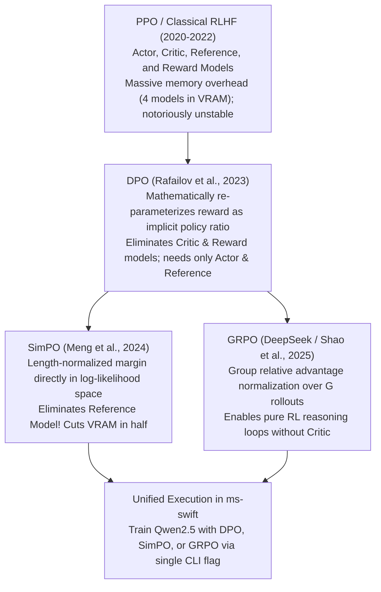

# 08. Advanced Alignment: DPO, SimPO & GRPO — Direct Preference, Simple Preference & Group Relative Policy Optimization

> **Target Audience**: Post-Training Specialists, Reinforcement Learning (RL) Engineers, Alignment Researchers, and Enterprise AI Safety Leads fine-tuning models on preference and reasoning data.  
> **Prerequisites**: Solid foundation in probability theory (expectation, log-likelihood, KL divergence), Supervised Fine-Tuning (SFT), and familiarity with [Volume 06](06-models-scope-ms-swift-framework-core.md) and [DeepSeek Volume 05](../DeepSeek/05-deepseek-r1-and-grpo-reasoning.md).  
> **Estimated Deep-Dive Time**: 50 minutes  
> **What You Will Master**:
> 1. The theoretical and computational limitations of classical **RLHF with PPO** (maintaining 4 simultaneous models in memory).
> 2. The first-principles mathematical derivations of **Direct Preference Optimization (DPO)** and **Simple Preference Optimization (SimPO)**.
> 3. The mechanics of **Group Relative Policy Optimization (GRPO)** in `ms-swift` for training verifiable reasoning and self-reflection loops.
> 4. Comparative trade-off matrix: PPO vs. DPO vs. SimPO vs. KTO vs. GRPO across memory footprint, stability, and reasoning emergence.
> 5. A runnable, self-contained Python script computing DPO and SimPO losses with numerical stability checks and advantage normalization.
> 6. Hardware memory budgeting for preference alignment on the **NVIDIA DGX Spark (Grace Blackwell GB10)**.

---

## 📑 Table of Contents
1. [Zero-to-One Intuition: Why SFT is Only Half the Battle](#1-zero-to-one-intuition-why-sft-is-only-half-the-battle)
2. [Evolutionary Lineage: The Death of the Critic Network](#2-evolutionary-lineage-the-death-of-the-critic-network)
3. [First-Principles Mathematics: Direct Preference Optimization (DPO)](#3-first-principles-mathematics-direct-preference-optimization-dpo)
4. [Simple Preference Optimization (SimPO): Eliminating the Reference Model](#4-simple-preference-optimization-simpo-eliminating-the-reference-model)
5. [Group Relative Policy Optimization (GRPO) for Reasoning](#5-group-relative-policy-optimization-grpo-for-reasoning)
6. [Comparative Trade-Off Matrix: The Alignment Zoo](#6-comparative-trade-off-matrix-the-alignment-zoo)
7. [Hands-On Production Lab: DPO, SimPO & GRPO Loss Simulator](#7-hands-on-production-lab-dpo-simpo--grpo-loss-simulator)
8. [Hardware Grounding for NVIDIA DGX Spark (Grace Blackwell GB10)](#8-hardware-grounding-for-nvidia-dgx-spark-grace-blackwell-gb10)
9. [Step-by-Step Practice Exercises with Full Solutions](#9-step-by-step-practice-exercises-with-full-solutions)
10. [Troubleshooting & Operational FAQ](#10-troubleshooting--operational-faq)

---

## 1. Zero-to-One Intuition: Why SFT is Only Half the Battle

Supervised Fine-Tuning (SFT) trains a model via teacher forcing to predict the next token in high-quality demonstration datasets. 

However, SFT suffers from a fundamental blindness:
* **The Imitation Trap**: SFT learns *what* human developers wrote, but it has no mathematical concept of *why* one answer is superior to another.
* **Compounding Distribution Drift**: If the model veers slightly off-distribution during inference, it enters uncharted territory where it has never seen ground-truth supervision, causing hallucinations.
* **Negative Example Blindness**: SFT can only be trained on positive examples ($y_{\text{win}}$). It cannot be penalized for generating subtly dangerous or logically flawed text ($y_{\text{lose}}$).

```text
Supervised Fine-Tuning (SFT):
[Prompt] ──> Maximize P(y_gold | x)  (Blind imitation of single target)

Preference Alignment (DPO / SimPO):
[Prompt] ──> Maximize P(y_win | x) AND Minimize P(y_lose | x) Simultaneously!
             (Pushes probability mass away from bad answers toward good answers)
```

Preference alignment algorithms reshape the probability landscape: boosting the likelihood of preferred responses while actively depressing the probability of unhelpful, dangerous, or syntactically incorrect outputs.

---

## 2. Evolutionary Lineage: The Death of the Critic Network



---

## 3. First-Principles Mathematics: Direct Preference Optimization (DPO)

In classical RLHF, a Reward Model $r_\psi(x, y)$ is trained to score answers, and a Policy $\pi_\theta$ is optimized using Proximal Policy Optimization (PPO) with a KL penalty against reference policy $\pi_{\text{ref}}$:
$$\max_{\pi_\theta} \mathbb{E}_{x, y \sim \pi_\theta} [r_\psi(x, y)] - \beta D_{\text{KL}}(\pi_\theta(y \mid x) \parallel \pi_{\text{ref}}(y \mid x))$$

### The Bradley-Terry Preference Model
Human preference between winning answer $y_w$ and losing answer $y_l$ is governed by the Bradley-Terry formula:
$$P(y_w \succ y_l \mid x) = \sigma(r^*(x, y_w) - r^*(x, y_l))$$

### The DPO Breakthrough
Rafailov et al. (2023) showed that the optimal policy $\pi^*$ under the KL-constrained objective can be inverted to express the ground-truth reward function **directly in terms of the language model probabilities**:
$$r^*(x, y) = \beta \log \frac{\pi_\theta(y \mid x)}{\pi_{\text{ref}}(y \mid x)} + \beta \log Z(x)$$

Substituting this into the Bradley-Terry objective causes the partition function $Z(x)$ to cancel out completely, yielding the **DPO Loss Function**:

$$\mathcal{L}_{\text{DPO}}(\pi_\theta; \pi_{\text{ref}}) = -\mathbb{E}_{(x, y_w, y_l)} \left[ \log \sigma \left( \beta \log \frac{\pi_\theta(y_w \mid x)}{\pi_{\text{ref}}(y_w \mid x)} - \beta \log \frac{\pi_\theta(y_l \mid x)}{\pi_{\text{ref}}(y_l \mid x)} \right) \right]$$

where:
* $\beta$: Temperature hyperparameter (typically $0.1$ or $0.05$) controlling how tightly the policy clings to the reference model.
* $\sigma$: Standard sigmoid function $\sigma(z) = \frac{1}{1 + e^{-z}}$.

---

## 4. Simple Preference Optimization (SimPO): Eliminating the Reference Model

While DPO eliminated the separate reward and critic models, it still requires keeping two models in memory simultaneously:
1. **The Active Policy Model** $\pi_\theta$ (trainable).
2. **The Frozen Reference Model** $\pi_{\text{ref}}$ (evaluating baseline log-probabilities).

Furthermore, DPO suffers from **Length Bias**: models learn that longer responses naturally accumulate higher log-probability ratios.

### The SimPO Mathematical Formulation
SimPO (Meng et al., 2024) introduces two radical improvements:
1. **Length Normalization**: Divides the log-probability by response length $|y|$ to eliminate length exploitation.
2. **Target Margin ($\gamma$)**: Enforces an explicit separation margin directly in the log-likelihood space, **completely eliminating the reference model $\pi_{\text{ref}}$**!

$$\mathcal{L}_{\text{SimPO}}(\pi_\theta) = -\mathbb{E}_{(x, y_w, y_l)} \left[ \log \sigma \left( \frac{\beta}{|y_w|} \log \pi_\theta(y_w \mid x) - \frac{\beta}{|y_l|} \log \pi_\theta(y_l \mid x) - \gamma \right) \right]$$

```
Memory Footprint Comparison:
DPO:   [ Active Policy (32.5 GB) ] + [ Frozen Reference (32.5 GB) ] = 65.0 GB VRAM!
SimPO: [ Active Policy (32.5 GB) ]                                  = 32.5 GB VRAM! (50% SAVINGS)
```

---

## 5. Group Relative Policy Optimization (GRPO) for Reasoning

While DPO and SimPO operate on static pairs of human preferences $(y_w, y_l)$, **Group Relative Policy Optimization (GRPO)** (pioneered by DeepSeek and natively supported in `ms-swift`) is designed for **verifiable reasoning tasks** (such as mathematics and code):

1. For prompt $x$, sample a group of $G$ candidate outputs $\{y_1, y_2, \dots, y_G\}$ from the current policy $\pi_{\theta_{\text{old}}}$.
2. Evaluate each output using an automated compiler, unit test, or SymPy verifier to assign reward $r_i \in \{0.0, 1.0\}$.
3. Normalize the rewards across the group to calculate relative advantage:
$$A_i = \frac{r_i - \text{mean}(\{r_1, \dots, r_G\})}{\text{std}(\{r_1, \dots, r_G\}) + \epsilon}$$
4. Update the policy using PPO's clipped surrogate loss:
$$\mathcal{L}_{\text{GRPO}}(\theta) = -\frac{1}{G} \sum_{i=1}^G \left[ \min\left( \frac{\pi_\theta(y_i \mid x)}{\pi_{\text{old}}(y_i \mid x)} A_i, \text{clip}\left(\frac{\pi_\theta(y_i \mid x)}{\pi_{\text{old}}(y_i \mid x)}, 1-\epsilon, 1+\epsilon\right) A_i \right) - \beta D_{\text{KL}}(\pi_\theta \parallel \pi_{\text{ref}}) \right]$$

---

## 6. Comparative Trade-Off Matrix: The Alignment Zoo

| Alignment Method | Reward Model Required? | Reference Model Required? | Memory Multiplier vs SFT | Best Application Domain |
| :--- | :--- | :--- | :--- | :--- |
| **PPO (Classical RLHF)** | Yes (Separate) | Yes (Separate) | **$4.0\times$ (Actor, Critic, Ref, Reward)**| General dialogue (Obsolete) |
| **DPO** | No (Implicit) | Yes (Frozen base) | **$2.0\times$ (Actor + Reference)** | General conversational alignment |
| **SimPO** | **No** | **No (Eliminated)** | **$1.0\times$ (Actor Only - Same as SFT!)**| **Memory-constrained preference tuning** |
| **KTO (Kahneman-Tversky)**| No | Yes | $2.0\times$ | Binary thumbs-up / thumbs-down data |
| **GRPO** | Rule-Based Verifier | Yes (or KL-free) | **$1.2\times$ (Actor + Rollout buffer)**| **Mathematical & Coding Reasoning Loops** |

---

## 7. Hands-On Production Lab: DPO, SimPO & GRPO Loss Simulator

This self-contained Python script implements the exact loss functions for DPO, SimPO, and GRPO advantage normalization in pure PyTorch, verifying mathematical stability.

Save this script as `swift_alignment_simulator.py` and run it:

```python
#!/usr/bin/env python3
"""
Production Lab: DPO, SimPO & GRPO Mathematical Loss Implementations
Author: Advanced AI Architecture Group
Target Hardware: NVIDIA DGX Spark (Grace Blackwell GB10)
"""

import math
import torch
import torch.nn.functional as F

def compute_dpo_loss(
    pi_win_logps: torch.Tensor,
    pi_lose_logps: torch.Tensor,
    ref_win_logps: torch.Tensor,
    ref_lose_logps: torch.Tensor,
    beta: float = 0.1
) -> torch.Tensor:
    """
    Computes DPO Loss:
    L = -log(sigmoid(beta * (log(pi_w/ref_w) - log(pi_l/ref_l))))
    """
    pi_ratio = pi_win_logps - pi_lose_logps
    ref_ratio = ref_win_logps - ref_lose_logps
    logits = beta * (pi_ratio - ref_ratio)
    loss = -F.logsigmoid(logits)
    return loss.mean()

def compute_simpo_loss(
    pi_win_logps: torch.Tensor,
    pi_lose_logps: torch.Tensor,
    len_win: torch.Tensor,
    len_lose: torch.Tensor,
    beta: float = 2.0,
    gamma: float = 0.5
) -> torch.Tensor:
    """
    Computes SimPO Loss:
    L = -log(sigmoid(beta * (pi_w/len_w - pi_l/len_l) - gamma))
    Zero reference model required!
    """
    norm_win = pi_win_logps / len_win
    norm_lose = pi_lose_logps / len_lose
    logits = beta * (norm_win - norm_lose) - gamma
    loss = -F.logsigmoid(logits)
    return loss.mean()

def compute_grpo_advantages(rewards: torch.Tensor, eps: float = 1e-8) -> torch.Tensor:
    """
    Computes group relative advantage normalization:
    A_i = (r_i - mean(r)) / (std(r) + eps)
    """
    mean = rewards.mean()
    std = rewards.std()
    return (rewards - mean) / (std + eps)

def main():
    print("=" * 80)
    print("      ADVANCED ALIGNMENT LOSS ENGINE: DPO, SimPO & GRPO")
    print("=" * 80)

    # 1. Simulate DPO Batch (Batch size = 2)
    print("\n[STEP 1: DPO LOSS EVALUATION]")
    # Simulated log-probabilities for winning and losing responses
    pi_w  = torch.tensor([-12.5, -18.2])
    pi_l  = torch.tensor([-15.8, -24.1])
    ref_w = torch.tensor([-13.1, -19.0])
    ref_l = torch.tensor([-14.2, -21.5])

    dpo_loss = compute_dpo_loss(pi_w, pi_l, ref_w, ref_l, beta=0.1)
    print(f"  • Calculated DPO Loss: {dpo_loss.item():.4f}")
    assert not torch.isnan(dpo_loss), "NaN in DPO calculation!"
    print("  ✅ DPO Numerical Stability Confirmed.")

    # 2. Simulate SimPO Batch
    print("\n[STEP 2: SimPO LOSS EVALUATION (ZERO REFERENCE MODEL)]")
    lengths_w = torch.tensor([42.0, 68.0])
    lengths_l = torch.tensor([55.0, 92.0])

    simpo_loss = compute_simpo_loss(pi_w, pi_l, lengths_w, lengths_l, beta=2.0, gamma=0.5)
    print(f"  • Calculated SimPO Loss: {simpo_loss.item():.4f}")
    assert not torch.isnan(simpo_loss), "NaN in SimPO calculation!"
    print("  ✅ SimPO Length-Normalized Margin Confirmed.")

    # 3. Simulate GRPO Advantage Normalization (Group size = 8)
    print("\n[STEP 3: GRPO GROUP RELATIVE ADVANTAGE]")
    # 8 rollouts on math problem: 3 correct (reward=1.0), 5 incorrect (reward=0.0)
    group_rewards = torch.tensor([1.0, 0.0, 1.0, 0.0, 0.0, 1.0, 0.0, 0.0])
    advantages = compute_grpo_advantages(group_rewards)

    print(f"  • Group Rewards:     {group_rewards.tolist()}")
    print(f"  • Mean Reward:       {group_rewards.mean().item():.3f}")
    print(f"  • Normalized Advs:   {[round(a, 3) for a in advantages.tolist()]}")
    print(f"  • Advantage Sum:     {advantages.sum().item():.6f} (Must be ~0.0)")
    assert abs(advantages.sum().item()) < 1e-5, "Advantages do not center at zero!"
    print("  ✅ GRPO Group Zero-Mean Advantage Verified.")

    print("\n" + "=" * 80)
    print("STATUS: All Modern Alignment Paradigms Verified for ms-swift!")
    print("=" * 80)

if __name__ == "__main__":
    main()
```

---

## 8. Hardware Grounding for NVIDIA DGX Spark (Grace Blackwell GB10)

Executing preference alignment on the **NVIDIA DGX Spark** highlights the immense memory efficiency of **SimPO**:

```
+────────────────────────────────────────────────────────────────────────────────────+
|                      DGX SPARK PREFERENCE ALIGNMENT MEMORY BUDGET                  |
+────────────────────────────────────────────────────────────────────────────────────+
|  Configuration A: Classical DPO (Qwen2.5-32B LoRA):                                |
|  - Active Policy Model (BF16):               65.0 GB                               |
|  - Frozen Reference Model (BF16):            65.0 GB                               |
|  - Total Model Weights Alone:                130.0 GB (EXCEEDS 128 GB VRAM -> OOM!)|
|                                                                                    |
|  Configuration B: SimPO (Qwen2.5-32B LoRA - ZERO REFERENCE MODEL):                 |
|  - Active Policy Model (BF16):               65.0 GB                               |
|  - Frozen Reference Model:                    0.0 GB (ELIMINATED!)                 |
|  - LoRA Gradients & Optimizers:               3.6 GB                               |
|  - Dynamic Activations (Seq=2048):            8.4 GB                               |
|  - Host OS & CUDA Overhead:                  12.0 GB                               |
|  Total Memory Allocated:                     89.0 GB / 128 GB (FITS COMFORTABLY!)  |
+────────────────────────────────────────────────────────────────────────────────────+
```

> **Engineering Recommendation**: On single-node workstations like the DGX Spark, **SimPO** allows you to perform preference alignment on 32B models without requiring 4-bit quantization or multi-node clusters.

---

## 9. Step-by-Step Practice Exercises with Full Solutions

### Exercise 1: Executing DPO in ms-swift
* **Objective**: Write the `ms-swift` CLI command to fine-tune `Qwen2.5-Coder-7B-Instruct` using DPO on a paired preference dataset.
* **Solution**:
```bash
swift dpo \
    --model_type qwen2_5-7b-instruct \
    --model_id_or_path /data/models/Qwen2.5-Coder-7B-Instruct \
    --dataset /data/datasets/code_preference_pairs.jsonl \
    --train_type lora \
    --lora_target_modules ALL \
    --lora_rank 16 \
    --beta 0.1 \
    --output_dir /data/checkpoints/qwen_coder_dpo \
    --learning_rate 5e-6 \
    --num_train_epochs 2 \
    --batch_size 1 \
    --gradient_accumulation_steps 4
```

---

### Exercise 2: Converting Paired Preference Data to SimPO Format
* **Objective**: Convert a standard DPO JSONL format (`prompt`, `chosen`, `rejected`) into the format expected by SimPO in `ms-swift`.
* **Solution**:
`ms-swift` natively parses standard DPO datasets for SimPO! Simply specify `--rlhf_type simpo` in the CLI:
```bash
swift rlhf \
    --rlhf_type simpo \
    --model_type qwen2_5-32b-instruct \
    --dataset /data/datasets/preferences.jsonl \
    --simpo_gamma 0.5 \
    --simpo_beta 2.0
```

---

### Exercise 3: Validating DPO Implicit Reward Scaling
* **Objective**: Calculate the implicit reward difference $\Delta r$ when the policy ratio for the chosen answer is $2.5\times$ higher than the reference ratio, with $\beta = 0.1$.
* **Formula**:
  $$\Delta r = \beta \log \left( \frac{\pi_\theta(y_w \mid x)}{\pi_{\text{ref}}(y_w \mid x)} \right)$$
* **Calculation**:
  $$\Delta r = 0.1 \times \ln(2.5) \approx 0.1 \times 0.9163 = \mathbf{0.09163}$$

---

## 10. Troubleshooting & Operational FAQ

### Q1: Why does DPO training loss rapidly plateau at $\approx 0.693$?
**Root Cause**: $\ln(2) \approx 0.69315$. When the model cannot distinguish between winning and losing answers, the logits evaluate to $0.0$, and $-\ln(\sigma(0)) = -\ln(0.5) = \ln(2) \approx 0.693$.  
**Remediation**: Check whether your learning rate is too low ($< 10^{-7}$) or if the dataset has noisy labels where $y_w$ and $y_l$ are nearly identical.

### Q2: What is the optimal value for $\beta$ in DPO?
**Best Practice**: Start with **$\beta = 0.1$**. If the model starts repeating degenerate phrases or suffers from catastrophic forgetting of general knowledge, reduce $\beta$ to **$0.05$** to penalize deviation from the reference model more strongly.

### Q3: When should I choose GRPO over DPO?
**Answer**: Choose **DPO or SimPO** for subjective tasks (creative writing, brand voice alignment, polite conversational tone). Choose **GRPO** for objective, verifiable tasks (competitive mathematics, Python code compilation, SQL execution) where answers can be definitively verified by unit tests.

---

### Complete Qwen Curriculum Navigation
| Previous Volume | Master Curriculum Navigation | Next Volume |
| :--- | :---: | :---: |
| [← 07. Distributed SFT with ms-swift](07-distributed-sft-with-ms-swift.md) | [Curriculum Index](README.md) | [09. Parameter-Efficient Tuning (PEFT) →](09-parameter-efficient-tuning-peft.md) |
