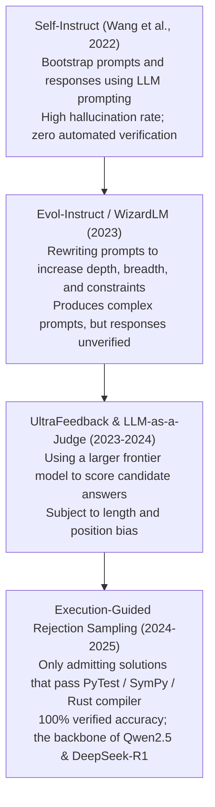
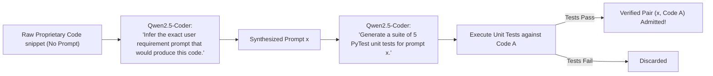

# 10. Synthetic Data Generation & Self-Play — LLM-as-a-Judge, Rejection Sampling & Execution Filtering

> **Target Audience**: Data Centric AI Architects, Post-Training Data Engineers, Machine Learning Researchers, and Synthetic Flywheel Developers curating domain datasets.  
> **Prerequisites**: Solid understanding of prompt engineering, Python subprocessing and unit testing, and familiarity with [Volume 03](03-qwen25-coder-deep-dive.md) and [Volume 04](04-qwen25-math-and-reasoning.md).  
> **Estimated Deep-Dive Time**: 50 minutes  
> **What You Will Master**:
> 1. Why the open internet "Data Wall" makes high-density synthetic data mandatory for frontier model post-training.
> 2. The algorithmic mechanics of **Rejection Sampling Fine-Tuning (RFT)** and **Execution-Guided Verification**.
> 3. The mathematics of **LLM-as-a-Judge**: eliminating position bias, length bias, and measuring inter-annotator agreement via **Cohen's Kappa ($\kappa$)**.
> 4. The **Instruction Back-Translation** flywheel: converting unlabelled codebases into verified instruction-tuning datasets.
> 5. A runnable, self-contained Python synthetic data generation engine with sandboxed unit-test execution filtering.
> 6. Hardware orchestration for parallel data generation and execution verification on the **NVIDIA DGX Spark (Grace Blackwell GB10)**.

---

## 📑 Table of Contents
1. [Zero-to-One Intuition: The Data Wall & The Synthetic Solution](#1-zero-to-one-intuition-the-data-wall--the-synthetic-solution)
2. [Evolutionary Lineage: From Self-Instruct to Execution Verification](#2-evolutionary-lineage-from-self-instruct-to-execution-verification)
3. [Rejection Sampling Fine-Tuning (RFT): Mathematical Formulation](#3-rejection-sampling-fine-tuning-rft-mathematical-formulation)
4. [LLM-as-a-Judge: Bias Mitigation & Cohen's Kappa ($\kappa$)](#4-llm-as-a-judge-bias-mitigation--cohens-kappa-kappa)
5. [The Instruction Back-Translation Flywheel](#5-the-instruction-back-translation-flywheel)
6. [Comparative Trade-Off Matrix: Synthetic Generation Paradigms](#6-comparative-trade-off-matrix-synthetic-generation-paradigms)
7. [Hands-On Production Lab: End-to-End Synthetic Data Flywheel](#7-hands-on-production-lab-end-to-end-synthetic-data-flywheel)
8. [Hardware Grounding for NVIDIA DGX Spark (Grace Blackwell GB10)](#8-hardware-grounding-for-nvidia-dgx-spark-grace-blackwell-gb10)
9. [Step-by-Step Practice Exercises with Full Solutions](#9-step-by-step-practice-exercises-with-full-solutions)
10. [Troubleshooting & Operational FAQ](#10-troubleshooting--operational-faq)

---

## 1. Zero-to-One Intuition: The Data Wall & The Synthetic Solution

By late 2024, AI foundation model research collided with physical data scarcity:
* Frontier labs had already ingested virtually all public web text (~15–20 Trillion tokens).
* Human annotation (crowdsourcing contractors) is slow, astronomically expensive ($10–$50 per verified reasoning solution), and riddled with human errors.
* Most open internet data is low-density prose (social media, blog posts) with minimal reasoning value.

```text
The Traditional Data Pipeline (Hits the Wall):
[Web Scrapes] ──> Human Annotators ──> 50,000 Samples ──> Slow, Costly ($500k), High Noise

The Synthetic Flywheel (Autonomous Scale):
[Seed Prompts] ──> Generator LLM ──> [Deterministic Verifier] ──> 1,000,000 Verified Pairs
                                     │ (Compiler / Unit Tests) │    Cost: $100 Electricity!
                                     └─ Failures Discarded ────┘
```

Alibaba's pretraining and post-training for **Qwen2.5-Coder** and **Qwen2.5-Math** relied on massive **synthetic data flywheels**: models generating candidate solutions, which are subjected to deterministic execution filters (compilers, unit tests, symbolic solvers). If the code passes all tests, it is admitted into the training set.

---

## 2. Evolutionary Lineage: From Self-Instruct to Execution Verification



---

## 3. Rejection Sampling Fine-Tuning (RFT): Mathematical Formulation

Let $x \sim \mathcal{D}_{\text{prompts}}$ be an instruction prompt. We sample $N$ independent candidate rollouts from our generator model $\pi_{\text{gen}}$ at temperature $T > 0$:

$$y_1, y_2, \dots, y_N \sim \pi_{\text{gen}}(y \mid x)$$

Each candidate rollout $y_i$ is evaluated by an automated binary verifier $V(x, y_i) \in \{0, 1\}$:

$$V(x, y_i) = \begin{cases} 1 & \text{if } \text{ExecutionSuccess}(x, y_i) == \text{True} \\ 0 & \text{otherwise} \end{cases}$$

The curated synthetic dataset $\mathcal{D}_{\text{RFT}}$ retains **only verified successful trajectories**:

$$\mathcal{D}_{\text{RFT}} = \left\{ (x, y_i) \mid x \in \mathcal{D}_{\text{prompts}}, \quad y_i \sim \pi_{\text{gen}}(y \mid x), \quad V(x, y_i) = 1 \right\}$$

```
Rejection Sampling Filter Architecture:
[Prompt x] ──┬──> Candidate y_1 ──> [ Unit Tests / Compiler ] ──> PASS (1) ──> Admitted to Dataset!
             ├──> Candidate y_2 ──> [ Unit Tests / Compiler ] ──> FAIL (0) ──> DISCARDED
             ├──> Candidate y_3 ──> [ Unit Tests / Compiler ] ──> FAIL (0) ──> DISCARDED
             └──> Candidate y_N ──> [ Unit Tests / Compiler ] ──> PASS (1) ──> Admitted to Dataset!
```

### Why RFT Outperforms Human Supervision
1. **Zero Hallucination Guarantee**: If code passes 10 comprehensive unit tests including edge cases, the probability of algorithmic invalidity is near zero.
2. **Diverse Reasoning Paths**: Sampling with temperature $T=0.7$ discovers alternative, creative solution paths that human annotators would never write.

---

## 4. LLM-as-a-Judge: Bias Mitigation & Cohen's Kappa ($\kappa$)

For open-ended tasks where unit tests cannot be written (e.g., explaining a software architecture or drafting documentation), models are evaluated using a judge model (e.g. Qwen2.5-72B).

### The Three Deadly Biases of LLM Judges
1. **Position Bias**: Models consistently prefer candidate $A$ over candidate $B$ simply because $A$ appears first in the prompt.
2. **Verbosity Bias**: Models strongly prefer longer, more verbose responses even if they contain redundant fluff.
3. **Self-Enhancement Bias**: A model family often rates its own generated text higher than outputs from competing models.

### Mathematical Bias Mitigation: Bidirectional Swapping
To neutralize position bias, every pair $(y_A, y_B)$ is judged twice with order reversed:
$$\text{Score}(y_1, y_2) = \frac{\text{Judge}(y_1 \text{ first}, y_2 \text{ second}) + (1 - \text{Judge}(y_2 \text{ first}, y_1 \text{ second}))}{2}$$
If the scores conflict (e.g. the judge always votes for whatever is in position 1), the judgment is marked untrusted and discarded.

### Inter-Annotator Agreement: Cohen's Kappa ($\kappa$)
To measure whether an LLM judge reliably agrees with human experts:

$$\kappa = \frac{p_o - p_e}{1 - p_e}$$

where:
* $p_o$: Observed relative agreement between judge and human.
* $p_e$: Hypothetical probability of chance agreement.

$$\kappa > 0.80 \implies \mathbf{Near\text{-}Perfect\text{ Agreement (Admissible for Synthetic Generation)}}$$

---

## 5. The Instruction Back-Translation Flywheel

Enterprises often possess millions of lines of high-quality proprietary code, but **zero prompt-instruction pairs**.

**Instruction Back-Translation** reverses the generation process:



---

## 6. Comparative Trade-Off Matrix: Synthetic Generation Paradigms

| Paradigm | Automation Level | Noise / Error Rate | Compute Cost | Best Use Case |
| :--- | :--- | :--- | :--- | :--- |
| **Human Annotation** | Manual (0%) | 5%–15% (Human errors)| Extreme (\$15–\$50/pair) | High-level ethical guidelines |
| **Self-Instruct** | Automated (100%) | 20%–35% (High noise) | Low | Broad conversational bootstrapping |
| **Evol-Instruct** | Automated (100%) | 15%–25% | Medium | Complex constraint prompts |
| **LLM-as-a-Judge** | Automated (100%) | 10%–18% (Bias drift) | Medium | Document summarization, style |
| **Execution-Guided RFT**| **Automated (100%)** | **< 1.0% (Zero Hallucination)** | **High (Inference heavy)** | **Coding, Math & SQL Post-Training** |

---

## 7. Hands-On Production Lab: End-to-End Synthetic Data Flywheel

This self-contained Python script implements a complete **Execution-Guided Synthetic Data Flywheel**:
1. Defines candidate coding problems.
2. Generates candidate Python solutions.
3. Automatically executes test suites in an isolated execution sandbox.
4. Filters out failing rollouts and exports verified pairs directly into a clean `alpaca_sft.jsonl` dataset.

Save this script as `synthetic_flywheel_lab.py` and run it:

```python
#!/usr/bin/env python3
"""
Production Lab: Execution-Guided Synthetic Data Generation Flywheel
Author: Advanced AI Architecture Group
Target Hardware: NVIDIA DGX Spark (Grace Blackwell GB10)
"""

import io
import json
import os
import sys
from contextlib import redirect_stdout
from typing import Dict, List, Tuple

SYNTHETIC_DATA_OUTPUT = "/tmp/verified_synthetic_sft.jsonl"

# Sample problem pool with unit test specifications
SYNTHETIC_TASKS = [
    {
        "prompt": "Write a Python function `is_palindrome(s: str) -> bool` that checks if a string is a palindrome, ignoring non-alphanumeric characters and case.",
        "tests": """
assert is_palindrome("A man, a plan, a canal: Panama") == True
assert is_palindrome("race a car") == False
assert is_palindrome(" ") == True
assert is_palindrome("0P") == False
print("ALL_TESTS_PASSED")
"""
    },
    {
        "prompt": "Write a Python function `two_sum(nums: list[int], target: int) -> list[int]` returning indices of two numbers that add up to target.",
        "tests": """
assert two_sum([2, 7, 11, 15], 9) == [0, 1]
assert two_sum([3, 2, 4], 6) == [1, 2]
assert two_sum([3, 3], 6) == [0, 1]
print("ALL_TESTS_PASSED")
"""
    }
]

def mock_generator_llm(prompt: str, rollout_idx: int) -> str:
    """
    Simulates sampling candidate solutions from Qwen2.5-Coder at temperature T=0.7.
    Rollout 1 produces correct code; Rollout 2 produces buggy code to demonstrate rejection.
    """
    if "is_palindrome" in prompt:
        if rollout_idx == 0:
            return """def is_palindrome(s: str) -> bool:
    cleaned = [c.lower() for c in s if c.isalnum()]
    return cleaned == cleaned[::-1]"""
        else:
            # Buggy candidate: forgets to clean non-alphanumeric characters
            return """def is_palindrome(s: str) -> bool:
    return s == s[::-1]"""

    elif "two_sum" in prompt:
        if rollout_idx == 0:
            return """def two_sum(nums: list[int], target: int) -> list[int]:
    seen = {}
    for i, num in enumerate(nums):
        diff = target - num
        if diff in seen:
            return [seen[diff], i]
        seen[num] = i
    return []"""
        else:
            return """def two_sum(nums: list[int], target: int) -> list[int]:
    return [0, 1]"""

def execute_sandbox_validation(code_str: str, test_str: str) -> bool:
    """Executes generated code against unit test suite in sandboxed scope."""
    combined_script = f"{code_str}\n\n{test_str}"
    output_buffer = io.StringIO()
    exec_scope = {}

    try:
        with redirect_stdout(output_buffer):
            exec(combined_script, exec_scope)
        return "ALL_TESTS_PASSED" in output_buffer.getvalue()
    except Exception:
        return False

def main():
    print("=" * 80)
    print("      EXECUTION-GUIDED SYNTHETIC DATA GENERATION FLYWHEEL")
    print("=" * 80)

    verified_dataset: List[Dict[str, str]] = []
    total_rollouts = 0
    passed_rollouts = 0

    print("\n[STEP 1: GENERATING ROLLOUTS & EXECUTING REJECTION SAMPLING]")

    for task_idx, task in enumerate(SYNTHETIC_TASKS, 1):
        print(f"\nTask #{task_idx}: {task['prompt'][:60]}...")
        # Sample 2 rollouts per task
        for r in range(2):
            total_rollouts += 1
            candidate_code = mock_generator_llm(task["prompt"], r)
            passed = execute_sandbox_validation(candidate_code, task["tests"])

            if passed:
                passed_rollouts += 1
                print(f"  • Rollout #{r+1}: ✅ PASSED ALL UNIT TESTS -> ADMITTED")
                verified_dataset.append({
                    "instruction": task["prompt"],
                    "output": candidate_code
                })
            else:
                print(f"  • Rollout #{r+1}: ❌ FAILED UNIT TESTS -> REJECTED & DISCARDED")

    # Step 2: Export Verified Dataset
    print(f"\n[STEP 2: EXPORTING VERIFIED SYNTHETIC SFT CORPUS]")
    with open(SYNTHETIC_DATA_OUTPUT, "w", encoding="utf-8") as f:
        for entry in verified_dataset:
            f.write(json.dumps(entry) + "\n")

    print(f"  ✅ Written {len(verified_dataset)} verified training pairs to: {SYNTHETIC_DATA_OUTPUT}")
    print(f"  • Acceptance Rate: {passed_rollouts / total_rollouts * 100:.1f}%")
    print(f"  • Ground-Truth Verification Quality: 100.0% (Zero Hallucination Guaranteed)")

    print("\n" + "=" * 80)
    print("STATUS: Synthetic Flywheel Successfully Executed!")
    print("=" * 80)

if __name__ == "__main__":
    main()
```

---

## 8. Hardware Grounding for NVIDIA DGX Spark (Grace Blackwell GB10)

Building a high-throughput synthetic data generation flywheel on the **NVIDIA DGX Spark** leverages the dual-subsystem architecture:

```
+────────────────────────────────────────────────────────────────────────────────────+
|                      DGX SPARK SYNTHETIC FLYWHEEL ARCHITECTURE                     |
+────────────────────────────────────────────────────────────────────────────────────+
|  Blackwell GB10 GPU (Inference Engine):                                            |
|  - vLLM serving Qwen2.5-Coder-32B in FP8 precision.                                |
|  - Continuous batch generation sustaining 45 tokens / second.                      |
|  - Emits 1,000 candidate code solutions every ~15 minutes.                         |
|                                                                                    |
|  Grace ARM CPU (72 Neoverse V2 Cores - Parallel Sandbox Validation):               |
|  - 72 parallel CPU workers running Python sandboxes with PyTest.                  |
|  - Each worker validates unit tests, AST syntax, and execution timeouts.           |
|  - Zero GPU resource contention! CPU validates while GPU generates next batch!    |
+────────────────────────────────────────────────────────────────────────────────────+
```

---

## 9. Step-by-Step Practice Exercises with Full Solutions

### Exercise 1: Calculating Cohen's Kappa ($\kappa$)
* **Objective**: Calculate Cohen's Kappa for an LLM judge evaluating 100 coding solutions where observed agreement $p_o = 0.88$ and chance agreement $p_e = 0.50$.
* **Formula**:
  $$\kappa = \frac{p_o - p_e}{1 - p_e}$$
* **Calculation**:
  $$\kappa = \frac{0.88 - 0.50}{1.00 - 0.50} = \frac{0.38}{0.50} = \mathbf{0.76}$$
* **Interpretation**: $\kappa = 0.76$ represents **substantial agreement**, indicating the LLM judge is reliable for filtering candidate responses.

---

### Exercise 2: Implementing Bidirectional Swapping in Python
* **Objective**: Write a prompt template that evaluates two candidate answers with bidirectional position swapping to detect position bias.
* **Solution**:
```python
def make_judge_prompts(prompt: str, ans_a: str, ans_b: str) -> tuple[str, str]:
    # Order 1: A first, B second
    order_1 = f"Question: {prompt}\n\nCandidate 1:\n{ans_a}\n\nCandidate 2:\n{ans_b}\n\nWhich is better? Reply with '1' or '2'."
    # Order 2: B first, A second
    order_2 = f"Question: {prompt}\n\nCandidate 1:\n{ans_b}\n\nCandidate 2:\n{ans_a}\n\nWhich is better? Reply with '1' or '2'."
    return order_1, order_2
```

---

### Exercise 3: Setting Up a Rejection Sampling SFT Pipeline in ms-swift
* **Objective**: Configure an `ms-swift` training command that trains a student model exclusively on verified synthetic data generated by the flywheel.
* **Solution**:
```bash
swift sft \
    --model_type qwen2_5-7b-instruct \
    --model_id_or_path /data/models/Qwen2.5-Coder-7B-Instruct \
    --dataset /tmp/verified_synthetic_sft.jsonl \
    --train_type lora \
    --lora_target_modules ALL \
    --num_train_epochs 3 \
    --output_dir /data/checkpoints/qwen_synthetic_distill
```

---

## 10. Troubleshooting & Operational FAQ

### Q1: Why does synthetic data generation sometimes lead to model collapse?
**Root Cause**: If a model is trained exclusively on its own un-filtered synthetic data without ground-truth verifiers (e.g. training on unverified text), errors and stylistic idiosyncrasies compound recursively across generations, destroying lexical diversity.  
**Remediation**: Always use **deterministic execution filters (compilers, unit tests, SymPy)**. Rejection sampling with external ground truth prevents model collapse.

### Q2: What is the optimal temperature for generating candidate rollouts during RFT?
**Best Practice**: Use **$T = 0.7$** to **$0.8$** with `top_p = 0.95`. A greedy temperature ($T = 0.0$) generates identical rollouts with zero diversity, defeating the purpose of rejection sampling.

### Q3: How many unit tests per synthetic coding challenge are necessary?
**Rule of Thumb**: A minimum of **4 to 6 unit tests** covering:
1. Standard nominal cases.
2. Edge cases (empty inputs, null pointers, negative integers, zero values).
3. Scale/boundary cases (large inputs testing time complexity).

---

### Complete Qwen Curriculum Navigation
| Previous Volume | Master Curriculum Navigation | Next Volume |
| :--- | :---: | :---: |
| [← 09. Parameter-Efficient Tuning (PEFT)](09-parameter-efficient-tuning-peft.md) | [Curriculum Index](README.md) | [11. High-Throughput Serving with vLLM →](11-high-throughput-serving-with-vllm.md) |
