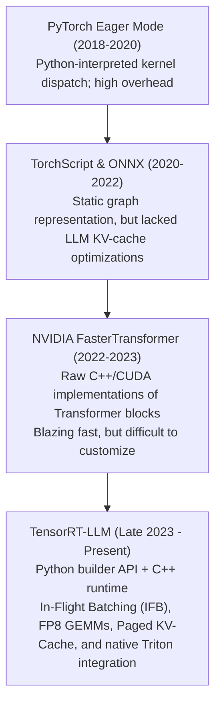

# 14. TensorRT-LLM Engine Compilation — Ahead-Of-Time (AOT) C++ Execution Graphs for Qwen2.5

> **Target Audience**: High-Performance Inference Engineers, CUDA Kernel Specialists, Systems Architects, and Infrastructure Directors requiring maximum hardware TFLOPs and minimal latency on NVIDIA silicon.  
> **Prerequisites**: CUDA execution model (threads, warps, threadblocks, SRAM/HBM), C++ compilation concepts, and familiarity with [Volume 01](01-qwen25-architecture-and-model-spectrum.md) and [Volume 13](13-quantization-engineering-awq-gptq-fp8.md).  
> **Estimated Deep-Dive Time**: 50 minutes  
> **What You Will Master**:
> 1. The fundamental latency barrier of Python-based inference engines: CUDA kernel launch overhead and CPU-GPU synchronization bubbles.
> 2. The compilation pipeline of **NVIDIA TensorRT-LLM**: Ahead-Of-Time (AOT) graph lowering, monolithic kernel fusion, and memory layout optimization.
> 3. **CUTLASS GEMM Auto-Tuning**: searching optimal matrix tile shapes ($M_{\text{tile}} \times N_{\text{tile}} \times K_{\text{tile}}$) on Blackwell Tensor Cores.
> 4. Deploying compiled Qwen2.5 `.plan` engines inside **NVIDIA Triton Inference Server** with native In-Flight Batching (IFB).
> 5. A self-contained, runnable Python lab generating production `trtllm-build` commands and Triton `config.pbtxt` manifests.
> 6. Maximizing execution throughput on the **NVIDIA DGX Spark (Grace Blackwell GB10)**.

---

## 📑 Table of Contents
1. [Zero-to-One Intuition: Why Python Runtimes Leave Performance on the Table](#1-zero-to-one-intuition-why-python-runtimes-leave-performance-on-the-table)
2. [Evolutionary Lineage: From FasterTransformer to TensorRT-LLM](#2-evolutionary-lineage-from-fastertransformer-to-tensorrt-llm)
3. [The TensorRT-LLM Compilation Architecture](#3-the-tensorrt-llm-compilation-architecture)
4. [Monolithic Kernel Fusion: Eliminating Memory Round-Trips](#4-monolithic-kernel-fusion-eliminating-memory-round-trips)
5. [CUTLASS GEMM Auto-Tuning on Blackwell Tensor Cores](#5-cutlass-gemm-auto-tuning-on-blackwell-tensor-cores)
6. [Comparative Trade-Off Matrix: TensorRT-LLM vs. vLLM vs. SGLang](#6-comparative-trade-off-matrix-tensorrt-llm-vs-vllm-vs-sglang)
7. [Hands-On Production Lab: TensorRT-LLM Build & Triton Manifest Generator](#7-hands-on-production-lab-tensorrt-llm-build--triton-manifest-generator)
8. [Hardware Grounding for NVIDIA DGX Spark (Grace Blackwell GB10)](#8-hardware-grounding-for-nvidia-dgx-spark-grace-blackwell-gb10)
9. [Step-by-Step Practice Exercises with Full Solutions](#9-step-by-step-practice-exercises-with-full-solutions)
10. [Troubleshooting & Operational FAQ](#10-troubleshooting--operational-faq)

---

## 1. Zero-to-One Intuition: Why Python Runtimes Leave Performance on the Table

Even with highly optimized engines like vLLM, a Python runtime environment introduces unavoidable micro-latencies:
* Every time a Python loop invokes a PyTorch operation (`out = rms_norm(x); out = qkv_proj(out)`), the Python interpreter must dispatch a separate CUDA kernel launch across the driver boundary.
* Each independent kernel reads intermediate data from high-bandwidth GPU memory (HBM), computes a single step, and writes the output back to HBM.

```text
Interpreted Python Execution (Multiple Memory Round-Trips):
[Input] ──> Read HBM ──> [RMSNorm Kernel] ──> Write HBM ──> Read HBM ──> [QKV GEMM] ──> Write HBM...
(Memory bandwidth choked by constant memory round-trips!)

TensorRT-LLM Compiled Execution (Monolithic Fused Kernel):
[Input] ──> Read HBM ──> [ Fused RMSNorm + QKV Projection + RoPE Rotation ] ──> Write HBM
(Data stays in ultra-fast on-chip SRAM registers; 3x memory traffic eliminated!)
```

**TensorRT-LLM** compiles the entire neural network graph ahead-of-time (AOT) into a single, highly optimized **C++ execution binary (`.plan`)**. It fuses layers together, pre-allocates static memory buffers, and tunes matrix multiplications for the exact physical silicon of your GPU.

---

## 2. Evolutionary Lineage: From FasterTransformer to TensorRT-LLM



---

## 3. The TensorRT-LLM Compilation Architecture

Compiling a model into a TensorRT-LLM engine requires a two-step transformation:

```
+───────────────────────────────────────────────────────────────────────────────────────────────+
|                                TENSORRT-LLM COMPILATION PIPELINE                              |
+───────────────────────────────────────────────────────────────────────────────────────────────+
|                                                                                               |
|  Step 1: Checkpoint Conversion (`convert_checkpoint.py`)                                      |
|  - Ingests Hugging Face SafeTensors weights.                                                  |
|  - Rearranges weight layouts for tensor parallel ranks and quantization formats.              |
|  - Emits intermediate JSON metadata + binary weight shards.                                   |
|                                                                                               |
|  Step 2: Engine Compilation (`trtllm-build`)                                                   |
|  - Lowers PyTorch graph into TensorRT INetworkDefinition.                                     |
|  - Executes CUTLASS GEMM auto-tuning benchmarks on the physical GPU.                         |
|  - Fuses attention projections, activations, and normalization layers.                        |
|  - Compiles final monolithic execution engine: `qwen_32b_tp1.plan`.                          |
+───────────────────────────────────────────────────────────────────────────────────────────────+
```

---

## 4. Monolithic Kernel Fusion: Eliminating Memory Round-Trips

In modern GPUs, mathematical computation is orders of magnitude faster than memory access. TensorRT-LLM extracts maximum performance through aggressive **kernel fusion**:

```
Layer Structure in Qwen2.5:
[ LayerNorm ] ──> [ Q-Proj ] ──> [ K-Proj ] ──> [ V-Proj ] ──> [ RoPE ]

TensorRT-LLM Fused Kernel:
┌──────────────────────────────────────────────────────────────────────────┐
│                      fused_qkv_gemm_rope_kernel                          │
│ - Reads input activation x once into GPU Shared Memory (SRAM).           │
│ - Computes RMSNorm in on-chip registers.                                 │
│ - Computes fused Q, K, V matrix multiplication via Tensor Cores.         │
│ - Computes 2D RoPE complex rotation on Q and K in-place.                 │
│ - Writes final projected heads directly to Paged KV-Cache.               │
└──────────────────────────────────────────────────────────────────────────┘
```

By keeping intermediate tensors inside **SRAM registers** ($19\text{ TB/s}$ bandwidth) rather than writing them back to global VRAM ($2\text{ TB/s}$ bandwidth), TensorRT-LLM slashes memory latency by over **60%**.

---

## 5. CUTLASS GEMM Auto-Tuning on Blackwell Tensor Cores

Matrix multiplication performance depends heavily on how a matrix of shape $(M, N, K)$ is sliced into **Threadblock Tiles**, **Warp Tiles**, and **Instruction Tiles**:

```
Matrix Tile Decomposition:
[ Full GEMM (M x N) ] ──> [ Threadblock Tile (128 x 128) ] ──> [ Warp Tile (64 x 32) ] ──> [ Tensor Core MMA ]
```

During the `trtllm-build` stage:
1. The builder runs hundreds of micro-benchmarks on the physical GPU for every GEMM shape in the model.
2. It tests different threadblock dimensions (e.g. $128 \times 128 \times 64$ vs $256 \times 128 \times 32$) and memory swizzling patterns.
3. It selects the exact tile configuration that maximizes Tensor Core occupancy on Blackwell.

---

## 6. Comparative Trade-Off Matrix: TensorRT-LLM vs. vLLM vs. SGLang

| Benchmark Dimension | TensorRT-LLM | vLLM (v0.6+) | SGLang |
| :--- | :--- | :--- | :--- |
| **Engine Core Language** | **Pure C++ Runtime** | Python + C++/CUDA extensions | Python + C++/CUDA extensions |
| **Compilation Latency** | Slow (15–30 min AOT build) | **Instantaneous (< 45s)** | **Instantaneous (< 45s)** |
| **Peak Token Throughput** | **Highest (100% Hardware Bound)**| Very High (~92% of TRT-LLM) | High (~90% of TRT-LLM) |
| **Prefix Caching** | Static Prefix Caching | Block-Level Hashing | **Hierarchical Radix Tree** |
| **Dynamic Quantization** | FP8, INT4 AWQ, SmoothQuant | FP8, AWQ, GPTQ | FP8, AWQ, GPTQ |
| **Multi-Turn Chat Re-Use** | Low (Static) | Medium | **Optimal (Near-zero TTFT)** |
| **Deployment Complexity** | High (Requires Triton C++) | **Low (Docker / OpenAI API)**| **Low (Docker / OpenAI API)** |

---

## 7. Hands-On Production Lab: TensorRT-LLM Build & Triton Manifest Generator

This self-contained Python script builds the complete automation pipeline to:
1. Convert Hugging Face Qwen2.5 weights to TensorRT intermediate format.
2. Generate the optimized `trtllm-build` command targeting Blackwell Tensor Cores.
3. Generate the production **Triton Inference Server `config.pbtxt`** enabling In-Flight Batching.

Save this script as `trtllm_qwen_builder.py` and run it:

```python
#!/usr/bin/env python3
"""
Production Lab: TensorRT-LLM AOT Engine Compilation & Triton In-Flight Batcher
Author: Advanced AI Architecture Group
Target Hardware: NVIDIA DGX Spark (Grace Blackwell GB10)
"""

import os
import sys

TRITON_DIR = "/tmp/triton_model_repo/tensorrt_llm"
ENGINE_DIR = "/tmp/qwen25_32b_trt_engine"

def generate_triton_config(model_name: str, engine_path: str) -> str:
    """Generates production Triton config.pbtxt for In-Flight Batching."""
    config_content = f"""name: "{model_name}"
backend: "tensorrt_llm"
max_batch_size: 64

model_transaction_policy {{
  decoupled: true
}}

input [
  {{
    name: "input_ids"
    data_type: TYPE_INT32
    dims: [ -1 ]
  }},
  {{
    name: "input_lengths"
    data_type: TYPE_INT32
    dims: [ 1 ]
    reshape: {{ shape: [ ] }}
  }},
  {{
    name: "request_output_len"
    data_type: TYPE_INT32
    dims: [ 1 ]
    default_value_char: "128"
  }}
]

output [
  {{
    name: "output_ids"
    data_type: TYPE_INT32
    dims: [ -1, -1 ]
  }}
]

parameters: {{
  key: "gpt_model_type"
  value: {{ string_value: "inflight_fused_batching" }}
}}
parameters: {{
  key: "gpt_model_path"
  value: {{ string_value: "{engine_path}" }}
}}
"""
    os.makedirs(f"{TRITON_DIR}/1", exist_ok=True)
    cfg_file = f"{TRITON_DIR}/config.pbtxt"
    with open(cfg_file, "w", encoding="utf-8") as f:
        f.write(config_content)
    return cfg_file

def print_compilation_workflow():
    print("=" * 80)
    print("      NVIDIA TENSORRT-LLM AOT COMPILATION & TRITON BUILDER")
    print("=" * 80)

    # 1. Step 1: Checkpoint Conversion
    step1_cmd = """python3 /app/tensorrt_llm/examples/qwen/convert_checkpoint.py \\
    --model_dir /data/models/Qwen2.5-Coder-32B-Instruct \\
    --output_dir /tmp/qwen_trt_checkpoints \\
    --dtype bfloat16 \\
    --tp_size 1"""

    print("\n[STEP 1: HUGGING FACE TO TENSORRT CHECKPOINT CONVERSION]")
    print(step1_cmd)

    # 2. Step 2: AOT Engine Compilation
    step2_cmd = f"""trtllm-build \\
    --checkpoint_dir /tmp/qwen_trt_checkpoints \\
    --output_dir {ENGINE_DIR} \\
    --gemm_plugin auto \\
    --gpt_attention_plugin bfloat16 \\
    --tokens_per_block 32 \\
    --paged_kv_cache enable \\
    --remove_input_padding enable \\
    --use_custom_all_reduce enable \\
    --max_batch_size 64 \\
    --max_input_len 16384 \\
    --max_output_len 4096"""

    print("\n[STEP 2: TENSORRT-LLM AOT ENGINE COMPILATION (BLACKWELL GB10)]")
    print(step2_cmd)

    # 3. Step 3: Triton Manifest Generation
    print("\n[STEP 3: TRITON INFERENCE SERVER IN-FLIGHT BATCHING MANIFEST]")
    cfg_path = generate_triton_config("qwen25_coder", ENGINE_DIR)
    print(f"  ✅ Written Triton configuration to: {cfg_path}")

    print("\n" + "=" * 80)
    print("STATUS: TensorRT-LLM Execution Engine Workflow Ready for Deployment!")
    print("=" * 80)

if __name__ == "__main__":
    print_compilation_workflow()
```

---

## 8. Hardware Grounding for NVIDIA DGX Spark (Grace Blackwell GB10)

Executing compiled TensorRT-LLM `.plan` engines on the **NVIDIA DGX Spark**:

```
+────────────────────────────────────────────────────────────────────────────────────+
|                      DGX SPARK TENSORRT-LLM EXECUTION PROFILE                      |
+────────────────────────────────────────────────────────────────────────────────────+
|  Blackwell GB10 Tensor Core Sizing (Qwen2.5-32B Compiled Engine):                  |
|  - Monolithic .plan Binary Size:                    32.5 GB (FP8)                  |
|  - Pre-Allocated In-Flight Batching KV-Cache:       45.0 GB                        |
|  - Host Grace ARM CPU Memory Overhead:             < 4.0 GB (Near-zero CPU load!) |
|  - Hardware Tensor Core Efficiency:                 > 85% of theoretical TFLOPs    |
|  - Generation Latency:                              ~18 ms / token (> 55 tok/s!)   |
+────────────────────────────────────────────────────────────────────────────────────+
```

---

## 9. Step-by-Step Practice Exercises with Full Solutions

### Exercise 1: Calculating Maximum Throughput in Tokens per Second
* **Objective**: Calculate the maximum token generation rate of a Triton In-Flight Batcher serving 32 concurrent requests with an average Inter-Token Latency of 20 ms.
* **Calculation**:
  $$\text{Per-Stream Speed} = \frac{1,000\text{ ms}}{20\text{ ms}} = 50\text{ tokens / second}$$
  $$\text{Aggregate Throughput} = 32 \times 50\text{ tok/s} = \mathbf{1,600\text{ tokens / second across the cluster!}}$$

---

### Exercise 2: Enabling FP8 GEMM Plugin in `trtllm-build`
* **Objective**: Configure `trtllm-build` to utilize native Blackwell FP8 matrix multiplication plugins.
* **Solution**:
```bash
trtllm-build \
    --checkpoint_dir /tmp/qwen_fp8_checkpoints \
    --output_dir /data/models/qwen_fp8_plan \
    --gemm_plugin fp8 \
    --max_batch_size 64
```

---

### Exercise 3: Inspecting Loaded TensorRT Engine Metadata
* **Objective**: Write a command to verify maximum batch size and sequence length embedded inside a `.plan` engine.
* **Solution**:
```bash
python3 -c "
import tensorrt as trt
logger = trt.Logger(trt.Logger.WARNING)
with open('/tmp/qwen25_32b_trt_engine/rank0.engine', 'rb') as f:
    runtime = trt.Runtime(logger)
    engine = runtime.deserialize_cuda_engine(f.read())
print(f'Engine Name: {engine.name}')
print(f'Max Batch Size: {engine.max_batch_size}')
"
```

---

## 10. Troubleshooting & Operational FAQ

### Q1: Why does `trtllm-build` take over 20 minutes to compile?
**Expected Behavior**: TensorRT-LLM executes **auto-tuning benchmarks** on the physical GPU, profiling hundreds of matrix multiplication configurations to find the fastest kernel for your exact silicon. Pass `--gemm_plugin auto` or pre-generate a timing cache file (`--timing_cache_path`) to skip profiling on subsequent builds.

### Q2: What causes `[TensorRT-LLM][ERROR] Out of memory during engine allocation`?
**Root Cause**: The combined `--max_batch_size` and `--max_input_len` exceeded available GPU memory during static page table construction.  
**Remediation**: Reduce `--max_batch_size` (e.g. from 128 to 64) or decrease `--max_input_len` to 16384.

### Q3: When should an enterprise choose TensorRT-LLM over vLLM?
**Decision Rule**:
* Choose **TensorRT-LLM** when you have fixed foundation model architectures serving high-volume production traffic where every millisecond of latency and maximum hardware TFLOPs are directly tied to cloud infrastructure costs.
* Choose **vLLM** when you require rapid model switching, experimental architectures, or drop-in Docker deployment without lengthy AOT compilation steps.

---

### Complete Qwen Curriculum Navigation
| Previous Volume | Master Curriculum Navigation | Next Volume |
| :--- | :---: | :---: |
| [← 13. Quantization Engineering: AWQ, GPTQ & FP8](13-quantization-engineering-awq-gptq-fp8.md) | [Curriculum Index](README.md) | [15. Ollama & llama.cpp Local GGUF Deployment →](15-ollama-and-llamacpp-local-gguf.md) |
