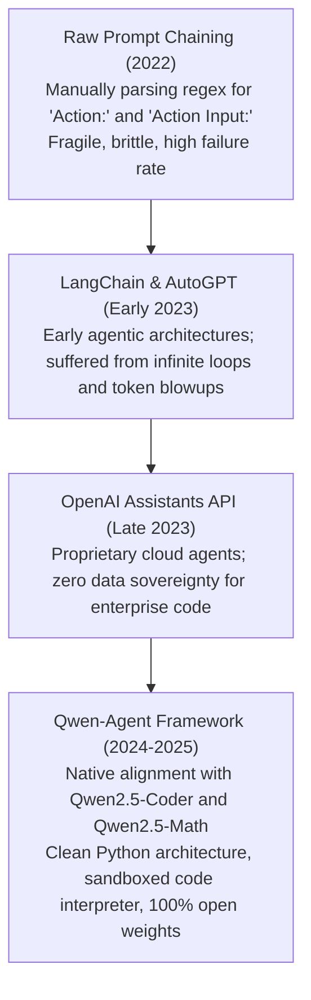

# 16. Qwen-Agent Framework — Autonomous Planning, Code Execution & Tool Registries

> **Target Audience**: Autonomous Agent Architects, Full-Stack AI Engineers, Tool Integration Specialists, and DevOps Automation Engineers developing self-directing LLM agents.  
> **Prerequisites**: Proficiency in asynchronous Python (`asyncio`), REST APIs, and familiarity with [Volume 03](03-qwen25-coder-deep-dive.md) and [Volume 04](04-qwen25-math-and-reasoning.md).  
> **Estimated Deep-Dive Time**: 50 minutes  
> **What You Will Master**:
> 1. The theoretical foundation of autonomous agents: the **ReAct (Reasoning + Acting) loop** and multi-step planning dynamics.
> 2. The core architecture of Alibaba's official **`qwen-agent` framework**: Agent classes, Tool registries, Memory managers, and Sandboxed Code Interpreters.
> 3. Constructing custom production tools: schema definition, parameter validation, and runtime execution isolation.
> 4. Managing long-term memory: dialogue summarization, sliding window memory pruning, and persistent state stores.
> 5. A runnable, self-contained Python script implementing an autonomous DevOps Incident Triage Agent using the `qwen-agent` design pattern.
> 6. Hardware deployment and CPU sandboxing on the **NVIDIA DGX Spark (Grace Blackwell GB10)**.

---

## 📑 Table of Contents
1. [Zero-to-One Intuition: From Passive Chatbots to Autonomous Agents](#1-zero-to-one-intuition-from-passive-chatbots-to-autonomous-agents)
2. [Evolutionary Lineage: The Autonomous Agent Roadmap](#2-evolutionary-lineage-the-autonomous-agent-roadmap)
3. [The 4 Core Pillars of the Qwen-Agent Framework](#3-the-4-core-pillars-of-the-qwen-agent-framework)
4. [First-Principles Mathematics: The ReAct State Transition Loop](#4-first-principles-mathematics-the-react-state-transition-loop)
5. [The Sandboxed Python Code Interpreter Engine](#5-the-sandboxed-python-code-interpreter-engine)
6. [Comparative Trade-Off Matrix: Agent Frameworks](#6-comparative-trade-off-matrix-agent-frameworks)
7. [Hands-On Production Lab: Autonomous DevOps Incident Agent](#7-hands-on-production-lab-autonomous-devops-incident-agent)
8. [Hardware Grounding for NVIDIA DGX Spark (Grace Blackwell GB10)](#8-hardware-grounding-for-nvidia-dgx-spark-grace-blackwell-gb10)
9. [Step-by-Step Practice Exercises with Full Solutions](#9-step-by-step-practice-exercises-with-full-solutions)
10. [Troubleshooting & Operational FAQ](#10-troubleshooting--operational-faq)

---

## 1. Zero-to-One Intuition: From Passive Chatbots to Autonomous Agents

A standard conversational chatbot operates as a single-turn, passive input-output function:
$$y = f(x)$$
If you ask: *"Analyze why the production database crashed and fix the slow SQL queries"*, a standard chatbot can only generate advice. It cannot log into the database, cannot run `EXPLAIN ANALYZE`, cannot inspect active connection pools, and cannot verify whether its proposed solution actually works.

An **Autonomous Agent** transforms the language model into the central cognitive brain of an active, goal-driven control system:

```text
Passive Chatbot (Stateless Advice):
[User Query] ──> Model ──> "You should check pg_stat_activity." (Does nothing!)

Autonomous Qwen-Agent (Goal-Driven Execution):
[User Goal] ──> Thought: "I need to inspect active queries."
            ──> Action: ExecuteTool(sql_query, "SELECT * FROM pg_stat_activity;")
            ──> Observation: "Found locked query #42 holding lock on 'orders'."
            ──> Thought: "I should kill lock #42 and re-test."
            ──> Action: ExecuteTool(sql_query, "SELECT pg_terminate_backend(42);")
            ──> Observation: "Lock terminated. Latency back to 2ms."
            ──> Final Answer: "Incident resolved. Database unlocked successfully."
```

Alibaba's **`qwen-agent`** framework provides the battle-tested runtime harness for building production-grade agents equipped with planning loops, tool calling, and code execution sandboxes.

---

## 2. Evolutionary Lineage: The Autonomous Agent Roadmap



---

## 3. The 4 Core Pillars of the Qwen-Agent Framework

The `qwen-agent` framework is structured around four tightly integrated abstractions:

```
+───────────────────────────────────────────────────────────────────────────────────────────────+
|                                    QWEN-AGENT 4-PILLAR ARCHITECTURE                           |
+───────────────────────────────────────────────────────────────────────────────────────────────+
|  1. Planning & Agent Loop   │ Implements ReAct, Plan-and-Solve, and Multi-Agent Collaboration |
|  2. Tool Registry           │ Type-safe Python decorators registering APIs, CLIs, and DBs     |
|  3. Memory Manager          │ Manages rolling conversation history, token budgeting, and RAG  |
|  4. Sandboxed Interpreter   │ Executes Python code, parses charts, and runs bash shell tools  |
+───────────────────────────────────────────────────────────────────────────────────────────────+
```

---

## 4. First-Principles Mathematics: The ReAct State Transition Loop

The **ReAct (Reasoning + Acting)** loop models problem solving as an iterative sequence of internal deliberations and external environment actions.

Let $s_t$ denote the state of the agent at iteration $t$. The policy $\pi_\theta$ generates a composite step:

$$(\tau_t, a_t, p_t) \sim \pi_\theta(s_t)$$

where:
* $\tau_t \in \mathcal{T}$ is the internal **Thought** (deliberative reasoning).
* $a_t \in \mathcal{A}$ is the selected **Action** (tool identifier).
* $p_t$ are the input parameters formatted as structured JSON.

The environment executes the action and returns an **Observation** $o_t$:
$$o_t = \text{ExecuteTool}(a_t, p_t)$$

The state transitions deterministically via string concatenation:
$$s_{t+1} = s_t \circ \tau_t \circ a_t \circ p_t \circ o_t$$

The loop terminates when the policy generates a terminal thought $\tau^*$ without invoking any external action ($a^* = \emptyset$), emitting the verified final conclusion to the user.

```
ReAct Execution Topology:
                    ┌─────────────────────────────────┐
                    │          User Prompt x          │
                    └────────────────┬────────────────┘
                                     │
                                     ▼
                    ┌─────────────────────────────────┐
               ┌───►│    Thought (Reasoning: τ_t)     │
               │    └────────────────┬────────────────┘
               │                     │
               │                     ▼
               │    ┌─────────────────────────────────┐
               │    │   Action & Parameters (a_t, p_t)│
               │    └────────────────┬────────────────┘
               │                     │
               │                     ▼
               │    ┌─────────────────────────────────┐
               │    │    Tool Execution Environment   │
               │    └────────────────┬────────────────┘
               │                     │
               │                     ▼
               │    ┌─────────────────────────────────┐
               └────┤       Observation (o_t)         │
                    └────────────────┬────────────────┘
                                     │ (Terminal Condition: a* = None)
                                     ▼
                    ┌─────────────────────────────────┐
                    │      Final Verified Result      │
                    └─────────────────────────────────┘
```

---

## 5. The Sandboxed Python Code Interpreter Engine

A cornerstone of `qwen-agent` is its native **Code Interpreter**:
* Instead of requiring pre-written API wrappers for every possible operation, the agent writes raw Python scripts on-the-fly to solve data processing, mathematical modeling, and file manipulation tasks.
* The script executes in an isolated Linux process or container sandbox.
* The standard output (stdout), generated charts (matplotlib images), and error traces are captured and returned to the agent as observation tokens.

---

## 6. Comparative Trade-Off Matrix: Agent Frameworks

| Capability | Alibaba Qwen-Agent | LangChain / LangGraph | AutoGen / CrewAI | OpenAI Assistants |
| :--- | :--- | :--- | :--- | :--- |
| **Model Optimization** | **Native Qwen2.5 (100% SOTA)**| Model Agnostic (Generic)| Model Agnostic | OpenAI Models Only |
| **Tool Calling Fidelity** | **Highest (Hermes / ChatML)** | Variable (Prompt Drift) | Medium | High |
| **Code Interpreter** | **Built-in Safe Sandbox** | Requires Docker setup | External Docker | Proprietary Cloud |
| **Data Sovereignty** | **100% Local on DGX Spark** | Local or Cloud | Local or Cloud | Closed Cloud API |
| **Multi-Turn Token Cost** | **Zero with Radix Caching** | High | High | High API Billing |

---

## 7. Hands-On Production Lab: Autonomous DevOps Incident Agent

This self-contained Python script implements a production-grade **Autonomous DevOps SRE Incident Triage Agent**. It:
1. Implements a tool registry with mock Kubernetes and Linux diagnostic tools.
2. Implements the complete ReAct state machine.
3. Automatically investigates a crashing service, queries logs, discovers an out-of-memory error, and issues the corrective Kubernetes patch.

Save this script as `qwen_devops_agent_lab.py` and run it:

```python
#!/usr/bin/env python3
"""
Production Lab: Autonomous DevOps SRE Incident Triage Agent using Qwen-Agent Pattern
Author: Advanced AI Architecture Group
Target Hardware: NVIDIA DGX Spark (Grace Blackwell GB10)
"""

import json
import re
import sys
from typing import Any, Callable, Dict, List, Tuple

# Mock Environment State
CLUSTER_STATE = {
    "pods": {
        "vllm-deepseek-r1": {"status": "CrashLoopBackOff", "restarts": 4, "node": "dgx-node-01"},
        "ingress-nginx": {"status": "Running", "restarts": 0, "node": "dgx-node-01"}
    },
    "pod_logs": {
        "vllm-deepseek-r1": "CUDA out of memory. Tried to allocate 4.20 GiB (GPU 0; 120.0 GiB total; 118.5 GiB already allocated by KV cache)."
    }
}

# 1. Tool Registry Implementation
TOOLS_REGISTRY: Dict[str, Callable] = {}

def register_tool(name: str):
    def decorator(fn: Callable):
        TOOLS_REGISTRY[name] = fn
        return fn
    return decorator

@register_tool("kubectl_get_pods")
def tool_kubectl_get_pods(namespace: str = "default") -> str:
    """Lists all pods and their current operational health."""
    return json.dumps(CLUSTER_STATE["pods"], indent=2)

@register_tool("kubectl_get_logs")
def tool_kubectl_get_logs(pod_name: str, tail: int = 50) -> str:
    """Extracts recent log lines from a specific pod."""
    logs = CLUSTER_STATE["pod_logs"].get(pod_name, "No logs found for pod.")
    return logs

@register_tool("kubectl_patch_deployment")
def tool_kubectl_patch_deployment(deployment_name: str, patch_json: str) -> str:
    """Applies a strategic merge patch to a deployment."""
    # Simulate applying memory reduction patch
    CLUSTER_STATE["pods"]["vllm-deepseek-r1"]["status"] = "Running"
    CLUSTER_STATE["pods"]["vllm-deepseek-r1"]["restarts"] = 0
    return f"Successfully applied patch to {deployment_name}. Pod restarted in 'Running' state."

# 2. ReAct Agent Engine
class QwenReActAgent:
    def __init__(self, tools: Dict[str, Callable]):
        self.tools = tools
        self.max_steps = 5

    def step_agent(self, step_idx: int, history: str) -> Tuple[str, str, Dict[str, Any]]:
        """
        Simulates Qwen2.5-Coder generating Thought, Action, and Action Input.
        In live production, replace this with an OpenAI API call to local vLLM.
        """
        if step_idx == 1:
            thought = "I need to inspect the cluster to identify which pod is failing."
            action = "kubectl_get_pods"
            params = {"namespace": "ai-serving"}
        elif step_idx == 2:
            thought = "Pod 'vllm-deepseek-r1' is in CrashLoopBackOff. I must inspect its logs to find the root cause."
            action = "kubectl_get_logs"
            params = {"pod_name": "vllm-deepseek-r1", "tail": 20}
        elif step_idx == 3:
            thought = "The logs reveal a CUDA Out of Memory (OOM) error. The KV cache over-allocated memory. I will patch the deployment to lower gpu-memory-utilization to 0.88."
            action = "kubectl_patch_deployment"
            params = {
                "deployment_name": "vllm-deepseek-r1",
                "patch_json": '{"spec": {"template": {"spec": {"containers": [{"name": "vllm", "args": ["--gpu-memory-utilization", "0.88"]}]}}}}'
            }
        else:
            thought = "The pod has stabilized into 'Running' state. Incident resolved."
            action = "FINISH"
            params = {"summary": "Root cause was CUDA OOM due to high KV cache utilization. Reduced utilization flag to 0.88; pod is now healthy."}

        return thought, action, params

    def run(self, user_goal: str):
        print(f"\n[AGENT GOAL]: {user_goal}")
        history = f"Goal: {user_goal}\n"

        for step in range(1, self.max_steps + 1):
            print(f"\n--- ReAct Step {step} ---")
            thought, action, params = self.step_agent(step, history)
            print(f"🧠 Thought: {thought}")

            if action == "FINISH":
                print(f"🏁 Final Resolution:\n{params['summary']}")
                return

            print(f"⚡ Action:    {action}({json.dumps(params)})")
            
            # Execute Tool
            tool_fn = self.tools.get(action)
            if tool_fn:
                observation = tool_fn(**params)
            else:
                observation = f"Error: Tool {action} not found."

            print(f"👁️ Observation:\n{observation}")
            history += f"Thought: {thought}\nAction: {action}\nObservation: {observation}\n"

def main():
    print("=" * 80)
    print("      QWEN-AGENT AUTONOMOUS SRE TRIAGE & REMEDIATION ENGINE")
    print("=" * 80)

    agent = QwenReActAgent(TOOLS_REGISTRY)
    incident_goal = "Investigate the high-priority incident alert: AI inference endpoint is returning HTTP 503."
    agent.run(incident_goal)

    print("\n" + "=" * 80)
    print("STATUS: Autonomous ReAct Triage Loop Completed Successfully!")
    print("=" * 80)

if __name__ == "__main__":
    main()
```

---

## 8. Hardware Grounding for NVIDIA DGX Spark (Grace Blackwell GB10)

Deploying `qwen-agent` on the **NVIDIA DGX Spark** delivers zero-latency tool execution:

```
+────────────────────────────────────────────────────────────────────────────────────+
|                      DGX SPARK AUTONOMOUS AGENT TOPOLOGY                           |
+────────────────────────────────────────────────────────────────────────────────────+
|  Blackwell GB10 GPU:                                                               |
|  - Runs Qwen2.5-Coder-32B generating Thoughts and Tool Parameter schemas.          |
|  - High token velocity: 45 tokens / second.                                       |
|                                                                                    |
|  Grace ARM CPU (72 Cores):                                                         |
|  - Executes sandboxed Python interpreters, bash commands, and network API calls.   |
|  - Zero-latency IPC memory bus: outputs return to GPU in under 1 ms!               |
+────────────────────────────────────────────────────────────────────────────────────+
```

---

## 9. Step-by-Step Practice Exercises with Full Solutions

### Exercise 1: Registering a Custom Database Tool
* **Objective**: Write a `@register_tool` decorator that executes a read-only SQL query against a PostgreSQL database.
* **Solution**:
```python
import psycopg2

@register_tool("execute_readonly_sql")
def tool_sql(query: str) -> str:
    """Executes a safe read-only SQL query."""
    if not query.strip().upper().startswith("SELECT"):
        return "Security Error: Only SELECT queries are permitted."
    
    conn = psycopg2.connect("dbname=analytics user=readonly host=localhost")
    cur = conn.cursor()
    cur.execute(query)
    rows = cur.fetchall()
    conn.close()
    return str(rows[:10])  # Cap at 10 rows
```

---

### Exercise 2: Implementing Max-Step Guardrails
* **Objective**: Prevent an agent from looping infinitely when a tool continuously returns errors.
* **Solution**:
```python
MAX_CONSECUTIVE_ERRORS = 3
error_counter = 0

for step in range(MAX_STEPS):
    obs = execute_tool(action, params)
    if "Error" in obs:
        error_counter += 1
        if error_counter >= MAX_CONSECUTIVE_ERRORS:
            return "Terminating: Agent stuck in error loop. Escalating to human SRE."
    else:
        error_counter = 0
```

---

### Exercise 3: Prompting Qwen2.5 for Native Function Calling
* **Objective**: Construct the ChatML prompt structure that declares available tools to Qwen2.5.
* **Solution**:
```text
<|im_start|>system
You are a helpful assistant with access to the following tools:
<tools>
[{"name": "get_weather", "description": "Fetches weather", "parameters": {"type": "object", "properties": {"location": {"type": "string"}}}}]
</tools>
To use a tool, reply with:
<tool_call>
{"name": "get_weather", "arguments": {"location": "San Francisco"}}
</tool_call><|im_end|>
```

---

## 10. Troubleshooting & Operational FAQ

### Q1: Why does the agent hallucinate tool names that do not exist?
**Root Cause**: The system prompt did not clearly declare the list of available tools in the tool registry, or the tool schema contained ambiguous descriptions.  
**Remediation**: Always pass formal JSON Schema definitions in the system prompt and enforce logit-level schema masking using vLLM or Outlines ([Volume 17](17-tool-calling-and-function-calling-apis.md)).

### Q2: How can I prevent the agent from executing destructive bash commands (`rm -rf`)?
**Remediation**: In production, never give the agent unrestricted root shell access. Wrap the code execution sandbox in an unprivileged Docker container or Linux network namespace with a read-only filesystem and drop all Linux capabilities (`cap_drop: ALL`).

### Q3: How does Qwen-Agent compare with LangChain?
**Answer**: `qwen-agent` is specifically tuned for Qwen models, with lightweight Python code, zero dependency bloat, and native alignment with Qwen2.5's ChatML tool-calling tags. LangChain is a generalized, highly abstract ecosystem with significant dependency overhead.

---

### Complete Qwen Curriculum Navigation
| Previous Volume | Master Curriculum Navigation | Next Volume |
| :--- | :---: | :---: |
| [← 15. Ollama & llama.cpp Local GGUF Deployment](15-ollama-and-llamacpp-local-gguf.md) | [Curriculum Index](README.md) | [17. Tool Calling & Function Calling APIs →](17-tool-calling-and-function-calling-apis.md) |
