# Alibaba Qwen Ecosystem Mastery Curriculum

Welcome to the **Alibaba Qwen Ecosystem Curriculum** engineered for enterprise AI developers and large-scale deployment on the **NVIDIA DGX Spark (Grace Blackwell GB10)**.

Alibaba's **Qwen (Tongyi Qianwen)** represents the world's most widely adopted open-weights foundation model family outside of Llama. Spanning from **0.5B to 72B** dense models, **57B-A14B MoE**, industry-leading specialized models (**Qwen2.5-Coder, Qwen2.5-Math, Qwen2-VL**), and the comprehensive **ms-swift** training framework, Qwen is an essential pillar of modern AI engineering.

---

## 🗺️ Master Curriculum Architecture

```mermaid
graph TD
    subgraph Part1["Part I: Architecture & Model Spectrum (01-05)"]
        Q01["01. Qwen2.5 Dense & MoE Architecture"]
        Q02["02. Attention Mechanics: GQA, RoPE & DCA"]
        Q03["03. Qwen2.5-Coder Deep Dive"]
        Q04["04. Qwen2.5-Math & Reasoning"]
        Q05["05. Qwen2-VL & Vision-Language Processing"]
    end

    subgraph Part2["Part II: Training & Alignment Stack: ms-swift (06-10)"]
        Q06["06. ModelScope ms-swift Framework Core"]
        Q07["07. Distributed SFT with ms-swift"]
        Q08["08. Advanced Alignment: DPO, SimPO & GRPO"]
        Q09["09. Parameter-Efficient Tuning: PEFT & LoRA"]
        Q10["10. Synthetic Data Generation & Self-Play"]
    end

    subgraph Part3["Part III: Serving, Quantization & Performance (11-15)"]
        Q11["11. High-Throughput Serving with vLLM"]
        Q12["12. SGLang & Radix Attention Deployment"]
        Q13["13. Quantization Engineering: AWQ, GPTQ & FP8"]
        Q14["14. TensorRT-LLM Engine Compilation"]
        Q15["15. Ollama & llama.cpp Local GGUF Deployment"]
    end

    subgraph Part4["Part IV: Autonomous Agents & Enterprise Applications (16-20)"]
        Q16["16. Qwen-Agent Framework Core"]
        Q17["17. Tool Calling & Function Calling APIs"]
        Q18["18. Enterprise RAG with Qwen, BGE-M3 & Qdrant"]
        Q19["19. Multimodal Document & Video RAG with Qwen2-VL"]
        Q20["20. Open-WebUI & LiteLLM Gateway Integration"]
    end

    subgraph Part5["Part V: Kubernetes Deployment & Production Ops (21-25)"]
        Q21["21. Kubernetes Production Manifests"]
        Q22["22. High-Speed Storage & Weight Caching"]
        Q23["23. DCGM, Prometheus & Grafana Telemetry"]
        Q24["24. Master Troubleshooting Playbook"]
        Q25["25. Hands-On Exercises Mastery Workbook"]
    end

    Part1 --> Part2
    Part2 --> Part3
    Part3 --> Part4
    Part4 --> Part5
```

---

## 📚 Complete 25-Volume Curriculum Index

Every volume adheres to the strict **8-Layer Pedagogical Masterclass Standard**: Target Audience & Scaffolding, Zero-to-One Foundational Intuition, Evolutionary Lineage, First-Principles Mathematics, Comparative Trade-Off Matrices, Concrete Production Labs (with self-contained runnable code), NVIDIA DGX Spark Hardware Grounding (Grace ARM + GB10 128 GB Unified Memory), and Hands-On Exercises with Solutions.

### Part I: Architecture & Model Foundations (Volumes 01–05)
- [**Volume 01: Qwen2.5 Architecture and Model Spectrum**](01-qwen25-architecture-and-model-spectrum.md) — Dense 0.5B to 72B vs MoE 57B-A14B, 152k vocab, SwiGLU, RMSNorm, and PyTorch block implementations.
- [**Volume 02: Attention Engineering: GQA, RoPE, and Dual Chunk Attention**](02-attention-engineering-gqa-rope-and-dca.md) — 8:1 GQA compression, RoPE $\theta=10^6$ proof, Dual Chunk Attention (DCA), and 128k context mechanics.
- [**Volume 03: Qwen2.5-Coder Deep Dive**](03-qwen25-coder-deep-dive.md) — 5.5T code tokens, Fill-in-the-Middle (FIM) PSM/SPM formulation, cross-file AST packing, and syntax verifier labs.
- [**Volume 04: Qwen2.5-Math and Reasoning Engines**](04-qwen25-math-and-reasoning.md) — Mitigating autoregressive drift, Tool-Integrated Reasoning (TIR) POMDPs, SymPy formal proofs, and sandboxed math execution.
- [**Volume 05: Qwen2-VL and Vision-Language Processing**](05-qwen2-vl-and-vision-language-processing.md) — NaViT aspect ratio preservation, 3D M-RoPE $[t, h, w]$ coordinate decomposition, and dynamic patching.

### Part II: Training & Alignment Stack: ms-swift (Volumes 06–10)
- [**Volume 06: ModelScope ms-swift Framework Core**](06-models-scope-ms-swift-framework-core.md) — ms-swift 4-layer architecture, 300+ models, ChatML loss masking, and programmatic training loops.
- [**Volume 07: Distributed SFT with ms-swift**](07-distributed-sft-with-ms-swift.md) — Overcoming the 16x memory explosion, ZeRO-1/2/3 math, $3\Psi$ communication volume, and DeepSpeed pipelines.
- [**Volume 08: Advanced Alignment: DPO, SimPO, and GRPO**](08-advanced-alignment-dpo-simpo-and-grpo.md) — Bradley-Terry derivation, DPO loss, SimPO zero-reference margin, and GRPO group advantage normalization.
- [**Volume 09: Parameter-Efficient Tuning (PEFT)**](09-parameter-efficient-tuning-peft.md) — Intrinsic dimensionality, LoRA $B \cdot A$ rank analysis, QLoRA NF4/DQ, DoRA decomposition, and zero-latency weight merging.
- [**Volume 10: Synthetic Data Generation and Self-Play**](10-synthetic-data-generation-and-self-play.md) — Rejection Sampling Fine-Tuning (RSFT), Cohen's Kappa evaluation, instruction back-translation, and self-play flywheels.

### Part III: Serving, Quantization & Performance (Volumes 11–15)
- [**Volume 11: High-Throughput Serving with vLLM**](11-high-throughput-serving-with-vllm.md) — PagedAttention v2 virtual memory, chunked prefill, speculative decoding with Qwen2.5-0.5B draft, and async streaming clients.
- [**Volume 12: SGLang and Radix Attention Deployment**](12-sglang-and-radix-attention-deployment.md) — Eliminating multi-turn prefix redundancy, Radix Tree Trie KV-cache, LRU cache eviction, and high-concurrency benchmarks.
- [**Volume 13: Quantization Engineering: AWQ, GPTQ, and FP8**](13-quantization-engineering-awq-gptq-fp8.md) — Activation outlier channels, GPTQ Hessian inverse, AWQ channel scaling, Blackwell FP8 E4M3 vs E5M2, and SNR auditing.
- [**Volume 14: TensorRT-LLM Engine Compilation**](14-tensorrt-llm-engine-compilation.md) — Kernel launch overhead, monolithic GEMM+Activation kernel fusion, CUTLASS tuning, and Triton In-Flight Batching (IFB).
- [**Volume 15: Ollama and llama.cpp Local GGUF Deployment**](15-ollama-and-llamacpp-local-gguf.md) — Zero-dependency C++, GGUF v3 binary specification, zero-copy `mmap`, k-quants Q4_K_M super-blocks, and custom Modelfiles.

### Part IV: Autonomous Agents & Enterprise Applications (Volumes 16–20)
- [**Volume 16: Qwen-Agent Framework Core**](16-qwen-agent-framework.md) — ReAct state transition loops, tool registries, sandboxed code interpreters, and autonomous Kubernetes SRE triage agents.
- [**Volume 17: Tool Calling and Function Calling APIs**](17-tool-calling-and-function-calling-apis.md) — Grammar-constrained logit masking, Pushdown Automata, ChatML tool protocols, and deterministic parallel function calling.
- [**Volume 18: Enterprise RAG with Qwen2.5, BGE-M3, and Qdrant**](18-enterprise-rag-qwen-bge-qdrant.md) — BGE-M3 dense/sparse hybrid vectors, Qdrant HNSW storage, Reciprocal Rank Fusion (RRF), and cross-encoder reranking.
- [**Volume 19: Multimodal Document and Video RAG with Qwen2-VL**](19-multimodal-document-and-video-rag.md) — Processing multi-column PDFs, financial charts, and videos with NaViT and 3D M-RoPE temporal anchoring.
- [**Volume 20: Open-WebUI and LiteLLM Gateway Integration**](20-open-webui-and-litellm-gateway-integration.md) — Enterprise LLM reverse proxy, leaky token bucket rate limiting, circuit breakers, team quotas, and failover routing.

### Part V: Kubernetes Deployment & Production Ops (Volumes 21–25)
- [**Volume 21: Kubernetes Production Manifests**](21-kubernetes-production-manifests.md) — Cloud-native deployment, POSIX `/dev/shm` mounts, triple health probes (Startup, Readiness, Liveness), and Queue-Length HPA.
- [**Volume 22: High-Speed Storage and Weight Caching**](22-high-speed-storage-and-weight-caching.md) — Eliminating cold-start latency, Safetensors zero-copy `mmap`, `hf_transfer` Rust multi-stream, and Linux page cache warming.
- [**Volume 23: DCGM, Prometheus, and Grafana Telemetry**](23-dcgm-prometheus-and-grafana-telemetry.md) — NVIDIA DCGM FIDs (1004, 1009, 251), vLLM TTFT/ITL metrics, PromQL SLO queries, and real-time Grafana dashboards.
- [**Volume 24: Master Troubleshooting Playbook**](24-master-troubleshooting-playbook.md) — Systematic root-cause triage for CUDA OOM, NaN loss spikes during SFT, RoPE context boundary corruption, and NCCL deadlocks.
- [**Volume 25: Hands-On Exercises and Mastery Workbook**](25-hands-on-exercises-mastery-workbook.md) — 25 production capstone challenges with runnable test harnesses, mathematical assertions, and full solutions.

---

## 🚀 Key Architectural Highlights of Qwen2.5

1. **Massive Pretraining & Token Diversity**:
   - Trained on **18 Trillion tokens** of multilingual text, high-quality synthetic data, math proofs, and code repositories across 29+ languages.
2. **Dense & MoE Flexibility**:
   - Dense: 0.5B, 1.5B, 3B, 7B, 14B, 32B, and 72B.
   - MoE: Qwen2-57B-A14B (57B total parameters, 14B active parameters routed across 64 experts).
3. **Extreme Context Windows**:
   - Up to **128,000 tokens** native context window via Dual Chunk Attention (DCA) and base frequency $\theta = 1,000,000$ RoPE scaling, capable of generating up to 8,192 tokens per response.
4. **Grouped Query Attention (GQA)**:
   - Configured across all parameter scales (e.g., 64 Query heads to 8 Key/Value heads in the 72B model) reducing KV cache footprint by **87.5%** compared to standard Multi-Head Attention (MHA).
5. **The Alibaba ms-swift Powerhouse**:
   - The most complete open-source LLM training ecosystem in the industry, supporting 300+ LLMs and 50+ MLLMs out of the box with zero-code CLI or Python APIs.
