# NVIDIA NeMo & Nemotron Ecosystem Mastery Curriculum

Welcome to the **NVIDIA NeMo & Nemotron Ecosystem Curriculum** engineered for enterprise AI architects and large-scale deployment on the **NVIDIA DGX Spark (Grace Blackwell GB10)**.

**NVIDIA NeMo** is the world's premier end-to-end enterprise platform for developing custom generative AI. Built directly by NVIDIA to extract the absolute maximum performance from Grace, Hopper, and Blackwell silicon, NeMo encompasses the complete AI lifecycle — from petabyte-scale data curation (**NeMo Curator**) and distributed pretraining (**Megatron-Core 3D Parallelism**) to advanced multi-attribute alignment (**NeMo Customizer / SteerLM**), programmable runtime safety (**NeMo Guardrails**), enterprise semantic search (**NeMo Retriever**), and state-of-the-art open models (**Nemotron-4 340B, Llama-3.1-Nemotron-70B, Minitron**).

---

## 🗺️ Master Curriculum Architecture

```mermaid
graph TD
    subgraph Part1["Part I: Foundation & Megatron 3D Parallelism (01-05)"]
        N01["01. NeMo Framework Architecture & Core Abstractions"]
        N02["02. Megatron-Core 3D Parallelism: TP, PP, DP & CP"]
        N03["03. Transformer Engine & Native FP8 on Blackwell"]
        N04["04. Nemotron Model Family: 340B, 70B & Minitron"]
        N05["05. Minitron: Structured Pruning & Knowledge Distillation"]
    end

    subgraph Part2["Part II: Data Engineering & Curation (06-10)"]
        N06["06. NeMo Curator: GPU-Accelerated Petabyte Ingestion"]
        N07["07. MinHash LSH Deduplication & Exact String Matching"]
        N08["08. Heuristic Quality Filtering & Domain Classifiers"]
        N09["09. PII Redaction & Data Sanitization at Scale"]
        N10["10. Synthetic Data Generation with Nemotron-4 340B"]
    end

    subgraph Part3["Part III: Model Alignment & Customization (11-15)"]
        N11["11. NeMo Customizer: Distributed SFT & PEFT"]
        N12["12. SteerLM: Multi-Attribute Conditioned Alignment"]
        N13["13. Direct Preference Optimization (DPO) at Scale"]
        N14["14. Distributed RLHF with PPO & Nemotron Reward Models"]
        N15["15. Parameter-Efficient Tuning: LoRA, P-Tuning & Adapters"]
    end

    subgraph Part4["Part IV: Enterprise Guardrails & Retrieval (16-20)"]
        N16["16. NeMo Guardrails & Colang 2.0 Programming"]
        N17["17. Input, Output & Dialog Flow Safety Rails"]
        N18["18. Hallucination Detection & Jailbreak Prevention"]
        N19["19. NeMo Retriever: NV-Embed & Neural Rerankers"]
        N20["20. Enterprise Production RAG Architectures"]
    end

    subgraph Part5["Part V: Triton Serving, Operations & DGX Spark (21-25)"]
        N21["21. Triton Inference Server + TensorRT-LLM Integration"]
        N22["22. NVIDIA NGC Container Deployment & PyTorch 2.5"]
        N23["23. Kubernetes & Slurm Orchestration for NeMo"]
        N24["24. Cluster Diagnostics, NCCL RDMA & Xid Recovery"]
        N25["25. Hands-On NeMo Mastery Practice Workbook"]
    end

    Part1 --> Part2
    Part2 --> Part3
    Part3 --> Part4
    Part4 --> Part5
```

---

## 📚 Complete 25-Volume Curriculum Index

Every volume strictly satisfies the **8-Layer Pedagogical Masterclass Standard**: Target Audience & Scaffolding, Zero-to-One Foundational Intuition, Evolutionary Lineage, First-Principles Mathematics, Comparative Trade-Off Matrices, Concrete Production Labs (with self-contained runnable code), NVIDIA DGX Spark Hardware Grounding (Grace ARM + GB10 128 GB Unified Memory), and Hands-On Exercises with Solutions.

### Part I: Foundation & Megatron 3D Parallelism (Volumes 01–05)
- [**Volume 01: NeMo Framework Architecture and Core Abstractions**](01-nemo-framework-architecture-and-core-abstractions.md) — Neural Modules, typed ports, ModelPT LightningModule lifecycles, and OmegaConf dynamic interpolation.
- [**Volume 02: Megatron-Core 3D Parallelism Deep Dive**](02-megatron-core-3d-parallelism-deep-dive.md) — Column/Row Tensor Parallelism, Sequence Parallelism with Reduce-Scatter/All-Gather, and 1F1B Pipeline schedules.
- [**Volume 03: Transformer Engine and Native FP8 on Blackwell Architecture**](03-transformer-engine-and-native-fp8-on-blackwell.md) — Dual FP8 E4M3/E5M2 precision formats, delayed scaling amax history tracking, and Blackwell Tensor Cores.
- [**Volume 04: Nemotron Model Family: 340B, 70B, and Minitron**](04-nemotron-model-family-340b-70b-and-minitron.md) — Nemotron-4 340B (Base, Instruct, Reward), HelpSteer2 multi-attribute scoring, and Llama-3.1-Nemotron-70B.
- [**Volume 05: Minitron: Structured Pruning and Distillation**](05-minitron-structured-pruning-and-distillation.md) — Depth and width pruning via cosine redundancy, Taylor expansion, and temperature-scaled KL distillation.

### Part II: Data Engineering & Curation: NeMo Curator (Volumes 06–10)
- [**Volume 06: NeMo Curator: GPU-Accelerated Petabyte Ingestion**](06-nemo-curator-gpu-accelerated-petabyte-ingestion.md) — Dask-CUDA, cuDF vectorized strings, and high-throughput Megatron memory-mapped `.bin`/`.idx` compilation.
- [**Volume 07: MinHash LSH Deduplication and Exact String Matching**](07-minhash-lsh-deduplication-and-exact-matching.md) — Jaccard similarity, MinHash theorem proof, LSH band S-curve probability, and Union-Find graph clustering.
- [**Volume 08: Heuristic Quality Filtering and Domain Classifiers**](08-heuristic-quality-filtering-and-domain-classifiers.md) — Repetition heuristics, Shannon text entropy bounds, FastText 176-language ID, and neural quality heads.
- [**Volume 09: PII Redaction and Enterprise Data Sanitization**](09-pii-redaction-and-enterprise-data-sanitization.md) — ISO/IEC 7812 Luhn algorithm credit card verification, RFC-5322 email patterns, and Transformer NER span masking.
- [**Volume 10: Synthetic Data Generation with Nemotron-4 340B**](10-synthetic-data-generation-with-nemotron-340b.md) — Evol-Instruct prompt mutation trees, HelpSteer2 reward filtering, and sandboxed execution-guided verification.

### Part III: Model Alignment & Customization (Volumes 11–15)
- [**Volume 11: NeMo Customizer: Distributed SFT and PEFT**](11-nemo-customizer-distributed-sft-and-peft.md) — FlashAttention VarLen sequence packing (`cu_seqlens`), prompt-loss masking, and Megatron distributed LoRA.
- [**Volume 12: SteerLM: Multi-Attribute Conditioned Alignment**](12-steerlm-multi-attribute-conditioned-alignment.md) — Multi-attribute conditioning (Helpfulness, Correctness, Verbosity), self-steering bootstrapping, and dynamic runtime control.
- [**Volume 13: Direct Preference Optimization (DPO) at Scale**](13-direct-preference-optimization-dpo-at-scale.md) — Analytical reward substitution, Bradley-Terry pairwise loss, gradient dynamics, and FP8 reference model freezing.
- [**Volume 14: Distributed RLHF with PPO and Nemotron Reward**](14-distributed-rlhf-with-ppo-and-nemotron-reward.md) — 4-model cluster topology (Actor, Critic, Reference, Reward), PPO clipped surrogate objective, and GAE calculus.
- [**Volume 15: Parameter-Efficient Fine-Tuning (PEFT) in NVIDIA NeMo**](15-parameter-efficient-tuning-peft.md) — LoRA low-rank decomposition, P-Tuning v2 deep prefixes, bottleneck adapters, and zero-latency weight folding.

### Part IV: Enterprise Guardrails & Retrieval (Volumes 16–20)
- [**Volume 16: NeMo Guardrails and Colang 2.0 Programming**](16-nemo-guardrails-and-colang-20-programming.md) — Event-driven state machines, programmable dialog flows, asynchronous actions, and deterministic runtime boundaries.
- [**Volume 17: Input, Output, and Dialog Flow Safety Rails**](17-input-output-and-dialog-flow-safety-rails.md) — Adversarial prompt injection defense, scope enforcement, output secret scrubbing, and automated legal disclaimers.
- [**Volume 18: Hallucination Detection and Jailbreak Prevention**](18-hallucination-detection-and-jailbreak-prevention.md) — Atomic claim decomposition, Natural Language Inference (NLI) cross-encoders, and Hallucination Index $H(y)$.
- [**Volume 19: NeMo Retriever: NV-Embed and Neural Rerankers**](19-nemo-retriever-nv-embed-and-neural-rerankers.md) — NV-Embed-v2 latent attention pooling, NV-Rerank cross-encoders, and NVIDIA cuVS CAGRA graph acceleration.
- [**Volume 20: Enterprise Production RAG Architectures**](20-enterprise-production-rag-architectures.md) — Hierarchical parent-child chunking, hybrid search, Lost-in-the-Middle context sandwiching, and citation attribution.

### Part V: Triton Serving, Operations & DGX Spark (Volumes 21–25)
- [**Volume 21: Triton Inference Server and TensorRT-LLM Integration**](21-triton-inference-server-and-tensorrt-llm-integration.md) — Exporting `.nemo` to TensorRT-LLM, C++ In-Flight Batching (IFB), paged KV-cache, and BLS ensembles.
- [**Volume 22: NVIDIA NGC Container Deployment and PyTorch 2.5**](22-nvidia-ngc-container-deployment-and-pytorch25.md) — Certified NGC base images, POSIX IPC `/dev/shm` configuration, and PyTorch 2.5 Inductor kernel compilation.
- [**Volume 23: Kubernetes and Slurm Orchestration for NeMo**](23-kubernetes-and-slurm-orchestration-for-nemo.md) — Volcano/Kueue all-or-nothing gang scheduling, Pyxis/Enroot containers, and InfiniBand topology-aware node packing.
- [**Volume 24: Cluster Diagnostics, NCCL RDMA, and Xid Recovery**](24-cluster-diagnostics-nccl-rdma-and-xid-recovery.md) — NCCL all-reduce bus bandwidth benchmarks, NVIDIA Xid error taxonomy (Xid 79/92), and automated node cordoning.
- [**Volume 25: Hands-On NeMo Mastery Practice Workbook**](25-hands-on-nemo-mastery-practice-workbook.md) — 25 production capstone challenges with runnable test harnesses, mathematical assertions, and full solutions.

---

## 🚀 Key Architectural Highlights of the NeMo Ecosystem

1. **Hardware-Engineered Efficiency**:
   - NeMo is co-designed with NVIDIA GPU microarchitecture. Using **Transformer Engine (TE)**, it dynamically adjusts mantissa and exponent bits for FP8 matrix multiplies, maximizing Blackwell Tensor Core utilization.
2. **Megatron-Core 3D/5D Parallelism**:
   - Scales training across tens of thousands of GPUs using Tensor Parallelism (TP intra-node), Pipeline Parallelism (PP inter-node), Sequence/Context Parallelism (CP for 1M tokens), and Distributed Optimizer (Zero-1/ZeRO-2).
3. **Nemotron-4 340B & Synthetic Data Engine**:
   - Nemotron-4 340B generates high-quality synthetic pretraining and alignment data, while the 340B Reward model evaluates responses across 5 quality attributes: Helpfulness, Correctness, Coherence, Complexity, and Verbosity.
4. **SteerLM Paradigm**:
   - Replaces fragile binary preference models with continuous multi-attribute conditioning, allowing dynamic runtime control over model persona and tone.
5. **Colang Guardrails**:
   - Introduces **Colang 2.0**, an expressive domain-specific language for defining deterministic conversation flows, safety boundaries, and topical control.
