# Google Gemma Ecosystem Mastery Curriculum

Welcome to the **Google Gemma Ecosystem Curriculum** engineered for frontier AI engineers, research scientists, and production deployment on the **NVIDIA DGX Spark (Grace Blackwell GB10)**.

**Gemma** is Google's family of lightweight, state-of-the-art open models built from the same research, infrastructure, and technology used to create **Gemini**. Featuring distinctive architectural innovations — such as **Sliding Window Attention (SWA)**, **Double Logit Soft-Capping**, and **Gemini Ultra Knowledge Distillation** — Gemma spans dense text models (**Gemma 2 2B, 9B, 27B**), specialized code engines (**CodeGemma**), vision-language models (**PaliGemma 2**), and sub-quadratic linear recurrent architectures (**RecurrentGemma / Griffin**).

---

## 🗺️ Master Curriculum Architecture

```mermaid
graph TD
    subgraph Part1["Part I: Gemma Architecture & Gemini Lineage (01-05)"]
        G01["01. Gemma 2 Architecture: 2B, 9B & 27B"]
        G02["02. Sliding Window Attention (SWA) & KV Compression"]
        G03["03. Logit Soft-Capping: Math & Numerical Stability"]
        G04["04. Gemini Ultra Knowledge Distillation Mechanics"]
        G05["05. Specialized Models: CodeGemma, PaliGemma 2 & RecurrentGemma"]
    end

    subgraph Part2["Part II: Dual-Compiler Stack: JAX/XLA vs PyTorch (06-10)"]
        G06["06. Google JAX, XLA & MaxText on NVIDIA GPUs"]
        G07["07. PyTorch 2.5, Hugging Face & Keras 3 Backends"]
        G08["08. SPMD Sharding & Mesh Parallelism in JAX"]
        G09["09. Cross-Silicon Compilation: GPU vs Cloud TPU"]
        G10["10. gemma.cpp: Zero-Dependency C++ Native Inference"]
    end

    subgraph Part3["Part III: Fine-Tuning & Alignment (11-15)"]
        G11["11. Parameter-Efficient Tuning: LoRA & QLoRA on Gemma"]
        G12["12. Post-Training: SFT, DPO & Gemma-2-Ataraxy RLHF"]
        G13["13. Model Merging: Warp, TIES & DARE Architectures"]
        G14["14. Safety Tuning: Responsible AI & ShieldGemma"]
        G15["15. Vision-Language Fine-Tuning with PaliGemma 2"]
    end

    subgraph Part4["Part IV: Serving, Quantization & Performance (16-20)"]
        G16["16. High-Throughput vLLM Serving for Gemma 2"]
        G17["17. Quantization: bitsandbytes, AWQ & Native FP8"]
        G18["18. TensorRT-LLM Engine Compilation for Gemma"]
        G19["19. Ollama & llama.cpp Local GGUF Deployment"]
        G20["20. Unified Memory Math & KV Sizing on GB10"]
    end

    subgraph Part5["Part V: Enterprise Applications & Production Ops (21-25)"]
        G21["21. Multimodal Document RAG with PaliGemma 2"]
        G22["22. Enterprise Tool Calling & Function Calling APIs"]
        G23["23. Kubernetes Production Manifests & KServe on DGX"]
        G24["24. Master Troubleshooting: Soft-Cap Overflows & CUDA OOM"]
        G25["25. Hands-On Gemma Practice Workbook & Mastery Lab"]
    end

    Part1 --> Part2
    Part2 --> Part3
    Part3 --> Part4
    Part4 --> Part5
```

---

## 📚 Complete 25-Volume Curriculum Index

Every volume adheres strictly to the **8-Layer Pedagogical Masterclass Standard**, containing comprehensive mathematical formulations, ASCII system diagrams, comparative architectural matrices, runnable self-contained Python/CUDA/JAX labs, DGX Spark hardware grounding, and beginner practice exercises with full solutions.

| Vol | Curriculum Module | Core Focus & Mathematical Foundations | Lab & Operational Artifact |
| :---: | :--- | :--- | :--- |
| **01** | [**Gemma 2 Architecture: 2B, 9B & 27B**](01-gemma2-architecture-and-model-spectrum.md) | Gemini tokenizer (256k), GeGLU activations, unit-offset RMSNorm $(1+\gamma)$, RoPE embeddings. | `gemma2_transformer_lab.py` (Full Gemma 2 Block) |
| **02** | [**Sliding Window Attention (SWA) Mechanics**](02-sliding-window-attention-mechanics.md) | Alternating 4k local sliding window and 8k global attention, 50% KV cache savings on even layers. | `gemma2_swa_lab.py` (Cyclic Ring Buffer KV Cache) |
| **03** | [**Logit Soft-Capping: Math & Implementation**](03-logit-soft-capping-math-and-implementation.md) | Double logit soft-capping (50.0 attention, 30.0 vocab), $\tanh$ analytical gradient, zero NaN loss. | `gemma2_soft_capping_lab.py` (Custom Autograd) |
| **04** | [**Gemini Ultra Knowledge Distillation**](04-gemini-ultra-knowledge-distillation.md) | On-policy distillation, KL divergence vs cross-entropy, temperature invariance proof ($\tau^2$). | `gemma2_distillation_lab.py` (Top-K Distill Engine) |
| **05** | [**Specialized Gemma Architectures**](05-specialized-gemma-architectures.md) | CodeGemma FIM (`<|fim_prefix|>`), PaliGemma 2 (`<loc0000>`), RecurrentGemma Griffin GLR ($O(1)$ memory). | `specialized_gemma_lab.py` (FIM Parser & Griffin GLR) |
| **06** | [**Google JAX, XLA & MaxText on NVIDIA**](06-google-jax-xla-and-maxtext-on-nvidia.md) | Pure functional programming, XLA High-Level Optimizer (HLO) fusion, MaxText engine on CUDA. | `gemma2_jax_maxtext_lab.py` (XLA Fused Attention) |
| **07** | [**PyTorch 2.5, Hugging Face & Keras 3**](07-pytorch-huggingface-and-keras3-integration.md) | Keras 3 multi-backend engine, TorchDynamo frame evaluation, TorchInductor Triton codegen. | `gemma2_frameworks_lab.py` (TorchDynamo Compile) |
| **08** | [**SPMD Sharding & Mesh Parallelism in JAX**](08-spmd-sharding-and-mesh-parallelism-in-jax.md) | Single Program Multiple Data, NamedSharding, PartitionSpec $P()$, automated collective synthesis. | `gemma2_jax_spmd_lab.py` (Sharded Column GEMM) |
| **09** | [**Cross-Silicon Compilation: GPU vs TPU**](09-cross-silicon-compilation-gpu-vs-tpu.md) | Blackwell Tensor Cores (MMA) vs TPU v6e Systolic Array (MXU), Roofline ridge point analysis. | `gemma2_roofline_profiler.py` (Roofline Profiler) |
| **10** | [**gemma.cpp: Zero-Dependency C++ Inference**](10-gemmacpp-zero-dependency-cpp-inference.md) | Google Highway portable SIMD, sub-100ms cold starts via `mmap()`, Grace ARM SVE2 vectorization. | `gemma_cpp_simulation_lab.py` (Fast Padé Tanh SIMD) |
| **11** | [**Parameter-Efficient Tuning: LoRA & QLoRA**](11-parameter-efficient-tuning-lora-and-qlora.md) | Low-Rank Adaptation on GeGLU MLP + Attention projections, 4-bit NF4 QLoRA, weight folding. | `gemma2_lora_lab.py` (LoRA Layer & Weight Folder) |
| **12** | [**Post-Training: SFT, DPO & Gemma-2-Ataraxy**](12-post-training-sft-dpo-and-ataraxy.md) | Official chat template, Direct Preference Optimization (DPO) implicit reward, Ataraxy reward modeling. | `gemma2_dpo_lab.py` (DPO Implicit Reward Loss) |
| **13** | [**Model Merging: Warp, TIES & DARE**](13-model-merging-warp-ties-and-dare.md) | Task Arithmetic vectors, TIES sign consensus voting, DARE stochastic Bernoulli delta pruning. | `gemma2_model_merging_lab.py` (TIES + DARE Merger) |
| **14** | [**Safety Tuning: Responsible AI & ShieldGemma**](14-safety-tuning-responsible-ai-and-shieldgemma.md) | ShieldGemma 2B/9B/27B moderation, binary logit risk scoring ($R = \sigma(z_{\text{Yes}} - z_{\text{No}})$). | `shieldgemma_guardrail_lab.py` (Dual-Layer Gateway) |
| **15** | [**Vision-Language Fine-Tuning with PaliGemma 2**](15-vision-language-finetuning-with-paligemma2.md) | SigLIP-So400M multimodal projection, DocVQA, spatial bounding boxes `<loc0000>` to `<loc1023>`. | `paligemma2_finetuning_lab.py` (DocVQA Coordinate Codec)|
| **16** | [**High-Throughput vLLM Serving for Gemma 2**](16-high-throughput-vllm-serving-for-gemma2.md) | PagedAttention v2, alternating SWA block reclamation, chunked prefill, OpenAI streaming client. | `vllm_gemma2_client_lab.py` (Async Streaming Benchmark) |
| **17** | [**Quantization: bitsandbytes, AWQ & Native FP8**](17-quantization-awq-bitsandbytes-and-fp8.md) | 4-bit NF4, AWQ salient channel protection ($s = S^{0.5}$), Blackwell native FP8 E4M3/E5M2 execution. | `gemma2_quantization_lab.py` (AWQ & FP8 Simulator) |
| **18** | [**TensorRT-LLM Engine Compilation for Gemma**](18-tensorrt-llm-engine-compilation-for-gemma.md) | Custom soft-capping FMHA plugin, SWA ring buffer plugin, `trtllm-build` ahead-of-time engine plan. | `trtllm_gemma2_pipeline_lab.py` (TRT-LLM Plan Builder) |
| **19** | [**Ollama & llama.cpp Local GGUF Deployment**](19-ollama-and-llamacpp-local-gguf-deployment.md) | GGUF binary format, Q4_K_M K-quants, Ollama Modelfile, zero-copy unified memory offloading (`-ngl`). | `ollama_gemma2_client_lab.py` (Ollama Streaming Client) |
| **20** | [**Unified Memory Math & KV Sizing on GB10**](20-unified-memory-math-and-kv-sizing-on-gb10.md) | 27B memory footprint across precisions, SWA KV buffer math, concurrency limits (74+ streams on GB10). | `dgx_spark_gemma2_memory_lab.py` (Capacity Planner) |
| **21** | [**Multimodal Document RAG with PaliGemma 2**](21-multimodal-document-rag-with-paligemma2.md) | Direct page rendering, SigLIP visual embedding retrieval, grounded DocVQA with spatial citations. | `paligemma2_document_rag_lab.py` (Visual Document RAG) |
| **22** | [**Enterprise Tool Calling & Function Calling APIs**](22-enterprise-tool-calling-and-function-calling-apis.md) | JSON Schema tool definitions, CFG/DFA logit masking, autonomous ReAct agent state machine. | `gemma2_agentic_tool_lab.py` (ReAct Tool Agent Loop) |
| **23** | [**Kubernetes Production Manifests & KServe**](23-kubernetes-production-manifests-and-kserve.md) | Production Deployments, Services, PVCs, emptyDir `/dev/shm` (16Gi), triple health probes on DGX Spark. | `generate_gemma2_k8s_manifests.py` (K8s Generator) |
| **24** | [**Master Troubleshooting: Soft-Cap & OOM**](24-master-troubleshooting-soft-cap-and-oom.md) | Root-cause analysis (RCA) for NaN loss spikes, unit-offset RMSNorm bugs, SWA leaks, DCGM Xid codes. | `gemma2_diagnostic_triage_lab.py` (Diagnostic Triage) |
| **25** | [**Hands-On Gemma Practice Workbook & Mastery Lab**](25-hands-on-gemma-practice-workbook.md) | 25 production capstone challenges with self-contained executable Python test harness and solutions. | `gemma_mastery_workbook_harness.py` (25-Test Suite) |

---

## 🛠️ Master Curriculum Blueprint Reference

- [**01-gemma-ecosystem-master-curriculum.md**](01-gemma-ecosystem-master-curriculum.md): Comprehensive 25-item syllabus, architectural reference formulas, and hardware sizing rules for NVIDIA DGX Spark.

---

## 🚀 Key Architectural Highlights of Gemma 2

1. **Sliding Window Attention (SWA)**:
   - Alternates between local sliding window attention (window size = 4,096 tokens) and global full attention (8,192 tokens) every other layer. This slashes KV cache memory and compute requirements by up to **50% on even layers (25% system-wide)** while preserving long-context recall.
2. **Double Logit Soft-Capping**:
   - Caps attention logits at **50.0** and output vocabulary projection logits at **30.0** using hyperbolic tangent scaling:
     $$\text{soft\_capped}(x) = \text{cap} \times \tanh\left(\frac{x}{\text{cap}}\right)$$
     This completely eliminates loss spikes and prevents extreme logit drift during pre-training, SFT, and low-precision FP8 inference.
3. **Gemini Knowledge Distillation**:
   - Unlike most open models trained purely on raw next-token prediction, Gemma 2 9B and 2B are trained by distilling probabilities from massive teacher models (**Gemini Ultra and Gemma 2 27B**), allowing the 9B model to outperform competitive models twice its size.
4. **Dual-Compiler Supremacy (JAX & PyTorch)**:
   - Native first-class support for both Google's **JAX / XLA / MaxText** ecosystem (delivering automated compiler optimizations and SPMD sharding) and the PyTorch / Keras 3 ecosystem.
5. **Ultra-Lightweight C++ Runtime (`gemma.cpp`)**:
   - Standalone C++ inference engine using Google Highway library for portable SIMD/AVX and GPU execution without Python or heavyweight dependencies.
