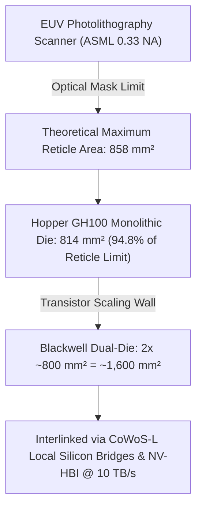
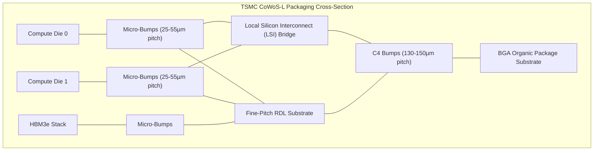
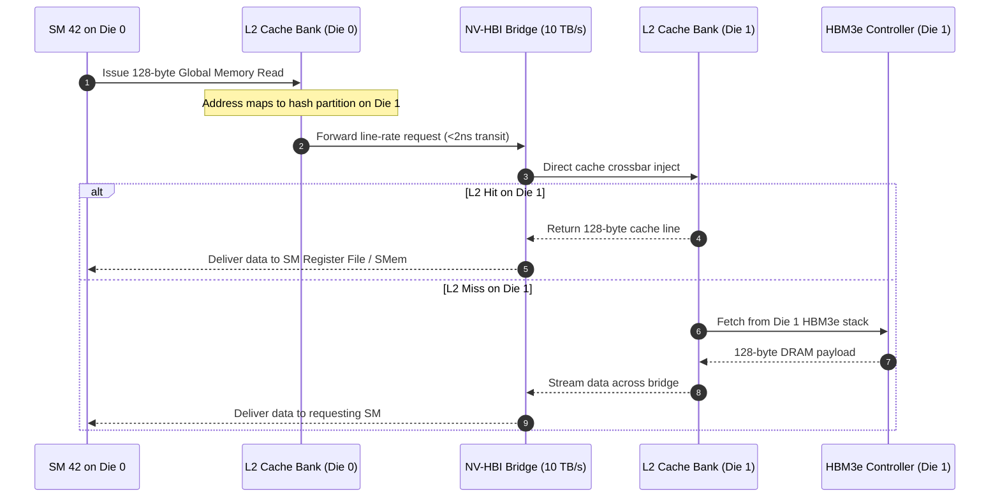

# Volume 01: Silicon Packaging, CoWoS-L & NV-HBI Interconnect

```text
====================================================================================================
MODULE 01: SILICON FABRICATION, ADVANCED PACKAGING & CROSS-DIE BRIDGES
PLATFORMS: NVIDIA HOPPER (GH100) | BLACKWELL (GB100/B200/GB200) | VERA RUBIN (R100)
====================================================================================================
```

To engineer, optimize, and diagnose modern accelerated computing systems, an infrastructure engineer must look beyond abstract framework APIs and understand the solid-state physics of silicon fabrication, 2.5D wafer-scale packaging, and multi-die coherent bridges. 

This volume examines how physical lithography constraints forced the transition from monolithic dies to multi-die architectures, how **TSMC CoWoS-L** bridges high-bandwidth memory (HBM) and compute silicon, and how the **10 TB/s NV-HBI (NVIDIA High-Bandwidth Interface)** creates a single logical GPU out of dual reticle-limit dies.

---

## 📑 Table of Contents
1. [Physical Silicon & Photolithography Reticle Limits](#1-physical-silicon--photolithography-reticle-limits)
2. [Monolithic Silicon vs. Multi-Die Architectures](#2-monolithic-silicon-vs-multi-die-architectures)
3. [Advanced Packaging: CoWoS-S vs. CoWoS-R vs. CoWoS-L](#3-advanced-packaging-cowos-s-vs-cowos-r-vs-cowos-l)
4. [NV-HBI: The 10 TB/s Cross-Die Coherent Bridge](#4-nv-hbi-the-10-tbs-cross-die-coherent-bridge)
5. [HBM3e / HBM4 Silicon Integration & Physical Interconnects](#5-hbm3e--hbm4-silicon-integration--physical-interconnects)
6. [Multi-Dimensional Architecture Correlation](#6-multi-dimensional-architecture-correlation)
7. [Hands-On Silicon & Bus Diagnostic Lab](#7-hands-on-silicon--bus-diagnostic-lab)
8. [Practice Exercises & Verification Workbook](#8-practice-exercises--verification-workbook)

---

## 1. Physical Silicon & Photolithography Reticle Limits

In semiconductor manufacturing using optical lithography, the **photolithography reticle limit** is the maximum exposure area that an Extreme Ultraviolet (EUV) scanner (such as ASML Twinscan NXE machines) can pattern onto a silicon wafer in a single flash.

```text
ASML EUV Scanner Optical Field (0.33 Numerical Aperture):
┌─────────────────────────────────────────────────────────┐
│ Maximum Scan Field Width  : 26.0 mm                     │
│ Maximum Scan Field Length : 33.0 mm                     │
│ Maximum Theoretical Reticle Area: 26 mm × 33 mm = 858 mm²│
└─────────────────────────────────────────────────────────┘
```



### The Reticle Limit Wall:
* **Hopper GH100**: Fabricated on TSMC 4N (custom 5nm class). Monolithic die size is **814 mm²** containing **80 billion transistors**. This utilized ~94.8% of the optical reticle field. It was impossible to make GH100 noticeably larger on a single die without severe optical distortion and near-zero wafer yields.
* **The AI Compute Demand Dilemma**: Doubling compute density for trillion-parameter LLMs required >200 billion transistors. At a fixed lithography node (TSMC 4NP), packing 208B transistors onto a single die would require a die area of roughly $1,600\text{ mm}^2$—nearly double the physical reticle limit.
* **The Solution**: Construct two distinct reticle-limit dies and fuse them together on a high-density package using microscopic silicon interconnect bridges so that they behave as an unpartitioned monolithic ASIC.

---

## 2. Monolithic Silicon vs. Multi-Die Architectures

Building a multi-die accelerator presents a severe latency and memory-coherency penalty if implemented with standard SerDes (Serializer/Deserializer) chiplets:

```text
+--------------------------------------------------------------------------------------------------+
| MONOLITHIC GPU (Hopper GH100) vs. MULTI-DIE COHERENT GPU (Blackwell B200)                         |
+--------------------------------------------------------------------------------------------------+
|                                                                                                  |
| [ Hopper GH100: Monolithic Die ]                 [ Blackwell B200: Dual-Die CoWoS-L ]             |
| ┌──────────────────────────────┐                 ┌───────────────┐     ┌───────────────┐         |
| │  814 mm² Monolithic Silicon  │                 │ Compute Die 0 │     │ Compute Die 1 │         |
| │  Single L2 Crossbar Network  │                 │ (80 SMs, L2)  │     │ (80 SMs, L2)  │         |
| │  132 Active SMs              │                 │   104B Trans. │     │   104B Trans. │         |
| │  80B Transistors             │                 └───┬───────────┘     └───────────┬───┘         |
| └──────────────┬───────────────┘                     │    NV-HBI (10 TB/s)         │             |
|                │                                     └═════════════════════════════┘             |
|       ┌────────┴────────┐                                  ┌──────────────┴──────────────┐       |
|       │  HBM3 (3.35 TB/s)│                                  │   HBM3e (8.0 TB/s Total)    │       |
|       └─────────────────┘                                  └─────────────────────────────┘       |
+--------------------------------------------------------------------------------------------------+
```

### The Latency vs. Throughput Penalty of Standard Chiplets:
Traditional chiplet designs (e.g., standard PCIe or proprietary SerDes interfaces) suffer from:
1. **High Energy-per-Bit**: Standard SerDes require 5 to 10 pJ/bit to serialize data, drive signals across substrate traces, and deserialize.
2. **Serialization Latency**: Serializing a 512-bit cache line incurs 15 to 40 ns of latency, breaking cache coherency.
3. **Partitioned Memory Domains**: Applications must manage NUMA (Non-Uniform Memory Access) nodes, partitioning L2 caches and explicit copy buffers.

Blackwell avoids this by deploying **NV-HBI** over TSMC **CoWoS-L**, achieving:
* **Energy**: Less than $0.5\text{ pJ/bit}$ ($>10\times$ lower than standard SerDes).
* **Latency**: $<2\text{ nanoseconds}$ transit time across dies (identical to intra-die crossbar hops).
* **Logical View**: Zero NUMA partitioning. To the CUDA driver, runtime, and SM warp schedulers, the two physical dies represent **one single logical GPU with a unified L2 cache and shared address space**.

---

## 3. Advanced Packaging: CoWoS-S vs. CoWoS-R vs. CoWoS-L

To bridge multiple compute dies and High Bandwidth Memory (HBM) stacks at micrometer scale, standard organic printed circuit boards (PCBs) are physically inadequate. Standard PCBs have trace pitches of $30\text{–}50\ \mu\text{m}$, whereas HBM and cross-die interfaces require sub-micron to micron-scale interconnects.

```text
+--------------------------------------------------------------------------------------------------+
| PACKAGING TECHNOLOGY COMPARISON                                                                  |
+------------------+------------------------------+---------------------------+--------------------+
| Attribute        | CoWoS-S (Silicon Interposer) | CoWoS-R (Organic RDL)     | CoWoS-L (LSI Bridge)|
+------------------+------------------------------+---------------------------+--------------------+
| Interposer Base  | Pure Monolithic Silicon      | Organic Polymer + Cu RDL  | Organic Mold + LSI |
| Interconnect Tech| Etched Sub-Micron Metal Lines| Redistribution Layers     | Silicon LSI Bridges|
| Max Substrate Size| ~1.5x to 2x Reticle Size    | ~2x to 3x Reticle Size    | >3.5x Reticle Size |
| Line / Space (L/S)| 0.4 µm / 0.4 µm              | 2.0 µm / 2.0 µm           | 0.4 µm (Bridge)    |
| Primary Silicon  | Hopper H100, A100            | Mobile / Cost-Optimized   | Blackwell B200/B100|
| Thermal Warpage  | High CTE mismatch vs organic | Low warpage, lower routing| Highly balanced    |
+------------------+------------------------------+---------------------------+--------------------+
```



### The Engineering Anatomy of CoWoS-L:
1. **LSI (Local Silicon Interconnect) Bridges**: Tiny, ultra-dense passive silicon chips embedded inside the underlying organic molding compound. These bridges feature sub-micron copper dual-damascene routing wires ($0.4\ \mu\text{m} / 0.4\ \mu\text{m}$ line and space) directly bridging Die 0 and Die 1.
2. **RDL (Redistribution Layer)**: Connects the power, ground, and lower-speed I/O lines from the compute dies and HBM stacks down to the package ball grid array (BGA).
3. **Thermal Warpage Mitigation**: Because silicon has a low Coefficient of Thermal Expansion (CTE $\approx 2.6 \times 10^{-6}/\text{K}$) while organic packaging materials have a higher CTE ($\approx 15 \times 10^{-6}/\text{K}$), large monolithic silicon interposers crack under thermal cycling. CoWoS-L embeds silicon only where high-density routing is required (under the bridges and HBM edges), drastically improving reliability under 1000W+ thermal loads.

---

## 4. NV-HBI: The 10 TB/s Cross-Die Coherent Bridge

The **NV-HBI (NVIDIA High-Bandwidth Interface)** is the physical and logical communication layer operating across the LSI silicon bridges.

```text
NV-HBI Physical Bus Parameters:
┌─────────────────────────────────────────────────────────────────┐
│ Bidirectional Bisection Bandwidth : 10.0 TB/s (Terabytes/sec)   │
│ Raw Signal Bus Width              : Thousands of parallel wires │
│ Target Latency                    : < 2 nanoseconds             │
│ Energy Efficiency                 : < 0.5 pJ / bit              │
│ Coherency Protocol                : Hardware Unified Cache (L2) │
└─────────────────────────────────────────────────────────────────┘
```

### Mathematical Bandwidth Formulation:
The aggregate bidirectional bandwidth of a wide parallel bus is governed by:

$$\text{Bandwidth}_{\text{total}} = 2 \times N_{\text{wires}} \times f_{\text{clock}} \times \text{Bits per Baud}$$

Where:
* $N_{\text{wires}}$ represents the thousands of physical sub-micron micro-bump interconnect lines spanning the LSI bridge.
* $f_{\text{clock}}$ operates at multi-gigahertz parallel clock rates without the latency overhead of SerDes encoding (8b/10b or 128b/130b).
* $2 \times$ accounts for full-duplex simultaneous transmission.

Because the physical distance across the LSI bridge is less than a millimeter:
* Signal attenuation is negligible.
* Voltage swing can be minimized ($\approx 0.4\text{V} - 0.75\text{V}$), keeping dynamic power consumption ($P = C \cdot V^2 \cdot f$) ultra-low.



---

## 5. HBM3e / HBM4 Silicon Integration & Physical Interconnects

High Bandwidth Memory stacks are 3D-stacked DRAM dies connected to the base logic die via **TSVs (Through-Silicon Vias)** and micro-bumps.

```text
+--------------------------------------------------------------------------------------------------+
| HBM GENERATIONAL EVOLUTION & SILICON METRICS                                                     |
+---------------------+-----------------------+-------------------------+--------------------------+
| Architectural Metric| Hopper H100 (HBM3)    | Blackwell B200 (HBM3e)  | Vera Rubin R100 (HBM4)   |
+---------------------+-----------------------+-------------------------+--------------------------+
| Capacity per GPU    | 80 GB                 | 180 GB – 192 GB         | 288 GB                   |
| Stacks per Package  | 5 active (6 physical) | 8 active (8-Hi)         | 8 active (12-Hi)         |
| Physical Bus Width  | 5,120 bits (5 × 1024) | 8,192 bits (8 × 1024)   | 16,384 bits (8 × 2048)   |
| Pin Transfer Rate   | 5.2 Gbps              | 8.0 Gbps                | ~10.7+ Gbps              |
| Peak Bus Bandwidth  | 3.35 TB/s             | 8.0 TB/s                | Up to 22.0 TB/s          |
| Base Logic Die Tech | Passive / Standard    | 4NP Mixed Logic         | Direct Custom Logic ASIC |
+---------------------+-----------------------+-------------------------+--------------------------+
```

```text
HBM3e Micro-Bump and TSV Stack Topology:
┌──────────────────────────────────────────────┐
│ DRAM Die 7 (Top)                             │
├──────────────────────────────────────────────┤  ▲
│ DRAM Die 6                                   │  │
├──────────────────────────────────────────────┤  │ Through-Silicon
│ DRAM Die 5                                   │  │ Vias (TSVs)
├──────────────────────────────────────────────┤  │ (Vertical Cu
│ DRAM Die 4                                   │  │  Columns)
├──────────────────────────────────────────────┤  │
│ DRAM Die 3                                   │  │
├──────────────────────────────────────────────┤  │
│ DRAM Die 2                                   │  │
├──────────────────────────────────────────────┤  │
│ DRAM Die 1                                   │  │
├──────────────────────────────────────────────┤  ▼
│ DRAM Die 0 (Bottom DRAM Die)                 │
├──────────────────────────────────────────────┤
│ High-Speed Base Logic Die (Buffer Die)       │
└──────────────────────┬───────────────────────┘
                       │ Micro-Bumps (25-55µm pitch)
═══════════════════════╧═════════════════════════════════
CoWoS-L Substrate with Sub-Micron Interconnect Traces
```

### The HBM4 Architectural Leap (Vera Rubin):
In HBM3 and HBM3e, each stack is limited to a **1024-bit** bus interface to the GPU compute die. 
In **HBM4**:
1. The bus width **doubles to 2048 bits per stack**.
2. The base buffer die underneath the DRAM stack transitions from a standard memory vendor logic process to a **pure advanced TSMC foundry node (e.g., TSMC 3nm/5nm)**.
3. This allows the GPU memory controllers to interface directly with the base die routing at unprecedented densities, delivering up to **22 TB/s** of local memory bandwidth per accelerator.

---

## 6. Multi-Dimensional Architecture Correlation

When operating or diagnosing multi-die platforms, observe how packaging, silicon defects, power, and kernel drivers correlate:

```text
+--------------------------------------------------------------------------------------------------+
| MULTI-DIMENSIONAL CORRELATION: SILICON & PACKAGING                                               |
+---------------------+----------------------------------------------------------------------------+
| Dimension           | Physical Mechanism & System Manifestation                                 |
+---------------------+----------------------------------------------------------------------------+
| Silicon x Power     | Current density exceeds 200 Amps/cm² across micro-bumps. Electromigration |
|                     | can degrade LSI bridge connections over thousands of thermal cycles.       |
| Silicon x Thermal   | Uneven workloads between Die 0 and Die 1 create thermal gradients across  |
|                     | the CoWoS substrate, causing localized micro-warpage and SerDes stress.   |
| Silicon x Kernel    | A dropped signal on an NV-HBI line corrupts the unified L2 crossbar,      |
|                     | resulting in hardware parity traps and Linux kernel XID 62 errors.        |
| Silicon x SASS      | Because L2 is unified, instructions targeting addresses across dies execute|
|                     | with zero host driver involvement. Latency is masked by warp schedulers.  |
+---------------------+----------------------------------------------------------------------------+
```

---

## 7. Hands-On Silicon & Bus Diagnostic Lab

### Lab Objective:
Inspect the physical GPU die topology, verify memory bus configurations, interrogate PCI Express link capabilities, and monitor for low-level bus errors using production utilities.

### Step 1: Query Physical Silicon Architecture & HBM Bus Parameters
Use `nvidia-smi` to dump the exact memory architecture, bus width, and ECC status:

```bash
# Query memory architecture, bus width, and brand
nvidia-smi --query-gpu=gpu_name,gpu_bus_id,memory.total,memory.bus_width,driver_version \
           --format=csv
```

*Expected Output (Grace Blackwell GB10 / B200):*
```text
gpu_name, gpu_bus_id, memory.total [MiB], memory.bus_width [bits], driver_version
NVIDIA GB10, 00000000:0F:00.0, 131072 MiB, 8192 [bits], 570.86.10
```

### Step 2: Extract Deep Hardware Silicon & Firmware Descriptors
Query the GPU XML descriptor to inspect NUMA affinities, VBIOS firmware versions, and GSP firmware flags:

```bash
# Dump complete XML topology and grep critical silicon parameters
nvidia-smi -q -x | grep -E "<product_name>|<vbios_version>|<bus_width>|<gsp_firmware_version>"
```

### Step 3: Inspect Physical PCIe & Interconnect Link Capabilities
Interrogate the physical PCI configuration space to confirm link speed and width:

```bash
# Locate GPU PCI slot address
GPU_PCI=$(lspci -d 10de: | head -n 1 | awk '{print $1}')
echo "Inspecting GPU at PCI Address: ${GPU_PCI}"

# Inspect physical PCIe Link Capabilities (LnkCap) and Status (LnkSta)
sudo lspci -vvv -s ${GPU_PCI} | grep -E "LnkCap:|LnkSta:"
```

*Expected Output (Gen 5 x16 Bus):*
```text
LnkCap: Port #0, Speed 32GT/s, Width x16, ASPM not supported, Exit Latency L0s <4us, L1 <1us
LnkSta: Speed 32GT/s (ok), Width x16 (ok)
```

### Step 4: Interrogate Kernel Ring Buffer for Silicon & Bus Faults (XID Checks)
Check `dmesg` for any silicon parity errors or bus timeouts:

```bash
# Check for uncorrectable SRAM parity (XID 62) or bus fall-off (XID 79)
sudo dmesg -T | grep -E "NVRM: Xid.*(31|43|62|79|92)" || echo "No critical silicon XIDs detected."
```

---

## 8. Practice Exercises & Verification Workbook

### Exercise 1.1: CoWoS-L Bandwidth Calculation
* **Scenario**: A dual-die Blackwell B200 system operates its NV-HBI cross-die interface. Suppose the interface uses 4,096 bidirectional signal traces across the LSI bridges, with each trace clocking at $10.0\text{ GHz}$ SDR (Single Data Rate, 1 bit per cycle).
* **Task**: Calculate the theoretical peak bidirectional bisection bandwidth in Terabytes per second ($\text{TB/s}$).
* **Solution**:
  $$\text{Bandwidth} = \frac{4096 \text{ traces} \times 10.0 \times 10^9 \text{ bits/s}}{8 \text{ bits/byte}} \times 2 = \frac{40.96 \times 10^{12} \text{ bits/s}}{8} \times 2 = 5.12 \text{ TB/s} \times 2 = 10.24 \text{ TB/s}$$
  *Result*: The physical layer provides $\approx 10.24\text{ TB/s}$, satisfying the nominal $10\text{ TB/s}$ bidirectional throughput specification.

### Exercise 1.2: HBM3e Bus Width Verification
* **Scenario**: An infrastructure engineer observes an HBM3e bandwidth of $8.0\text{ TB/s}$ on a Blackwell GPU running at a pin speed of $7.8125\text{ Gbps}$.
* **Task**: Determine the number of active 1024-bit HBM stacks and verify the total bus width.
* **Solution**:
  $$\text{Total Bus Width (bits)} = \frac{\text{Target Bandwidth (Bytes/s)} \times 8 \text{ bits/byte}}{\text{Pin Speed (bits/s)}}$$
  $$\text{Bus Width} = \frac{8.0 \times 10^{12} \times 8}{7.8125 \times 10^9} = \frac{64.0 \times 10^{12}}{7.8125 \times 10^9} = 8,192 \text{ bits}$$
  $$\text{Active Stacks} = \frac{8,192 \text{ bits}}{1,024 \text{ bits/stack}} = 8 \text{ stacks}$$
  *Verification*: The accelerator uses exactly 8 active 1024-bit HBM3e stacks configured in parallel on the CoWoS-L substrate.

---

## 📌 Summary Checklist: What You Have Mastered
- [x] The photolithography reticle limit ($858\text{ mm}^2$) and why modern AI accelerators must be dual-die.
- [x] TSMC CoWoS-L architecture, Local Silicon Interconnect (LSI) bridges, and thermal warpage mechanics.
- [x] The NV-HBI bus protocol, sub-nanosecond latency, and unified single-logical-GPU abstraction.
- [x] HBM3e vs HBM4 pin architectures and 2048-bit base-die scaling.
- [x] Production CLI tools to query memory bus width, PCIe link status, and kernel bus integrity logs.
