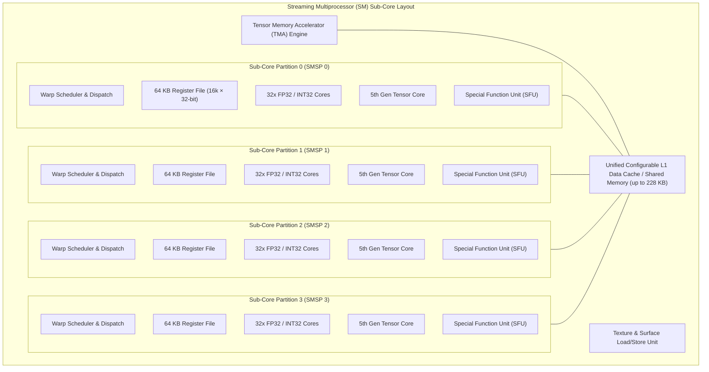
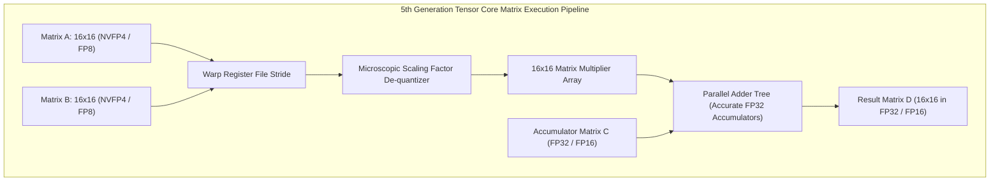

# Volume 02: SM Microarchitecture, Warp Schedulers & Tensor Cores

```text
====================================================================================================
MODULE 02: STREAMING MULTIPROCESSOR (SM) MICROARCHITECTURE & TENSOR ENGINES
PLATFORMS: NVIDIA HOPPER (GH100) | BLACKWELL (GB100/B200/GB200) | VERA RUBIN (R100)
====================================================================================================
```

At the core of every NVIDIA GPU computation is the **Streaming Multiprocessor (SM)**. While high-level programming frameworks abstract execution into thread grids and blocks, the silicon hardware executes strictly via **warps, sub-core processing partitions, hardware register files, and dense matrix engines**.

This volume analyzes the internal anatomy of modern SM microarchitectures, the mechanics of warp schedulers and dispatch units, the mathematical execution pipelines of **4th and 5th Generation Tensor Cores**, the hardware acceleration of **DPX instructions**, and how to profile SM execution bottlenecks using native assembly (`cuobjdump`) and microarchitectural profilers (`ncu`).

---

## 📑 Table of Contents
1. [The Internal Anatomy of a Streaming Multiprocessor (SM)](#1-the-internal-anatomy-of-a-streaming-multiprocessor-sm)
2. [Sub-Core Partitioning & Warp Scheduler Mechanics](#2-sub-core-partitioning--warp-scheduler-mechanics)
3. [Register File Banking & Register Pressure Math](#3-register-file-banking--register-pressure-math)
4. [Tensor Core Microarchitecture (Hopper to Blackwell)](#4-tensor-core-microarchitecture-hopper-to-blackwell)
5. [DPX Instructions & Dynamic Programming Acceleration](#5-dpx-instructions--dynamic-programming-acceleration)
6. [Thread Block Clusters & Distributed Shared Memory (DSMC)](#6-thread-block-clusters--distributed-shared-memory-dsmc)
7. [Hands-On SM & SASS Instruction Profiling Lab](#7-hands-on-sm--sass-instruction-profiling-lab)
8. [Practice Exercises & Verification Workbook](#8-practice-exercises--verification-workbook)

---

## 1. The Internal Anatomy of a Streaming Multiprocessor (SM)

A modern GPU is a massively parallel array of SMs arranged across multiple **GPCs (Graphics Processing Clusters)** and **TPCs (Texture Processing Clusters)**.

```text
GPU SILICON HIERARCHY (Blackwell B200 SXM):
┌─────────────────────────────────────────────────────────────────────────────┐
│ 2x TSMC 4NP Compute Dies (NV-HBI Interlinked)                               │
│ └── 160 Active Streaming Multiprocessors (80 SMs per die)                   │
│     ├── 20,480 CUDA Cores (128 FP32 cores per SM)                           │
│     ├── 640 5th Gen Tensor Cores (4 Tensor Cores per SM)                    │
│     ├── 40 MB Total Unified Shared Memory / L1 Cache (256 KB per SM)        │
│     └── 40 MB Total Register File (256 KB per SM across 4 partitions)       │
└─────────────────────────────────────────────────────────────────────────────┘
```



---

## 2. Sub-Core Partitioning & Warp Scheduler Mechanics

Each SM is partitioned into **4 identical processing blocks**, known as **SMSPs (SM Sub-Partitions)**.

### Warp Execution Fundamentals:
1. **The Warp**: The fundamental atomic scheduling unit of an NVIDIA GPU consisting of **32 parallel threads**.
2. **Lockstep Execution**: All 32 threads in a warp execute the identical instruction simultaneously on a single instruction pointer. If threads take divergent execution paths (`if/else`), the warp serializes both paths using an active thread mask, causing **warp divergence** and halving execution efficiency.
3. **Dual-Issue Dispatch**: Each SMSP contains a warp scheduler capable of issuing instructions from ready warps every clock cycle. Modern schedulers can dual-issue independent instructions (e.g., an integer index calculation and an FP32 arithmetic operation) to distinct execution units in the same cycle.

```text
Warp State Machine:
┌─────────────────┐       Warp Has Ready Instruction
│  Eligible Warp  │ ──────────────────────────────────────► ┌─────────────────┐
│ (Operands Ready)│                                         │ Issued to Core  │
└────────┬────────┘                                         └────────┬────────┘
         │                                                           │
         │ Memory Stall / Dependency / Barrier                       │ Completes Execution
         ▼                                                           ▼
┌─────────────────┐       Data Returns from Cache / HBM     ┌─────────────────┐
│   Stalled Warp  │ ◄────────────────────────────────────── │  Eligible Warp  │
│(Waiting on Data)│                                         │ (Next Inst.)    │
└─────────────────┘                                         └─────────────────┘
```

### Warp Stall Taxonomy (Nsight Compute Metrics):
* **`stall_memory_throttle`**: The warp is blocked because the local memory pipeline (L1 or L2 request queues) is completely saturated.
* **`stall_barrier`**: The warp is waiting at a `__syncthreads()` barrier for other warps in the thread block to catch up.
* **`stall_short_scoreboard`**: The warp is waiting on data from a short-latency shared memory read or local register dependency.
* **`stall_not_selected`**: The warp is ready to issue, but the scheduler chose a different eligible warp.

---

## 3. Register File Banking & Register Pressure Math

The GPU achieves zero-overhead context switching because **it does not spill registers to stack memory during context switches**. All active warps keep their registers permanently live in physical on-chip SRAM register files.

```text
SM REGISTER FILE CAPACITIES:
┌───────────────────────────────────────────────────────────────┐
│ Total Register File per SM        : 256 KB (65,536 registers) │
│ Partitions per SM                 : 4 Sub-partitions (SMSPs)  │
│ Register File per Sub-Partition   : 64 KB (16,384 registers)  │
│ Width of Physical Register        : 32 bits (4 bytes)         │
│ Maximum Registers per Single Thread: 255 registers            │
└───────────────────────────────────────────────────────────────┘
```

### The Occupancy vs. Register Pressure Equation:
SM **Occupancy** is the ratio of active warps resident on an SM to the maximum theoretical active warps supported by the hardware (typically 32 to 48 warps per SM on modern architectures).

$$\text{Active Warps per SM} = \min \left( \text{Warp Limit}, \frac{\text{Register File Capacity}}{\text{Registers per Thread} \times 32}, \frac{\text{Shared Memory Capacity}}{\text{Shared Memory per Block}} \times \frac{\text{Threads per Block}}{32} \right)$$

```text
OCCUPANCY CURVE: REGISTERS PER THREAD VS. ACTIVE WARPS (Hopper/Blackwell):
Active Warps
  48 ┼──────────────────────────────┐ (Max Theoretical Occupancy)
     │                              │
  32 ┼                              └────────┐
     │                                       │
  16 ┼                                       └──────────────────┐
     │                                                          │
   8 ┼                                                          └───────
     └──────┬───────────────────────┬───────────────────────────┬───────
           32                      64                          128     255
                               Registers Per Thread
```

### The Register Spilling Cascade:
If a CUDA kernel requires 128 registers per thread, an SM with 65,536 registers can only host:

$$\frac{65,536 \text{ registers}}{128 \text{ registers/thread} \times 32 \text{ threads/warp}} = 16 \text{ warps}$$

This cuts occupancy down to $33.3\%$ of maximum. If the compiler cannot fit variables into 255 registers, the excess registers **spill into Local Memory (which resides in high-latency DRAM/HBM)**, causing kernel throughput to collapse by up to $10\times$.

---

## 4. Tensor Core Microarchitecture (Hopper to Blackwell)

Standard CUDA cores perform one **FMA (Fused Multiply-Add)** operation per clock ($D = A \times B + C$) on scalar values. 
**Tensor Cores** execute matrix operations directly at the hardware silicon level, computing an entire matrix multiplication in a single instruction:

$$D = A \cdot B + C$$

```text
+--------------------------------------------------------------------------------------------------+
| TENSOR CORE GENERATIONAL EVOLUTION & PRECISION THROUGHPUT                                        |
+---------------------+-----------------------+-------------------------+--------------------------+
| Architectural Metric| Ampere A100 (3rd Gen) | Hopper H100 (4th Gen)   | Blackwell B200 (5th Gen) |
+---------------------+-----------------------+-------------------------+--------------------------+
| Native Precisions   | FP16, BF16, TF32, INT8| FP8 (E4M3/E5M2), FP16,  | NVFP4 (E2M1), FP6, FP8,  |
|                     | FP64                  | BF16, TF32, DPX, INT8   | BF16, TF32, FP64         |
| 2:4 Structural Sparsity| Yes (2x Throughput)| Yes (2x Throughput)     | Yes (2x Throughput)      |
| FP16 Dense MMA TFLOPS| 312 TFLOPS (SXM4)     | 989 TFLOPS (SXM5)       | ~2,250 TFLOPS (SXM)      |
| FP8 Dense MMA TFLOPS | N/A                   | 1,979 TFLOPS (SXM5)     | 4,500 TFLOPS (SXM)       |
| FP4 Dense MMA TFLOPS | N/A                   | N/A                     | 9,000 TFLOPS (SXM)       |
| Transformer Engine  | No                    | 1st Gen (FP8 dynamic)   | 2nd Gen (FP4 microscopic)|
+---------------------+-----------------------+-------------------------+--------------------------+
```



### The SASS Assembly Instruction for Tensor Cores:
At the machine instruction layer, Tensor Core operations emit `HMMA` (Half-precision Matrix Multiply-Accumulate) or `MMA` assembly:

```text
HMMA.16816.F32.BF16  R0, R2, R4, R0;
```
* Interpretation: Multiply Matrix $A$ (held across registers $R2$) and Matrix $B$ (held across registers $R4$) with dimensions $M=16, N=8, K=16$ in BF16 precision, and accumulate into Matrix $D$ ($R0$) in full FP32 precision.

---

## 5. DPX Instructions & Dynamic Programming Acceleration

Introduced in the Hopper architecture and retained in Blackwell and Rubin, **DPX** is a hardware instruction set dedicated to accelerating **Dynamic Programming** recurrence equations (e.g., Smith-Waterman local sequence alignment, Needleman-Wunsch, and Floyd-Warshall graph all-pairs shortest paths).

```text
Standard GPU ALU vs. DPX Hardware Acceleration:
┌────────────────────────────────────────────────────────────────────────┐
│ Classic Core: Requires 7+ separate instructions (ADD, MAX3, MIN3, CMP) │
│ DPX Hardware: Executes the complete recurrence in a single cycle!       │
└────────────────────────────────────────────────────────────────────────┘
```

### The DPX Mathematical Primitive:
Dynamic programming algorithms repeatedly compute equations of the form:

$$S(i, j) = \max \Big( S(i-1, j-1) + W(i, j),\ S(i-1, j) + D,\ S(i, j-1) + I,\ 0 \Big)$$

DPX introduces hardware fused instructions:
* `MAX3`: Computes $\max(A, B, C)$ in a single hardware step.
* `ADD+MAX3`: Computes $\max(A + B, C, D)$ in a single instruction.
* `RELU+ADD+MAX3`: Computes $\max(\max(A + B, 0), C, D)$ directly inside the ALU pipeline.

*Result*: Up to a **$7\times$ speedup** in genome sequencing alignment, routing optimization, and graph pathfinding compared to Ampere GPUs.

---

## 6. Thread Block Clusters & Distributed Shared Memory (DSMC)

Traditionally, GPU thread blocks were strictly isolated. If Thread Block 0 needed data generated by Thread Block 1, it had to write to global DRAM memory and synchronize via a costly kernel boundary.

```text
TRADITIONAL THREAD BLOCK VS. THREAD BLOCK CLUSTERS (Hopper/Blackwell):
┌─────────────────────────────────────────────────────────────────────────┐
│ Thread Block Cluster (Up to 8 Thread Blocks Co-Located on Adjacent SMs) │
│ ┌────────────────────────┐         ┌────────────────────────┐           │
│ │   SM 0: Block 0        │  DSMC   │   SM 1: Block 1        │           │
│ │   Local Shared Memory  │ ◄═════► │   Remote Shared Memory │           │
│ └────────────────────────┘ (SM-to-SM│ └────────────────────────┘           │
│                             Network)                                    │
└─────────────────────────────────────────────────────────────────────────┘
```

### Distributed Shared Memory (DSMC) Mechanics:
1. **Thread Block Clusters**: The hardware groups up to 8 thread blocks to execute concurrently on adjacent SMs within the same GPC.
2. **Distributed Shared Memory**: SM 0 can directly load and store into the Shared Memory of SM 1 using ordinary pointer dereferences over the high-speed SM-to-SM crossbar fabric.
3. **Hardware Barrier (`cuda::barrier`)**: Clusters synchronize across SMs asynchronously without halting the entire grid, enabling massive reductions in DRAM memory traffic for FlashAttention algorithms.

---

## 7. Hands-On SM & SASS Instruction Profiling Lab

### Lab Objective:
Compile a CUDA matrix kernel, disassemble the binary to verify Tensor Core SASS instructions (`HMMA`), inspect register allocation, and analyze warp stall metrics using Nsight Compute.

### Step 1: Write and Compile a Kernel with Exact Architecture Targets
Create a matrix multiplication kernel and compile it targeting the Hopper/Blackwell compute architecture:

```bash
cat << 'EOF' > matrix_test.cu
#include <cuda_runtime.h>
#include <cuda_fp16.h>
#include <stdio.h>

__global__ void simple_gemm(half *A, half *B, float *C, int N) {
    int idx = blockIdx.x * blockDim.x + threadIdx.x;
    if (idx < N) {
        float acc = 0.0f;
        #pragma unroll 4
        for (int k = 0; k < 16; ++k) {
            acc += __half2float(A[idx * 16 + k]) * __half2float(B[k * 16 + idx]);
        }
        C[idx] = acc;
    }
}

int main() {
    printf("Compiling for hardware SM analysis.\n");
    return 0;
}
EOF

# Compile targeting compute capability 90 (Hopper) or 100 (Blackwell)
nvcc -O3 -gencode arch=compute_90,code=sm_90 matrix_test.cu -o matrix_test.bin
```

### Step 2: Disassemble the Binary to Inspect SASS Machine Instructions
Use `cuobjdump` to extract and inspect the physical machine code:

```bash
# Dump the raw native SASS instructions
cuobjdump -sass matrix_test.bin | grep -E "HMMA|FFMA|LDG|STG" | head -n 20
```

*Expected SASS Output snippet:*
```text
/*0080*/                   LDG.E.128 R2, desc[UR4][R6.64];
/*0090*/                   HMMA.16816.F32.F16 R0, R2, R4, R0;
/*00a0*/                   STG.E [R8.64], R0;
```

### Step 3: Inspect Physical Register Count and Shared Memory Allocation
Check the exact resource consumption per kernel using `nvcc` compiler diagnostic flags:

```bash
# Compile with resource usage diagnostics
nvcc -O3 -Xptxas -v -gencode arch=compute_90,code=sm_90 matrix_test.cu -o matrix_test.bin
```

*Expected Diagnostic Output:*
```text
ptxas info    : Compiling entry function '_Z11simple_gemmP6__halfS0_Pf' for 'sm_90'
ptxas info    : Function properties for _Z11simple_gemmP6__halfS0_Pf
    0 bytes stack frame, 0 bytes spill stores, 0 bytes spill loads
ptxas info    : Used 32 registers, 0 bytes smem, 352 bytes cmem[0]
```

### Step 4: Profile Warp Stall Reasons with Nsight Compute (`ncu`)
Run microarchitectural profiling to inspect warp scheduler health:

```bash
# Profile warp issue stalls and SM occupancy on target binary
ncu --metrics sm__warps_active.avg.pct_of_peak_sustained_active,\
smsp__warp_issue_stalled_memory_throttle_per_warp_active.pct,\
smsp__warp_issue_stalled_short_scoreboard_per_warp_active.pct \
./matrix_test.bin
```

---

## 8. Practice Exercises & Verification Workbook

### Exercise 2.1: Register Pressure & SM Occupancy Limit
* **Scenario**: An AI engineer authors a custom CUDA kernel that utilizes **64 registers per thread** and **48 KB of Shared Memory per block**. The target GPU SM has **65,536 registers**, a **1024-thread maximum per SM**, a **32-warp maximum per SM**, and **128 KB of configurable Shared Memory**.
* **Task**: Calculate the maximum active warps supported on the SM and determine the limiting resource bottleneck.
* **Solution**:
  1. *Register Constraint*:
     $$\text{Max Threads (Registers)} = \frac{65,536 \text{ registers}}{64 \text{ registers/thread}} = 1,024 \text{ threads} = \frac{1024}{32} = 32 \text{ warps}$$
  2. *Shared Memory Constraint (assuming 512 threads per block = 16 warps/block)*:
     $$\text{Max Blocks (SMem)} = \left\lfloor \frac{128 \text{ KB}}{48 \text{ KB/block}} \right\rfloor = 2 \text{ blocks}$$
     $$\text{Max Warps (SMem)} = 2 \text{ blocks} \times 16 \text{ warps/block} = 32 \text{ warps}$$
  3. *Hardware Absolute Limits*: $32 \text{ warps}$.
  *Result*: Both register pressure and shared memory perfectly balance at 32 active warps, achieving **100% theoretical occupancy**.

### Exercise 2.2: SASS HMMA Throughput Calculation
* **Scenario**: A Blackwell SM executes `HMMA.16816` instructions operating on FP8 inputs. Each Tensor Core completes a $16 \times 8 \times 16$ matrix multiply-accumulate operation per clock cycle.
* **Task**: Calculate the number of floating-point operations (FLOPs) performed in a single clock cycle by an SM containing 4 Tensor Cores.
* **Solution**:
  * An $M \times N \times K$ matrix multiplication requires:
    $$\text{Operations} = 2 \times M \times N \times K \text{ (1 multiply + 1 accumulate)}$$
  * For $16 \times 8 \times 16$:
    $$\text{FLOPs per Tensor Core} = 2 \times 16 \times 8 \times 16 = 4,096 \text{ FLOPs/cycle}$$
  * For 4 Tensor Cores in the SM:
    $$\text{Total SM FLOPs/cycle} = 4 \times 4,096 = 16,384 \text{ FLOPs/cycle}$$
  *Result*: At a nominal clock of $2.0\text{ GHz}$, one single SM delivers $32.768\text{ TFLOPS}$ of dense FP8 compute.

---

## 📌 Summary Checklist: What You Have Mastered
- [x] SM sub-core partitioning (4 SMSPs per SM) and warp scheduler issue mechanics.
- [x] The register file architecture (64 KB/SMSP) and the exact occupancy math preventing local memory spilling.
- [x] 4th and 5th Gen Tensor Core MMA pipelines and the `HMMA.16816` native SASS instruction.
- [x] Hardware DPX acceleration for dynamic programming recurrence equations.
- [x] Thread Block Clusters and Distributed Shared Memory (DSMC) cross-SM communication.
- [x] Practical disassembly and microarchitectural profiling using `cuobjdump` and `ncu`.
