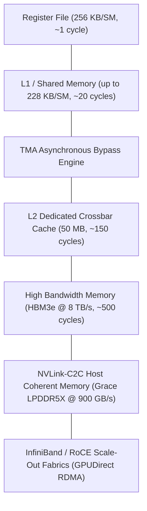
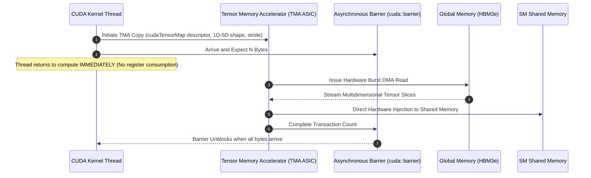
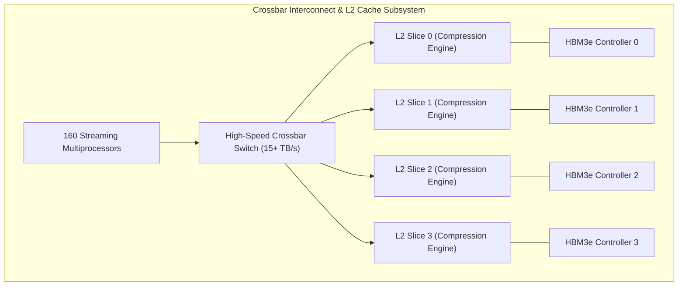

# Volume 03: Memory Subsystem: TMA, Cache Crossbars & HBM3e/HBM4

```text
====================================================================================================
MODULE 03: MEMORY ACCELERATORS, ON-CHIP CACHES & HIGH-BANDWIDTH MEMORY
PLATFORMS: NVIDIA HOPPER (GH100) | BLACKWELL (B200/GB200) | VERA RUBIN (R100)
====================================================================================================
```

In high-performance AI computing, arithmetic throughput is fundamentally constrained by memory bandwidth. Modern accelerators operate under the **Memory Wall**: floating-point computation capability has grown exponentially faster than DRAM access speeds.

To prevent SM starvation, modern NVIDIA architectures feature an advanced, multi-tier memory hierarchy. This volume analyzes the **Tensor Memory Accelerator (TMA)** for hardware asynchronous transfers, the configurable **L1/Shared Memory** crossbar, the **50 MB compressed L2 cache**, and the physical multi-terabyte **HBM3e and HBM4** subsystems.

---

## 📑 Table of Contents
1. [The GPU Memory Hierarchy & The Memory Wall](#1-the-gpu-memory-hierarchy--the-memory-wall)
2. [TMA (Tensor Memory Accelerator) Hardware Engine](#2-tma-tensor-memory-accelerator-hardware-engine)
3. [Configurable L1 Cache / Shared Memory & Bank Conflicts](#3-configurable-l1-cache--shared-memory--bank-conflicts)
4. [L2 Cache Crossbar, Compression & Cache Residency Control](#4-l2-cache-crossbar-compression--cache-residency-control)
5. [HBM3, HBM3e & HBM4 Physical Subsystems](#5-hbm3-hbm3e--hbm4-physical-subsystems)
6. [Multi-Dimensional Architecture Correlation](#6-multi-dimensional-architecture-correlation)
7. [Hands-On Memory Hierarchy Diagnostic & Profiling Lab](#7-hands-on-memory-hierarchy-diagnostic--profiling-lab)
8. [Practice Exercises & Verification Workbook](#8-practice-exercises--verification-workbook)

---

## 1. The GPU Memory Hierarchy & The Memory Wall

The execution speed of matrix multiplication and attention kernels depends on data staging through progressive tiers of memory latency and bandwidth:

```text
+--------------------------------------------------------------------------------------------------+
| GPU MEMORY HIERARCHY LATENCY & BANDWIDTH SPECTRUM (Blackwell B200)                                |
+-----------------------+-------------------+--------------------+---------------------------------+
| Memory Level          | Typical Capacity  | Peak Bandwidth     | Typical Access Latency          |
+-----------------------+-------------------+--------------------+---------------------------------+
| Register File (RF)    | 256 KB per SM     | > 300 TB/s (Agg.)  | ~1 clock cycle (~0.5 ns)        |
| Shared Memory / L1    | 228 KB per SM     | ~100 TB/s (Agg.)   | ~15 to 30 clock cycles (10 ns)  |
| L2 Cache (Unified)    | 50 MB - 64 MB     | ~15 to 20 TB/s     | ~120 to 200 clock cycles (60 ns)|
| HBM3e (DRAM)          | 180 GB - 192 GB   | 8.0 TB/s           | ~400 to 600 clock cycles (250ns)|
| System Host RAM (C2C) | Up to 480 GB      | 900 GB/s (C2C)     | ~800 to 1200 clock cycles (500ns|
| Remote Node GPU HBM   | Multi-Terabytes   | 400 - 800 Gbps (IB)| ~1.5 to 3.5 microseconds (RDMA) |
+-----------------------+-------------------+--------------------+---------------------------------+
```



---

## 2. TMA (Tensor Memory Accelerator) Hardware Engine

Before the Hopper and Blackwell architectures, moving a tensor from global memory (HBM) into Shared Memory required the SM threads to:
1. Calculate multidimensional array indices using integer arithmetic instructions.
2. Load data from HBM into the SM **Register File**.
3. Store data from the Register File into **Shared Memory**.
4. Synchronize threads across the block with explicit barriers (`__syncthreads()`).

This burdened SM ALUs with addressing overhead, wasted register file capacity, and increased dynamic power consumption.

```text
LEGACY MEMORY COPY VS. TMA ASYNCHRONOUS HARDWARE COPY:
┌────────────────────────────────────────────────────────────────────────┐
│ Legacy Method (Ampere & Earlier):                                      │
│ Global Memory (HBM) ──► Register File (RF) ──► Shared Memory (SMem)   │
│ [Consumes registers, issues integer index math, blocks thread execution]│
├────────────────────────────────────────────────────────────────────────┤
│ TMA Hardware Engine (Hopper, Blackwell, Rubin):                        │
│ Global Memory (HBM) ─────────────────────────► Shared Memory (SMem)   │
│ [Direct hardware copy engine, zero registers used, asynchronous DMA]   │
└────────────────────────────────────────────────────────────────────────┘
```



### TMA 1D–5D Tensor Descriptors:
The programmer defines a **Tensor Map Descriptor** (`CUtensorMap` / `cudaTensorMap`) specifying:
* Tensor rank (1D up to 5D).
* Base memory address and physical strides in bytes.
* Bounding box dimensions and sub-tile slice dimensions.
* Out-of-bounds element handling (zero-padding or clamp).
* Swizzling patterns (32B, 64B, or 128B) to eliminate Shared Memory bank conflicts upon arrival.

Once programmed, a single SM warp instruction launches the transfer of an entire multi-dimensional tile into shared memory asynchronously.

---

## 3. Configurable L1 Cache / Shared Memory & Bank Conflicts

Each SM integrates a shared, on-chip SRAM block that can be partitioned between the **hardware-managed L1 Data Cache** and **software-managed Shared Memory**:

```text
SM CACHE CONFIGURATION MODES (Blackwell / Hopper):
┌────────────────────────┬─────────────────────┬───────────────────────┐
│ Total SRAM per SM      │ Shared Memory Size  │ L1 Data Cache Size    │
├────────────────────────┼─────────────────────┼───────────────────────┤
│ 256 KB Total SRAM      │ 228 KB              │ 28 KB                 │
│                        │ 192 KB              │ 64 KB                 │
│                        │ 128 KB              │ 128 KB                │
│                        │ 64 KB               │ 192 KB                │
│                        │ 0 KB (L1 Max)       │ 256 KB                │
└────────────────────────┴─────────────────────┴───────────────────────┘
```

### Shared Memory Bank Organization & Conflicts:
Shared memory is divided into **32 independent banks**, corresponding to the 32 threads in a warp.
* **Bank Width**: 4 bytes (32 bits) per bank.
* **Bandwidth**: Each bank can service 4 bytes per clock cycle. If all 32 threads access distinct banks, the SM delivers **128 bytes per cycle** without serialization.
* **Bank Conflict**: If $M$ threads within the same warp access different addresses within the same bank, the hardware must serialize the requests ($M$-way conflict), reducing shared memory throughput by a factor of $M$.

$$\text{Bank Index} = \left( \frac{\text{Byte Address}}{4} \right) \bmod 32$$

```text
SHARED MEMORY ACCESS PATTERNS:
Thread ID:    T0   T1   T2   T3  ...  T31
Address:      A0   A1   A2   A3  ...  A31
Bank Mapped:  B0   B1   B2   B3  ...  B31   ===> ZERO CONFLICT (Full Line Rate)

Thread ID:    T0   T1   T2   T3  ...  T31
Address:      A0   A32  A64  A96 ...        (All map to Byte 0, 128, 256...)
Bank Mapped:  B0   B0   B0   B0  ...        ===> 32-WAY CONFLICT (Serialized 32x)
```

To eliminate conflicts, modern tensor loaders use **hardware XOR swizzling**:

$$\text{Bank}_{\text{swizzled}} = \left( \frac{\text{Byte Address}}{4} \right) \oplus \left( \frac{\text{Row Index}}{S} \right) \bmod 32$$

---

## 4. L2 Cache Crossbar, Compression & Cache Residency Control

Connecting all SMs on a die to the HBM controllers is the **Unified L2 Cache**.

```text
L2 CACHE SPECIFICATIONS:
┌─────────────────────────────────────────────────────────────────┐
│ Hopper H100 L2 Cache Capacity      : 50 MB dedicated SRAM       │
│ Blackwell B200 L2 Cache Capacity   : 50 MB - 64 MB crossbar     │
│ Crossbar Bisection Bandwidth       : > 15 TB/s                  │
│ Line-Rate Hardware Compression     : Up to 4:1 lossless ratio   │
│ Split Cache Residency Controls     : Persistent vs Streaming    │
└─────────────────────────────────────────────────────────────────┘
```



### Hardware Line-Rate Compression:
The L2 cache features inline hardware data compression engines. When cache lines are written back from SMs, the engine evaluates compressibility. Compressible data (e.g., sparse activation tensors, zero-padded weights) is stored in a compressed state, effectively multiplying L2 capacity by up to **$2\times\text{ to }4\times$** and cutting HBM read/write traffic.

### Cache Residency Control (`cudaAccessPolicyWindow`):
Developers can partition L2 into **Persistent** and **Streaming** windows:
* **Persistent Window**: Pins critical, frequently reused data (e.g., KV cache blocks, weight matrices in decode loops) in L2 SRAM so it is never evicted by large streaming inputs.
* **Streaming Window**: Routes high-throughput, single-use activation streams through a smaller eviction pool.

---

## 5. HBM3, HBM3e & HBM4 Physical Subsystems

High Bandwidth Memory delivers massive bandwidth through extreme bus width ($8,192\text{ to }16,384\text{ bits}$) rather than extreme pin clock speeds (unlike GDDR6/DDR5):

```text
+--------------------------------------------------------------------------------------------------+
| PHYSICAL HBM BUS COMPARISON                                                                      |
+---------------------+-----------------------+-------------------------+--------------------------+
| Specification       | H100 (HBM3)           | B200 (HBM3e)            | Vera Rubin (HBM4)        |
+---------------------+-----------------------+-------------------------+--------------------------+
| Active Stacks       | 5 stacks (SXM5)       | 8 stacks (SXM)          | 8 stacks (12-Hi)         |
| Bus Width per Stack | 1,024 bits            | 1,024 bits              | 2,048 bits               |
| Aggregate Bus Width | 5,120 bits            | 8,192 bits              | 16,384 bits              |
| Pin Signaling Speed | 5.2 Gbps              | 8.0 Gbps                | ~10.7 Gbps               |
| Peak Bus Bandwidth  | 3.35 TB/s             | 8.0 TB/s                | ~22.0 TB/s               |
| Energy Efficiency   | ~3.5 pJ/bit           | ~2.5 pJ/bit             | < 1.8 pJ/bit             |
+---------------------+-----------------------+-------------------------+--------------------------+
```

### The Physics of HBM Bandwidth Math:

$$\text{Bandwidth}_{\text{peak}} = \frac{\text{Total Bus Width (bits)} \times \text{Pin Transfer Rate (bits/s)}}{8 \text{ bits/byte}}$$

For Blackwell B200:

$$\text{Bandwidth}_{\text{peak}} = \frac{8,192 \text{ bits} \times 8.0 \times 10^9 \text{ bits/s}}{8} = 8,192 \times 10^9 \text{ Bytes/s} = 8.192 \text{ TB/s}$$

---

## 6. Multi-Dimensional Architecture Correlation

```text
+--------------------------------------------------------------------------------------------------+
| MULTI-DIMENSIONAL CORRELATION: MEMORY SUBSYSTEM                                                  |
+---------------------+----------------------------------------------------------------------------+
| Dimension           | Mechanism & Failure Manifestation                                          |
+---------------------+----------------------------------------------------------------------------+
| Memory x Compute    | When a kernel suffers low arithmetic intensity (< 10 FLOPs/byte), Tensor    |
|                     | Cores idle waiting for HBM loads, capping throughput below 20% of peak.     |
| Memory x Electrical | Massive HBM burst read activations create sudden instantaneous current     |
|                     | spikes on the GPU core power rail, triggering voltage ripple.              |
| Memory x Kernel     | If an application attempts to allocate physical memory beyond HBM capacity,|
|                     | the kernel driver triggers out-of-memory or costly UVM page migrations.   |
| Memory x SMem       | Shared memory bank conflicts serialize warp instructions, resulting in     |
|                     | high smsp__warp_issue_stalled_short_scoreboard metrics in Nsight Compute.  |
+---------------------+----------------------------------------------------------------------------+
```

---

## 7. Hands-On Memory Hierarchy Diagnostic & Profiling Lab

### Lab Objective:
Inspect memory utilization, measure memory throughput across L1/L2 and DRAM, and identify memory-bound kernels using Nsight Compute (`ncu`).

### Step 1: Query Physical Memory Clocks and ECC Event Counters
Use `nvidia-smi` to inspect active memory clock frequencies and hardware ECC scrubbing metrics:

```bash
# Check memory clock frequency, ECC uncorrectable errors, and power state
nvidia-smi -q -d MEMORY,ECC,CLOCK
```

### Step 2: Profile L1, L2, and DRAM Throughput with Nsight Compute
Profile an existing GPU application to extract hardware memory bandwidth utilization:

```bash
# Profile Speed-of-Light (SOL) memory throughput and cache hit rates
ncu --metrics \
dram__throughput.avg.pct_of_peak_sustained_elapsed,\
l1tex__t_sectors_pipe_lsu_mem_global_op_ld.sum,\
l2__throughput.avg.pct_of_peak_sustained_elapsed,\
smsp__warp_issue_stalled_memory_throttle_per_warp_active.pct \
./matrix_test.bin
```

*Expected Diagnostic Interpretation:*
* If `dram__throughput` is $>80\%$, the kernel is strictly memory-bound by HBM.
* If `l2__throughput` is high while `dram__throughput` is low, the L2 cache is absorbing memory traffic effectively.
* If `smsp__warp_issue_stalled_memory_throttle` is $>25\%$, the SM memory queues are saturated.

### Step 3: Inspect Memory Allocations and Bounds Safety
Verify that memory allocations do not exceed bounds using `compute-sanitizer`:

```bash
# Run memory bounds check to verify zero illegal global/shared memory accesses
compute-sanitizer --tool memcheck ./matrix_test.bin
```

---

## 8. Practice Exercises & Verification Workbook

### Exercise 3.1: Arithmetic Intensity & Roofline Boundary
* **Scenario**: An LLM Attention kernel performs $4.0\text{ TFLOPs}$ of computation while reading $1.0\text{ GB}$ of data from HBM3e on a Blackwell B200 ($8.0\text{ TB/s}$ memory bandwidth, $4,500\text{ TFLOPs}$ FP8 dense compute peak).
* **Task**: Calculate the arithmetic intensity ($I$) of the kernel and determine whether it is compute-bound or memory-bound.
* **Solution**:
  1. *Arithmetic Intensity Calculation*:
     $$I = \frac{\text{Computation (FLOPs)}}{\text{Data Moved (Bytes)}} = \frac{4.0 \times 10^{12} \text{ FLOPs}}{1.0 \times 10^9 \text{ Bytes}} = 4,000 \text{ FLOPs/Byte}$$
  2. *Machine Operational Boundary ($I_{\text{crit}}$)*:
     $$I_{\text{crit}} = \frac{\text{Peak Compute Throughput (FLOPs/s)}}{\text{Peak Memory Bandwidth (Bytes/s)}} = \frac{4,500 \times 10^{12} \text{ FLOPs/s}}{8.0 \times 10^{12} \text{ Bytes/s}} = 562.5 \text{ FLOPs/Byte}$$
  3. *Classification*:
     $$I (4,000) > I_{\text{crit}} (562.5)$$
  *Result*: The kernel is **compute-bound**. It can achieve peak Tensor Core utilization because it performs enough math per byte moved from DRAM to saturate the arithmetic pipelines.

### Exercise 3.2: Shared Memory Bank Conflict Penalty
* **Scenario**: A warp of 32 threads executes a shared memory load where all 32 threads read from `shared_array[threadIdx.x * 2]`.
* **Task**: Calculate the bank mapped for each thread and determine the bank conflict factor.
* **Solution**:
  * Address stride is 2 words (8 bytes).
  * For thread $i$, word index is $2i$.
  * $\text{Bank}(i) = (2i) \bmod 32$.
  * For $i = 0$, Bank 0. For $i = 16$, $\text{Bank}(16) = (32) \bmod 32 = \text{Bank } 0$.
  * Each bank is accessed by exactly 2 threads ($i$ and $i+16$).
  *Result*: This produces a **2-way bank conflict**, cutting shared memory throughput by $50\%$ for that instruction.

---

## 📌 Summary Checklist: What You Have Mastered
- [x] The GPU memory hierarchy, latencies, and the roofline arithmetic intensity model.
- [x] TMA (Tensor Memory Accelerator) hardware DMA transfers and asynchronous barrier synchronization.
- [x] Shared Memory 32-bank organization, bank conflict math, and XOR swizzling.
- [x] L2 crossbar compression and `cudaAccessPolicyWindow` cache residency control.
- [x] HBM3e vs HBM4 physical buses and micro-bump scaling.
- [x] Profiling memory bottlenecks with `ncu` and `compute-sanitizer`.
