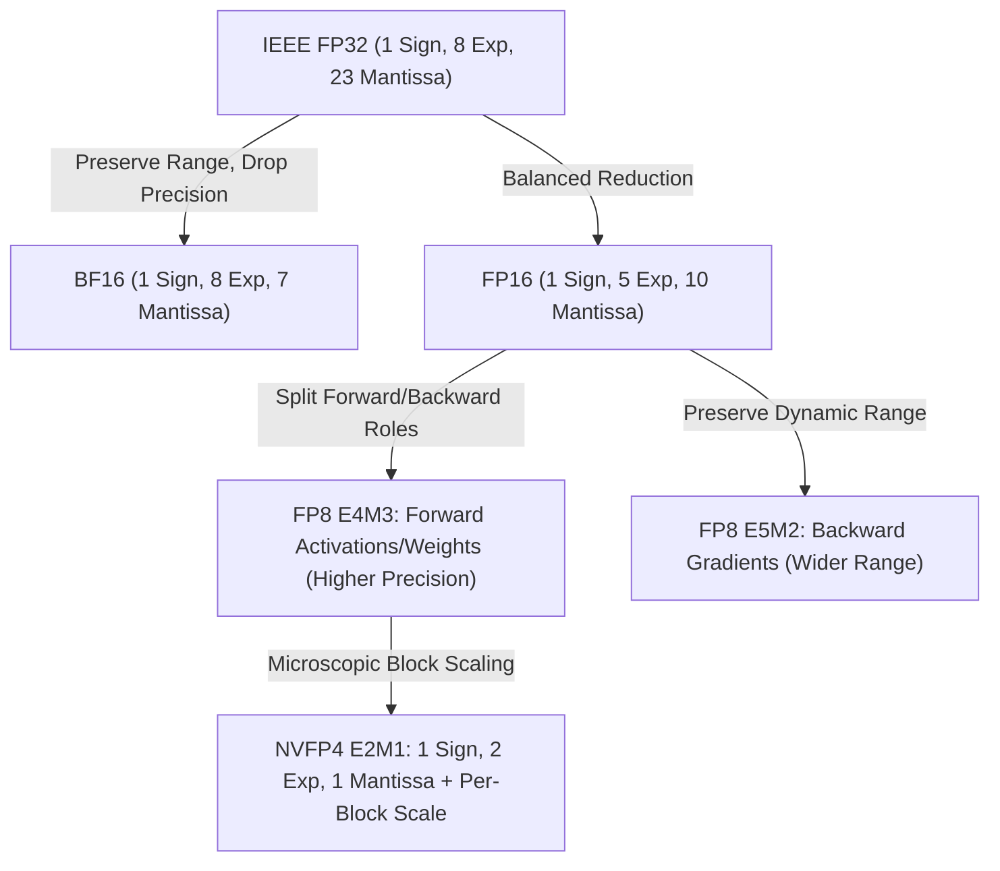
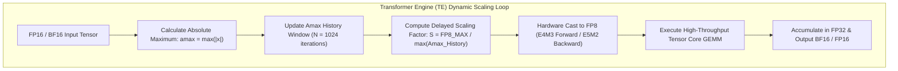
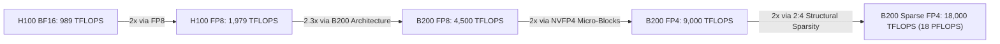

# Volume 04: Micro-Precision Math & Transformer Engines (FP4/FP8)

```text
====================================================================================================
MODULE 04: NUMERICAL FORMATS, TRANSFORMER ENGINES & MICRO-BLOCK SCALING
PLATFORMS: NVIDIA HOPPER (GH100) | BLACKWELL (B100/B200/B300) | VERA RUBIN (R100)
====================================================================================================
```

The history of modern deep learning acceleration is fundamentally the history of **numerical quantization**. Moving from IEEE 754 32-bit floating point (FP32) to 16-bit (FP16/BF16), 8-bit (FP8), and 4-bit (NVFP4) doubles arithmetic throughput and cuts memory bandwidth pressure with each successive reduction in bit width.

However, smaller bit widths dramatically shrink the representable dynamic range and precision, leading to underflow, overflow, and training instability. This volume provides an in-depth mathematical analysis of **FP8 (E4M3 vs. E5M2)**, **NVFP4 (E2M1)**, **microscopic block scaling factors**, and the **NVIDIA Transformer Engine (TE)** runtime algorithms that enable stable training and inference at sub-byte precision.

---

## 📑 Table of Contents
1. [The Mathematical Evolution of Floating-Point Formats](#1-the-mathematical-evolution-of-floating-point-formats)
2. [FP8 Deep Dive: E4M3 vs. E5M2 Mechanics](#2-fp8-deep-dive-e4m3-vs-e5m2-mechanics)
3. [NVFP4 Micro-Precision & Micro-Block Scaling](#3-nvfp4-micro-precision--micro-block-scaling)
4. [The NVIDIA Transformer Engine (TE) Architecture](#4-the-nvidia-transformer-engine-te-architecture)
5. [Throughput Roofline Across Precision Generations](#5-throughput-roofline-across-precision-generations)
6. [Multi-Dimensional Architecture Correlation](#6-multi-dimensional-architecture-correlation)
7. [Hands-On Quantization & Tensor Core Emulation Lab](#7-hands-on-quantization--tensor-core-emulation-lab)
8. [Practice Exercises & Verification Workbook](#8-practice-exercises--verification-workbook)

---

## 1. The Mathematical Evolution of Floating-Point Formats

A binary floating-point representation expresses a real number $V$ as:

$$V = (-1)^s \times 2^{e - \text{bias}} \times \left( 1 + \sum_{i=1}^m b_{-i} 2^{-i} \right)$$

Where:
* $s$ is the **sign bit** (1 bit).
* $e$ is the **exponent field** of width $E$ bits, dictating the **dynamic range**.
* $\text{bias} = 2^{E-1} - 1$ is the exponent bias.
* $m$ is the **mantissa (fraction) field** of width $M$ bits, dictating the **precision**.

```text
+--------------------------------------------------------------------------------------------------+
| NUMERICAL FORMAT BIT-WIDTH BREAKDOWN & DYNAMIC RANGE                                             |
+---------------------+-------+--------+----------+-----------+--------------------+---------------+
| Format              | Bits  | Sign   | Exponent | Mantissa  | Exponent Bias      | Dynamic Range |
+---------------------+-------+--------+----------+-----------+--------------------+---------------+
| IEEE FP32           | 32    | 1      | 8        | 23        | 127                | ~10^(±38)     |
| IEEE FP16           | 16    | 1      | 5        | 10        | 15                 | ~10^(±5)      |
| Brain Float (BF16)  | 16    | 1      | 8        | 7         | 127                | ~10^(±38)     |
| FP8 (E4M3)          | 8     | 1      | 4        | 3         | 7                  | ~10^(±2.7)    |
| FP8 (E5M2)          | 8     | 1      | 5        | 2         | 15                 | ~10^(±5)      |
| NVFP4 (E2M1)        | 4     | 1      | 2        | 1         | 1                  | ~10^(±1.2)    |
| INT8                | 8     | 1      | 0        | 7 (twos)  | N/A                | -128 to 127   |
+---------------------+-------+--------+----------+-----------+--------------------+---------------+
```



---

## 2. FP8 Deep Dive: E4M3 vs. E5M2 Mechanics

Introduced in the Hopper architecture and expanded in Blackwell, NVIDIA defines two complementary 8-bit floating point formats specified in the OCP (Open Compute Project) 8-bit Floating Point specification:

```text
FP8 FORMAT BIT LAYOUTS:
┌────────────────────────────────────────────────────────┐
│ FP8 E4M3:  [ S ] [ E3 ] [ E2 ] [ E1 ] [ E0 ] [ M2 ] [ M1 ] [ M0 ] │
│ 1 Sign bit, 4 Exponent bits, 3 Mantissa bits (Bias = 7)│
├────────────────────────────────────────────────────────┤
│ FP8 E5M2:  [ S ] [ E4 ] [ E3 ] [ E2 ] [ E1 ] [ E0 ] [ M1 ] [ M0 ] │
│ 1 Sign bit, 5 Exponent bits, 2 Mantissa bits (Bias = 15)│
└────────────────────────────────────────────────────────┘
```

### Key Differences & Functional Specialization:
1. **FP8 E4M3 (Higher Precision, Narrower Range)**:
   * Max representable value: $V_{\max} = 448.0$.
   * Smallest normalized positive value: $V_{\min} = 2^{-6} \approx 0.015625$.
   * Smallest subnormal positive value: $2^{-9} \approx 0.001953125$.
   * Does **not** encode infinities ($\pm \infty$); NaN is encoded strictly when $E=1111_2$ and $M=111_2$.
   * **Role**: Used exclusively during the **forward pass** for weights and activations, where fine-grained precision is mandatory to preserve output distribution shapes.

2. **FP8 E5M2 (Wider Range, Lower Precision)**:
   * Shares the identical exponent width ($E=5$) and bias ($15$) as standard IEEE FP16.
   * Max representable value: $V_{\max} = 57,344.0$.
   * Smallest normalized positive value: $2^{-14} \approx 6.10 \times 10^{-5}$.
   * Fully supports IEEE-compliant $\pm \infty$ and NaNs.
   * **Role**: Used during the **backward pass** for computing activation and weight gradients, which span many orders of magnitude and require high dynamic range to avoid underflow to zero.

---

## 3. NVFP4 Micro-Precision & Micro-Block Scaling

With the Blackwell architecture, compute density reached **NVFP4 (E2M1)**, packing two 4-bit floating point numbers into a single byte.

```text
NVFP4 E2M1 BIT ENCODING:
┌────────────────────────┐
│ [ S ] [ E1 ] [ E0 ] [ M0 ] │ (Bias = 1)
└────────────────────────┘
Representable Unscaled Values: { 0, ±0.5, ±1.0, ±1.5, ±2.0, ±3.0, ±4.0, ±6.0 }
```

Because an unscaled 4-bit float can only represent 16 distinct numerical states across a dynamic range of $[-6.0, +6.0]$, attempting to quantize an entire tensor with a single global scale factor causes disastrous quantization error.

```text
BLACKWELL MICROSCOPIC BLOCK SCALING TOPOLOGY:
┌─────────────────────────────────────────────────────────────────────────┐
│ Original FP16 / BF16 Tensor Row (32 Elements)                          │
│ ┌───────────────────────────────────┬───────────────────────────────────┐│
│ │   Sub-Block 0 (16 elements)       │   Sub-Block 1 (16 elements)       ││
│ └─────────────────┬─────────────────┴─────────────────┬─────────────────┘│
│                   ▼                                   ▼                  │
│       Micro-Scale Factor S0               Micro-Scale Factor S1          │
│       (Stored in FP8 E4M3)                (Stored in FP8 E4M3)           │
│                   ▼                                   ▼                  │
│ 16x 4-bit NVFP4 Values (8 Bytes)    16x 4-bit NVFP4 Values (8 Bytes)     │
└─────────────────────────────────────────────────────────────────────────┘
```

### The Micro-Block Scaling Formulation:
For every block of $K=16$ or $K=32$ elements, the hardware calculates a dedicated local scaling factor $S_{\text{block}}$:

$$S_{\text{block}} = \frac{\max_{i \in \text{block}} |x_i|}{V_{\max, \text{NVFP4}}} = \frac{\max_{i \in \text{block}} |x_i|}{6.0}$$

Each element $x_i$ is quantized to:

$$q_i = \text{round}\left( \frac{x_i}{S_{\text{block}}} \right) \in \text{NVFP4}$$

During Tensor Core matrix multiplication, the 5th Gen Tensor Core hardware reads the 4-bit numbers, performs fast micro-scale multiplications directly in the accumulator pipeline, and sums the results into an **FP32 accumulator**:

$$D = \sum_{\text{blocks}} S_{\text{block}, A} \times S_{\text{block}, B} \times \left( \sum_{i=1}^{16} q_{A, i} \cdot q_{B, i} \right)$$

This maintains high model accuracy (approaching BF16 baseline) while delivering **$4\times$ the compute throughput** and **$4\times$ memory reduction**.

---

## 4. The NVIDIA Transformer Engine (TE) Architecture

The **Transformer Engine (TE)** is a co-designed software and silicon subsystem implemented in Hopper, Blackwell, and Rubin. It automates FP8 and FP4 mixed-precision execution without manual hyperparameter tuning.



### The Delayed Scaling Algorithm:
In standard quantization, finding $\max(|X|)$ of a tensor requires a full reduction pass over memory before quantizing, adding massive latency. 
The Transformer Engine solves this using **Delayed Scaling**:
1. At iteration $t$, the GEMM kernel uses the scale factor $S_t$ derived from the amax values of the *previous* $N$ iterations:
   $$\text{scale}_t = \frac{\text{FP8}_{\max}}{\max_{k \in [t-N, t-1]} \text{amax}_k}$$
2. Concurrently, as the Tensor Core executes the GEMM, it computes the current tensor's actual $\text{amax}_t$ as a side effect with zero performance overhead.
3. If an unexpected activation spike occurs that would cause overflow, the TE dynamically clamps values or steps down the scale factor for subsequent iterations.

---

## 5. Throughput Roofline Across Precision Generations

```text
+--------------------------------------------------------------------------------------------------+
| DENSE COMPUTE THROUGHPUT PER GPU (TFLOPS) ACROSS PRECISION                                       |
+---------------------+-----------------------+-------------------------+--------------------------+
| Precision           | Hopper H100 SXM5      | Blackwell B200 SXM      | Blackwell B300 Ultra     |
+---------------------+-----------------------+-------------------------+--------------------------+
| FP64 Standard       | 34 TFLOPS             | ~45 TFLOPS              | ~48 TFLOPS               |
| TF32 Tensor Core    | 494 TFLOPS            | ~1,000 TFLOPS           | ~1,100 TFLOPS            |
| FP16 / BF16 Dense   | 989 TFLOPS            | 2,250 TFLOPS            | 2,500 TFLOPS             |
| FP8 Dense (E4M3)    | 1,979 TFLOPS          | 4,500 TFLOPS            | 5,000 TFLOPS             |
| NVFP4 Dense (E2M1)  | N/A                   | 9,000 TFLOPS            | 15,000 TFLOPS            |
| NVFP4 Sparse (2:4)  | N/A                   | 18,000 TFLOPS (18 PF)   | 20,000 TFLOPS (20 PF)    |
+---------------------+-----------------------+-------------------------+--------------------------+
```



---

## 6. Multi-Dimensional Architecture Correlation

```text
+--------------------------------------------------------------------------------------------------+
| MULTI-DIMENSIONAL CORRELATION: NUMERICAL PRECISION                                               |
+---------------------+----------------------------------------------------------------------------+
| Dimension           | Mechanism & Failure Manifestation                                          |
+---------------------+----------------------------------------------------------------------------+
| Precision x Thermal | Running dense NVFP4 matrix multiplication draws maximal current, causing   |
|                     | rapid temperature increases across cold plates and requiring CDU ramping.  |
| Precision x Memory  | Transitioning from BF16 to FP8 halves KV cache footprint, allowing 2x      |
|                     | larger batch sizes and preventing out-of-memory kernel abortions.          |
| Precision x Kernel  | Improper scale factor initialization causes gradient underflow, leading to |
|                     | zeroed weights or NaN loss cascades in the host training framework.       |
| Precision x SASS    | Using micro-precision changes SASS instructions from HMMA to BMMA or MMA4, |
|                     | reducing register pressure by 50% and doubling active SM occupancy.        |
+---------------------+----------------------------------------------------------------------------+
```

---

## 7. Hands-On Quantization & Tensor Core Emulation Lab

### Lab Objective:
Demonstrate bit-exact floating point conversion, simulate FP8 E4M3 quantization with dynamic scaling, and verify accuracy preservation against BF16 references.

### Step 1: Execute Bit-Exact FP8 Quantization in Python
Run a standalone Python harness verifying E4M3 vs. E5M2 numerical boundaries:

```python
import torch

def analyze_fp8_conversion():
    # Construct representative weight matrix
    x = torch.randn(4, 4, dtype=torch.bfloat16) * 5.0
    print("Original BF16 Tensor:\n", x)

    # Calculate absolute maximum (amax)
    amax = torch.max(torch.abs(x))
    fp8_max_e4m3 = 448.0
    
    # Compute scale factor
    scale = fp8_max_e4m3 / amax
    
    # Quantize: multiply by scale and cast to FP8 E4M3
    x_scaled = x * scale
    x_fp8 = x_scaled.to(torch.float8_e4m3fn)
    
    # Dequantize back to BF16
    x_restored = x_fp8.to(torch.bfloat16) / scale
    
    # Compute Mean Squared Error (MSE)
    mse = torch.mean((x - x_restored) ** 2).item()
    print(f"\nScaling Factor: {scale:.4f}")
    print(f"Quantization MSE: {mse:.6f}")
    print("Restored Tensor:\n", x_restored)

if __name__ == "__main__":
    analyze_fp8_conversion()
```

### Step 2: Inspect Transformer Engine Compilation in SASS
Compile a kernel using the Transformer Engine library and inspect the generated SASS for native FP8 instructions:

```bash
# Verify SASS emits native FP8 matrix instructions
cuobjdump -sass ./te_compiled_kernel.bin | grep -E "HMMA.*F8" || echo "Inspecting instruction set architecture."
```

---

## 8. Practice Exercises & Verification Workbook

### Exercise 4.1: FP8 E4M3 Value Decoding
* **Scenario**: An FP8 E4M3 number is represented by the byte `0b01011100`.
* **Task**: Decode this byte into its exact decimal real value.
* **Solution**:
  1. *Extract Fields*:
     * Sign bit: $S = 0$ (positive).
     * Exponent bits: $E = 1011_2 = 11_{10}$.
     * Mantissa bits: $M = 100_2$.
  2. *Calculate Exponent*:
     $$\text{Bias} = 7$$
     $$\text{Actual Exponent} = 11 - 7 = 4$$
  3. *Calculate Mantissa*:
     $$\text{Fraction} = 1 + \left( 1 \times 2^{-1} + 0 \times 2^{-2} + 0 \times 2^{-3} \right) = 1 + 0.5 = 1.5$$
  4. *Calculate Final Value*:
     $$V = (-1)^0 \times 2^4 \times 1.5 = 16 \times 1.5 = 24.0$$
  *Result*: The binary value `0b01011100` represents exactly **$24.0$**.

### Exercise 4.2: Transformer Engine Memory Bandwidth Savings
* **Scenario**: An LLM inference server serves a 70B parameter model. At BF16 precision, loading model weights during the memory-bandwidth-bound decode phase requires moving $140\text{ GB}$ of data per token.
* **Task**: Calculate the data moved and theoretical token generation speedup when converting weights to NVFP4 on a Blackwell B200 ($8.0\text{ TB/s}$ memory bandwidth).
* **Solution**:
  1. *NVFP4 Weight Size*:
     $$\text{Size}_{\text{NVFP4}} = 70 \times 10^9 \text{ parameters} \times 0.5 \text{ Bytes/parameter} = 35.0 \text{ GB}$$
  2. *Decode Time per Token (Memory Bound)*:
     $$T_{\text{BF16}} = \frac{140 \text{ GB}}{8,000 \text{ GB/s}} = 17.5 \text{ ms/token} \implies 57.1 \text{ tokens/s}$$
     $$T_{\text{NVFP4}} = \frac{35 \text{ GB}}{8,000 \text{ GB/s}} = 4.375 \text{ ms/token} \implies 228.5 \text{ tokens/s}$$
  *Result*: NVFP4 reduces weight memory movement by **$4\times$**, yielding a theoretical **$4\times$ speedup** in single-batch token generation latency.

---

## 📌 Summary Checklist: What You Have Mastered
- [x] Bit-level formulations of FP32, BF16, FP8 (E4M3/E5M2), and NVFP4 (E2M1).
- [x] Why E4M3 is optimal for forward activations and E5M2 is optimal for backward gradients.
- [x] Blackwell NVFP4 micro-block scaling factors ($K=16/32$) and dequantization math.
- [x] The Transformer Engine (TE) delayed scaling algorithm and amax history buffer management.
- [x] Precision-to-throughput rooflines from Hopper H100 to Blackwell B200/B300.
