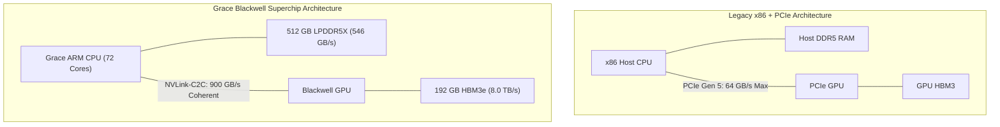
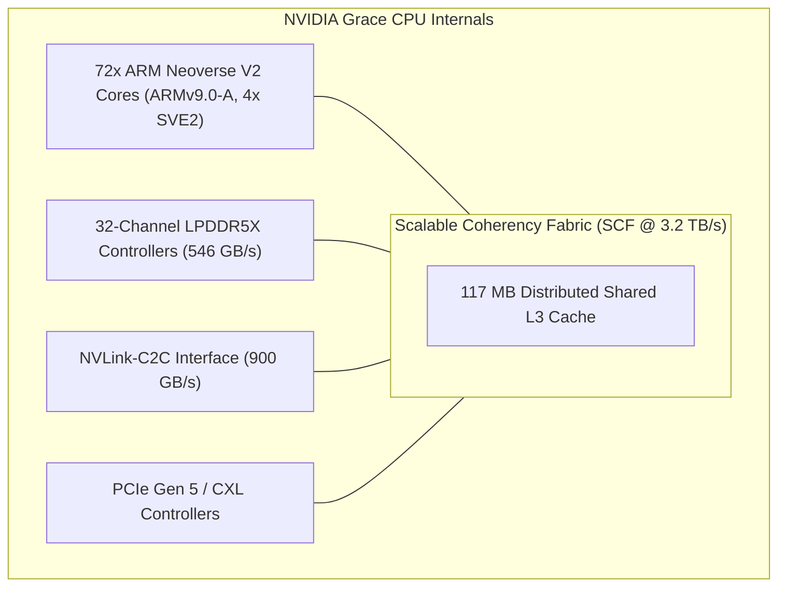
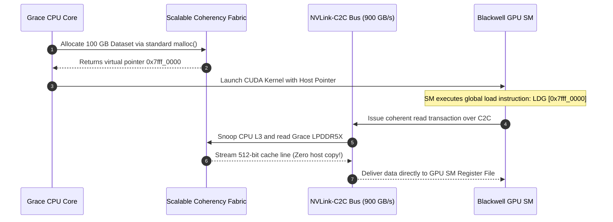

# Volume 05: Host Processors & NVLink-C2C Heterogeneous Superchips

```text
====================================================================================================
MODULE 05: ARM HOST PROCESSORS, SCALABLE COHERENCY FABRICS & NVLINK-C2C
PLATFORMS: GH200 | GB10 (DGX SPARK) | GB200 SUPERCHIP | VERA RUBIN NVL
====================================================================================================
```

For decades, accelerated computing was crippled by the **PCIe host-to-device bottleneck**. High-performance GPUs were tethered to x86 host CPUs over narrow, high-latency PCIe buses operating at 32 to 64 GB/s. Every tensor transfer required explicit staging through host system RAM, locking CPU threads and capping end-to-end pipeline throughput.

The **NVIDIA Grace and Vera CPU architectures** and the **NVLink-C2C (Chip-to-Chip)** interconnect fundamentally eliminate this divide. By physically uniting an enterprise ARM CPU and modern GPU accelerators onto a single coherent substrate with **900 to 1,800 GB/s** of bidirectional bandwidth, NVIDIA created the **Heterogeneous Superchip**. This volume explores the silicon architecture of the Grace and Vera CPUs, the Scalable Coherency Fabric (SCF), the NVLink-C2C physical layer, and how hardware cache coherency unifies memory across CPU and GPU.

---

## 📑 Table of Contents
1. [The PCIe Host Bottleneck & The Superchip Paradigm](#1-the-pcie-host-bottleneck--the-superchip-paradigm)
2. [NVIDIA Grace CPU Architecture Deep Dive](#2-nvidia-grace-cpu-architecture-deep-dive)
3. [NVIDIA Vera CPU & Next-Gen Microarchitecture](#3-nvidia-vera-cpu--next-gen-microarchitecture)
4. [NVLink-C2C: Physical Signaling & Coherency Protocol](#4-nvlink-c2c-physical-signaling--coherency-protocol)
5. [Superchip Topologies: GH200, GB10, GB200 & Vera Rubin NVL](#5-superchip-topologies-gh200-gb10-gb200--vera-rubin-nvl)
6. [Multi-Dimensional Architecture Correlation](#6-multi-dimensional-architecture-correlation)
7. [Hands-On Superchip Topology & Bandwidth Diagnostic Lab](#7-hands-on-superchip-topology--bandwidth-diagnostic-lab)
8. [Practice Exercises & Verification Workbook](#8-practice-exercises--verification-workbook)

---

## 1. The PCIe Host Bottleneck & The Superchip Paradigm

In standard accelerated server architectures (x86 Intel Xeon / AMD EPYC + PCIe GPU):
* **Bandwidth Mismatch**: The GPU memory subsystem operates at **$3.35\text{ to }8.0\text{ TB/s}$**, while the PCIe Gen 5 link connects to the host at a meager **$64\text{ GB/s}$**—a $125\times$ bandwidth disparity.
* **Explicit Copy Penalties**: Memory must be explicitly allocated with `cudaMallocHost()`, copied over PCIe via `cudaMemcpy()`, and synchronized.
* **Lack of Cache Coherency**: If the CPU writes to a pointer while the GPU is executing, data corruption occurs because the hardware lacks cache snooping across the PCIe bus.

```text
TRADITIONAL X86 + PCIE ACCELERATOR VS. GRACE BLACKWELL SUPERCHIP:
┌────────────────────────────────────────────────────────────────────────┐
│ Traditional Server Architecture (PCIe Gen 5 Bottleneck):              │
│ [ x86 Host CPU ] ◄──── PCIe Gen 5 x16 (64 GB/s) ────► [ GPU HBM ]      │
│ (Explicit staging, non-coherent, high driver latency, high energy)     │
├────────────────────────────────────────────────────────────────────────┤
│ NVIDIA Superchip Architecture (NVLink-C2C Unified Coherent Memory):   │
│ [ Grace ARM CPU ] ◄════ NVLink-C2C (900 GB/s) ════► [ Blackwell GPU ]  │
│ (Hardware Cache Coherent, Zero-Copy, Direct Atomics, 5x Energy Eff.)   │
└────────────────────────────────────────────────────────────────────────┘
```



---

## 2. NVIDIA Grace CPU Architecture Deep Dive

The **NVIDIA Grace CPU** is designed from the silicon up to maximize data feed rates into high-bandwidth accelerators:

```text
GRACE CPU ARCHITECTURAL SPECIFICATIONS:
┌─────────────────────────────────────────────────────────────────┐
│ Core Count & Architecture : 72x ARM Neoverse V2 (Demeter) cores │
│ Instruction Set           : ARMv9.0-A 64-bit                    │
│ Pipeline                  : 8-wide superscalar out-of-order     │
│ Vector & Math Units       : 4x 128-bit SVE2 per core + MatMul   │
│ Memory Subsystem          : 32-channel LPDDR5X with ECC         │
│ Memory Bandwidth          : Up to 546 GB/s                      │
│ Memory Capacity           : Up to 480 GB - 512 GB               │
│ On-Chip Interconnect      : Scalable Coherency Fabric (SCF)     │
│ SCF Bisection Bandwidth   : 3.2 TB/s                            │
│ Total L3 Cache            : 117 MB distributed shared cache     │
│ Thermal Design Power (TDP): 250W – 300W per CPU                 │
└─────────────────────────────────────────────────────────────────┘
```



### The Scalable Coherency Fabric (SCF):
The **Scalable Coherency Fabric (SCF)** is a high-bandwidth mesh interconnect connecting the 72 Neoverse V2 cores, memory controllers, and the NVLink-C2C bridge:
* Operates at **$3.2\text{ TB/s}$** bisection bandwidth.
* Implements a distributed cache coherence directory, ensuring that all 72 cores and the connected GPU maintain hardware-enforced consistency across their respective L1/L2/L3 and GPU caches.
* Integrates **117 MB of distributed L3 cache**, dynamically servicing core requests with uniform low latency.

---

## 3. NVIDIA Vera CPU & Next-Gen Microarchitecture

Building upon the Grace foundation, the **NVIDIA Vera CPU** is engineered for the Vera Rubin platform:

```text
+--------------------------------------------------------------------------------------------------+
| HOST PROCESSOR GENERATIONAL EVOLUTION                                                           |
+---------------------+-------------------------------+------------------------------------------+
| Architectural Metric| NVIDIA Grace CPU              | NVIDIA Vera CPU                          |
+---------------------+-------------------------------+------------------------------------------+
| Silicon Lithography | TSMC 4N                       | TSMC 3nm EUV                             |
| Core Architecture   | 72x ARM Neoverse V2 (Demeter) | 88x Custom ARMv9.2+ Olympus Cores        |
| Hardware Threads    | 72 Threads (Single-threaded)  | 176 Threads (Spatial Multithreading)     |
| Memory Technology   | Soldered LPDDR5X (32 channels)| Modular SOCAMM LPDDR5X                   |
| Memory Bandwidth    | 546 GB/s                      | 1,200 GB/s (1.2 TB/s, 2.4x Grace)        |
| Memory Capacity     | Up to 512 GB                  | Up to 1.5 TB                             |
| Host-to-GPU Link    | NVLink-C2C @ 900 GB/s         | NVLink-C2C @ 1,800 GB/s (1.8 TB/s)       |
| Confidential Compute| Core-level TrustZone / CCA    | Full Rack-Scale Hardware Encryption      |
+---------------------+-------------------------------+------------------------------------------+
```

### The SOCAMM Modular Memory Innovation:
While Grace used soldered LPDDR5X packages directly around the CPU to achieve $546\text{ GB/s}$ at low power, **SOCAMM (Small Outline Compression Attached Memory Module)** introduces high-density removable modules. This enables up to **$1.5\text{ TB}$** of high-speed memory per CPU with direct spring-pin compression, providing server serviceability while scaling bandwidth to **$1.2\text{ TB/s}$**.

---

## 4. NVLink-C2C: Physical Signaling & Coherency Protocol

**NVLink-C2C (Chip-to-Chip)** is an ultra-dense, ultra-short-reach physical layer interconnect designed specifically to link dies within the same multi-chip module:

```text
NVLINK-C2C PHYSICAL LAYER SPECIFICATIONS:
┌─────────────────────────────────────────────────────────────────┐
│ Bidirectional Bandwidth : 900 GB/s (Grace-Blackwell)            │
│ Energy Consumption      : ~1.3 pJ / bit (5x lower than PCIe 5)  │
│ Area Efficiency         : High edge-density (wires/mm of die)   │
│ Protocol Support        : Coherent Memory (Direct Atomics)      │
│ Physical Reach          : < 50 mm (within module substrate)     │
└─────────────────────────────────────────────────────────────────┘
```

### Hardware Unified Memory Space:
Because NVLink-C2C maintains hardware cache coherency:
1. **Unified Physical Addressing**: The CPU LPDDR5X and GPU HBM reside in a single continuous 64-bit physical address space.
2. **Zero-Copy Pointer Sharing**: A pointer returned by standard CPU `malloc()` or `mmap()` can be passed directly to a CUDA kernel. The GPU reads and writes the host memory over NVLink-C2C at **$900\text{ GB/s}$**.
3. **Atomic Operations**: The GPU can issue native atomic instructions (`atomicAdd`, `CAS`) directly into host system memory words without CPU interrupts.



---

## 5. Superchip Topologies: GH200, GB10, GB200 & Vera Rubin NVL

```text
+--------------------------------------------------------------------------------------------------+
| SUPERCHIP TOPOLOGICAL CONFIGURATIONS                                                             |
+---------------------+-------------------+---------------------+----------------------------------+
| Configuration       | CPU Composition   | GPU Composition     | Memory Hierarchy                 |
+---------------------+-------------------+---------------------+----------------------------------+
| GH200 Grace Hopper  | 1x Grace (72c)    | 1x Hopper (H100)    | 480GB LPDDR5X + 96GB/144GB HBM3e |
| GB10 (DGX Spark)    | 1x Grace (72c)    | 1x Blackwell (B100) | 128GB Unified Coherent Subsystem |
| GB200 Superchip     | 1x Grace (72c)    | 2x Blackwell (B200) | 480GB LPDDR5X + 384GB HBM3e      |
| Vera Rubin NVL      | 1x Vera (88c)     | 2x Rubin (R100)     | 1.5TB LPDDR5X + 576GB HBM4       |
+---------------------+-------------------+---------------------+----------------------------------+
```

```text
GB200 SUPERCHIP PHYSICAL MODULE TOPOLOGY:
┌────────────────────────────────────────────────────────────────────────┐
│                        GB200 SUPERCHIP BOARD                           │
│                                                                        │
│                 ┌─────────────────────────────────┐                    │
│                 │        NVIDIA Grace CPU         │                    │
│                 │   (72 ARM Cores, 480GB LPDDR5X) │                    │
│                 └────────┬───────────────┬────────┘                    │
│                          │               │                             │
│          NVLink-C2C      │               │     NVLink-C2C              │
│          (900 GB/s)      │               │     (900 GB/s)              │
│                          ▼               ▼                             │
│          ┌───────────────────────┐ ┌───────────────────────┐           │
│          │  Blackwell GPU 0      │ │  Blackwell GPU 1      │           │
│          │  (192GB HBM3e, 8TB/s) │ │  (192GB HBM3e, 8TB/s) │           │
│          └───────────────────────┘ └───────────────────────┘           │
│                          ▲               ▲                             │
│                          └═══════╦═══════┘                             │
│                                  │ NVLink 5 (1.8 TB/s per GPU)         │
│                                  ▼                                     │
│                     To NVSwitch 4 Spine Backplane                      │
└────────────────────────────────────────────────────────────────────────┘
```

---

## 6. Multi-Dimensional Architecture Correlation

```text
+--------------------------------------------------------------------------------------------------+
| MULTI-DIMENSIONAL CORRELATION: HETEROGENEOUS SUPERCHIPS                                          |
+---------------------+----------------------------------------------------------------------------+
| Dimension           | Mechanism & Failure Manifestation                                          |
+---------------------+----------------------------------------------------------------------------+
| Superchip x Power   | Combined thermal envelope of GB200 module reaches 2,700 Watts peak.        |
|                     | Uneven CPU-GPU cooling can cause localized thermal throttling on C2C.      |
| Superchip x Memory  | Over-reliance on Grace LPDDR5X for high-intensity GEMM operations causes   |
|                     | memory bandwidth starvation ($546\text{ GB/s}$ vs. $8.0\text{ TB/s}$ HBM).|
| Superchip x Kernel  | If NUMA auto-balancing is active, the Linux kernel may migrate memory      |
|                     | pages between CPU and GPU uncontrollably, causing severe latency spikes.   |
| Superchip x Network | GPUDirect RDMA can stream data directly from ConnectX SuperNICs into Grace |
|                     | LPDDR5X memory without touching the GPU or involving CPU OS interrupts.   |
+---------------------+----------------------------------------------------------------------------+
```

---

## 7. Hands-On Superchip Topology & Bandwidth Diagnostic Lab

### Lab Objective:
Inspect the ARM CPU topology, verify the physical NVLink-C2C link parameters, query NUMA node distances, and measure unified memory bandwidth.

### Step 1: Interrogate ARM Host CPU Topology
Verify ARM Neoverse V2 cores and vector capabilities using `lscpu`:

```bash
# Check CPU architecture, vector units, and cache topology
lscpu | grep -E "Architecture|Model name|CPU\(s\):|Thread|sve|L3 cache"
```

*Expected Output snippet:*
```text
Architecture:            aarch64
Model name:              Neoverse-V2
CPU(s):                  72
Thread(s) per core:      1
Flags:                   fp asimd evtstrm aes pmull sha1 sha2 crc32 atomics fphp asimdhp cpuid asimdrdm jscvt fcma lrcpc dcpop sha3 sm3 sm4 asimddp sha512 sve asimdfhm dit uscat ilrcpc flagm ssbs sb paca pacg dcpodp flagm2 frint sve2 sveaes sveldrot ...
L3 cache:                117 MiB
```

### Step 2: Inspect NUMA Node Interconnect Distance
Check how the Linux kernel maps the Grace CPU memory and GPU HBM:

```bash
# Display NUMA hardware topology and distance matrix
numactl -H
```

*Expected Output:*
```text
available: 2 nodes (0-1)
node 0 cpus: 0 1 2 ... 71
node 0 size: 483120 MB
node 0 free: 442100 MB
node 1 cpus: (GPU HBM Memory Node)
node 1 size: 131072 MB
node 1 free: 129500 MB
node distances:
node   0   1 
  0:  10  20 
  1:  20  10 
```

### Step 3: Measure NVLink-C2C Host-to-Device Transfer Bandwidth
Run a micro-benchmark testing bidirectional memory copies over NVLink-C2C:

```bash
# Run CUDA bandwidth test across host and device memory
bandwidthTest --memory=pinned --mode=shmoo
```

*Expected Result:*
* Host-to-Device Bandwidth: **$\sim 850\text{ to }880\text{ GB/s}$** (approaching the $900\text{ GB/s}$ theoretical physical limit of NVLink-C2C).

---

## 8. Practice Exercises & Verification Workbook

### Exercise 5.1: NVLink-C2C vs. PCIe Gen 5 LLM Loading Speed
* **Scenario**: An AI inference engine boots and must load a $400\text{ GB}$ LLM checkpoint from host system memory into GPU memory.
* **Task**: Calculate the theoretical minimum time required to transfer the model over:
  1. Standard PCIe Gen 5 x16 link ($64.0\text{ GB/s}$ theoretical, assume $90\%$ bus efficiency).
  2. NVLink-C2C link ($900.0\text{ GB/s}$ theoretical, assume $92\%$ bus efficiency).
* **Solution**:
  1. *PCIe Gen 5*:
     $$\text{Effective Bandwidth} = 64.0 \times 0.90 = 57.6 \text{ GB/s}$$
     $$T_{\text{PCIe}} = \frac{400.0 \text{ GB}}{57.6 \text{ GB/s}} = 6.944 \text{ seconds}$$
  2. *NVLink-C2C*:
     $$\text{Effective Bandwidth} = 900.0 \times 0.92 = 828.0 \text{ GB/s}$$
     $$T_{\text{C2C}} = \frac{400.0 \text{ GB}}{828.0 \text{ GB/s}} = 0.483 \text{ seconds}$$
  *Result*: NVLink-C2C loads the $400\text{ GB}$ model in **under half a second**, achieving a **$14.3\times$ speedup** over PCIe Gen 5.

### Exercise 5.2: Memory Coherency Energy Math
* **Scenario**: A distributed training pipeline transfers $100\text{ Terabytes}$ of activation and gradient data between host CPU RAM and GPU memory over an 8-hour period.
* **Task**: Calculate the total electrical energy consumed by the data transfers under standard PCIe Gen 5 ($7.0\text{ pJ/bit}$) vs. NVLink-C2C ($1.3\text{ pJ/bit}$).
* **Solution**:
  1. *Total Bits Transferred*:
     $$\text{Total Bits} = 100 \times 10^{12} \text{ Bytes} \times 8 \text{ bits/Byte} = 8.0 \times 10^{14} \text{ bits}$$
  2. *Energy Consumption*:
     $$E_{\text{PCIe}} = 8.0 \times 10^{14} \times 7.0 \times 10^{-12} \text{ Joules} = 5,600 \text{ Joules}$$
     $$E_{\text{C2C}} = 8.0 \times 10^{14} \times 1.3 \times 10^{-12} \text{ Joules} = 1,040 \text{ Joules}$$
  *Result*: NVLink-C2C saves **$4,560\text{ Joules}$** ($81.4\%$ energy reduction), preventing module thermal saturation.

---

## 📌 Summary Checklist: What You Have Mastered
- [x] The PCIe bottleneck ($64\text{ GB/s}$) and the architecture of the unified heterogeneous superchip.
- [x] NVIDIA Grace CPU Neoverse V2 cores, 4x SVE2 units, and the 3.2 TB/s Scalable Coherency Fabric (SCF).
- [x] NVIDIA Vera CPU Olympus architecture, SOCAMM memory, and 1.2 TB/s memory bandwidth.
- [x] NVLink-C2C signaling layer, 900 GB/s bidirectional throughput, and hardware cache coherency.
- [x] GH200, GB10, and GB200 physical module topologies and power profiles.
- [x] Inspecting ARM CPU features, NUMA distance, and measuring C2C bandwidth with `bandwidthTest`.
