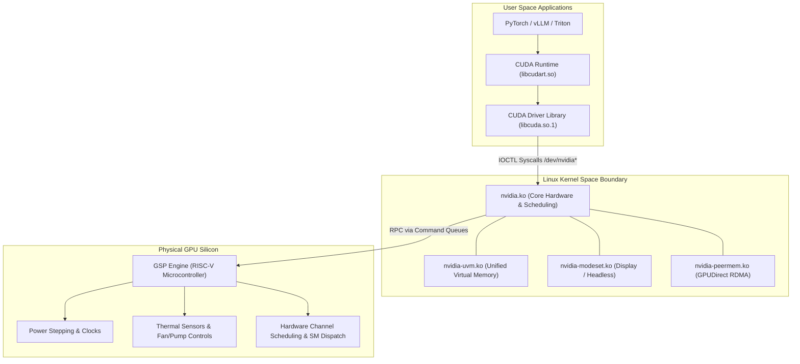
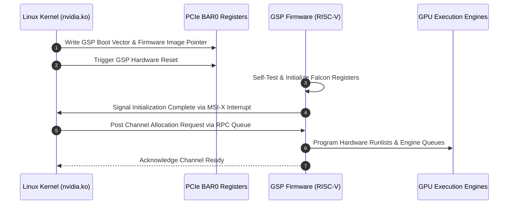
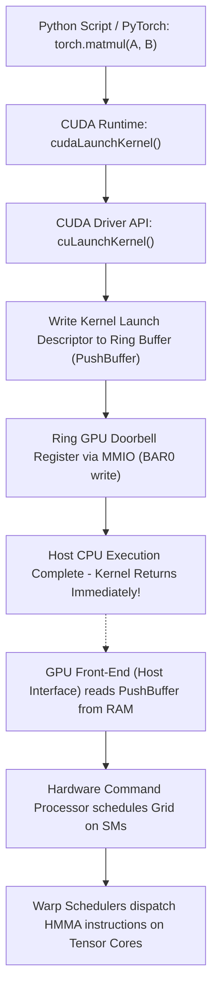

# Volume 06: Open GPU Kernel Drivers (nvidia.ko) & GSP Firmware

```text
====================================================================================================
MODULE 06: LINUX KERNEL MODULE SUBSYSTEM, IOCTL INTERFACES & GSP FIRMWARE
PLATFORMS: DATA CENTER LINUX | NVIDIA HOPPER | BLACKWELL | VERA RUBIN
====================================================================================================
```

Modern NVIDIA GPUs in production data centers do not communicate with the Linux operating system as simple peripheral devices. Instead, they operate as autonomous compute subsystems controlled by open-source kernel modules, user-space driver interfaces, and an embedded RISC-V co-processor running **GSP (GPU System Processor)** firmware.

Understanding the kernel boundary is essential for diagnosing low-level driver hangs, PCIe register corruption, memory allocation stalls, and system-level panics. This volume explores the internal architecture of **`nvidia.ko`**, the IOCTL system call interface, Base Address Register (BAR) memory mappings, and the GSP firmware execution loop.

---

## 📑 Table of Contents
1. [The Linux Kernel Driver Architecture: Open vs. Proprietary](#1-the-linux-kernel-driver-architecture-open-vs-proprietary)
2. [Kernel Module Topology: nvidia.ko & nvidia-modeset.ko](#2-kernel-module-topology-nvidiako--nvidia-modesetko)
3. [GSP (GPU System Processor): The Embedded RISC-V Co-Processor](#3-gsp-gpu-system-processor-the-embedded-risc-v-co-processor)
4. [PCIe Base Address Registers (BAR0 & BAR1) & IOCTL Interfaces](#4-pcie-base-address-registers-bar0--bar1--ioctl-interfaces)
5. [The Lifecycle of a CUDA Command: User Space to Silicon](#5-the-lifecycle-of-a-cuda-command-user-space-to-silicon)
6. [Multi-Dimensional Architecture Correlation](#6-multi-dimensional-architecture-correlation)
7. [Hands-On Kernel Driver & GSP Firmware Diagnostic Lab](#7-hands-on-kernel-driver--gsp-firmware-diagnostic-lab)
8. [Practice Exercises & Verification Workbook](#8-practice-exercises--verification-workbook)

---

## 1. The Linux Kernel Driver Architecture: Open vs. Proprietary

NVIDIA transitioned its data center GPU driver stack to the **NVIDIA Open GPU Kernel Modules** (starting with R515, fully standard on R535, R550, and R570+):

```text
+--------------------------------------------------------------------------------------------------+
| DRIVER ARCHITECTURAL COMPARISON: LEGACY VS. MODERN OPEN KERNEL                                    |
+---------------------+-------------------------------+------------------------------------------+
| Feature             | Legacy Proprietary Driver     | Open GPU Kernel Modules (Modern Standard)|
+---------------------+-------------------------------+------------------------------------------+
| License             | Proprietary Binary Blob       | Dual MIT / GPLv2 Open Source             |
| Kernel Source Code  | Closed-source binary wrapper  | Fully public upstream C source code      |
| Hardware Offload    | Host CPU ran power/clocks/init| Offloaded to on-chip GSP RISC-V firmware |
| Kernel Footprint    | Monolithic host execution     | Lightweight shim translating to GSP RPCs |
| Distribution        | `.run` proprietary installer  | In-tree DKMS, upstream Linux packages    |
| Primary Silicon     | Kepler, Maxwell, Pascal, Volta| Turing, Ampere, Hopper, Blackwell, Rubin |
+---------------------+-------------------------------+------------------------------------------+
```



---

## 2. Kernel Module Topology: nvidia.ko & nvidia-modeset.ko

The kernel driver stack is modularized into dedicated `.ko` (kernel object) files:

1. **`nvidia.ko` (Core Driver)**:
   * Discovers GPU silicon during PCIe enumeration (`pci_register_driver`).
   * Maps physical device memory into host kernel virtual address space via **BAR0** and **BAR1**.
   * Creates character device nodes in `/dev`:
     * `/dev/nvidiactl`: Control device for system-wide configuration, enumeration, and discovery.
     * `/dev/nvidia0` to `/dev/nvidiaN`: Per-GPU communication nodes for hardware channels.
   * Manages interrupt service routines (MSI-X interrupts) and hardware command submissions.

2. **`nvidia-modeset.ko`**:
   * Responsible for display timing and presentation.
   * On headless enterprise data center servers (e.g., DGX H100, B200, GB200), `nvidia-modeset` operates in headless mode, managing low-level resource cleanups.

3. **`nvidia-uvm.ko` & `nvidia-peermem.ko`**:
   * `nvidia-uvm.ko`: Manages the Unified Virtual Memory page table mirror and hardware fault handlers.
   * `nvidia-peermem.ko`: Direct verbs layer bridging Mellanox InfiniBand/RoCE HCAs directly into GPU memory without host CPU pinning.

---

## 3. GSP (GPU System Processor): The Embedded RISC-V Co-Processor

In modern GPUs (Turing, Ampere, Hopper, Blackwell, and Rubin), NVIDIA embedded a dedicated physical microcontroller directly onto the GPU die: the **GSP (GPU System Processor)**.

```text
GSP SYSTEM ARCHITECTURE:
┌──────────────────────────────────────────────────────────────┐
│ Processor Architecture  : 64-bit RISC-V Co-Processor         │
│ Memory Subsystem        : Dedicated Falcon/RISC-V SRAM Cache │
│ Firmware Location       : Stored in `/lib/firmware/nvidia/`  │
│ Boot Sequence           : Loaded into GPU RAM on driver init │
│ Communication Protocol  : Shared-memory RPC Message Queues   │
└──────────────────────────────────────────────────────────────┘
```

### Why GSP Was Introduced:
* **Host CPU Offload**: Previously, the host x86/ARM CPU had to handle power management, clock frequency stepping, thermal regulation, and engine initialization via thousands of kernel interrupts.
* **Low-Latency Control**: By placing control logic directly on the GPU die, the GSP reacts to microsecond-scale thermal and current fluctuations locally without traversing the PCIe/C2C bus.
* **Kernel Stability**: Complex proprietary driver logic is shifted out of the Linux kernel address space into GSP firmware, reducing host kernel panic risks.



---

## 4. PCIe Base Address Registers (BAR0 & BAR1) & IOCTL Interfaces

Communication between the host kernel and GPU silicon relies on **Base Address Registers (BARs)**:

```text
+--------------------------------------------------------------------------------------------------+
| GPU PCI BASE ADDRESS REGISTER (BAR) ALLOCATION                                                   |
+---------------------+-----------------------+----------------------------------------------------+
| Register            | Typical Size          | Purpose & Memory Mapping                           |
+---------------------+-----------------------+----------------------------------------------------+
| BAR0                | 16 MB - 32 MB         | MMIO (Memory-Mapped I/O) Control Registers. Maps   |
|                     |                       | GPU hardware registers, GSP queues, and PLL clocks.|
| BAR1 (Aperture)     | 256 MB (Legacy) up to | Physical GPU Framebuffer (HBM) aperture. With     |
|                     | Full HBM Size (BAR1)  | Resizable BAR (ReBAR), maps full HBM into host space|
| BAR2 / BAR3         | 32 MB                 | Secondary I/O registers and MSI-X interrupt tables.|
+---------------------+-----------------------+----------------------------------------------------+
```

### The IOCTL System Call Protocol:
When a user-space application allocates memory or submits work, `libcuda.so.1` issues `ioctl()` syscalls to `/dev/nvidia*`:

```c
// Example: Conceptual user-space invocation into nvidia.ko
int fd = open("/dev/nvidia0", O_RDWR);
struct nv_ioctl_alloc_memory args = {
    .size = 1024 * 1024 * 1024, // 1 GB
    .flags = NV_MEM_TARGET_HBM
};
ioctl(fd, NV_IOCTL_MAGIC_ALLOC, &args);
```

The kernel module validates credentials, allocates physical memory blocks via the GSP firmware, updates page tables, and returns a mapped virtual address to the application.

---

## 5. The Lifecycle of a CUDA Command: User Space to Silicon



Notice that **kernel launch is completely non-blocking**:
The CPU simply writes the launch descriptor into a mapped ring buffer (**PushBuffer**) in system memory, writes a single 32-bit integer to the GPU's hardware **Doorbell Register** via BAR0 MMIO, and returns immediately to user code. The GPU hardware engine processes the queue autonomously.

---

## 6. Multi-Dimensional Architecture Correlation

```text
+--------------------------------------------------------------------------------------------------+
| MULTI-DIMENSIONAL CORRELATION: KERNEL DRIVERS & FIRMWARE                                         |
+---------------------+----------------------------------------------------------------------------+
| Dimension           | Mechanism & Failure Manifestation                                          |
+---------------------+----------------------------------------------------------------------------+
| Driver x Thermal    | If direct liquid cooling fails, GSP firmware initiates hardware thermal     |
|                     | micro-throttling; if threshold is exceeded, GSP issues emergency shutdown. |
| Driver x Memory     | Memory fragmentation inside `nvidia.ko` allocation tables can cause CUDA   |
|                     | out-of-memory errors even when gross free HBM capacity appears available.  |
| Driver x SRE        | A hung CUDA kernel that fails to yield triggers the host Watchdog timer,   |
|                     | resulting in driver resets and Linux kernel XID 43 errors.                 |
| Driver x GSP        | If GSP firmware hangs or hits a microcode crash, the host kernel registers |
|                     | XID 62/119, dropping the GPU offline until a full host reboot occurs.     |
+---------------------+----------------------------------------------------------------------------+
```

---

## 7. Hands-On Kernel Driver & GSP Firmware Diagnostic Lab

### Lab Objective:
Inspect loaded kernel modules, verify GSP firmware operational status, analyze BAR memory apertures, and inspect device character nodes.

### Step 1: Inspect Loaded NVIDIA Kernel Modules
Verify module versions and dependencies using `lsmod` and `modinfo`:

```bash
# List all active NVIDIA kernel modules
lsmod | grep -E "nvidia|uvm|peermem"

# Inspect detailed metadata of core module
modinfo nvidia | grep -E "filename|version|license|description"
```

*Expected Output:*
```text
filename:       /lib/modules/.../kernel/drivers/video/nvidia.ko
license:        Dual MIT/GPL
version:        570.86.10
description:    NVIDIA Open UNIX Kernel Module
```

### Step 2: Verify GSP Firmware Activation in Kernel Logs
Check `dmesg` to confirm that GSP firmware initialized successfully:

```bash
# Verify GSP firmware boot and communication
sudo dmesg -T | grep -i "GSP"
```

*Expected Output:*
```text
[Mon Sep 28 05:40:12 2026] NVRM: Loading GSP-RM firmware version 570.86.10...
[Mon Sep 28 05:40:13 2026] NVRM: GSP firmware initialization succeeded.
[Mon Sep 28 05:40:13 2026] NVRM: GPU 0000:0f:00.0: GSP-RM RPC channels initialized.
```

### Step 3: Inspect BAR0 and BAR1 Physical Memory Apertures
Interrogate PCIe configuration registers to check Resizable BAR (ReBAR) status:

```bash
# Locate GPU PCI slot
GPU_ADDR=$(lspci -d 10de: | head -n 1 | awk '{print $1}')

# Check BAR0 (MMIO) and BAR1 (Aperture) sizes
sudo lspci -vvv -s ${GPU_ADDR} | grep -E "Region 0:|Region 1:"
```

*Expected Output (with Full Resizable BAR enabled):*
```text
Region 0: Memory at 90000000 (32-bit, non-prefetchable) [size=16M]
Region 1: Memory at 380000000000 (64-bit, prefetchable) [size=128G]
```
*(Notice that Region 1 is 128G—the full physical HBM size is directly addressable by the host!)*

---

## 8. Practice Exercises & Verification Workbook

### Exercise 6.1: GSP RPC Latency Math
* **Scenario**: A host application issues 10,000 memory allocation calls sequentially. In legacy proprietary drivers without GSP, each allocation incurred a $15\ \mu\text{s}$ CPU interrupt trap. With GSP firmware, allocations use shared-memory RPC queues requiring $2.5\ \mu\text{s}$.
* **Task**: Calculate the total CPU time spent on allocations under both architectures.
* **Solution**:
  1. *Legacy Driver Time*:
     $$T_{\text{legacy}} = 10,000 \times 15 \times 10^{-6} \text{ s} = 0.15 \text{ seconds} = 150 \text{ ms}$$
  2. *GSP Firmware Time*:
     $$T_{\text{GSP}} = 10,000 \times 2.5 \times 10^{-6} \text{ s} = 0.025 \text{ seconds} = 25 \text{ ms}$$
  *Result*: GSP firmware reduces host allocation overhead by **$6\times$**, saving $125\text{ ms}$ of blocking CPU latency.

### Exercise 6.2: Resizable BAR Memory Bandwidth
* **Scenario**: A server has Resizable BAR disabled. The BAR1 aperture is locked to the legacy default of $256\text{ MB}$. A CPU thread wants to map a $16\text{ GB}$ dataset directly into GPU memory.
* **Task**: Determine how many times the driver must re-program the PCIe BAR1 page table registers to stage the full dataset.
* **Solution**:
  $$\text{Window Reprogrammings} = \frac{\text{Dataset Size}}{\text{BAR1 Window Size}} = \frac{16 \times 1024 \text{ MB}}{256 \text{ MB}} = 64 \text{ cycles}$$
  *Result*: The driver must rewrite BAR1 registers 64 times, causing massive CPU context-switch latency. Enabling Full ReBAR allows the entire $16\text{ GB}$ (and beyond) to be mapped in a single transaction with zero window shifts.

---

## 📌 Summary Checklist: What You Have Mastered
- [x] NVIDIA Open GPU Kernel Modules vs. Legacy proprietary drivers.
- [x] The roles of `nvidia.ko`, `nvidia-modeset.ko`, and `/dev/nvidia*` character nodes.
- [x] The on-chip GSP (GPU System Processor) RISC-V microcontroller architecture and RPC loops.
- [x] PCIe BAR0 (MMIO) and BAR1 (Framebuffer) memory apertures and Resizable BAR (ReBAR).
- [x] The non-blocking lifecycle of a CUDA command submission via PushBuffers and Doorbell registers.
