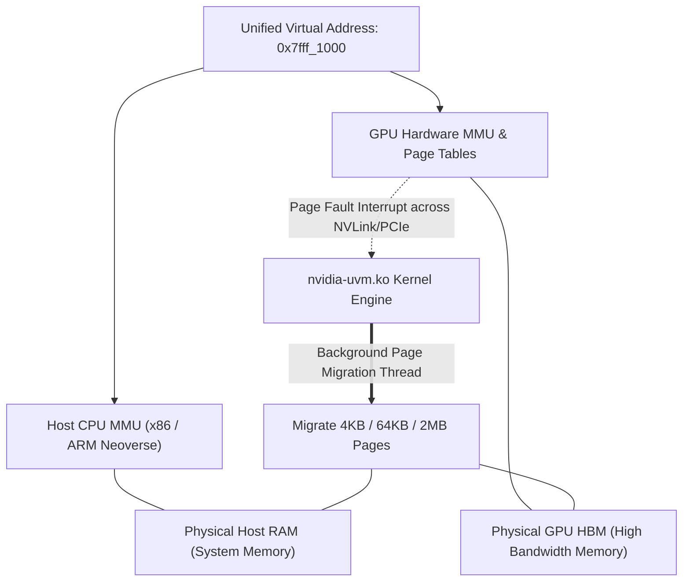

# Volume 07: Unified Virtual Memory (UVM), ATS & Hardware Page Faults

```text
====================================================================================================
MODULE 07: UNIFIED VIRTUAL MEMORY (UVM), HARDWARE PAGE FAULTS & ATS/PASID
PLATFORMS: DATA CENTER LINUX | NVIDIA HOPPER | BLACKWELL | VERA RUBIN
====================================================================================================
```

Unified Virtual Memory (UVM) is the fundamental memory virtualization layer that bridges physical host memory (DDR5/LPDDR5X) and accelerator memory (HBM) into a **single, coherent 64-bit virtual address space**. 

While UVM simplifies programming by allowing CPU and GPU threads to access the same pointers (`cudaMallocManaged` or standard system `malloc` via HMM), improper memory staging triggers **hardware page faults, TLB invalidation storms, and bus thrashing**, degrading kernel performance by orders of magnitude. This volume analyzes the internal architecture of **`nvidia-uvm.ko`**, the hardware page fault engine, **Address Translation Services (ATS / PASID)**, and how to eliminate page fault latency.

---

## 📑 Table of Contents
1. [The Architecture of Unified Virtual Memory (UVM)](#1-the-architecture-of-unified-virtual-memory-uvm)
2. [The nvidia-uvm.ko Kernel Module Internals](#2-the-nvidia-uvmko-kernel-module-internals)
3. [The Hardware Page Fault Lifecycle: Step-by-Step](#3-the-hardware-page-fault-lifecycle-step-by-step)
4. [Heterogeneous Memory Management (HMM) & ATS/PASID](#4-heterogeneous-memory-management-hmm--atspasid)
5. [Page Thrashing Mechanics & Memory Overcommit](#5-page-thrashing-mechanics--memory-overcommit)
6. [Multi-Dimensional Architecture Correlation](#6-multi-dimensional-architecture-correlation)
7. [Hands-On UVM Page Fault Profiling & Diagnostics Lab](#7-hands-on-uvm-page-fault-profiling--diagnostics-lab)
8. [Practice Exercises & Verification Workbook](#8-practice-exercises--verification-workbook)

---

## 1. The Architecture of Unified Virtual Memory (UVM)

Before UVM, the host and GPU maintained completely disjoint physical and virtual address spaces:

```text
+--------------------------------------------------------------------------------------------------+
| DISJOINT MEMORY SPACES VS. UNIFIED VIRTUAL MEMORY (UVM)                                          |
+--------------------------------------------------------------------------------------------------+
|                                                                                                  |
| [ Legacy Disjoint Architecture ]              [ Unified Virtual Memory (UVM) Architecture ]      |
|                                                                                                  |
|   Host CPU Virtual Address Space                  Single 64-Bit Unified Virtual Address Space    |
|   ┌─────────────────────────────┐                 ┌──────────────────────────────────────────┐   |
|   │ Pointer: 0x7fff_1000        │                 │ Unified Virtual Pointer: 0x7fff_1000     │   |
|   └──────────────┬──────────────┘                 └────────────────────┬─────────────────────┘   |
|                  │ (Explicit cudaMemcpy)                               │                         |
|   GPU Device Virtual Address Space                                     ├──────────────┐          |
|   ┌─────────────────────────────┐                                      ▼              ▼          |
|   │ Pointer: 0x0000_8000        │                              Physical CPU RAM   Physical GPU   |
|   └─────────────────────────────┘                              (Host LPDDR5X)     (Device HBM)   |
|                                                                                                  |
+--------------------------------------------------------------------------------------------------+
```



---

## 2. The nvidia-uvm.ko Kernel Module Internals

The **`nvidia-uvm.ko`** driver module manages address mappings, hardware interrupts, and migration threads:

```text
NVIDIA-UVM.KO INTERNAL SUBSYSTEMS:
┌─────────────────────────────────────────────────────────────────┐
│ 1. Fault Handling Engine    : Catches GPU hardware page faults  │
│ 2. Page Table Synchronizer  : Mirrors OS MMU state to GPU MMU   │
│ 3. Migration Scheduler      : Queues async DMA transfer engines │
│ 4. Eviction Manager         : Swaps cold HBM pages to host RAM  │
│ 5. Coherency Protocol Engine: Enforces CPU-GPU cache consistency│
└─────────────────────────────────────────────────────────────────┘
```

When an application invokes `cudaMallocManaged(&ptr, size)`:
1. `nvidia-uvm.ko` reserves virtual address space in the calling process's page table.
2. **No physical memory is initially allocated in GPU HBM** (lazy allocation).
3. The page table entry (PTE) is marked as non-present for the GPU.

---

## 3. The Hardware Page Fault Lifecycle: Step-by-Step

When a GPU thread executes a global load instruction (`LDG`) targeting an unmapped or host-resident managed address, the hardware triggers a **Demand Page Fault**:

```mermaid
sequenceDiagram
    autonumber
    participant SM as SM Execution Warp
    participant GMMU as GPU MMU & TLB
    participant PF_Queue as Hardware Page Fault Buffer
    participant UVM as nvidia-uvm.ko Kernel Daemon
    participant DMA as Copy Engine (CE) / NVLink
    participant HBM as GPU HBM Framebuffer

    SM->>GMMU: Execute LDG [0x7fff_1000]
    GMMU->>GMMU: TLB Miss & Page Table Walk
    Note over GMMU: Page marked NOT_PRESENT in GPU HBM!
    GMMU->>PF_Queue: Push Hardware Page Fault Entry (Address, Channel, SM ID)
    GMMU-->>SM: Put Requesting Warp into STALL State (stall_memory_throttle)
    PF_Queue->>UVM: Assert MSI-X Interrupt to Host Kernel
    UVM->>UVM: Read Fault Buffer & Locate Physical Host Page
    UVM->>HBM: Allocate 4KB / 64KB Physical Page in GPU HBM
    UVM->>DMA: Program DMA Copy from Host RAM -> GPU HBM
    DMA-->>HBM: Transfer Page over NVLink / PCIe
    UVM->>GMMU: Update GPU Page Table Entry (PTE = Valid) & Flush TLB
    UVM->>PF_Queue: Clear Fault Entry
    GMMU-->>SM: Wake Stalled Warp; Re-issue Memory Instruction
```

### The Cost of a Page Fault:
* Standard HBM read latency: **$\sim 250\text{ nanoseconds}$**.
* Hardware Page Fault handling latency (servicing interrupt, host OS scheduling, DMA copy, and TLB flush): **$\sim 15\text{ to }45\text{ microseconds}$** ($100\times$ slower!).
* If millions of threads fault simultaneously, the hardware fault buffer overflows, causing a **Page Fault Storm** that stalls the entire GPU.

---

## 4. Heterogeneous Memory Management (HMM) & ATS/PASID

In modern Linux kernels (Linux 6.x+) and Grace/Vera platforms, UVM is supercharged by **HMM (Heterogeneous Memory Management)** and **ATS (Address Translation Services)**:

```text
+--------------------------------------------------------------------------------------------------+
| MANAGED MEMORY VS. SYSTEM-ALLOCATED HMM                                                          |
+---------------------+-------------------------------+------------------------------------------+
| Feature             | Managed Memory (cudaMallocManaged) | Heterogeneous Memory Management (HMM)   |
+---------------------+-------------------------------+------------------------------------------+
| Allocation API      | Requires `cudaMallocManaged()`| Standard C `malloc()`, C++ `new`, `mmap()`|
| Third-Party Libs    | Incompatible without refactor | Fully transparent; works with any pointer|
| Address Translation | Software mirrored page tables | Hardware ATS/PASID PCIe/C2C coherency    |
| Kernel Subsystem    | Custom `nvidia-uvm.ko` pools  | Linux upstream core MMU subsystem        |
+---------------------+-------------------------------+------------------------------------------+
```

### PCIe Address Translation Services (ATS) & PASID:
* **PASID (Process Address Space ID)**: A PCIe header tag that uniquely identifies the virtual address space of a process across the bus.
* **ATS (Address Translation Services)**: Allows the GPU's memory management unit to send virtual address translation requests directly to the host CPU's IOMMU over PCIe/NVLink-C2C. The GPU caches translations in its internal **ATC (Address Translation Cache)**, eliminating kernel driver intervention.

---

## 5. Page Thrashing Mechanics & Memory Overcommit

**Memory Overcommit** allows an application to allocate more memory than physically exists in GPU HBM (e.g., allocating a $150\text{ GB}$ dataset on an $80\text{ GB}$ GPU). 

However, if the active working set of a kernel exceeds physical HBM, **Page Thrashing** occurs:

```text
PAGE THRASHING RECURRENCE LOOP:
┌────────────────────────────────────────────────────────────────────────┐
│ 1. Kernel reads Block A ────► Faults ────► UVM migrates Block A to HBM │
│ 2. HBM is full          ────► Eviction ──► UVM evicts Block B to Host  │
│ 3. Kernel reads Block B ────► Faults ────► UVM migrates Block B to HBM │
│ 4. HBM is full          ────► Eviction ──► UVM evicts Block A to Host  │
│ 5. REPEAT INFINITELY    ────► Bus 100% saturated with copies; 0% Compute│
└────────────────────────────────────────────────────────────────────────┘
```

### Eliminating Fault Latency via Asynchronous Prefetching:
Developers can eliminate demand page faults by instructing the driver to stream pages into HBM *before* kernel launch:

```c
// Pre-stream managed memory into GPU HBM asynchronously
cudaMemPrefetchAsync(ptr, data_size, target_gpu_id, stream);

// Advise the UVM driver that data is predominantly read-only
cudaMemAdvise(ptr, data_size, cudaMemAdviseSetReadMostly, target_gpu_id);
```

---

## 6. Multi-Dimensional Architecture Correlation

```text
+--------------------------------------------------------------------------------------------------+
| MULTI-DIMENSIONAL CORRELATION: UNIFIED VIRTUAL MEMORY                                            |
+---------------------+----------------------------------------------------------------------------+
| Dimension           | Mechanism & Failure Manifestation                                          |
+---------------------+----------------------------------------------------------------------------+
| UVM x Interconnect  | Page thrashing saturates NVLink-C2C or PCIe bandwidth, starving concurrent |
|                     | GPUDirect RDMA network operations across the cluster.                      |
| UVM x Kernel        | Accessing an unmapped page or a freed pointer triggers an unrecoverable   |
|                     | page fault, causing the driver to emit Linux kernel **XID 31**.            |
| UVM x SRE           | If the host kernel OOM killer terminates a process during active migration,|
|                     | incomplete DMA descriptors can cause GPU driver channel hangs (XID 43).    |
| UVM x Profiler      | High UVM activity appears in Nsight Systems as long, continuous blocks of  |
|                     | `Unified Memory Memcpy HtoD` and `GPU Page Faults` preceding kernel bars.  |
+---------------------+----------------------------------------------------------------------------+
```

---

## 7. Hands-On UVM Page Fault Profiling & Diagnostics Lab

### Lab Objective:
Compile a managed memory program, capture real-time UVM page fault events, identify page migrations in Nsight Systems (`nsys`), and inspect UVM driver statistics.

### Step 1: Write a Managed Memory Test Application
Create a program that intentionally triggers demand page faults:

```bash
cat << 'EOF' > uvm_test.cu
#include <cuda_runtime.h>
#include <stdio.h>

__global__ void access_kernel(int *data, int N) {
    int idx = blockIdx.x * blockDim.x + threadIdx.x;
    if (idx < N) {
        data[idx] += 1;
    }
}

int main() {
    int N = 10000000;
    size_t size = N * sizeof(int);
    int *data;

    // Allocate Managed Memory (UVM)
    cudaMallocManaged(&data, size);

    // Initialize on CPU (Pages allocated in host RAM)
    for (int i = 0; i < N; i++) data[i] = i;

    // Launch kernel on GPU WITHOUT prefetching (Triggers Demand Page Faults!)
    access_kernel<<<(N + 255) / 255, 255>>>(data, N);
    cudaDeviceSynchronize();

    printf("Execution complete.\n");
    cudaFree(data);
    return 0;
}
EOF

nvcc -O3 uvm_test.cu -o uvm_test.bin
```

### Step 2: Trace UVM Page Faults and Migrations with Nsight Systems
Profile the binary to capture exact fault timestamps and byte migrations:

```bash
# Capture CUDA runtime and UVM page fault events
nsys profile --trace=cuda,uvm --output=uvm_profile_report ./uvm_test.bin
```

*Expected Profiler Analysis:*
* Open `uvm_profile_report.nsys-rep` in Nsight Systems or inspect CLI text export.
* You will observe hundreds of `GPU Page Fault` events immediately after kernel start, followed by `CPU-to-GPU Memory Migration` transfers on the timeline.

### Step 3: Inspect UVM Kernel Driver Counters
Inspect the Linux kernel's active UVM counters:

```bash
# Query active UVM memory allocation counters
cat /proc/driver/nvidia-uvm/stats 2>/dev/null || echo "UVM stats queried via DCGM."

# Profile active page fault rate using DCGM
dcgmi profile --pause
dcgmi profile -e 100,101 -s 1000
```

---

## 8. Practice Exercises & Verification Workbook

### Exercise 7.1: Page Fault Penalty Quantification
* **Scenario**: A CUDA kernel accesses a $4\text{ GB}$ array ($1,048,576\text{ pages}$ of size $4\text{ KB}$). 
  * Under demand paging, each page fault requires an average of $20\ \mu\text{s}$ to service.
  * Under explicit asynchronous prefetching (`cudaMemPrefetchAsync`), the entire $4\text{ GB}$ moves over NVLink-C2C ($900\text{ GB/s}$) in a single bulk DMA burst.
* **Task**: Calculate the total migration latency under demand paging vs. bulk prefetching.
* **Solution**:
  1. *Demand Paging Latency (Serialized Page Faults)*:
     $$T_{\text{demand}} = 1,048,576 \text{ faults} \times 20 \times 10^{-6} \text{ s} \approx 20.97 \text{ seconds}$$
  2. *Bulk Prefetch Latency over NVLink-C2C*:
     $$T_{\text{prefetch}} = \frac{4.0 \text{ GB}}{900.0 \text{ GB/s}} = 0.00444 \text{ seconds} \approx 4.44 \text{ ms}$$
  *Result*: Bulk prefetching is **$4,700\times$ faster**, reducing data transfer time from $\approx 21\text{ seconds}$ to just $4.4\text{ ms}$.

### Exercise 7.2: Deciphering Kernel XID 31
* **Scenario**: A machine learning engineer observes the following line in `/var/log/syslog`:
  ```text
  NVRM: Xid (PCI:0000:0f:00): 31, pid='14201', name='python', GPU Page Fault at 0x7fff4000 on SM 12.
  ```
* **Task**: Explain the root cause of this error and state the exact CLI command to pinpoint the culpable line of source code.
* **Solution**:
  * **Root Cause**: XID 31 indicates an illegal memory access where an SM thread attempted to dereference a virtual address (`0x7fff4000`) that was either unmapped, out of bounds, or not registered with `nvidia-uvm.ko`.
  * **Diagnosis Command**:
    ```bash
    compute-sanitizer --tool memcheck python train.py
    ```
    This tool intercepts the exact instruction and outputs the thread ID, block ID, kernel name, and line of code that triggered the fault.

---

## 📌 Summary Checklist: What You Have Mastered
- [x] Unified Virtual Memory (UVM) single 64-bit address space architecture.
- [x] The `nvidia-uvm.ko` kernel driver and its migration/eviction scheduling loops.
- [x] The step-by-step lifecycle of a GPU hardware demand page fault.
- [x] Heterogeneous Memory Management (HMM), ATS, and PCIe PASID hardware translation.
- [x] Page thrashing mechanics and how to eliminate it using `cudaMemPrefetchAsync()`.
- [x] Profiling UVM migrations with `nsys` and diagnosing XID 31 kernel page faults.
