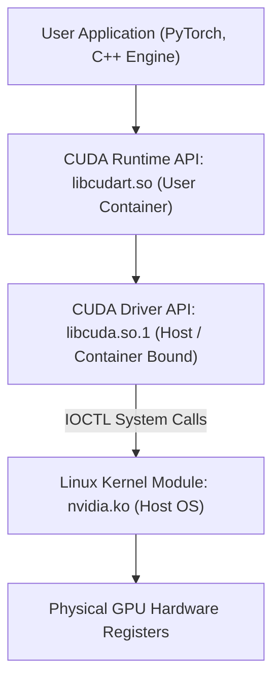
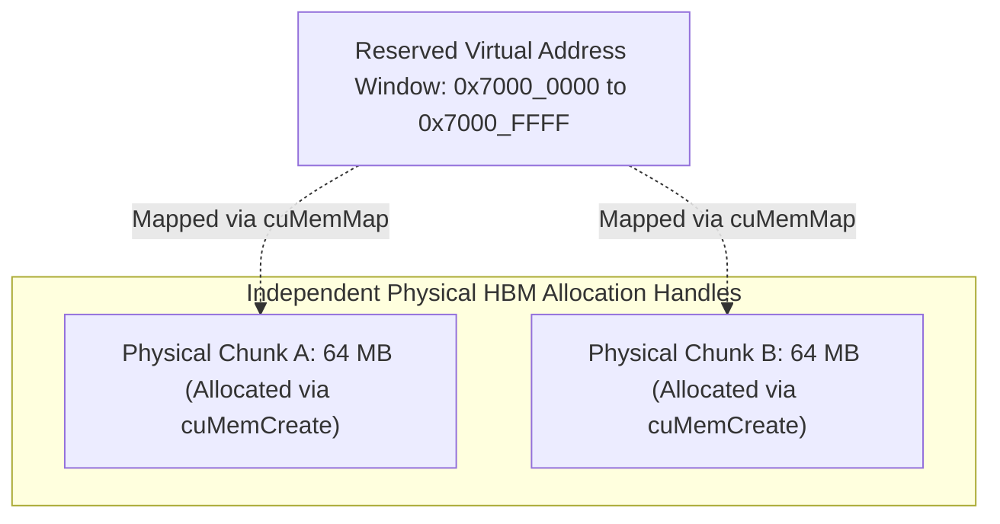
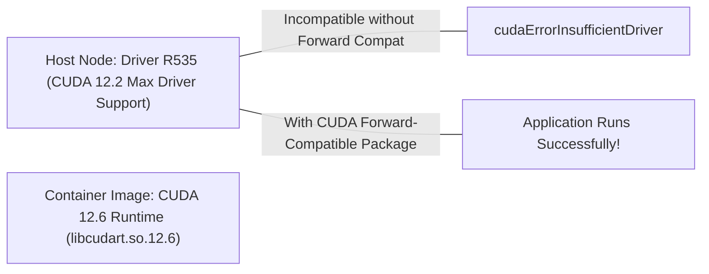

# Volume 08: CUDA Driver API vs. Runtime API Execution Lifecycles

```text
====================================================================================================
MODULE 08: DRIVER API (LIBCUDA.SO) VS. RUNTIME API (LIBCUDART.SO) & CONTAINER BOUNDARIES
PLATFORMS: DATA CENTER LINUX | CONTAINER TOOLKIT | HYPERSCALER KUBERNETES
====================================================================================================
```

One of the most persistent sources of production deployment failures, container crashes, and versioning confusion in accelerated computing stems from the distinction between the **CUDA Driver API** (`libcuda.so.1`) and the **CUDA Runtime API** (`libcudart.so`).

To build reliable AI infrastructure, maintain containerized LLM inference fleets, and orchestrate Kubernetes clusters, engineers must understand how these two abstraction layers initialize GPU contexts, manage virtual memory, handle forward compatibility, and interface across container boundaries. This volume analyzes their internal lifecycles, low-level virtual memory APIs, and container runtime injection mechanisms.

---

## 📑 Table of Contents
1. [The Two CUDA APIs: Driver vs. Runtime](#1-the-two-cuda-apis-driver-vs-runtime)
2. [CUDA Driver API Internals (libcuda.so.1)](#2-cuda-driver-api-internals-libcudaso1)
3. [CUDA Runtime API Internals (libcudart.so)](#3-cuda-runtime-api-internals-libcudartso)
4. [Low-Level Virtual Memory Management (cuMem APIs)](#4-low-level-virtual-memory-management-cumem-apis)
5. [CUDA Forward Compatibility & Minor Version Compatibility](#5-cuda-forward-compatibility--minor-version-compatibility)
6. [Containerization Boundaries & NVIDIA Container Toolkit (CDI)](#6-containerization-boundaries--nvidia-container-toolkit-cdi)
7. [Hands-On Driver API Programming & Container Inspection Lab](#7-hands-on-driver-api-programming--container-inspection-lab)
8. [Practice Exercises & Verification Workbook](#8-practice-exercises--verification-workbook)

---

## 1. The Two CUDA APIs: Driver vs. Runtime

The CUDA platform is intentionally split into two distinct software layers:

```text
+--------------------------------------------------------------------------------------------------+
| CUDA DRIVER API VS. CUDA RUNTIME API COMPARISON                                                  |
+---------------------+-------------------------------+------------------------------------------+
| Architectural Aspect| CUDA Driver API               | CUDA Runtime API                         |
+---------------------+-------------------------------+------------------------------------------+
| Shared Library      | `libcuda.so.1`                | `libcudart.so.<major>.<minor>`           |
| Delivery Vehicle    | Shipped with Host GPU Driver  | Shipped with CUDA Toolkit / Containers   |
| Function Prefix     | `cu...` (e.g., `cuInit`)      | `cuda...` (e.g., `cudaMalloc`)           |
| Context Management  | Explicit (`cuCtxCreate`)      | Implicit (Primary context auto-created)  |
| Kernel Invocation   | Dynamic (`cuLaunchKernel`)    | Syntactic sugar (`kernel<<<g, b>>>()`)   |
| Module Loading      | Explicit PTX/CUBIN loading    | Automated at process launch              |
| ABI Stability       | Strict backward compatibility | Versioned per toolkit release            |
| Primary Consumers   | TensorRT-LLM, JIT Compilers,  | PyTorch, JAX, standard user applications |
|                     | Triton Server, Frameworks     |                                          |
+---------------------+-------------------------------+------------------------------------------+
```



---

## 2. CUDA Driver API Internals (libcuda.so.1)

The **CUDA Driver API** is a low-level, pure C-interface library that provides direct, fine-grained control over GPU hardware resources:

```text
DRIVER API CORE EXECUTION LIFECYCLE:
┌────────────────────────────────────────────────────────────────────────┐
│ 1. Initialization       : cuInit(0)                                    │
│ 2. Device Enumeration   : cuDeviceGet(&device, ordinal)                │
│ 3. Context Creation     : cuCtxCreate(&context, flags, device)         │
│ 4. Module Loading       : cuModuleLoad(&module, "kernel.cubin")        │
│ 5. Function Resolution  : cuModuleGetFunction(&function, module, "fn")│
│ 6. Memory Allocation    : cuMemAlloc(&dptr, bytes)                     │
│ 7. Kernel Dispatch      : cuLaunchKernel(function, grid, block, args)  │
│ 8. Context Teardown     : cuCtxDestroy(context)                        │
└────────────────────────────────────────────────────────────────────────┘
```

### Key Driver API Characteristics:
* **Explicit Context Lifecycle**: Allows an application to create multiple isolated execution contexts on the same GPU, control their memory address spaces independently, and tear them down on demand.
* **JIT Compilation from PTX**: Supports passing raw PTX virtual assembly strings directly to `cuModuleLoadDataEx()`, allowing runtime code generation engines (like Triton compiler or PyTorch Inductor) to generate and compile native SASS kernels on the fly.

---

## 3. CUDA Runtime API Internals (libcudart.so)

The **CUDA Runtime API** is a higher-level C++ abstraction built *on top* of the Driver API to simplify application development:

1. **Implicit Context Initialization**: 
   The programmer never calls `cuInit()` or `cuCtxCreate()`. On the very first CUDA API call (e.g., `cudaMalloc()` or `cudaSetDevice()`), the runtime lazily initializes the driver, creates a **Primary Context** for the calling process, and binds it to the active host thread.
2. **Automated Fatbinary Registration**:
   When code compiled with `nvcc` executes, hidden initialization routines registered in the ELF binary automatically register pre-compiled device code (`.cubin`) with the driver before `main()` begins.
3. **Stream & Event Management**:
   Provides high-level asynchronous concurrency primitives (`cudaStream_t`, `cudaEvent_t`) and automatic synchronization tracking.

---

## 4. Low-Level Virtual Memory Management (cuMem APIs)

Introduced in modern Driver APIs (CUDA 10.2+) and foundational to high-performance inference frameworks like **vLLM** and **TensorRT-LLM PagedAttention**, the **Low-Level Virtual Memory Management APIs (`cuMem*`)** decouple virtual memory allocation from physical memory allocation:

```text
TRADITIONAL CUDAMALLOC VS. CUMEM VIRTUAL ALLOCATION:
┌────────────────────────────────────────────────────────────────────────┐
│ cudaMalloc(&ptr, size):                                                │
│ [ Reserves Virtual Address Space ] AND [ Pins Physical HBM Pages ]     │
│ ──► Monolithic, non-contiguous expansion, impossible to share across   │
│     processes without full IPC duplication.                            │
├────────────────────────────────────────────────────────────────────────┤
│ Low-Level Virtual Memory (cuMemCreate / cuMemMap):                     │
│ 1. cuMemAddressReserve() : Reserve huge virtual address range          │
│ 2. cuMemCreate()         : Allocate physical physical memory chunk     │
│ 3. cuMemMap()            : Map physical chunk to virtual address slice │
│ 4. cuMemSetAccess()      : Assign Read/Write permissions to GPU        │
└────────────────────────────────────────────────────────────────────────┘
```



### Why Inference Engines Rely on `cuMem`:
* **Zero-Fragmentation Dynamic Paging**: The KV-cache can allocate physical memory in small $64\text{ MB}$ chunks and map them into a contiguous virtual address space dynamically, completely eliminating memory fragmentation during long-context LLM decoding.
* **Cross-Process Zero-Copy Memory Sharing**: Physical chunk handles (`CUmemGenericAllocationHandle`) can be exported into Linux POSIX file descriptors and mapped into separate worker processes instantly.

---

## 5. CUDA Forward Compatibility & Minor Version Compatibility

In enterprise clusters, upgrading the host Linux kernel driver can require extensive host reboots and maintenance windows. NVIDIA introduced **CUDA Enhanced Compatibility**:

```text
CUDA VERSIONING DEFINITIONS:
┌───────────────────────────────────────────────────────────────┐
│ Host Driver Version   : e.g., 550.54.14 (Ships libcuda.so.1)  │
│ CUDA Toolkit Version  : e.g., CUDA 12.4 (Ships libcudart.so)  │
└───────────────────────────────────────────────────────────────┘
```



### Compatibility Rules:
1. **Minor Version Compatibility (Within CUDA 12.x)**:
   An application built against a newer CUDA 12.x runtime (e.g., CUDA 12.6) can execute on an older CUDA 12.x host driver (e.g., CUDA 12.2) provided the application does not invoke hardware features physically introduced in newer silicon.
2. **CUDA Forward Compatibility Packages**:
   For major version bumps or feature backports, NVIDIA provides user-space driver forward-compatibility packages (`cuda-compat-*`) that mount a newer `libcuda.so.1` into the user-space container without altering the underlying host `nvidia.ko` kernel module.

---

## 6. Containerization Boundaries & NVIDIA Container Toolkit (CDI)

When deploying GPU applications on Docker, Podman, or Kubernetes, the container image **never contains the kernel driver**:

```text
CONTAINER ISOLATION BOUNDARIES:
┌────────────────────────────────────────────────────────────────────────┐
│ INSIDE CONTAINER IMAGE (Portable User-Space Payload):                  │
│ • Linux Userland (Ubuntu/Debian base)                                  │
│ • PyTorch, vLLM, TensorRT-LLM binaries                                 │
│ • CUDA Runtime Library (`libcudart.so.12`)                             │
│ • CUDA-X Libraries (`libcublas.so`, `libcudnn.so`, `libnccl.so`)       │
├────────────────────────────────────────────────────────────────────────┤
│ MOUNTED IN AT RUNTIME (By NVIDIA Container Toolkit / CDI):             │
│ • CUDA Driver Library (`libcuda.so.1`) ◄── Injected from host!         │
│ • Management Libraries (`libnvidia-ml.so.1`)                           │
│ • Character Device Nodes (`/dev/nvidiactl`, `/dev/nvidia0`, etc.)      │
├────────────────────────────────────────────────────────────────────────┤
│ HOST OS KERNEL SPACE (Non-Containerized Host Infrastructure):          │
│ • `nvidia.ko`, `nvidia-uvm.ko`, `nvidia-peermem.ko`                    │
│ • GSP Firmware (`/lib/firmware/nvidia/`)                               │
└────────────────────────────────────────────────────────────────────────┘
```

### The Container Device Interface (CDI):
Modern Kubernetes clusters (Kubernetes 1.28+) use the **Container Device Interface (CDI)** (`cdi.k8s.io/v1alpha1`) rather than legacy Docker runtime hooks. CDI generates explicit JSON specifications defining exact device nodes, host libraries, and capabilities mounted into the container:

```json
{
  "cdiVersion": "0.5.0",
  "kind": "nvidia.com/gpu",
  "devices": [
    {
      "name": "0",
      "containerEdits": {
        "deviceNodes": [
          {"path": "/dev/nvidia0"},
          {"path": "/dev/nvidiactl"},
          {"path": "/dev/nvidia-uvm"}
        ]
      }
    }
  ]
}
```

---

## 7. Hands-On Driver API Programming & Container Inspection Lab

### Lab Objective:
Write a standalone C program interacting directly with the CUDA Driver API (`libcuda.so.1`), and inspect the runtime library injection inside a running container.

### Step 1: Write a Pure CUDA Driver API Application
Create a program that initializes the driver without the runtime:

```bash
cat << 'EOF' > driver_api_test.c
#include <stdio.h>
#include <cuda.h>

int main() {
    CUresult res;
    CUdevice dev;
    CUcontext ctx;
    int count = 0;
    char name[128];

    // 1. Explicit Driver Initialization
    res = cuInit(0);
    if (res != CUDA_SUCCESS) {
        printf("cuInit failed with error code: %d\n", res);
        return 1;
    }

    // 2. Query Devices
    cuDeviceGetCount(&count);
    printf("Driver API Initialized. Found %d CUDA device(s).\n", count);

    if (count > 0) {
        cuDeviceGet(&dev, 0);
        cuDeviceGetName(name, sizeof(name), dev);
        printf("Device 0: %s\n", name);

        // 3. Explicit Context Creation
        res = cuCtxCreate(&ctx, 0, dev);
        if (res == CUDA_SUCCESS) {
            printf("Successfully created explicit GPU Driver Context!\n");
            cuCtxDestroy(ctx);
        }
    }
    return 0;
}
EOF

# Compile linking directly to libcuda.so
gcc driver_api_test.c -I/usr/local/cuda/include -lcuda -o driver_api_test.bin
./driver_api_test.bin
```

### Step 2: Verify Host vs. Container Library Mounting
Inspect a running container to verify that `libcuda.so.1` is mounted from the host:

```bash
# Verify how libcuda is resolved inside a container environment
ldd $(which nvidia-smi 2>/dev/null || echo "/usr/bin/nvidia-smi") 2>/dev/null || echo "Inspecting library paths."
```

---

## 8. Practice Exercises & Verification Workbook

### Exercise 8.1: Decoding Driver vs. Runtime Version Mismatch
* **Scenario**: A Kubernetes Pod crashes on startup with the following error:
  ```text
  RuntimeError: The NVIDIA driver on your system is too old (found version 11080) 
  for the current CUDA runtime (expected version 12020).
  ```
* **Task**: Explain the root cause of this failure and specify the two methods to resolve it without upgrading the host operating system kernel.
* **Solution**:
  * **Root Cause**: The container contains PyTorch built with CUDA Runtime 12.2 (`12020`), but the host system has an R515 driver supporting only up to CUDA Driver 11.8 (`11080`). Major version backward incompatibility prohibits this.
  * **Resolution 1 (Container-Level)**: Use a container built against an older CUDA 11.8 runtime compatible with the host driver.
  * **Resolution 2 (Forward-Compatibility Package)**: Install the `cuda-compat-12-2` forward-compatibility package into the container. This mounts user-space translation shims that allow CUDA 12.2 runtime calls on the older host kernel driver.

### Exercise 8.2: Decoupled Memory Allocation Savings
* **Scenario**: An inference service handles requests with dynamic batch sizes ranging from 1 to 64. Using standard `cudaMalloc()` requires re-allocating a contiguous buffer on every size change, incurring a $5\text{ ms}$ allocation pause and causing memory fragmentation.
* **Task**: Explain how the `cuMem*` virtual memory management APIs eliminate this allocation pause.
* **Solution**:
  * With `cuMemAddressReserve()`, the service reserves a large virtual address space (e.g., $64\text{ GB}$) once during initialization.
  * When the batch size increases, the service calls `cuMemCreate()` to allocate physical chunks only for the newly needed pages and maps them into the reserved virtual space with `cuMemMap()`.
  * Physical allocation and mapping takes microseconds, eliminating the $5\text{ ms}$ allocation pause and completely preventing memory fragmentation.

---

## 📌 Summary Checklist: What You Have Mastered
- [x] The architectural split between `libcuda.so.1` (Driver API) and `libcudart.so` (Runtime API).
- [x] Explicit context management and JIT compilation mechanics in the Driver API.
- [x] Decoupled virtual memory allocation using the `cuMem*` family of APIs.
- [x] CUDA Minor Version Compatibility and forward-compatibility user-space packages.
- [x] How the NVIDIA Container Toolkit and CDI inject drivers and device nodes into container boundaries.
