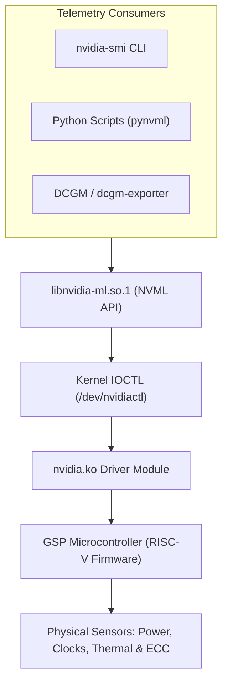
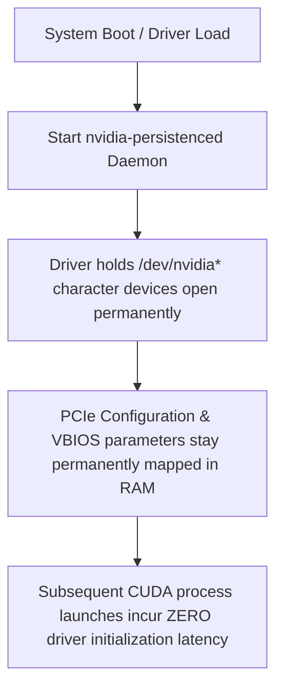

# Volume 09: Low-Level System Telemetry with nvidia-smi & NVML

```text
====================================================================================================
MODULE 09: SYSTEM MANAGEMENT INTERFACE, TELEMETRY ENGINES & NVML INTEGRATION
PLATFORMS: DATA CENTER LINUX | NVIDIA HOPPER | BLACKWELL | VERA RUBIN
====================================================================================================
```

In mission-critical enterprise AI clusters, continuous hardware monitoring and active device management are essential to prevent silent performance degradation, thermal throttling, and unrecoverable hardware crashes. 

The two primary interfaces for hardware control and telemetry ingestion are **`nvidia-smi` (System Management Interface)** and **NVML (NVIDIA Management Library)**. This volume explores their internal mechanisms, automated query scripting, persistence daemon architecture, clock locking and power capping protocols, and programmatic C/Python telemetry ingestion.

---

## 📑 Table of Contents
1. [The Architecture of nvidia-smi & NVML](#1-the-architecture-of-nvidia-smi--nvml)
2. [Automated Telemetry Extraction & Query Formatting](#2-automated-telemetry-extraction--query-formatting)
3. [The Persistence Daemon (nvidia-persistenced)](#3-the-persistence-daemon-nvidia-persistenced)
4. [Active Hardware Control: Power Capping & Application Clock Locking](#4-active-hardware-control-power-capping--application-clock-locking)
5. [Deciphering Performance States (P-States) & Throttling Flags](#5-deciphering-performance-states-p-states--throttling-flags)
6. [Programmatic Telemetry Ingestion via Python NVML](#6-programmatic-telemetry-ingestion-via-python-nvml)
7. [Multi-Dimensional Architecture Correlation](#7-multi-dimensional-architecture-correlation)
8. [Hands-On Hardware Telemetry & Automation Lab](#8-hands-on-hardware-telemetry--automation-lab)
9. [Practice Exercises & Verification Workbook](#9-practice-exercises--verification-workbook)

---

## 1. The Architecture of nvidia-smi & NVML

Contrary to common perception, `nvidia-smi` is not a standalone diagnostic binary that directly talks to hardware registers. It is a thin user-space CLI wrapper built on top of the **NVIDIA Management Library (`libnvidia-ml.so.1`)**:

```text
+--------------------------------------------------------------------------------------------------+
| TELEMETRY STACK ARCHITECTURE                                                                     |
+--------------------------------------------------------------------------------------------------+
| User-Space Utilities: `nvidia-smi` CLI | Custom Python Scripts (pynvml) | DCGM Daemon (nv-hostengine)
|                                        │
|                                        ▼
| Management Shared Library: `libnvidia-ml.so.1` (NVML C-API)
|                                        │
|                                        ▼ IOCTL Syscalls (/dev/nvidiactl)
| Linux Kernel Space: `nvidia.ko` Core Driver Module
|                                        │
|                                        ▼ RPC Message Queues
| On-Chip Hardware: GSP Firmware (RISC-V) ──► Thermal / Voltage / Power Sensor Registers
+--------------------------------------------------------------------------------------------------+
```



---

## 2. Automated Telemetry Extraction & Query Formatting

For automated monitoring, parsing human-readable tables from `nvidia-smi` is brittle and computationally wasteful. Production monitoring systems use **structured query formatting** or **XML machine dumps**:

### The Structured CSV Query Syntax:
The `--query-gpu=` flag enables high-frequency, comma-separated metric extraction:

```bash
nvidia-smi --query-gpu=timestamp,name,pci.bus_id,utilization.gpu,utilization.memory,\
memory.used,memory.total,temperature.gpu,power.draw,clocks.current.graphics \
--format=csv,noheader,nounits -l 1
```

*Key Parameters:*
* `-l 1`: Continuous streaming loop every $1\text{ second}$.
* `-lms 100`: High-frequency sub-second sampling every $100\text{ milliseconds}$.
* `noheader,nounits`: Strips unit suffixes (`MiB`, `W`, `C`) for direct ingestion into time-series pipelines.

### The XML Machine Dump (`-q -x`):
For complete, deep hardware state capture during cluster triage:

```bash
nvidia-smi -q -x > node_state_dump.xml
```
This produces an exhaustive machine-readable XML snapshot detailing:
* Per-SM clock frequencies and throttle reasons.
* Granular Single-Bit (SBE) and Double-Bit (DBE) ECC memory error counts.
* Board serial numbers, PCIe generation capabilities, and VBIOS versions.

---

## 3. The Persistence Daemon (nvidia-persistenced)

By default on Linux, when no GPU application is active, the `nvidia.ko` driver **unloads from device context** and puts the GPU into a deep low-power sleep state ($D3$).

```text
DEFAULT STATE (Persistence Mode Disabled):
App Starts ──► 1-2s Cold Driver Init ──► App Runs ──► App Exits ──► Driver Shuts Down
(Repeated across every single container or CLI call, causing massive latency!)
----------------------------------------------------------------------------------
PRODUCTION STATE (Persistence Mode Enabled):
Driver Loaded & Initialized Permanently ──► Apps Launch Instantly (< 1ms)
```



### Enabling Persistence Mode:
In production, enable persistence mode via systemd or the CLI:

```bash
# Enable persistence mode directly on all GPUs
sudo nvidia-smi -pm 1

# Verify persistence mode status
nvidia-smi --query-gpu=persistence_mode --format=csv
```

---

## 4. Active Hardware Control: Power Capping & Application Clock Locking

### Power Capping (`-pl`):
To prevent datacenter power shelves from tripping during sudden AI step loads or to operate under constrained cooling envelopes, the GPU's maximum TDP can be capped dynamically:

```bash
# Query minimum, maximum, and default power limits
nvidia-smi -q -d POWER | grep -E "Min Power Limit|Max Power Limit|Enforced Power Limit"

# Set enforced power limit to 650 Watts (e.g., on H100 SXM5 700W)
sudo nvidia-smi -pl 650
```

### Locking Application Clocks (`-lgc`):
Modern GPUs continuously adjust core clocks based on temperature, workload, and power draw (GPU Boost). While this maximizes peak performance, it introduces **timing jitter** that destabilizes benchmark runs and distributed collective synchronization.

```bash
# Query supported memory and graphics clock combinations
nvidia-smi -q -d SUPPORTED_CLOCKS | head -n 30

# Lock graphics clock to a fixed frequency (e.g., 1800 MHz)
sudo nvidia-smi -lgc 1800

# Reset graphics clocks back to dynamic auto-scaling
sudo nvidia-smi -rgc
```

---

## 5. Deciphering Performance States (P-States) & Throttling Flags

GPUs transition between **Performance States (P-States)** to balance power and performance:
* **P0 / P1**: Maximum 3D compute performance; clocks running at peak boost.
* **P8 / P12**: Low-power idle state; clocks reduced to $200\text{–}400\text{ MHz}$.

### Low-Level Throttle Reasons (Nsight / NVML Bitmasks):
When a GPU downclocks, NVML sets specific hardware bitmask flags:

```text
+--------------------------------------------------------------------------------------------------+
| NVML CLOCK THROTTLE REASONS BITMASK                                                              |
+---------------------+------------+---------------------------------------------------------------+
| Throttle Flag Name  | Hex Value  | Root Cause & Physical Meaning                                 |
+---------------------+------------+---------------------------------------------------------------+
| `SW_POWER_CAP`      | 0x00000004 | Software power limit enforced via `-pl` is active.            |
| `HW_SLOWDOWN`       | 0x00000008 | Hardware slowdown triggered (severe thermal or power trip).   |
| `SYNC_BOOST`        | 0x00000010 | Multi-GPU Sync Boost is aligning clocks across SLI/NVLink.    |
| `SW_THERMAL_SLOWDOWN| 0x00000020 | Software thermal limit reached; target fan/cooling saturated. |
| `HW_THERMAL_SLOWDOWN| 0x00000040 | Critical temperature reached; hardware clock cut by 50%.      |
| `HW_POWER_BRAKE`    | 0x00000080 | External power brake triggered (e.g., power supply failure).  |
+---------------------+------------+---------------------------------------------------------------+
```

---

## 6. Programmatic Telemetry Ingestion via Python NVML

Directly polling NVML using Python bindings (`pynvml`) delivers **microsecond-level telemetry** with virtually zero CPU overhead compared to repeatedly spawning `nvidia-smi` subprocesses:

```python
import pynvml
import time

def monitor_gpu_telemetry():
    # 1. Initialize NVML
    pynvml.nvmlInit()
    device_count = pynvml.nvmlDeviceGetCount()
    print(f"NVML Initialized. Monitoring {device_count} device(s).\n")

    try:
        handle = pynvml.nvmlDeviceGetHandleByIndex(0)
        name = pynvml.nvmlDeviceGetName(handle)
        
        for _ in range(5):
            # Query power, memory, and utilization
            power = pynvml.nvmlDeviceGetPowerUsage(handle) / 1000.0  # mW -> Watts
            temp = pynvml.nvmlDeviceGetTemperature(handle, pynvml.NVML_TEMPERATURE_GPU)
            util = pynvml.nvmlDeviceGetUtilizationRates(handle)
            mem = pynvml.nvmlDeviceGetMemoryInfo(handle)
            clocks = pynvml.nvmlDeviceGetClockInfo(handle, pynvml.NVML_CLOCK_GRAPHICS)

            print(f"[{time.strftime('%H:%M:%S')}] {name} | "
                  f"GPU: {util.gpu:3d}% | "
                  f"Power: {power:6.1f}W | "
                  f"Temp: {temp:2d}°C | "
                  f"Clock: {clocks:4d} MHz | "
                  f"Mem Used: {mem.used / (1024**2):6.0f} / {mem.total / (1024**2):.0f} MiB")
            time.sleep(1.0)

    finally:
        # Shutdown cleanly
        pynvml.nvmlShutdown()

if __name__ == "__main__":
    monitor_gpu_telemetry()
```

---

## 7. Multi-Dimensional Architecture Correlation

```text
+--------------------------------------------------------------------------------------------------+
| MULTI-DIMENSIONAL CORRELATION: SYSTEM MANAGEMENT & TELEMETRY                                     |
+---------------------+----------------------------------------------------------------------------+
| Dimension           | Mechanism & Failure Manifestation                                          |
+---------------------+----------------------------------------------------------------------------+
| Telemetry x Thermal | Persistent `SW_THERMAL_SLOWDOWN` indicates degraded cold plate contact or  |
|                     | coolant flow rate drops inside the rack liquid cooling loop.               |
| Telemetry x Power   | Sudden dips in graphics clocks during high-compute phases indicate hitting |
|                     | the enforced TDP limit (`SW_POWER_CAP`), capping peak GEMM throughput.    |
| Telemetry x Kernel  | Polling `nvidia-smi` in tight bash loops spawns heavy host processes,     |
|                     | contending for CPU execution threads and disrupting real-time serving.     |
| Telemetry x ECC     | A sudden surge in Volatile Single-Bit ECC errors precedes uncorrectable    |
|                     | Double-Bit ECC errors (XID 62), signaling failing physical HBM silicon.    |
+---------------------+----------------------------------------------------------------------------+
```

---

## 8. Hands-On Hardware Telemetry & Automation Lab

### Lab Objective:
Configure persistence mode, enforce an application clock lock, monitor real-time power capping, and detect clock throttle reasons using the CLI.

### Step 1: Enforce Persistence Daemon & Validate
Enable persistence mode on all accessible GPUs:

```bash
# Enforce persistence daemon mode
sudo nvidia-smi -pm 1

# Check current state
nvidia-smi -q | grep "Persistence Mode"
```

### Step 2: Lock Clocks and Verify Elimination of Jitter
Lock application clocks to a stable target frequency and verify:

```bash
# Query maximum supported graphics frequency
MAX_CLOCK=$(nvidia-smi --query-gpu=clocks.max.graphics --format=csv,noheader,nounits | head -n 1)
echo "Max supported graphics clock: ${MAX_CLOCK} MHz"

# Lock clock to 1500 MHz (requires root privileges)
sudo nvidia-smi -lgc 1500,1500 2>/dev/null || echo "Clock lock requires root privileges."

# Verify active clock
nvidia-smi --query-gpu=clocks.current.graphics,clocks.current.memory --format=csv
```

### Step 3: Inspect Real-Time Throttle Reasons
Query if any GPU is currently throttled by power, thermal, or hardware brakes:

```bash
# Query active throttle reasons
nvidia-smi --query-gpu=clocks_event_reasons.active --format=csv
```

*Expected Healthy State:*
```text
clocks_event_reasons.active
0x0000000000000000 (No Throttling Active)
```

---

## 9. Practice Exercises & Verification Workbook

### Exercise 9.1: NVML High-Frequency Ingestion Overhead Math
* **Scenario**: A monitoring engineer writes a bash script that executes `nvidia-smi` every $100\text{ ms}$ to log telemetry. Each invocation spawns a new Linux process, reads dynamic libraries, opens `/dev/nvidiactl`, queries NVML, formats text, and terminates, consuming $20\text{ ms}$ of CPU time.
* **Task**: Compare the host CPU core consumption of this bash loop against a persistent Python daemon using `pynvml` (which requires $0.15\text{ ms}$ per sample).
* **Solution**:
  1. *Subprocess Execution CPU Load*:
     $$\text{CPU Core Utilization} = \frac{20 \text{ ms}}{100 \text{ ms}} \times 100\% = 20.0\% \text{ of a full CPU core}$$
  2. *Persistent NVML Daemon CPU Load*:
     $$\text{CPU Core Utilization} = \frac{0.15 \text{ ms}}{100 \text{ ms}} \times 100\% = 0.15\% \text{ of a full CPU core}$$
  *Result*: Spawning `nvidia-smi` subprocesses consumes **$133\times$ more CPU resources**, introducing host thread scheduling jitter that degrades AI serving latency.

### Exercise 9.2: Diagnosing Power Capping Impact on GEMM FLOPS
* **Scenario**: An H100 SXM5 GPU operates at $700\text{ Watts}$ delivering $1,979\text{ TFLOPS}$ of dense FP8 compute. An infrastructure operator applies a power cap of $500\text{ Watts}$ (`-pl 500`).
* **Task**: Assuming arithmetic power consumption scales linearly with core frequency ($P \propto f$) in the high-frequency regime, estimate the resulting compute throughput.
* **Solution**:
  1. *Power Reduction Ratio*:
     $$\text{Ratio} = \frac{500 \text{ W}}{700 \text{ W}} \approx 0.7143$$
  2. *Estimated Scaled Compute*:
     $$\text{Throughput} \approx 1,979 \text{ TFLOPS} \times 0.7143 \approx 1,413.5 \text{ TFLOPS}$$
  *Result*: The $28.5\%$ power reduction decreases peak compute throughput to approximately **$1,414\text{ TFLOPS}$**, demonstrating the direct trade-off between thermal headroom and FLOPS.

---

## 📌 Summary Checklist: What You Have Mastered
- [x] The architecture of `nvidia-smi` and its underlying `libnvidia-ml.so.1` (NVML) engine.
- [x] High-frequency structured telemetry extraction using `--query-gpu=` and XML dumps.
- [x] The crucial role of `nvidia-persistenced` in eliminating cold-start driver latency.
- [x] Active hardware control via power capping (`-pl`) and application clock locking (`-lgc`).
- [x] Identifying low-level hardware and thermal throttling bitmasks in real time.
- [x] Programmatic, low-overhead monitoring using Python NVML C-bindings.
