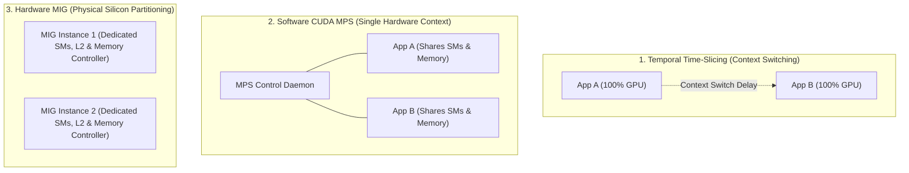
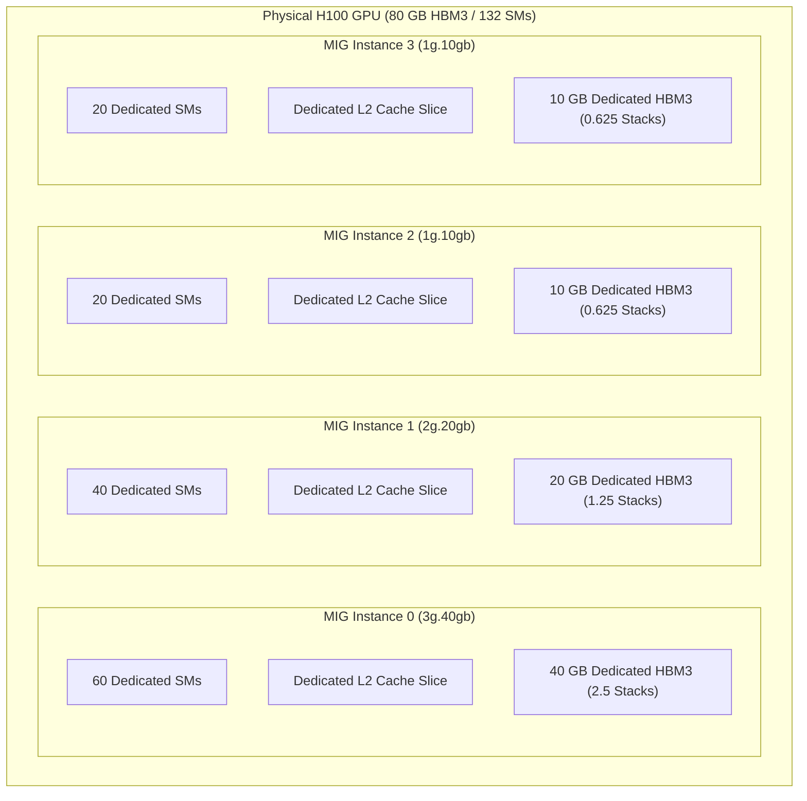

# Volume 10: Hardware Slicing: MIG, vGPU & Multi-Tenant Isolation

```text
====================================================================================================
MODULE 10: MULTI-INSTANCE GPU (MIG), HARDWARE PARTITIONING & VGPU VIRTUALIZATION
PLATFORMS: DATA CENTER LINUX | KUBERNETES | VMWARE ESXI / KVM | RUN:AI
====================================================================================================
```

In enterprise data centers and hyperscale AI clouds, dedicating an entire $700\text{W}+$ accelerator (like an H100 or B200) to a single lightweight inference service or development notebook results in massive underutilization and wasted capital expenditure. However, traditional software-based sharing mechanisms suffer from **noisy-neighbor interference, memory contention, and lack of fault isolation**.

To resolve this, modern NVIDIA architectures introduce hardware-level spatial partitioning: **MIG (Multi-Instance GPU)** and **vGPU (Virtual GPU)**. This volume explores the silicon mechanics of MIG slicing, the architectural distinction between GPU Instances (GI) and Compute Instances (CI), hypervisor virtualization, and Kubernetes multi-tenant orchestration.

---

## 📑 Table of Contents
1. [The Evolution of GPU Sharing: Time-Slicing vs. MPS vs. MIG](#1-the-evolution-of-gpu-sharing-time-slicing-vs-mps-vs-mig)
2. [Multi-Instance GPU (MIG) Silicon Architecture](#2-multi-instance-gpu-mig-silicon-architecture)
3. [GPU Instances (GI) vs. Compute Instances (CI)](#3-gpu-instances-gi-vs-compute-instances-ci)
4. [MIG Geometry & Memory Slice Profiles](#4-mig-geometry--memory-slice-profiles)
5. [Enterprise vGPU Virtualization (KVM & ESXi)](#5-enterprise-vgpu-virtualization-kvm--esxi)
6. [Fractional Scheduling & Elastic Orchestration (Run:ai)](#6-fractional-scheduling--elastic-orchestration-runai)
7. [Multi-Dimensional Architecture Correlation](#7-multi-dimensional-architecture-correlation)
8. [Hands-On MIG Partitioning & Validation Lab](#8-hands-on-mig-partitioning--validation-lab)
9. [Practice Exercises & Verification Workbook](#9-practice-exercises--verification-workbook)

---

## 1. The Evolution of GPU Sharing: Time-Slicing vs. MPS vs. MIG

```text
+--------------------------------------------------------------------------------------------------+
| GPU MULTI-TENANCY MECHANISM COMPARISON                                                           |
+---------------------+-----------------------+-------------------------+--------------------------+
| Feature             | Time-Slicing          | CUDA MPS (Multi-Process)| Hardware MIG             |
+---------------------+-----------------------+-------------------------+--------------------------+
| Isolation Type      | Temporal (Time-Shared)| Software Context Share  | Physical Hardware Slicing|
| Memory Protection   | Full Isolation (TDR)  | Shared Address Space    | Dedicated Memory Slices  |
| QoS & Latency       | High Jitter (Swapping)| Low Jitter (Concurrent) | Zero Jitter (Guaranteed) |
| Fault Isolation     | Moderate              | Zero (One crash kills all| 100% Hardware Isolated  |
| Memory Bandwidth    | Shared Dynamically    | Shared Dynamically      | Dedicated Hardware Paths |
| Crossbar Isolation  | None                  | None                    | Dedicated Crossbar Ports |
+---------------------+-----------------------+-------------------------+--------------------------+
```



---

## 2. Multi-Instance GPU (MIG) Silicon Architecture

First introduced in Ampere (A100) and expanded in Hopper (H100) and Blackwell, **Multi-Instance GPU (MIG)** partitions a single physical GPU into up to **7 independent hardware instances**.

### What Makes MIG Truly Hardware-Isolated:
1. **Isolated SM Clusters**: Each MIG slice receives a fixed, non-overlapping physical set of Streaming Multiprocessors.
2. **Dedicated Memory Controllers & HBM Slices**: Each instance is assigned dedicated physical HBM channels and memory controllers. No instance can starve another of memory bandwidth.
3. **Dedicated Crossbar Switch Paths**: On-chip interconnect routing paths are partitioned in silicon, preventing internal crossbar congestion.
4. **Dedicated L2 Cache Slices**: L2 cache banks are physically partitioned to eliminate cache thrashing from co-located workloads.
5. **Separate Fault Domains**: If an application running on MIG Instance 0 experiences a kernel segmentation fault (XID 31) or hangs, MIG Instances 1 through 6 continue executing with zero interruption.



---

## 3. GPU Instances (GI) vs. Compute Instances (CI)

A MIG partition is organized as a two-tier hierarchy:

```text
MIG TWO-TIER HIERARCHY:
Physical GPU
└── GPU Instance (GI)      <── Defines Physical Memory Controllers, L2 & Crossbar Slices
    └── Compute Instance (CI) <── Slices SMs within the assigned GPU Instance
```

1. **GPU Instance (GI)**:
   * Allocates physical memory capacity, HBM bandwidth, and L2 cache slices.
   * Establishes the memory protection boundary.
2. **Compute Instance (CI)**:
   * Slices the SM compute resources within a given GPU Instance.
   * Multiple CIs inside the same GI share the memory capacity and bandwidth of that GI, but run on dedicated, non-overlapping SMs.

---

## 4. MIG Geometry & Memory Slice Profiles

MIG naming follows the standard syntax: `<Compute_Slices>g.<Memory_GB>gb`

```text
+--------------------------------------------------------------------------------------------------+
| STANDARD H100 SXM5 (80 GB) MIG PROFILES                                                         |
+---------------------+-------------+-------------------+--------------------+---------------------+
| Profile Name        | SM Fraction | Memory Capacity   | L2 Cache Share     | Max Slices per GPU  |
+---------------------+-------------+-------------------+--------------------+---------------------+
| `1g.10gb`           | 1/7 (~19 SM)| 10 GB             | 1/7 (~7.1 MB)      | 7 Instances         |
| `2g.20gb`           | 2/7 (~38 SM)| 20 GB             | 2/7 (~14.2 MB)     | 3 Instances         |
| `3g.40gb`           | 3/7 (~57 SM)| 40 GB             | 3/7 (~21.4 MB)     | 2 Instances         |
| `4g.40gb`           | 4/7 (~76 SM)| 40 GB             | 4/7 (~28.5 MB)     | 1 Instance          |
| `7g.80gb`           | 7/7 (Full)  | 80 GB             | 7/7 (50 MB)        | 1 Instance          |
+---------------------+-------------+-------------------+--------------------+---------------------+
```

### Valid Placement Rules:
MIG slices cannot be placed arbitrarily across physical silicon; they must conform to fixed binary tree placement geometries. For instance, creating a `3g.40gb` instance occupies the first half of the GPU, allowing only a combination of `1g.10gb` or `2g.20gb` instances on the remaining half.

---

## 5. Enterprise vGPU Virtualization (KVM & ESXi)

In virtualized enterprise clouds, NVIDIA **vGPU software** integrates with hypervisors (VMware ESXi, Red Hat Enterprise Linux KVM, Nutanix):

```text
VGPU HOST-GUEST ARCHITECTURAL INTERACTION:
┌────────────────────────────────────────────────────────────────────────┐
│ Guest Virtual Machine (VM) / Kubernetes Worker Node                     │
│ └── Guest OS: Loads NVIDIA vGPU Guest Driver                           │
│     └── Standard CUDA Runtime & Applications run unmodified            │
├────────────────────────────────────────────────────────────────────────┤
│ Hypervisor Layer (VMware ESXi / KVM / QEMU)                            │
│ └── NVIDIA vGPU Manager (Virtual Memory Interceptor & Scheduler)       │
├────────────────────────────────────────────────────────────────────────┤
│ Bare-Metal Host Hardware: Physical GPU (MIG-Backed or Time-Sliced)     │
└────────────────────────────────────────────────────────────────────────┘
```

* **vGPU with MIG**: Assigns a physical MIG slice directly to a specific Virtual Machine using SR-IOV (Single Root I/O Virtualization), guaranteeing native bare-metal performance inside the VM.

---

## 6. Fractional Scheduling & Elastic Orchestration (Run:ai)

In large-scale Kubernetes environments, orchestrators like **Run:ai** extend MIG with dynamic scheduling:
* **Dynamic Fractional Slicing**: Automatically provisions MIG profiles based on container resource requests (`nvidia.com/mig-1g.10gb: 1`).
* **Elastic Pooling**: Aggregates idle MIG slices for transient batch training jobs and preempts them with microsecond latency when high-priority inference requests arrive.
* **Gang Scheduling**: Ensures all distributed worker slices across multiple nodes are scheduled concurrently to prevent deadlocks in distributed training.

---

## 7. Multi-Dimensional Architecture Correlation

```text
+--------------------------------------------------------------------------------------------------+
| MULTI-DIMENSIONAL CORRELATION: GPU PARTITIONING                                                  |
+---------------------+----------------------------------------------------------------------------+
| Dimension           | Mechanism & Failure Manifestation                                          |
+---------------------+----------------------------------------------------------------------------+
| MIG x Interconnect  | NVLink P2P is physically disabled between distinct MIG instances on the     |
|                     | same GPU; inter-instance transfers must route via host memory or PCIe.    |
| MIG x Kernel        | When MIG is enabled, `/dev/nvidia0` disappears; the driver exposes isolated|
|                     | capability nodes: `/dev/nvidia-caps/nvidia-capX`.                          |
| MIG x Power         | Power capping (`-pl`) affects the entire physical GPU; a single tenant     |
|                     | cannot independently adjust voltage or clock frequency limits.             |
| MIG x SRE           | If a MIG instance hits out-of-memory (OOM), only its local memory pool is  |
|                     | exhausted; adjacent slices maintain 100% uptime with zero spillover.       |
+---------------------+----------------------------------------------------------------------------+
```

---

## 8. Hands-On MIG Partitioning & Validation Lab

### Lab Objective:
Enable MIG mode on an accelerator, query supported geometry profiles, dynamically instantiate a `1g.10gb` slice, and verify isolation.

### Step 1: Enable Hardware MIG Mode
Check and enable MIG mode on the target accelerator:

```bash
# Enable MIG mode on GPU 0 (Requires root privileges and no active processes)
sudo nvidia-smi -i 0 -mig 1

# Verify MIG mode is ACTIVE
nvidia-smi -i 0 --query-gpu=mig.mode.current --format=csv
```

### Step 2: List Available GPU Instance Profiles
Query supported physical slice geometries:

```bash
# List all valid profile IDs for the current GPU
nvidia-smi mig -lgip
```

*Expected Output snippet (H100 SXM5):*
```text
+--------------------------------------------------------------------------+
| GPU instance profiles:                                                   |
| GPU   GI ID   Profile ID   Memory    Shared Memory   SMs   Available     |
|==========================================================================|
|   0       -           19    80.0 GB         228 KB   132           1     |
|   0       -           14    40.0 GB         228 KB    60           2     |
|   0       -            9    20.0 GB         228 KB    40           3     |
|   0       -            4    10.0 GB         228 KB    20           7     |
+--------------------------------------------------------------------------+
```

### Step 3: Create a GPU Instance and Compute Instance
Instantiate a `1g.10gb` profile (Profile ID 4) with automated compute creation:

```bash
# Create GPU Instance and its underlying Compute Instance simultaneously
sudo nvidia-smi mig -cgi 4 -C

# Verify newly created hardware instance
nvidia-smi -L
```

*Expected Output:*
```text
GPU 0: NVIDIA H100 80GB HBM3 (UUID: GPU-...)
  MIG 1g.10gb     Device  0: (UUID: MIG-...)
```

### Step 4: Destroy MIG Instances and Reset GPU
Clean up the instance and return the GPU to monolithic mode:

```bash
# Destroy all active MIG instances
sudo nvidia-smi mig -dgi

# Disable MIG mode
sudo nvidia-smi -i 0 -mig 0
```

---

## 9. Practice Exercises & Verification Workbook

### Exercise 10.1: MIG Memory Bandwidth Slicing Math
* **Scenario**: An H100 SXM5 GPU features $3.35\text{ TB/s}$ of aggregate HBM3 bandwidth across 5 active physical memory stacks. An administrator creates seven `1g.10gb` MIG instances.
* **Task**: Calculate the guaranteed physical memory bandwidth dedicated to each `1g.10gb` instance.
* **Solution**:
  * Each `1g.10gb` slice receives exactly $1/7$ of the physical memory controllers and crossbar routing channels.
  $$\text{Bandwidth per Slice} = \frac{3.35 \text{ TB/s}}{7} \approx 0.4785 \text{ TB/s} = 478.5 \text{ GB/s}$$
  *Result*: Each `1g.10gb` instance is guaranteed **$478.5\text{ GB/s}$** of memory bandwidth in hardware—higher than a full PCIe Gen 5 link—completely isolated from co-located workloads.

### Exercise 10.2: Kubernetes Device Plugin MIG Resource Naming
* **Scenario**: A cluster administrator configures the NVIDIA Kubernetes Device Plugin on a node with four `1g.10gb` slices and one `3g.40gb` slice.
* **Task**: Specify the exact resource limits defined in a Kubernetes Pod manifest to bind exclusively to a single `1g.10gb` slice.
* **Solution**:
  ```yaml
  apiVersion: v1
  kind: Pod
  metadata:
    name: inference-worker
  spec:
    containers:
    - name: vllm-engine
      image: vllm/vllm-openai:latest
      resources:
        limits:
          nvidia.com/mig-1g.10gb: 1
        requests:
          nvidia.com/mig-1g.10gb: 1
  ```
  The device plugin uses the unique MIG device UUID to inject only that specific slice's character device nodes (`/dev/nvidia-caps/*`) into the container.

---

## 📌 Summary Checklist: What You Have Mastered
- [x] Time-Slicing vs. CUDA MPS vs. Multi-Instance GPU (MIG) hardware isolation.
- [x] The physical silicon mechanics of MIG (isolated SMs, L2 banks, and memory controllers).
- [x] The architectural relationship between GPU Instances (GI) and Compute Instances (CI).
- [x] Standard MIG geometry profiles (`1g.10gb` through `7g.80gb`) and placement rules.
- [x] Enterprise vGPU virtualization architectures on VMware ESXi and KVM.
- [x] Creating, verifying, and tearing down hardware MIG instances using the CLI.
