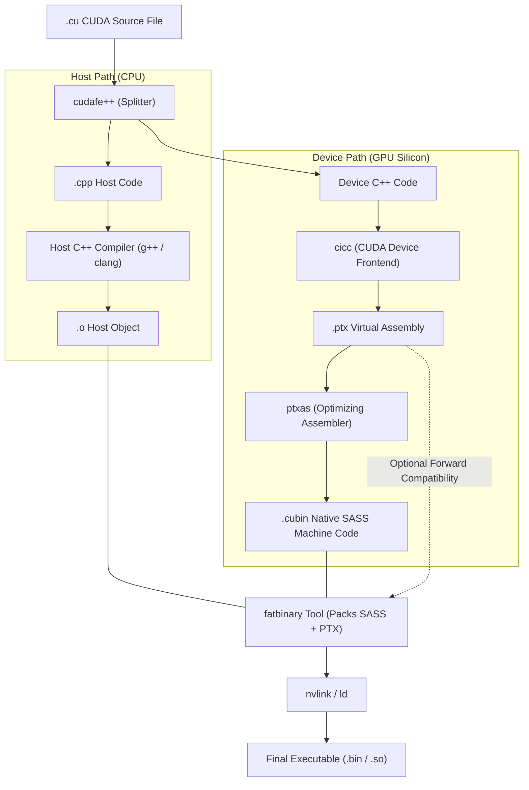

# Volume 11: CUDA Toolchain: nvcc, PTX Virtual ISA & SASS Disassembly

```text
====================================================================================================
MODULE 11: COMPILATION PIPELINES, INTERMEDIATE REPRESENTATIONS & SASS DISASSEMBLY
PLATFORMS: DATA CENTER LINUX | NVIDIA HOPPER (SM_90A) | BLACKWELL (SM_100)
====================================================================================================
```

To extract maximum performance from modern GPU architectures, an engineer cannot treat the CUDA compiler as a black box. What begins as high-level C++ or PyTorch code undergoes a multi-stage compilation transformation—splitting into host and device streams, lowering into target-independent virtual intermediate assembly (**PTX**), and finally optimizing into architecture-specific native machine instructions (**SASS**).

Understanding this pipeline is essential for analyzing register allocation, identifying instruction scheduling stalls, verifying Tensor Core hardware instructions (`HMMA`), and debugging memory access alignment. This volume examines the internal phases of **`nvcc`**, the syntax of PTX, the control-code architecture of SASS, and binary inspection using **`cuobjdump`** and **`nvdisasm`**.

---

## 📑 Table of Contents
1. [The nvcc Compilation Pipeline: Host vs. Device Split](#1-the-nvcc-compilation-pipeline-host-vs-device-split)
2. [PTX (Parallel Thread Execution): The Virtual Machine ISA](#2-ptx-parallel-thread-execution-the-virtual-machine-isa)
3. [SASS (Streaming Assembler): Native Hardware Machine Code](#3-sass-streaming-assembler-native-hardware-machine-code)
4. [SASS Instruction Anatomy & Hardware Control Codes](#4-sass-instruction-anatomy--hardware-control-codes)
5. [Fatbinaries & JIT Compilation Strategies](#5-fatbinaries--jit-compilation-strategies)
6. [Multi-Dimensional Architecture Correlation](#6-multi-dimensional-architecture-correlation)
7. [Hands-On PTX & SASS Binary Disassembly Lab](#7-hands-on-ptx--sass-binary-disassembly-lab)
8. [Practice Exercises & Verification Workbook](#8-practice-exercises--verification-workbook)

---

## 1. The nvcc Compilation Pipeline: Host vs. Device Split

The NVIDIA CUDA Compiler (**`nvcc`**) is a compiler driver that orchestrates multiple underlying compilation tools:

```text
+--------------------------------------------------------------------------------------------------+
| NVCC COMPILATION PHASES & INTERMEDIATE ARTIFACTS                                                 |
+---------------------+-------------------+---------------------+----------------------------------+
| Phase               | Tool / Sub-Binary | Input               | Output Generated                 |
+---------------------+-------------------+---------------------+----------------------------------+
| Pre-processing      | `cudafe++`        | `.cu` Source File   | Split Host (`.cpp`) & Device code|
| Device Parsing      | `cicc`            | Device C++ AST      | PTX Virtual Assembly (`.ptx`)    |
| Device Assembly     | `ptxas`           | PTX (`.ptx`)        | Native Machine Object (`.cubin`) |
| Host Compilation    | `g++` / `clang`   | Host C++ (`.cpp`)   | Host Object File (`.o`)          |
| Fatbinary Packaging | `fatbinary`       | `.cubin` + `.ptx`   | Unified Fatbinary Container      |
| Final Link          | `nvlink` / `ld`   | Host `.o` + Device  | Linked Executable / Shared Lib   |
+---------------------+-------------------+---------------------+----------------------------------+
```



---

## 2. PTX (Parallel Thread Execution): The Virtual Machine ISA

**PTX (Parallel Thread Execution)** is a low-level, target-independent virtual intermediate instruction set architecture. It provides an abstracted machine model of a GPU:
* **Virtual Register Set**: PTX uses an infinite number of virtual registers (e.g., `%r0`, `%r1`, `%rd0`, `%f0`), avoiding hardware register limits.
* **State Spaces**: Explicitly partitions memory into `.reg` (register), `.shared` (SMem), `.global` (HBM), `.local` (thread-private stack), and `.const` (constant cache).
* **Hardware Independence**: A PTX file compiled for `compute_90` can run on any future GPU architecture via JIT compilation by the host driver.

### Sample PTX Instruction:
```text
ld.global.v4.f32 {%f0, %f1, %f2, %f3}, [%rd1];
mma.sync.aligned.m16n8k16.row.col.f32.f16.f16.f32
    {%f4, %f5, %f6, %f7}, {%r0, %r1}, {%r2}, {%f4, %f5, %f6, %f7};
```

---

## 3. SASS (Streaming Assembler): Native Hardware Machine Code

While PTX is virtual, **SASS (Streaming Assembler)** is the actual binary machine instruction set executed directly by the SM warp schedulers and ALUs:
* **Architecture-Specific**: SASS instructions target exact microarchitectures (`sm_90` for Hopper, `sm_100` for Blackwell). SASS compiled for Hopper will **not** execute on Blackwell without JIT re-compilation.
* **Physical Register Allocation**: The infinite virtual registers of PTX are assigned to physical 32-bit registers ($R0$ through $R255$).
* **Instruction Latency Control**: SASS contains embedded control words that dictate dependency barriers and pipeline latency.

---

## 4. SASS Instruction Anatomy & Hardware Control Codes

Modern SASS instructions (on Hopper, Blackwell, and Rubin) are accompanied by a **128-bit Control Code** embedded in the instruction stream:

```text
TYPICAL SASS INSTRUCTION DISASSEMBLY (Hopper SM_90):
/*0080*/  [@P0]  HMMA.16816.F32.BF16  R0, R2, R4, R0 ;
/*0090*/         LDG.E.128.CONSTANT    R8, desc[UR4][R12.64] ;
```

```text
+--------------------------------------------------------------------------------------------------+
| SASS CONTROL CODE FIELDS & EXECUTION SEMANTICS                                                   |
+---------------------+-------------------+--------------------------------------------------------+
| Control Field       | Bit Width         | Purpose & Hardware Action                              |
+---------------------+-------------------+--------------------------------------------------------+
| Predicate Flag      | `@P0` / `@!P0`    | Conditional execution mask based on 1-bit predicate reg|
| Stall Count         | 4 bits (0-15)     | Cycles warp scheduler must wait before issuing next op |
| Yield Flag          | 1 bit (`Y`)       | Hints scheduler to switch to another eligible warp     |
| Write Barrier Mask  | 6 bits            | Sets dependency barrier index (SB0-SB5) on destination |
| Read Barrier Mask   | 6 bits            | Waits on dependency barrier before reading operands    |
| Reuse Flags         | 4 bits            | Informs register file cache to keep operand for next op|
+---------------------+-------------------+--------------------------------------------------------+
```

### The SASS Register Reuse Cache:
Accessing the 256 KB physical register file consumes dynamic electrical energy. Modern SMs feature a tiny **Register Cache (Operand Collector)**. SASS control codes mark registers with `.reuse` flags, instructing the ALU to retain the operand in the pipeline latch for the next cycle, cutting register file read power by up to **$30\%$**.

---

## 5. Fatbinaries & JIT Compilation Strategies

To ensure an application runs across different GPU generations without recompilation, `nvcc` packages device code into **Fatbinaries**:

```text
FATBINARY INTERNAL ASSET CONTAINER:
┌─────────────────────────────────────────────────────────────────┐
│ Target Architecture List: `-gencode arch=compute_90,code=sm_90`  │
│                           `-gencode arch=compute_100,code=sm_100`│
│                           `-gencode arch=compute_100,code=compute_100`│
├─────────────────────────────────────────────────────────────────┤
│ Container Contents:                                             │
│ 1. Native CUBIN (SASS) for sm_90  ──► Instant execution on H100 │
│ 2. Native CUBIN (SASS) for sm_100 ──► Instant execution on B200 │
│ 3. Virtual PTX for compute_100    ──► JIT compiled on future R100│
└─────────────────────────────────────────────────────────────────┘
```

* **Best Practice**: In production, **always compile native SASS for your target hardware (`code=sm_XX`)**. Relying purely on virtual PTX causes a noticeable **JIT compilation delay** (several seconds to minutes) on the first kernel launch when the host driver compiles PTX into SASS.

---

## 6. Multi-Dimensional Architecture Correlation

```text
+--------------------------------------------------------------------------------------------------+
| MULTI-DIMENSIONAL CORRELATION: COMPILATION & SASS                                                |
+---------------------+----------------------------------------------------------------------------+
| Dimension           | Mechanism & Failure Manifestation                                          |
+---------------------+----------------------------------------------------------------------------+
| SASS x Hardware     | Missing native SASS for target SM triggers JIT compilation at runtime; if   |
|                     | JIT cache is disabled or read-only, applications hang during init.         |
| SASS x Register     | Compiler register spilling (`spill stores` in `ptxas -v`) forces values    |
|                     | into local memory, triggering high-latency DRAM reads on every loop.       |
| SASS x Warp         | High stall counts in SASS control words correlate directly with            |
|                     | `stall_short_scoreboard` and `stall_barrier` metrics in Nsight Compute.    |
| SASS x Correctness  | Unaligned memory access instructions in SASS (`LDG.128` on unaligned ptr)  |
|                     | trigger hardware alignment faults and Linux kernel XID 31 crashes.         |
+---------------------+----------------------------------------------------------------------------+
```

---

## 7. Hands-On PTX & SASS Binary Disassembly Lab

### Lab Objective:
Compile a CUDA kernel generating both native SASS and virtual PTX, extract intermediate representations using `cuobjdump`, and disassemble machine instructions using `nvdisasm`.

### Step 1: Author a Multi-Precision Matrix Kernel
Create a kernel utilizing mixed-precision arithmetic:

```bash
cat << 'EOF' > sass_lab.cu
#include <cuda_runtime.h>
#include <cuda_fp16.h>

__global__ void saxpy_gemm(float *Y, const float *X, float A, int N) {
    int i = blockIdx.x * blockDim.x + threadIdx.x;
    if (i < N) {
        Y[i] = A * X[i] + Y[i];
    }
}
EOF

# Compile to object with diagnostic resource reporting
nvcc -O3 -Xptxas -v -gencode arch=compute_90,code=sm_90 \
     -gencode arch=compute_90,code=compute_90 -c sass_lab.cu -o sass_lab.o
```

### Step 2: Extract Virtual PTX Assembly
Use `cuobjdump` to dump the target-independent PTX:

```bash
# Dump virtual PTX assembly
cuobjdump -ptx sass_lab.o
```

*Expected PTX Output snippet:*
```text
.visible .entry _Z10saxpy_gemmPfPKffi(
    .param .u64 _Z10saxpy_gemmPfPKffi_param_0,
    .param .u64 _Z10saxpy_gemmPfPKffi_param_1,
    .param .f32 _Z10saxpy_gemmPfPKffi_param_2,
    .param .u32 _Z10saxpy_gemmPfPKffi_param_3
)
{
    .reg .pred  %p<2>;
    .reg .f32   %f<5>;
    .reg .b32   %r<5>;
    .reg .b64   %rd<7>;
    ...
    fma.rn.f32  %f4, %f1, %f2, %f3;
    st.global.f32 [%rd6], %f4;
}
```

### Step 3: Extract Native Hardware SASS Instructions
Disassemble the native machine instructions executed by the SM:

```bash
# Dump native SASS machine instructions
cuobjdump -sass sass_lab.o
```

*Expected SASS Output snippet:*
```text
/*0030*/                   LDG.E R2, [R2.64] ;
/*0040*/                   LDG.E R4, [R4.64] ;
/*0050*/                   FFMA R2, R2, R7, R4 ;
/*0060*/                   STG.E [R4.64], R2 ;
```

---

## 8. Practice Exercises & Verification Workbook

### Exercise 11.1: Register Spilling Overhead Calculation
* **Scenario**: A CUDA developer compiles a kernel with `nvcc -Xptxas -v`. The output reports:
  ```text
  ptxas info: Used 160 registers, 64 bytes spill stores, 64 bytes spill loads.
  ```
  The kernel executes 100,000,000 threads.
* **Task**: Calculate the excess memory traffic generated by register spills to Local Memory (DRAM).
* **Solution**:
  1. *Spill Bytes per Thread*:
     $$\text{Spill Traffic} = 64 \text{ bytes (stores)} + 64 \text{ bytes (loads)} = 128 \text{ bytes/thread}$$
  2. *Total Unnecessary DRAM Traffic*:
     $$\text{Total Traffic} = 100,000,000 \text{ threads} \times 128 \text{ bytes} = 12.8 \times 10^9 \text{ bytes} = 12.8 \text{ GB}$$
  *Result*: Register spilling injects **$12.8\text{ GB}$ of high-latency DRAM traffic**, severely degrading throughput.

### Exercise 11.2: Fatbinary Architecture Flag Dissection
* **Scenario**: An infrastructure engineer sees the following compiler flag in a build script:
  ```bash
  nvcc -gencode arch=compute_90,code=sm_90 -gencode arch=compute_90,code=compute_90
  ```
* **Task**: Explain the difference between `code=sm_90` and `code=compute_90` inside the resulting fatbinary.
* **Solution**:
  * `code=sm_90`: Generates native binary **SASS** compiled specifically for Hopper SM_90 hardware. The GPU executes it instantly with zero startup delay.
  * `code=compute_90`: Embeds intermediate **PTX virtual assembly** into the binary. If the application is subsequently executed on a Blackwell (SM_100) or Rubin (SM_110) GPU, the driver's JIT compiler parses this PTX and generates new native SASS, preserving forward compatibility.

---

## 📌 Summary Checklist: What You Have Mastered
- [x] The `nvcc` compilation stages: `cudafe++`, `cicc`, `ptxas`, and `fatbinary`.
- [x] The syntax and role of PTX virtual intermediate assembly.
- [x] The microarchitecture of native SASS and 128-bit instruction control codes.
- [x] SASS register reuse flags and physical operand collectors.
- [x] Fatbinaries, native CUBINs, and eliminating JIT startup latency in production.
- [x] Inspecting binaries using `cuobjdump` and `nvdisasm`.
