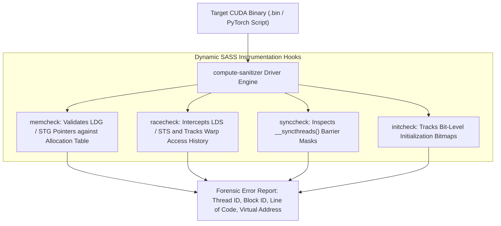
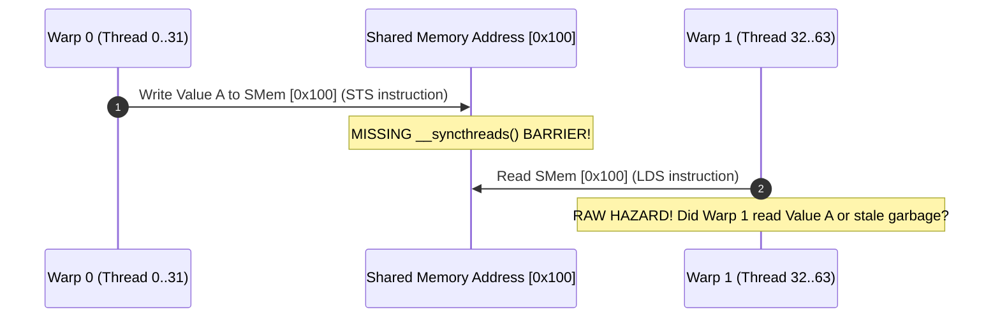

# Volume 12: Dynamic Memory Debugging with compute-sanitizer

```text
====================================================================================================
MODULE 12: RUNTIME MEMORY SAFETY, RACE HAZARDS & COMPUTE-SANITIZER VERIFICATION
PLATFORMS: DATA CENTER LINUX | NVIDIA HOPPER | BLACKWELL | VERA RUBIN
====================================================================================================
```

In massively parallel architectures where tens of thousands of threads execute concurrently, memory safety violations—such as **out-of-bounds array writes, misaligned pointer accesses, and shared memory data races**—are notoriously difficult to detect. Standard CPU debugging tools (like Valgrind or AddressSanitizer) cannot inspect the GPU’s physical memory spaces or SASS execution streams.

To guarantee correctness, NVIDIA engineered **`compute-sanitizer`**, an advanced dynamic binary instrumentation tool suite that inspects GPU instructions at the machine code level. This volume explores its four core sub-tools (**`memcheck`**, **`racecheck`**, **`synccheck`**, and **`initcheck`**), how to analyze memory access hazards, and how to automate GPU memory verification in production CI/CD pipelines.

---

## 📑 Table of Contents
1. [The Challenge of GPU Memory Safety](#1-the-challenge-of-gpu-memory-safety)
2. [compute-sanitizer Architecture & SASS Instrumentation](#2-compute-sanitizer-architecture--sass-instrumentation)
3. [memcheck: Out-of-Bounds, Alignment & Memory Leaks](#3-memcheck-out-of-bounds-alignment--memory-leaks)
4. [racecheck: Shared Memory Hazards (RAW, WAR, WAW)](#4-racecheck-shared-memory-hazards-raw-war-waw)
5. [synccheck & initcheck: Barrier Divergence & Uninitialized Reads](#5-synccheck--initcheck-barrier-divergence--uninitialized-reads)
6. [Multi-Dimensional Architecture Correlation](#6-multi-dimensional-architecture-correlation)
7. [Hands-On Dynamic Memory Verification Lab](#7-hands-on-dynamic-memory-verification-lab)
8. [Practice Exercises & Verification Workbook](#8-practice-exercises--verification-workbook)

---

## 1. The Challenge of GPU Memory Safety

Unlike CPU programs where memory violations frequently trigger an immediate Operating System `SIGSEGV`, GPU memory errors often fail silently:
* **Silent Data Corruption (SDC)**: An out-of-bounds write may overwrite adjacent weights or attention tensors without crashing, causing neural network loss divergence hours into training.
* **Non-Deterministic Race Hazards**: Two warps accessing the same Shared Memory address without barriers produce non-deterministic results depending on microscopic clock fluctuations.
* **Delayed Asynchronous Crashes**: A memory error in kernel $A$ may only be reported when kernel $C$ synchronizes seconds later, hiding the true culprit.

```text
+--------------------------------------------------------------------------------------------------+
| COMPUTE-SANITIZER TOOL SUITE OVERVIEW                                                            |
+---------------------+-------------------------------+------------------------------------------+
| Sub-Tool Name       | Target Memory Space           | Defect Category Detected                 |
+---------------------+-------------------------------+------------------------------------------+
| `memcheck`          | Global, Shared, Local, Const  | Out-of-bounds, misaligned, leaks, invalid|
| `racecheck`         | Shared Memory (SMem)          | RAW, WAR, and WAW data race hazards      |
| `synccheck`         | Barrier Synchronization Prims | Barrier divergence, deadlocks, sync bugs |
| `initcheck`         | Global Memory (HBM)           | Reads of uninitialized memory blocks     |
+---------------------+-------------------------------+------------------------------------------+
```



---

## 2. compute-sanitizer Architecture & SASS Instrumentation

`compute-sanitizer` does not require source code recompilation. It performs **Dynamic Binary Instrumentation (DBI)**:
1. When the target application launches, `compute-sanitizer` injects an instrumentation shim into the device JIT compiler and runtime.
2. Every memory instruction (e.g., `LDG`, `STG`, `LDS`, `STS`) is dynamically wrapped with safety assertions.
3. For every thread, the tool checks:
   * Is the target address within a valid, actively allocated memory segment?
   * Does the address satisfy hardware alignment constraints (e.g., 16-byte alignment for 128-bit vector loads)?
   * Has another warp written to this location without an intervening memory barrier?

---

## 3. memcheck: Out-of-Bounds, Alignment & Memory Leaks

`memcheck` is the default tool. It catches:

### Out-of-Bounds Memory Violations:
When a thread accesses beyond the boundary of an allocation:
```text
========= ERROR: Invalid __global__ write of size 4 bytes
=========     at 0x00000120 in vector_add(float*, float*, float*, int)
=========     by thread (1024,0,0) in block (9,0,0)
=========     Address 0x7fff14000000 is out of bounds for allocation
=========     Device allocation [0x7fff10000000, 0x7fff14000000) of size 67108864 bytes
```

### Misaligned Memory Access:
Modern SASS vector instructions (`LDG.E.128`) require addresses to be naturally aligned to the transaction size (16-byte boundary). If a pointer is misaligned:
```text
========= ERROR: Misaligned __global__ load of size 16 bytes
=========     Address 0x7fff10000004 is not aligned to 16 bytes
```

### Device Memory Leaks:
When `cudaMalloc` allocations are not freed before context destruction, `memcheck --leak-check full` prints the exact allocation call stack.

---

## 4. racecheck: Shared Memory Hazards (RAW, WAR, WAW)

Shared memory is shared across all warps within a thread block. Without strict barrier synchronization (`__syncthreads()` or `cuda::barrier`), concurrent accesses create **Data Race Hazards**:

```text
DATA RACE HAZARD TAXONOMY:
┌────────────────────────────────────────────────────────────────────────┐
│ 1. Read-After-Write (RAW)  : Warp 1 reads data before Warp 0 writes it.│
│ 2. Write-After-Read (WAR)  : Warp 1 overwrites data before Warp 0 reads│
│ 3. Write-After-Write (WAW) : Warp 0 and Warp 1 write simultaneously,   │
│                              leaving non-deterministic output data.    │
└────────────────────────────────────────────────────────────────────────┘
```



`racecheck` detects this hazard, outputting the exact source lines of both the prior write and the subsequent race read.

---

## 5. synccheck & initcheck: Barrier Divergence & Uninitialized Reads

### synccheck (Barrier Divergence):
In CUDA, calling `__syncthreads()` inside a conditional branch where not all threads in the block participate causes **undefined behavior or hardware deadlocks**:

```c
// ILLEGAL SYNCHRONIZATION BUG:
if (threadIdx.x < 16) {
    // Only half the block enters here!
    __syncthreads(); // DEADLOCK: The other 16 threads never arrive!
}
```
`synccheck` intercepts barrier arrival masks, instantly flagging barrier convergence violations.

### initcheck (Uninitialized Global Memory):
`initcheck` maintains a shadow bitmap for every byte of allocated global memory. If an arithmetic kernel reads a memory location that has never been written to by a kernel or host `cudaMemcpy`, `initcheck` flags an **Uninitialized Memory Access**.

---

## 6. Multi-Dimensional Architecture Correlation

```text
+--------------------------------------------------------------------------------------------------+
| MULTI-DIMENSIONAL CORRELATION: DYNAMIC MEMORY SAFETY                                             |
+---------------------+----------------------------------------------------------------------------+
| Dimension           | Mechanism & Failure Manifestation                                          |
+---------------------+----------------------------------------------------------------------------+
| Safety x Kernel     | An unhandled out-of-bounds global write triggers a hardware page fault,     |
|                     | causing `nvidia.ko` to log **XID 31** and aborting the process.           |
| Safety x SMem       | Shared memory race hazards cause intermittent NaN loss spikes in training  |
|                     | runs that disappear when running single-threaded or under debuggers.       |
| Safety x SASS       | Misaligned memory access forces the hardware memory controller to break a  |
|                     | single coalesced 128-byte burst into multiple transactions, halving speed. |
| Safety x SRE        | Leaked device memory accumulates over thousands of inference requests,     |
|                     | eventually exhausting HBM and triggering `CUDA out of memory` crashes.     |
+---------------------+----------------------------------------------------------------------------+
```

---

## 7. Hands-On Dynamic Memory Verification Lab

### Lab Objective:
Author a CUDA program containing intentional memory safety violations, execute dynamic verification using `compute-sanitizer`, and isolate defects.

### Step 1: Write a Defective CUDA Application
Create a program with an out-of-bounds write and a shared memory race:

```bash
cat << 'EOF' > memory_defects.cu
#include <cuda_runtime.h>
#include <stdio.h>

__global__ void buggy_kernel(float *out, int N) {
    __shared__ float smem[64];
    int tid = threadIdx.x;

    // Defect 1: Shared Memory RAW Race Hazard (Missing barrier)
    if (tid == 0) {
        smem[10] = 42.0f;
    }
    // Hazard: Thread 1 reads smem[10] without synchronizing!
    if (tid == 1) {
        out[0] = smem[10];
    }

    // Defect 2: Out-of-bounds global memory write
    if (tid == 64) {
        out[N + 10] = 99.0f; // Array has size N!
    }
}

int main() {
    float *d_out;
    cudaMalloc(&d_out, 64 * sizeof(float));
    buggy_kernel<<<1, 128>>>(d_out, 64);
    cudaDeviceSynchronize();
    cudaFree(d_out);
    return 0;
}
EOF

nvcc -O2 -g -G memory_defects.cu -o memory_defects.bin
```

### Step 2: Detect Out-of-Bounds Violations with memcheck
Execute dynamic bounds verification:

```bash
compute-sanitizer --tool memcheck ./memory_defects.bin
```

*Expected Diagnostic Output snippet:*
```text
========= ERROR: Invalid __global__ write of size 4 bytes
=========     at 0x00000180 in buggy_kernel(float*, int)
=========     by thread (64,0,0) in block (0,0,0)
=========     Address 0x7fff... is out of bounds for allocation
```

### Step 3: Detect Shared Memory Race Hazards with racecheck
Execute shared memory hazard analysis:

```bash
compute-sanitizer --tool racecheck ./memory_defects.bin
```

*Expected Diagnostic Output snippet:*
```text
========= ERROR: Race reported between Write of size 4 bytes
=========     at 0x000000a0 in buggy_kernel(float*, int)
=========     and Read of size 4 bytes
=========     at 0x000000c0 in buggy_kernel(float*, int)
=========     Hazard: Read-After-Write (RAW) on Shared Memory
```

---

## 8. Practice Exercises & Verification Workbook

### Exercise 12.1: Automated CI/CD Sanitizer Exit Codes
* **Scenario**: A DevOps engineer wants to integrate `compute-sanitizer` into a GitHub Actions / GitLab CI pipeline. By default, if the CUDA application returns `0`, `compute-sanitizer` returns `0` even if memory violations were detected.
* **Task**: Provide the exact CLI invocation that forces `compute-sanitizer` to return exit code `101` upon detecting any error.
* **Solution**:
  ```bash
  compute-sanitizer --error-exitcode 101 --tool memcheck ./test_suite.bin
  ```
  In the CI pipeline, evaluating `$? == 101` immediately fails the pull request build.

### Exercise 12.2: Memory Alignment SASS Transaction Math
* **Scenario**: An SM executes a 128-bit vector load (`LDG.E.128`) on an aligned address (`0x1000`). In a buggy kernel, the pointer is offset by 4 bytes (`0x1004`).
* **Task**: Calculate the number of 32-byte cache sectors required to service the aligned load vs. the misaligned load across a warp.
* **Solution**:
  1. *Aligned Load*:
     * A 32-thread warp loading 16 bytes per thread loads $32 \times 16 = 512\text{ bytes}$.
     * Because addresses are aligned to 128-byte boundaries, the transaction fits perfectly into **16 sectors (of 32 bytes each)**.
  2. *Misaligned Load (+4 bytes)*:
     * The offset straddles sector boundaries at the head and tail of the transaction.
     * The memory controller must fetch **17 to 18 sectors**, increasing DRAM traffic by up to $12.5\%$ and causing non-coalesced stalls.

---

## 📌 Summary Checklist: What You Have Mastered
- [x] Why GPU memory safety cannot be verified with standard CPU tools.
- [x] Dynamic binary instrumentation mechanics of `compute-sanitizer`.
- [x] Detecting out-of-bounds accesses, leaks, and pointer misalignment with `memcheck`.
- [x] Pinpointing RAW, WAR, and WAW shared memory data races with `racecheck`.
- [x] Catching barrier divergence bugs with `synccheck` and uninitialized reads with `initcheck`.
- [x] Integrating `compute-sanitizer` with automated exit codes in enterprise CI/CD.
