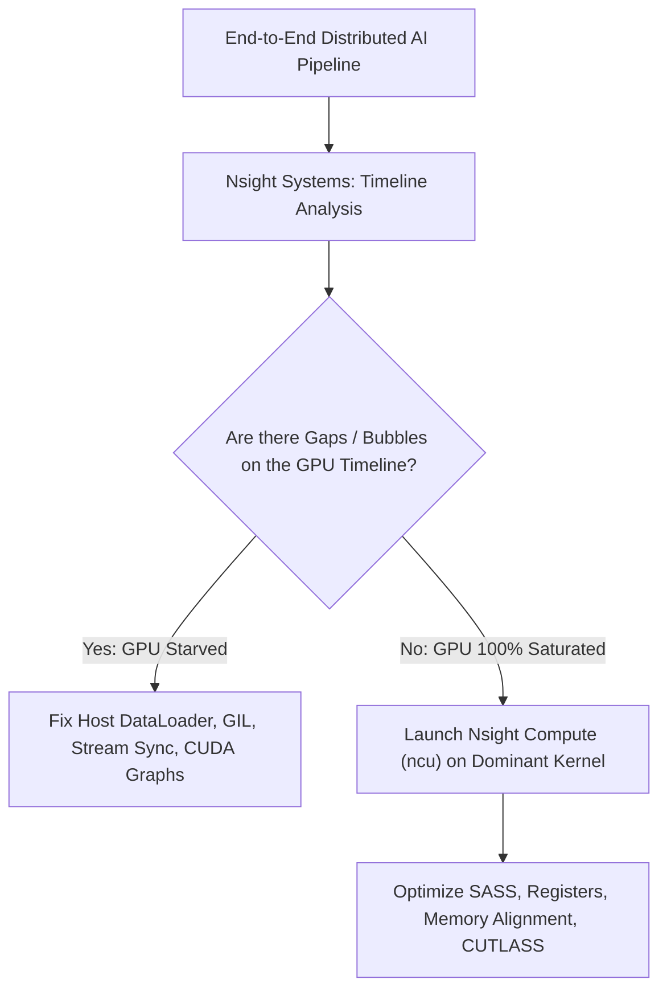
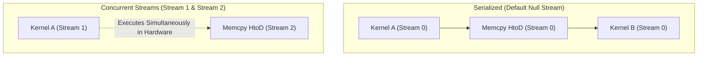

# Volume 13: System-Wide Timeline Tracing with Nsight Systems (nsys)

```text
====================================================================================================
MODULE 13: SYSTEM-WIDE CONCURRENCY, PIPELINE BUBBLES & NSIGHT SYSTEMS TRACING
PLATFORMS: DATA CENTER LINUX | PYTORCH / MEGATRON | TRITON INFERENCE SERVER
====================================================================================================
```

When optimizing large-scale distributed training or high-throughput LLM inference, focusing solely on individual kernel performance is insufficient. A system can have mathematically optimal GEMM kernels and yet achieve less than $20\%$ Model Flops Utilization (MFU) due to **GPU starvation, host CPU thread contention, uncoalesced memory copies, and NCCL communication bubbles**.

**Nsight Systems (`nsys`)** is NVIDIA's low-overhead, system-wide profiling tool designed to capture the holistic timeline across CPUs, GPUs, operating system runtimes, CUDA streams, and network interconnects. This volume explores how to capture and analyze system-wide traces, identify GPU idle bubbles, optimize CUDA stream concurrency, leverage CUDA Graphs, and instrument custom application layers using **NVTX (NVIDIA Tools Extension)**.

---

## 📑 Table of Contents
1. [The Holistic Profiling Paradigm](#1-the-holistic-profiling-paradigm)
2. [Nsight Systems Architecture & Sampling Mechanics](#2-nsight-systems-architecture--sampling-mechanics)
3. [The Anatomy of a Profile Timeline](#3-the-anatomy-of-a-profile-timeline)
4. [Diagnosing GPU Starvation & Host CPU Bottlenecks](#4-diagnosing-gpu-starvation--host-cpu-bottlenecks)
5. [CUDA Stream Concurrency & CUDA Graph Replay](#5-cuda-stream-concurrency--cuda-graph-replay)
6. [Instrumenting Applications with NVTX (C++ & Python)](#6-instrumenting-applications-with-nvtx-c--python)
7. [Multi-Dimensional Architecture Correlation](#7-multi-dimensional-architecture-correlation)
8. [Hands-On Timeline Profiling & NVTX Lab](#8-hands-on-timeline-profiling--nvtx-lab)
9. [Practice Exercises & Verification Workbook](#9-practice-exercises--verification-workbook)

---

## 1. The Holistic Profiling Paradigm

```text
+--------------------------------------------------------------------------------------------------+
| PROFILING TOOL SELECTION: NSIGHT SYSTEMS (NSYS) VS. NSIGHT COMPUTE (NCU)                         |
+---------------------+-------------------------------+------------------------------------------+
| Dimension           | Nsight Systems (`nsys`)       | Nsight Compute (`ncu`)                   |
+---------------------+-------------------------------+------------------------------------------+
| Scope               | Entire System Timeline        | Single Kernel Microarchitecture          |
| Overhead            | Extremely Low (< 2% to 5%)    | High (Kernel replay, up to 100x slower)  |
| Primary Target      | CPU-GPU Concurrency, Bubbles, | Warp Stalls, Register Pressure, Roofline,|
|                     | Streams, NCCL, OS Syscalls    | Tensor Core MMA, SMem Bank Conflicts     |
| Ideal Use Case      | "Why is my GPU idling?"       | "Why is this GEMM kernel not at 100% SOL"|
+---------------------+-------------------------------+------------------------------------------+
```



---

## 2. Nsight Systems Architecture & Sampling Mechanics

Nsight Systems operates by combining **event tracing** and **statistical CPU sampling**:

```text
NSIGHT SYSTEMS TRACING MODULES:
┌─────────────────────────────────────────────────────────────────┐
│ • CUDA Runtime / Driver : Intercepts cudaLaunchKernel, cudaMemcpy│
│ • OS Runtime (`osrt`)   : Traces pthread locks, nanosleep, fork │
│ • NVTX                  : User-defined hierarchical markers     │
│ • CUDA-X Libraries      : Intercepts cuBLAS, cuDNN, TensorRT ops│
│ • Distributed Networks  : Captures NCCL collective communication│
│ • CPU IP Sampling       : Samples host call stacks at 1000 Hz   │
└─────────────────────────────────────────────────────────────────┘
```

### The Production CLI Invocation:
To capture an actionable trace with minimal profiling overhead:

```bash
nsys profile \
  --trace=cuda,nvtx,osrt,cublas,cudnn \
  --sample=cpu \
  --cpuctxsw=process-tree \
  --output=system_trace_%p \
  --export=sqlite,arrow \
  --force-overwrite=true \
  ./my_ai_workload
```

---

## 3. The Anatomy of a Profile Timeline

When loading a trace file (`.nsys-rep`) into the GUI or analyzing exported tables:

```text
NSIGHT SYSTEMS TIMELINE VISUALIZATION:
Time:         0ms       10ms      20ms      30ms      40ms      50ms
CPU Thread 0: [ Data Loader / Preprocessing ]──►[ cudaLaunchKernel ]────────
              │                                 │
              ▼ (PCIe / C2C Transfer)           ▼ (Async Launch)
GPU Copy Eng: [   HtoD Memcpy (128 MB)   ]
                                                │
GPU Engine:                                     ▼ [ GEMM Kernel ]──►[ Softmax ]
                                                └─────────────────▲
                                                  GPU IDLE BUBBLE!
```

### Key Visual Signatures:
1. **The Long Blue Gap (GPU Starvation)**: The GPU row has long empty white intervals while the CPU row is saturated, indicating the GPU is waiting for the host to submit work.
2. **Synchronous Serial Blocks**: Memory copies (`cudaMemcpy`) blocking the CPU thread completely until completion instead of overlapping with compute on a secondary stream.
3. **NCCL Inter-Node Communication Bubbles**: GPUs idle in an AllReduce state waiting for network packets from straggler nodes.

---

## 4. Diagnosing GPU Starvation & Host CPU Bottlenecks

### Common Root Causes of Starvation:
* **Python Global Interpreter Lock (GIL)**: PyTorch multi-processing dataloaders blocked on CPU serialization.
* **Synchronous Device Queries**: Calling `tensor.item()` or `.cpu()` inside the training loop. This forces a blocking `cudaDeviceSynchronize()`, draining the GPU command queue.
* **High Kernel Launch Latency**: Submitting thousands of tiny kernels where CPU launch time ($5\ \mu\text{s}$) exceeds GPU execution time ($1\ \mu\text{s}$).

```text
TINY KERNELS LAUNCH OVERHEAD:
CPU Host:  [ Launch K1 ]─[ Launch K2 ]─[ Launch K3 ]─[ Launch K4 ]
           (5 µs each)    (5 µs each)    (5 µs each)    (5 µs each)
GPU Engine:  [ K1 ]       [ K2 ]       [ K3 ]       [ K4 ]
             (1 µs)       (1 µs)       (1 µs)       (1 µs)
             ▲            ▲            ▲
             └── BUBBLES ─┴── BUBBLES ─┘  (GPU is 80% IDLE!)
```

---

## 5. CUDA Stream Concurrency & CUDA Graph Replay

### Stream Concurrency:
Operations submitted to different `cudaStream_t` queues execute concurrently on the hardware if SM and copy engine resources permit:



### CUDA Graphs: Eliminating Launch Bubbles
**CUDA Graphs** record an entire workflow of dependent kernel launches, memory copies, and barriers into a single static execution graph:

```c
// Capture phase (once during warm-up)
cudaGraph_t graph;
cudaGraphExec_t instance;
cudaStreamBeginCapture(stream, cudaStreamCaptureModeGlobal);
launch_layer1<<<...>>>(stream);
launch_layer2<<<...>>>(stream);
launch_layer3<<<...>>>(stream);
cudaStreamEndCapture(stream, &graph);
cudaGraphInstantiate(&instance, graph, 0);

// Replay phase (thousands of training iterations)
// A single driver call launches the ENTIRE sequence with ZERO CPU overhead!
cudaGraphLaunch(instance, stream);
```

*Result*: CPU launch overhead drops from microseconds per kernel to **sub-microsecond for the entire network**, completely eliminating timeline launch bubbles.

---

## 6. Instrumenting Applications with NVTX (C++ & Python)

**NVTX (NVIDIA Tools Extension)** injects human-readable annotations directly into the profiling timeline:

### Python / PyTorch Integration:
```python
import torch

# Define labeled NVTX range
with torch.cuda.nvtx.range("Forward Pass - Attention Block 0"):
    q = torch.matmul(x, w_q)
    k = torch.matmul(x, w_k)
    v = torch.matmul(x, w_v)

with torch.cuda.nvtx.range("Backward Pass - AllReduce"):
    torch.distributed.all_reduce(grad_tensor)
```

### C++ Native Integration:
```cpp
#include <nvtx3/nvToolsExt.h>

nvtxRangePushA("FlashAttention_Forward");
// Execute attention kernel
nvtxRangePop();
```

---

## 7. Multi-Dimensional Architecture Correlation

```text
+--------------------------------------------------------------------------------------------------+
| MULTI-DIMENSIONAL CORRELATION: TIMELINE TRACING                                                  |
+---------------------+----------------------------------------------------------------------------+
| Dimension           | Mechanism & Failure Manifestation                                          |
+---------------------+----------------------------------------------------------------------------+
| Timeline x Network  | Uneven NCCL bubbles across ranks reveal network stragglers, packet drops,  |
|                     | or RoCE PFC pause storms on specific cluster switch ports.                 |
| Timeline x Kernel   | Unintended `cudaDeviceSynchronize()` calls appear as massive red blocking   |
|                     | bars across CPU host threads, halting asynchronous GPU queues.             |
| Timeline x Power    | Long GPU idle bubbles cause core power to fluctuate wildly between 150W   |
|                     | and 700W, generating severe di/dt electrical noise on datacenter rails.    |
| Timeline x SRE      | Correlating timeline timestamps with kernel `dmesg` logs isolates the exact|
|                     | kernel that was executing when an XID 79 hardware bus crash occurred.      |
+---------------------+----------------------------------------------------------------------------+
```

---

## 8. Hands-On Timeline Profiling & NVTX Lab

### Lab Objective:
Author an instrumented workload with NVTX markers, capture a system trace using `nsys`, export timeline statistics to SQLite, and detect synchronous stalls.

### Step 1: Author an Instrumented PyTorch Test Script
Create a script with deliberate synchronization and NVTX ranges:

```bash
cat << 'EOF' > nsys_lab.py
import torch
import time

def run_workload():
    device = torch.device("cuda:0" if torch.cuda.is_available() else "cpu")
    x = torch.randn(4096, 4096, device=device)
    w = torch.randn(4096, 4096, device=device)

    # Warmup
    for _ in range(5):
        _ = torch.matmul(x, w)
    torch.cuda.synchronize()

    # Instrumented Iterations
    for step in range(3):
        with torch.cuda.nvtx.range(f"Step_{step}"):
            with torch.cuda.nvtx.range("Matrix_Multiplication"):
                y = torch.matmul(x, w)
            
            with torch.cuda.nvtx.range("Blocking_Host_Sync"):
                # Deliberate synchronous stall: reading scalar back to CPU
                val = y[0, 0].item()

if __name__ == "__main__":
    run_workload()
EOF
```

### Step 2: Capture Timeline Profile with nsys
Execute profiling with CUDA and NVTX tracing:

```bash
nsys profile \
  --trace=cuda,nvtx \
  --output=nsys_lab_report \
  --force-overwrite=true \
  python3 nsys_lab.py
```

### Step 3: Extract Kernel & Memory Statistics CLI Summary
Generate a terminal text summary of top kernels and runtime calls:

```bash
nsys stats --report gputrace,cudaapisum nsys_lab_report.nsys-rep
```

*Expected Diagnostic Analysis:*
* The summary highlights `cudaMemcpyAsync` or `cudaStreamSynchronize` as dominant runtime calls.
* In the NVTX section, `Blocking_Host_Sync` shows up with high duration, identifying the blocking `.item()` call as the primary performance bottleneck.

---

## 9. Practice Exercises & Verification Workbook

### Exercise 13.1: Identifying Synchronous Memory Bottlenecks
* **Scenario**: An inference pipeline executes a preprocessing step on the CPU, copies a $256\text{ MB}$ tensor to the GPU, runs an inference kernel ($2.0\text{ ms}$ duration), and reads back a $4\text{ KB}$ token. The developer uses `cudaMemcpy(..., cudaMemcpyHostToDevice)` on the default stream.
* **Task**: Calculate the timeline overhead if the PCIe transfer takes $4.0\text{ ms}$, and explain how to overlap transfers using dual streams.
* **Solution**:
  1. *Serialized Timeline*:
     $$T_{\text{total}} = T_{\text{copy}} + T_{\text{kernel}} = 4.0 \text{ ms} + 2.0 \text{ ms} = 6.0 \text{ ms}$$
     GPU compute engine is completely idle during the first $4.0\text{ ms}$ (66.7% idle time).
  2. *Asynchronous Overlapped Pipeline*:
     * Use two CUDA streams: Stream 1 processes batch $N$, while Stream 2 issues `cudaMemcpyAsync` for batch $N+1$.
     * Compute and copy execute concurrently on independent hardware engines.
     $$\text{Effective Latency per Batch} = \max(T_{\text{copy}}, T_{\text{kernel}}) = \max(4.0 \text{ ms}, 2.0 \text{ ms}) = 4.0 \text{ ms}$$
  *Result*: Overlapping memory transfers cuts pipeline latency from $6.0\text{ ms}$ to $4.0\text{ ms}$, increasing throughput by $50\%$.

### Exercise 13.2: CUDA Graph Launch Speedup
* **Scenario**: A vision transformer executes 400 small operations per frame. Each operation requires $4\ \mu\text{s}$ of CPU driver launch time and $3\ \mu\text{s}$ of GPU execution time.
* **Task**: Compare the frame execution time between standard kernel launches and CUDA Graph execution (which reduces total CPU launch overhead to $2\ \mu\text{s}$ for the entire graph).
* **Solution**:
  1. *Standard Sequential Launches*:
     * Because launch time ($4\ \mu\text{s}$) > execution time ($3\ \mu\text{s}$), the pipeline is strictly CPU-launch bound.
     $$T_{\text{frame}} = 400 \times 4 \ \mu\text{s} = 1,600 \ \mu\text{s} = 1.6 \text{ ms}$$
  2. *CUDA Graph Replay*:
     * Host overhead is $2\ \mu\text{s}$ once. The GPU executes all 400 kernels back-to-back without bubbles:
     $$T_{\text{frame}} = 2 \ \mu\text{s} (\text{launch}) + (400 \times 3 \ \mu\text{s}) = 1,202 \ \mu\text{s} \approx 1.2 \text{ ms}$$
  *Result*: CUDA Graphs eliminate launch bubbles, reducing frame time by **$25\%$**.

---

## 📌 Summary Checklist: What You Have Mastered
- [x] Nsight Systems (`nsys`) holistic timeline analysis vs. Nsight Compute.
- [x] Catching GPU starvation bubbles and CPU thread serialization.
- [x] Eliminating blocking API calls (`.item()`, synchronous `cudaMemcpy`).
- [x] Asynchronous stream concurrency and multi-stream overlapping.
- [x] Capturing and replaying static workflows with CUDA Graphs.
- [x] Instrumenting enterprise AI pipelines with NVTX annotations in Python and C++.
