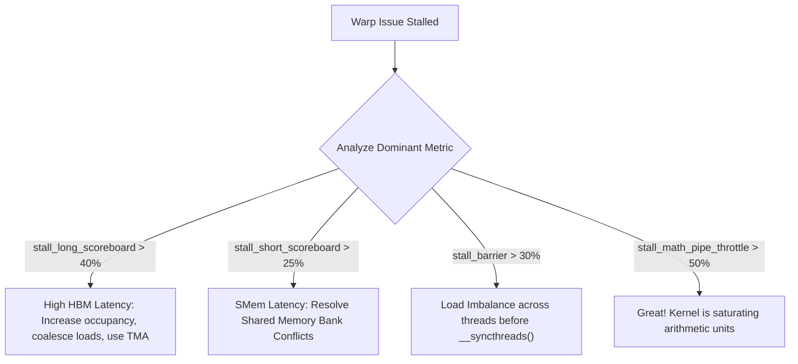

# Volume 14: SM Microarchitectural Profiling with Nsight Compute (ncu)

```text
====================================================================================================
MODULE 14: ROOFLINE MODELS, WARP STALL TAXONOMY & NSIGHT COMPUTE PROFILING
PLATFORMS: NVIDIA HOPPER (GH100) | BLACKWELL (B200/GB200) | VERA RUBIN (R100)
====================================================================================================
```

Once an engineer uses Nsight Systems to confirm that a GPU is saturated with work and free of host CPU starvation bubbles, optimization shifts to the microarchitectural level: **extracting the absolute physical limit of arithmetic throughput and memory bandwidth from the Streaming Multiprocessor (SM)**.

**Nsight Compute (`ncu`)** is NVIDIA's interactive kernel profiler. It provides cycle-accurate analysis of SM hardware metrics, registers, caches, warp execution state machines, and Tensor Core utilization. This volume explores the mathematical **Speed-of-Light (SOL) Roofline model**, the taxonomy of **warp scheduler stall reasons**, shared memory bank conflict diagnosis, and systematic kernel optimization workflows.

---

## 📑 Table of Contents
1. [The Nsight Compute Architecture & Hardware Replay](#1-the-nsight-compute-architecture--hardware-replay)
2. [The Speed-of-Light (SOL) Roofline Model](#2-the-speed-of-light-sol-roofline-model)
3. [Warp Scheduler Stall Taxonomy & Root Causes](#3-warp-scheduler-stall-taxonomy--root-causes)
4. [Memory Workload Analysis: L1, L2 & DRAM Rooflines](#4-memory-workload-analysis-l1-l2--dram-rooflines)
5. [Register Allocation, Launch Bounds & Occupancy](#5-register-allocation-launch-bounds--occupancy)
6. [Multi-Dimensional Architecture Correlation](#6-multi-dimensional-architecture-correlation)
7. [Hands-On Nsight Compute Profiling Lab](#7-hands-on-nsight-compute-profiling-lab)
8. [Practice Exercises & Verification Workbook](#8-practice-exercises--verification-workbook)

---

## 1. The Nsight Compute Architecture & Hardware Replay

Unlike timeline profilers that passively sample execution, `ncu` performs **Kernel Replay**:
1. When a kernel executes under `ncu`, the profiler runs the kernel multiple times behind the scenes.
2. During each pass, the hardware performance monitoring units (PMUs) configure a specific subset of hardware counter registers across the SMs and memory crossbars.
3. The profiler aggregates these multi-pass counters into an exhaustive microarchitectural report.

```text
+--------------------------------------------------------------------------------------------------+
| NCU METRIC GROUPS & PROFILING FOCUS                                                              |
+---------------------+-------------------------------+------------------------------------------+
| Section Name        | Target Subsystem              | Primary Hardware Metrics                 |
+---------------------+-------------------------------+------------------------------------------+
| Speed-of-Light      | SM Compute vs. DRAM Bandwidth | % of Peak Compute, % of Peak Memory Band.|
| Launch Statistics   | Grid & Block Dimensions       | Block Size, Grid Size, Threads per Block |
| Occupancy           | Register & Shared Memory Cap  | Theoretical vs. Achieved Active Warps    |
| Warp State Analysis | Warp Schedulers & Pipelines   | Detailed Breakdown of Warp Stall Reasons |
| Memory Workload     | L1 Cache, L2 Crossbar, HBM    | Hit Rates, Sector Counts, Bank Conflicts |
| Instruction Stats   | Instruction Mix & SASS Ops    | HMMA (Tensor), FMA, Branch, Load/Store   |
+---------------------+-------------------------------+------------------------------------------+
```

---

## 2. The Speed-of-Light (SOL) Roofline Model

The **Roofline Model** visualizes kernel performance against the theoretical physical limits of the hardware:

```text
SPEED-OF-LIGHT ROOFLINE MODEL:
Attainable Performance (TFLOPS)
   Peak Compute Roof (Tensor Core Peak: 4,500 TFLOPS)
   ▲ ────────────────────────────────────────────────────────
   │                                                     /
   │                                                    /  Compute-Bound Region
   │                                                   /
   │                                                  / 
   │                                                 /
   │       Memory-Bound Region                      /
   │       (Slope = Peak Bandwidth: 8.0 TB/s)      /
   │                                              /
   │                                             /
   └────────────────────────────────────────────┴─────────────►
   0                                          I_crit       Arithmetic Intensity
                                                           (FLOPs / Byte)
```

### The Governing Equations:

$$\text{Performance Ceiling (FLOPs/s)} = \min \Big( \text{Peak Compute FLOPS},\ \text{Arithmetic Intensity} \times \text{Peak Memory Bandwidth} \Big)$$

Where:

$$\text{Arithmetic Intensity } (I) = \frac{\text{Floating Point Operations (FLOPs)}}{\text{Data Moved from DRAM (Bytes)}}$$

* **If $I < I_{\text{crit}}$**: The kernel is **Memory-Bound**. Increasing compute speed will yield zero performance gain; the only solution is optimizing memory reuse, tiling in Shared Memory, or applying quantization (FP8/FP4).
* **If $I > I_{\text{crit}}$**: The kernel is **Compute-Bound**. Performance is limited by Tensor Core availability, instruction issue bottlenecks, or warp scheduling stalls.

---

## 3. Warp Scheduler Stall Taxonomy & Root Causes

When a warp scheduler cannot issue instructions, it records the exact hardware stall reason:

```text
+--------------------------------------------------------------------------------------------------+
| WARP SCHEDULER STALL TAXONOMY (NCU METRICS)                                                      |
+------------------------------------+-------------------------------------------------------------+
| Stall Reason Metric                | Root Cause & Hardware Bottleneck                            |
+------------------------------------+-------------------------------------------------------------+
| `stall_long_scoreboard`            | Waiting on high-latency Global Memory (HBM/L2) read.        |
| `stall_short_scoreboard`           | Waiting on Shared Memory read or local register dependency. |
| `stall_barrier`                    | Stalled at `__syncthreads()` waiting for warps in block.    |
| `stall_memory_throttle`            | Memory pipeline request queues are completely saturated.    |
| `stall_not_selected`               | Warp is ready, but scheduler chose a different warp.        |
| `stall_math_pipe_throttle`         | ALU / Tensor Core pipelines are completely saturated.       |
| `stall_drain`                      | Warp finished execution and is waiting to retire.           |
+------------------------------------+-------------------------------------------------------------+
```



---

## 4. Memory Workload Analysis: L1, L2 & DRAM Rooflines

Modern kernels feature hierarchical rooflines representing data reuse across cache levels:
1. **L1 Data Cache Roofline**: Bandwidth exceeds **$100\text{ TB/s}$**. Staging data into registers and L1 achieves maximal throughput.
2. **L2 Crossbar Roofline**: Bandwidth is **$\sim 15\text{ to }20\text{ TB/s}$**. Reusing weights in L2 avoids hitting external DRAM.
3. **DRAM (HBM) Roofline**: Bandwidth is **$3.35\text{ to }8.0\text{ TB/s}$**. Every un-cached byte loaded from HBM caps kernel throughput at DRAM speed.

```text
NCU MEMORY ACCESS EFFICIENCY METRICS:
┌─────────────────────────────────────────────────────────────────┐
│ Global Memory Load Efficiency  : Target > 90% (Coalesced Loads) │
│ Shared Memory Bank Conflicts   : Target 0 (XOR Swizzled Access) │
│ L2 Cache Hit Rate              : Target > 80% for Deep Learning │
└─────────────────────────────────────────────────────────────────┘
```

---

## 5. Register Allocation, Launch Bounds & Occupancy

An SM cannot achieve peak latency hiding if register consumption restricts the number of concurrent warps:

```text
COMPILER REGISTER CONTROL FLAGS:
┌─────────────────────────────────────────────────────────────────┐
│ nvcc -maxrregcount=64                                           │
│ Forces compiler to cap register usage to 64 per thread.         │
│ (WARNING: If variables exceed 64, values spill into DRAM!)      │
├─────────────────────────────────────────────────────────────────┤
│ __launch_bounds__(maxThreadsPerBlock, minBlocksPerMultiprocessor)│
│ Informs compiler of expected grid shapes to optimize registers. │
└─────────────────────────────────────────────────────────────────┘
```

```c
// Example: Enforcing launch bounds to guarantee 50% occupancy
__global__ void 
__launch_bounds__(256, 2)
optimized_attention_kernel(float *Q, float *K, float *V) {
    // ptxas guarantees register usage will not exceed 128 per thread!
}
```

---

## 6. Multi-Dimensional Architecture Correlation

```text
+--------------------------------------------------------------------------------------------------+
| MULTI-DIMENSIONAL CORRELATION: MICROARCHITECTURAL PROFILING                                      |
+---------------------+----------------------------------------------------------------------------+
| Dimension           | Mechanism & Failure Manifestation                                          |
+---------------------+----------------------------------------------------------------------------+
| Profiling x SMem    | High `stall_short_scoreboard` combined with bank conflicts indicates       |
|                     | non-swizzled shared memory writes, halving effective Tensor Core feed rate.|
| Profiling x SASS    | Comparing SASS instructions with the profile reveals whether `cicc` emitted |
|                     | native `HMMA` Tensor instructions or slow scalar `FFMA` emulation.         |
| Profiling x Thermal | Running kernels with high `sm__throughput` (> 95% SOL) draws peak power,   |
|                     | testing the direct-to-chip liquid cooling loop under sustained loads.      |
| Profiling x Memory  | Dominant `stall_long_scoreboard` indicates non-coalesced memory reads,     |
|                     | where each thread requests a separate 32-byte sector, flooding the L2 bus. |
+---------------------+----------------------------------------------------------------------------+
```

---

## 7. Hands-On Nsight Compute Profiling Lab

### Lab Objective:
Profile a CUDA kernel with Nsight Compute (`ncu`), generate a comprehensive Speed-of-Light report, identify dominant warp stall reasons, and inspect memory roofline metrics.

### Step 1: Execute Nsight Compute Full Section Profile
Run `ncu` targeting a compiled test binary:

```bash
# Capture full microarchitectural profiling report
ncu --set full \
    --target-processes all \
    --export ncu_kernel_report \
    --force-overwrite \
    ./matrix_test.bin
```

### Step 2: Extract Critical Speed-of-Light Metrics via CLI
Query the Speed-of-Light (SOL) compute and memory percentages directly from the command line:

```bash
ncu --metrics \
sm__throughput.avg.pct_of_peak_sustained_elapsed,\
dram__throughput.avg.pct_of_peak_sustained_elapsed,\
smsp__warp_issue_stalled_long_scoreboard_per_warp_active.pct,\
smsp__warp_issue_stalled_short_scoreboard_per_warp_active.pct,\
smsp__warp_issue_stalled_barrier_per_warp_active.pct \
./matrix_test.bin
```

*Sample CLI Diagnostic Output:*
```text
Section: Command line metrics
----------------------------------------------------------------------
sm__throughput.avg.pct_of_peak_sustained_elapsed          %      84.21
dram__throughput.avg.pct_of_peak_sustained_elapsed        %      32.10
smsp__warp_issue_stalled_long_scoreboard_per_warp_active  %      12.40
smsp__warp_issue_stalled_short_scoreboard_per_warp_active %       2.10
smsp__warp_issue_stalled_barrier_per_warp_active          %       5.30
```
*Analysis*: The kernel achieves $84.21\%$ of theoretical peak SM compute throughput with low stall metrics, indicating an optimized compute-bound implementation.

---

## 8. Practice Exercises & Verification Workbook

### Exercise 14.1: Arithmetic Intensity & Roofline Bottleneck
* **Scenario**: A kernel running on an H100 SXM5 GPU ($3.35\text{ TB/s}$ HBM3 bandwidth, $989\text{ TFLOPS}$ BF16 Tensor Core peak) performs $1.2 \times 10^{12}\text{ FLOPs}$ while loading $800\text{ MB}$ of data from HBM.
* **Task**: Determine if this kernel is compute-bound or memory-bound, and calculate the maximum attainable TFLOPS.
* **Solution**:
  1. *Arithmetic Intensity Calculation*:
     $$I = \frac{1.2 \times 10^{12} \text{ FLOPs}}{800 \times 10^6 \text{ Bytes}} = 1,500 \text{ FLOPs/Byte}$$
  2. *Machine Operational Inflexion Point ($I_{\text{crit}}$)*:
     $$I_{\text{crit}} = \frac{989 \times 10^{12} \text{ FLOPs/s}}{3.35 \times 10^{12} \text{ Bytes/s}} \approx 295.2 \text{ FLOPs/Byte}$$
  3. *Attainable Performance*:
     * Because $I (1,500) > I_{\text{crit}} (295.2)$, the kernel is strictly **compute-bound**.
     $$\text{Attainable Performance} = 989 \text{ TFLOPS (Peak Compute Ceiling)}$$

### Exercise 14.2: Diagnosing stall_long_scoreboard Stalls
* **Scenario**: An `ncu` profile reports that `smsp__warp_issue_stalled_long_scoreboard` accounts for **$65\%$** of all warp stall cycles in an attention kernel.
* **Task**: State the physical root cause and specify two concrete optimizations to eliminate this stall.
* **Solution**:
  * **Root Cause**: Warps are stalled waiting for data to return from high-latency global memory (HBM or L2 cache). The SM does not have enough active, independent warps to hide memory load latency.
  * **Optimization 1**: Restructure loads using **TMA (Tensor Memory Accelerator)** or asynchronous copy pipelines (`cuda::memcpy_async`) to overlap memory transfers with computation.
  * **Optimization 2**: Double-buffer shared memory tiles, allowing warps to compute on Tile $N$ while asynchronous hardware engines fetch Tile $N+1$ from DRAM.

---

## 📌 Summary Checklist: What You Have Mastered
- [x] Nsight Compute (`ncu`) architecture, PMU hardware counters, and kernel replay.
- [x] Constructing and interpreting the Speed-of-Light (SOL) Roofline model.
- [x] The complete taxonomy of warp scheduler stall reasons and remediation paths.
- [x] Memory workload analysis across L1, L2, and DRAM roofline tiers.
- [x] Managing register pressure with `__launch_bounds__` and `-maxrregcount`.
- [x] Extracting microarchitectural metrics using production CLI commands.
