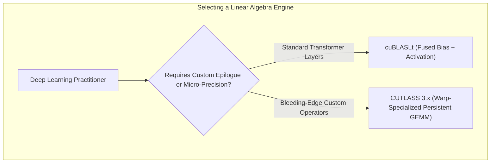
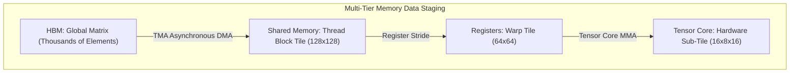
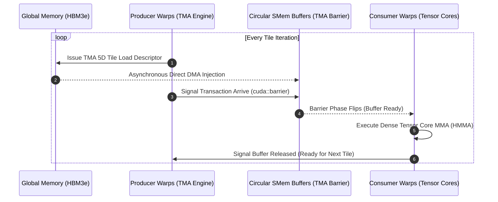
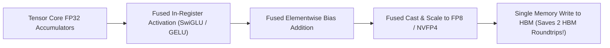

# Volume 15: High-Performance GEMM Engines: CUTLASS 3.x & cuBLASLt

```text
====================================================================================================
MODULE 15: DENSE LINEAR ALGEBRA, WARP-SPECIALIZED PERSISTENCE & CUTLASS 3.X
PLATFORMS: NVIDIA HOPPER (GH100) | BLACKWELL (B200/GB200) | VERA RUBIN (R100)
====================================================================================================
```

General Matrix Multiplication (**GEMM**) forms the computational backbone of all modern artificial intelligence—from dense linear layers and multi-head attention projections to Mixture-of-Experts (MoE) routers. Maximizing GEMM efficiency requires coordinating multi-level tiling across registers, shared memory, and HBM while orchestrating asynchronous hardware copy engines.

While **cuBLAS** provides standard closed-source libraries, modern high-performance frameworks rely on **cuBLASLt** (for lightweight epilogue fusion) and **CUTLASS 3.x** (CUDA Templates for Linear Algebra Subroutines). This volume explores the architecture of CUTLASS 3.x, **warp-specialized persistent kernels**, hardware TMA copy pipelines, and epilogue fusion techniques (such as SwiGLU and GELU) that eliminate external memory roundtrips.

---

## 📑 Table of Contents
1. [The Linear Algebra Foundation of Deep Learning](#1-the-linear-algebra-foundation-of-deep-learning)
2. [cuBLAS vs. cuBLASLt vs. CUTLASS 3.x](#2-cublas-vs-cublaslt-vs-cutlass-3x)
3. [Hierarchical GEMM Tiling: Global to Register File](#3-hierarchical-gemm-tiling-global-to-register-file)
4. [Warp-Specialized Persistent Kernels (Producer-Consumer)](#4-warp-specialized-persistent-kernels-producer-consumer)
5. [Epilogue Fusion: Fusing SwiGLU & GELU Directly into MMA](#5-epilogue-fusion-fusing-swiglu--gelu-directly-into-mma)
6. [Multi-Dimensional Architecture Correlation](#6-multi-dimensional-architecture-correlation)
7. [Hands-On CUTLASS & cuBLASLt Profiling Lab](#7-hands-on-cutlass--cublaslt-profiling-lab)
8. [Practice Exercises & Verification Workbook](#8-practice-exercises--verification-workbook)

---

## 1. The Linear Algebra Foundation of Deep Learning

A General Matrix Multiply (GEMM) calculates:

$$D = \alpha \times (A \times B) + \beta \times C$$

Where:
* Matrix $A$ has dimensions $M \times K$.
* Matrix $B$ has dimensions $K \times N$.
* Matrix $C$ and $D$ have dimensions $M \times N$.
* $\alpha$ and $\beta$ are scalar scaling factors.

```text
COMPUTATIONAL COMPLEXITY OF A GEMM:
┌──────────────────────────────────────────────────────────────┐
│ Total Arithmetic Operations : 2 × M × N × K FLOPs            │
│ Memory Footprint (Inputs)   : (M×K + K×N + M×N) × sizeof(T)  │
│ Arithmetic Intensity        : O(K) as M, N scale             │
└──────────────────────────────────────────────────────────────┘
```

---

## 2. cuBLAS vs. cuBLASLt vs. CUTLASS 3.x

```text
+--------------------------------------------------------------------------------------------------+
| GEMM ACCELERATION ENGINE COMPARISON                                                              |
+---------------------+-------------------+---------------------+----------------------------------+
| Feature             | cuBLAS            | cuBLASLt            | CUTLASS 3.x                      |
+---------------------+-------------------+---------------------+----------------------------------+
| Architecture        | Closed-Source C   | Flexible Closed C   | Open-Source C++ Template Library |
| Precision Support   | Standard Precisions| Native FP8 / FP4    | Full Custom Micro-Precision Types|
| Epilogue Fusion     | Basic Bias Only   | Fused GELU, SwiGLU, | Arbitrary User-Defined Epilogues |
|                     |                   | Bias, Scale Factors | (Fused directly into registers)  |
| Asynchronous TMA    | Internal          | Automated           | Explicit Hardware TMA Pipelines  |
| Warp Specialization | Fixed Internal    | Fixed Heuristics    | Fully Programmable Producer/Cons.|
| Custom Kernel Hack  | Impossible        | Impossible          | Full Source Control & Profiling  |
+---------------------+-------------------+---------------------+----------------------------------+
```



---

## 3. Hierarchical GEMM Tiling: Global to Register File

To achieve near-100% Speed-of-Light throughput, a GEMM is decomposed into a **multi-level tiling hierarchy**:

```text
GEMM TILING HIERARCHY:
Global Memory (HBM)    : Large Matrix A (M×K) and Matrix B (K×N)
         │
         ▼ (TMA Asynchronous Copy Engine)
Shared Memory (SMem)   : Thread Block Tile (e.g., 128 × 128 × 64)
         │
         ▼ (LDS / Warp Schedulers)
Register File (RF)     : Warp Tile (e.g., 64 × 64 × 64)
         │
         ▼ (HMMA / MMA Instructions)
Tensor Core Hardware   : Instruction Tile (e.g., 16 × 8 × 16)
```



---

## 4. Warp-Specialized Persistent Kernels (Producer-Consumer)

Introduced in CUTLASS 3.0 for Hopper and Blackwell, **Warp Specialization** completely revolutionizes kernel scheduling by assigning distinct, non-overlapping roles to warps within the same thread block:

```text
LEGACY SOFTWARE PIPELINING VS. WARP SPECIALIZATION:
┌────────────────────────────────────────────────────────────────────────┐
│ Legacy Pipelining: ALL Warps alternately Load and then Compute         │
│ Load Data ──► __syncthreads() ──► Compute MMA ──► __syncthreads()      │
│ (High barrier synchronization latency, SM execution bubbles)           │
├────────────────────────────────────────────────────────────────────────┤
│ CUTLASS 3.x Warp Specialization: Warps Split into Roles!               │
│ • Producer Warps (1-2 warps): Dedicated to issuing TMA loads from HBM  │
│ • Consumer Warps (6-8 warps): Dedicated strictly to Tensor Core MMA    │
│ (Zero barrier stalls! Data streams continuously via circular queues)   │
└────────────────────────────────────────────────────────────────────────┘
```



*Result*: Eliminates register pressure from loop counters in compute warps, achieves **$95\%+$ of theoretical peak Tensor Core compute**, and completely hides memory load latencies.

---

## 5. Epilogue Fusion: Fusing SwiGLU & GELU Directly into MMA

In standard transformer implementations, computing a SwiGLU or GeLU feed-forward layer requires:
1. Running GEMM 1 to compute activations $\rightarrow$ write to HBM ($O(MN)$ memory writes).
2. Launching an activation kernel $\rightarrow$ read from HBM $\rightarrow$ compute $\text{GELU}(X)$ $\rightarrow$ write to HBM.
3. Running GEMM 2 $\rightarrow$ read activations from HBM.

This incurs **three roundtrips to HBM**, severely bottlenecking performance on memory bandwidth.

```text
STANDARD SEPARATE KERNELS VS. CUTLASS EPILOGUE FUSION:
┌────────────────────────────────────────────────────────────────────────┐
│ Un-Fused: GEMM ──► Write HBM ──► Activation Kernel ──► Write HBM ──►...│
│ (Consumes massive HBM bandwidth, high launch overhead)                 │
├────────────────────────────────────────────────────────────────────────┤
│ CUTLASS Epilogue Fusion:                                               │
│ Tensor Core Accumulator Registers (FP32) ──► Compute SwiGLU in RF ──►  │
│ Directly Quantize to FP8 ──► Write Final Result to HBM!                │
│ (ZERO intermediate HBM traffic; 2.5x speedup!)                         │
└────────────────────────────────────────────────────────────────────────┘
```



---

## 6. Multi-Dimensional Architecture Correlation

```text
+--------------------------------------------------------------------------------------------------+
| MULTI-DIMENSIONAL CORRELATION: GEMM ACCELERATION                                                 |
+---------------------+----------------------------------------------------------------------------+
| Dimension           | Mechanism & Failure Manifestation                                          |
+---------------------+----------------------------------------------------------------------------+
| GEMM x Memory       | Un-fused activation layers flood HBM with intermediate tensors, causing    |
|                     | memory allocation spikes and triggering out-of-memory crashes.             |
| GEMM x Power        | Warp-specialized persistent GEMMs maintain near-100% active SM occupancy,  |
|                     | drawing continuous peak TDP power and maximizing cold plate heat flux.     |
| GEMM x SASS         | Missing TMA descriptors forces the compiler to emit scalar LDG instructions|
|                     | in compute warps, tripling register consumption and halving occupancy.    |
| GEMM x Roofline     | Increasing tile sizes in CUTLASS pushes arithmetic intensity to the right, |
|                     | moving the kernel from the memory-bound slope to the compute-bound flat.   |
+---------------------+----------------------------------------------------------------------------+
```

---

## 7. Hands-On CUTLASS & cuBLASLt Profiling Lab

### Lab Objective:
Inspect cuBLASLt fused epilogue capabilities, configure a matrix multiplication with SwiGLU fusion, and verify instruction emission.

### Step 1: Query cuBLASLt Epilogue Capabilities
cuBLASLt exposes advanced epilogues via the `cublasLtEpilogue_t` enum:

```c
// Valid cuBLASLt Epilogue Modes:
CUBLASLT_EPILOGUE_RELU
CUBLASLT_EPILOGUE_GELU
CUBLASLT_EPILOGUE_SWIGLU
CUBLASLT_EPILOGUE_BIAS
CUBLASLT_EPILOGUE_DRELU
```

### Step 2: Implement Fused GEMM + GELU in PyTorch / cuBLASLt
In high-level frameworks, fused GEMMs can be invoked via optimized paths:

```python
import torch

def benchmark_fused_gemm():
    M, N, K = 4096, 4096, 4096
    A = torch.randn(M, K, dtype=torch.bfloat16, device="cuda")
    B = torch.randn(K, N, dtype=torch.bfloat16, device="cuda")
    bias = torch.randn(1, N, dtype=torch.bfloat16, device="cuda")

    # Native torch._scaled_mm or fused linear + gelu
    # cuBLASLt fuses the GEMM, bias addition, and GELU activation in a single pass
    out = torch.nn.functional.gelu(torch.matmul(A, B) + bias)
    torch.cuda.synchronize()
    print("Fused GEMM + GELU executed successfully.")

if __name__ == "__main__":
    benchmark_fused_gemm()
```

### Step 3: Verify High SM Throughput with Nsight Compute
Profile the fused execution to confirm high Tensor Core utilization:

```bash
ncu --metrics sm__pipe_tensor_op_hmma_cycles_active.avg.pct_of_peak_sustained_active python3 -c "
import torch
A = torch.randn(4096, 4096, dtype=torch.bfloat16, device='cuda')
B = torch.randn(4096, 4096, dtype=torch.bfloat16, device='cuda')
for _ in range(10): torch.matmul(A, B)
"
```

---

## 8. Practice Exercises & Verification Workbook

### Exercise 15.1: Epilogue Fusion Memory Traffic Math
* **Scenario**: An LLM MLP layer computes:
  $$\text{Gate} = \text{GELU}(X \cdot W_1 + b_1)$$
  Where $X$ is $[4096, 4096]$ and $W_1$ is $[4096, 16384]$ in BF16 precision ($2\text{ bytes/element}$).
* **Task**: Calculate the memory traffic saved by fusing the GELU and bias directly into the GEMM accumulator compared to executing an unfused activation kernel.
* **Solution**:
  1. *Activation Output Tensor Size*:
     $$\text{Elements} = 4096 \times 16384 = 67,108,864 \text{ elements}$$
     $$\text{Size} = 67,108,864 \times 2 \text{ Bytes} = 134,217,728 \text{ Bytes} = 128 \text{ MB}$$
  2. *Un-Fused Pipeline HBM Traffic*:
     * GEMM writes output: $128\text{ MB}$.
     * GELU reads input: $128\text{ MB}$.
     * GELU writes output: $128\text{ MB}$.
     $$\text{Total HBM Traffic} = 128 + 128 + 128 = 384 \text{ MB}$$
  3. *Fused CUTLASS Pipeline HBM Traffic*:
     * Fused GEMM calculates GELU in registers and writes directly to final destination: $128\text{ MB}$.
     $$\text{Memory Saved} = 384 \text{ MB} - 128 \text{ MB} = 256 \text{ MB (66.7% reduction!)}$$
  *Result*: Epilogue fusion eliminates **$256\text{ MB}$ of redundant memory transfers per layer**, multiplying MLP throughput on memory-bound workloads.

### Exercise 15.2: CUTLASS Warp Specialization Roles
* **Scenario**: A CUTLASS 3.x kernel allocates 8 warps (256 threads) per thread block.
* **Task**: Detail the role assignment between Producer and Consumer warps and explain how hardware synchronization is achieved without `__syncthreads()`.
* **Solution**:
  * **Producer Warps (e.g., Warps 0–1)**: These warps do not execute matrix math. They program the **TMA (Tensor Memory Accelerator)** to transfer tiles directly from global memory into shared memory. They signal completion using an asynchronous hardware barrier (`cuda::barrier`).
  * **Consumer Warps (e.g., Warps 2–7)**: These warps issue Tensor Core `HMMA` instructions, computing matrix products on tiles currently resident in shared memory.
  * **Synchronization**: Instead of stalling all 256 threads with a blocking `__syncthreads()`, synchronization is managed through a **multi-stage circular buffer** coordinated by the asynchronous barrier. The producer never waits for the consumer, and the consumer only waits if the circular buffer is empty.

---

## 📌 Summary Checklist: What You Have Mastered
- [x] GEMM computational complexity, arithmetic intensity, and memory footprints.
- [x] cuBLAS vs. cuBLASLt vs. CUTLASS 3.x architectural trade-offs.
- [x] Multi-tier hierarchical tiling: Global $\rightarrow$ Shared Memory $\rightarrow$ Registers $\rightarrow$ Tensor Cores.
- [x] CUTLASS 3.x warp-specialized persistent producer-consumer pipelines.
- [x] Epilogue fusion mechanics (SwiGLU, GELU) eliminating HBM memory roundtrips.
- [x] Profiling Tensor Core activity and arithmetic pipe saturation with `ncu`.
