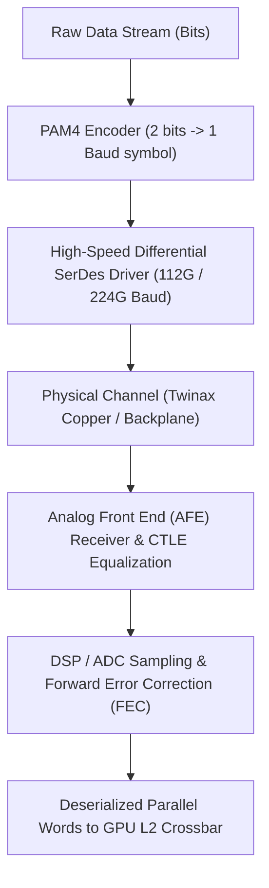
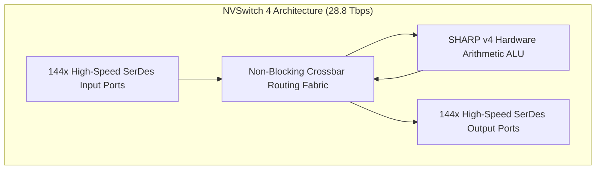
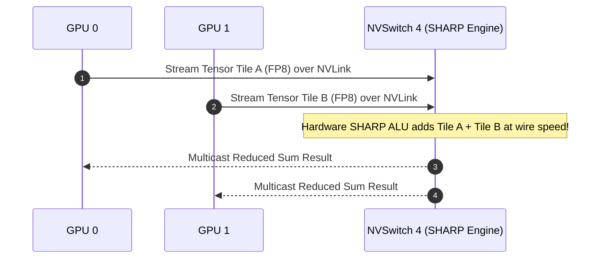

# Volume 16: NVLink Signaling (PAM4) & NVSwitch Silicon Generations

```text
====================================================================================================
MODULE 16: HIGH-SPEED DIFFERENTIAL SIGNALING, SERDES & NVSWITCH SILICON CROSSBARS
PLATFORMS: NVIDIA HOPPER | BLACKWELL (GB200 NVL72) | VERA RUBIN (NVL72)
====================================================================================================
```

Scaling AI compute beyond a single accelerator requires interconnects capable of moving Terabytes of data per second with sub-microsecond latencies. Traditional multi-drop buses and PCIe slots cannot deliver the bandwidth density required for trillion-parameter distributed matrix multiplications.

NVIDIA solved this with the **NVLink** protocol and **NVSwitch** crossbar silicon. By deploying high-speed differential SerDes with **Pulse Amplitude Modulation (PAM4)**, hardware error correction, and in-network reduction engines (**SHARP**), modern NVLink fabrics scale from intra-node baseboards to 72-GPU liquid-cooled rack-scale superchips. This volume explores the physical signaling layers of NVLink 4, 5, and 6, NVSwitch silicon generations, and hardware collective compute engines.

---

## 📑 Table of Contents
1. [The Physical Signaling Layer: NRZ vs. PAM4](#1-the-physical-signaling-layer-nrz-vs-pam4)
2. [NVLink Generational Evolution: NVLink 4 to NVLink 6](#2-nvlink-generational-evolution-nvlink-4-to-nvlink-6)
3. [NVSwitch Silicon Architecture: NVSwitch 3 to NVSwitch 6](#3-nvswitch-silicon-architecture-nvswitch-3-to-nvswitch-6)
4. [In-Network Computing: The SHARP Protocol Engine](#4-in-network-computing-the-sharp-protocol-engine)
5. [Signal Integrity: Eye Diagrams, SerDes & FEC](#5-signal-integrity-eye-diagrams-serdes--fec)
6. [Multi-Dimensional Architecture Correlation](#6-multi-dimensional-architecture-correlation)
7. [Hands-On NVLink Hardware Diagnostic & Error Lab](#7-hands-on-nvlink-hardware-diagnostic--error-lab)
8. [Practice Exercises & Verification Workbook](#8-practice-exercises--verification-workbook)

---

## 1. The Physical Signaling Layer: NRZ vs. PAM4

To transmit high-bandwidth digital data across copper traces and backplanes without doubling the physical clock frequency (which introduces unmanageable dielectric loss and radio-frequency radiation), modern SerDes transitioned from **NRZ (Non-Return-to-Zero)** to **PAM4 (Pulse Amplitude Modulation 4-Level)**:

```text
NRZ (2 Voltage Levels, 1 bit per Baud):
Voltage
 V1  ───┐   ┌───────┐       ┌───
        │   │       │       │       (1 Baud = 1 Bit)
 V0     └───┘       └───────┘───
 Bit:     0   1   1   0   0   1

PAM4 (4 Voltage Levels, 2 bits per Baud):
Voltage
 V3  ───────┐                       (Level 3: '11')
 V2         │   ┌───┐               (Level 2: '10') (1 Baud = 2 Bits)
 V1         └───┤   │   ┌───        (Level 1: '01')
 V0             └───┴───┘           (Level 0: '00')
 Bits:       11  01  10  00
```



### The Trade-off of PAM4:
* **Throughput**: Transmits **$2\times$ the data rate** at the same fundamental Nyquist frequency.
* **Signal-to-Noise Ratio (SNR)**: The voltage gap between adjacent levels is reduced by $3\times$ ($9.5\text{ dB}$ SNR penalty). To compensate, modern NVLink receivers incorporate digital signal processing (DSP) and hardware **Forward Error Correction (FEC)** to correct symbol errors in real time.

---

## 2. NVLink Generational Evolution: NVLink 4 to NVLink 6

```text
+--------------------------------------------------------------------------------------------------+
| NVLINK GENERATIONAL SPECIFICATIONS                                                               |
+---------------------+-----------------------+-------------------------+--------------------------+
| Architectural Metric| NVLink 4 (Hopper)     | NVLink 5 (Blackwell)    | NVLink 6 (Vera Rubin)    |
+---------------------+-----------------------+-------------------------+--------------------------+
| SerDes Baud Rate    | 112 Gbps PAM4         | 224 Gbps PAM4           | 224 Gbps+ Optimized PAM4 |
| Links per GPU       | 18 links              | 18 ports (36 links)     | 36 links                 |
| Bandwidth per Link  | 50 GB/s bidirectional | 100 GB/s bidirectional  | 200 GB/s bidirectional   |
| Peak Aggregate BW   | 900 GB/s per GPU      | 1.8 TB/s per GPU        | 3.6 TB/s per GPU         |
| Physical Interface  | SXM5 Baseboard traces | Twinax Copper Cartridge | High-Density Blind-Mate  |
| Protocol Feature    | Distributed Shared Mem| Native Micro-Precision  | Counted-Write Zero-Copy  |
+---------------------+-----------------------+-------------------------+--------------------------+
```

---

## 3. NVSwitch Silicon Architecture: NVSwitch 3 to NVSwitch 6

Connecting multiple GPUs into a full-mesh, non-blocking fabric requires dedicated crossbar routing ASICs: **NVSwitch**.

```text
NVSWITCH CHIP GENERATIONS:
┌─────────────────────────────────────────────────────────────────┐
│ NVSwitch 3 (Hopper Platform):                                   │
│ • Radix: 64 ports @ 100 Gbps SerDes (3.2 Tbps aggregate)        │
│ • Built-in SHARP v3 Engine (FP16 / FP32 in-network reduction)   │
├─────────────────────────────────────────────────────────────────┤
│ NVSwitch 4 (Blackwell Platform):                                │
│ • Radix: 144 ports @ 100 Gbps SerDes (28.8 Tbps aggregate)      │
│ • Built-in SHARP v4 Engine (Native FP8 & NVFP4 reduction)       │
├─────────────────────────────────────────────────────────────────┤
│ NVSwitch 6 (Vera Rubin Platform):                               │
│ • Radix: 57.6 Tbps aggregate non-blocking switching capacity    │
│ • Hardware In-Network Mixture-of-Experts (MoE) dispatch routing │
└─────────────────────────────────────────────────────────────────┘
```



---

## 4. In-Network Computing: The SHARP Protocol Engine

In standard distributed communication, computing an `AllReduce` requires data to travel from GPU 0 to GPU 1, where the GPU SMs perform the addition before writing back.

The **SHARP (Scalable Hierarchical Aggregation and Reduction Protocol)** engine built into NVSwitch offloads reduction operations directly onto the switch silicon:

```text
STANDARD ALLREDUCE VS. NVSWITCH SHARP IN-NETWORK REDUCTION:
┌────────────────────────────────────────────────────────────────────────┐
│ Standard AllReduce: Data routes to GPUs; SMs waste compute on addition │
│ GPU 0 ──► GPU 1 (SMs compute A + B) ──► GPU 2 (SMs compute + C) ──►... │
├────────────────────────────────────────────────────────────────────────┤
│ NVSwitch SHARP: Switching ASIC computes the math at line rate!         │
│ GPU 0 ──┐                                                              │
│ GPU 1 ──┼──► [ NVSwitch SHARP ALU: Fused Add ] ──► Broadcast Result    │
│ GPU 2 ──┘                                                              │
│ (Zero GPU SM cycles consumed! 2x fabric bandwidth efficiency!)         │
└────────────────────────────────────────────────────────────────────────┘
```



* **SHARP v4 Support**: Fused reductions in **FP8, FP4, BF16, and FP32**, cutting collective latency by up to **$50\%$**.

---

## 5. Signal Integrity: Eye Diagrams, SerDes & FEC

At 224 Gbps PAM4, a single bit symbol lasts less than **$9\text{ picoseconds}$**. High-frequency attenuation, crosstalk, and physical connector impedance cause signal degradation:

```text
PAM4 EYE DIAGRAM INTEGRITY:
Voltage
 V3 ─┐  ┌──┐  ┌──┐  ┌──┐
     │  │  │  │  │  │  │   ◄── Upper Eye
 V2 ─┼──┼──┼──┼──┼──┼──┼─
     │  │  │  │  │  │  │   ◄── Middle Eye  (If eyes close due to noise,
 V1 ─┼──┼──┼──┼──┼──┼──┼─                  SerDes loses lock -> CRC Errors!)
     │  │  │  │  │  │  │   ◄── Lower Eye
 V0 ─┴──┴──┴──┴──┴──┴──┴─
      Time
```

### Hardware Protection Layers:
1. **Continuous Time Linear Equalization (CTLE) & DFE**: High-speed analog filters boost attenuated high frequencies at the receiver.
2. **Reed-Solomon FEC (RS-FEC)**: Hardware mathematically reconstructs up to $N$ corrupted symbols per frame before payload delivery.
3. **Hardware CRC & Replay**: If FEC cannot correct a corrupted frame, the physical link engine re-transmits the frame at the hardware SerDes layer without involving the OS kernel.

---

## 6. Multi-Dimensional Architecture Correlation

```text
+--------------------------------------------------------------------------------------------------+
| MULTI-DIMENSIONAL CORRELATION: NVLINK & FABRICS                                                  |
+---------------------+----------------------------------------------------------------------------+
| Dimension           | Mechanism & Failure Manifestation                                          |
+---------------------+----------------------------------------------------------------------------+
| Fabric x Thermal    | Rising temperatures in copper cables or cold plates degrade SerDes analog  |
|                     | receiver margins, causing link eye closure and surging CRC error counts.   |
| Fabric x Kernel     | If an NVLink SerDes loses lock permanently, the driver logs kernel         |
|                     | **XID 92**, dropping the physical link and halting NCCL collectives.       |
| Fabric x Power      | Sudden power rail dips on NVSwitch trays cause packet drops and SerDes     |
|                     | re-training, freezing distributed AllReduce across the entire rack.        |
| Fabric x SRE        | A failed NVSwitch ASIC degrades bisection bandwidth from 1.8 TB/s to zero  |
|                     | on affected rails, requiring automated node draining and cordon.           |
+---------------------+----------------------------------------------------------------------------+
```

---

## 7. Hands-On NVLink Hardware Diagnostic & Error Lab

### Lab Objective:
Inspect physical NVLink port link states, verify transmission speeds, interrogate hardware CRC error counters, and identify link degradation.

### Step 1: Query NVLink Port Status and Link Speeds
Use `nvidia-smi` to verify that all physical NVLink ports are active and trained:

```bash
# Query NVLink connection status per port
nvidia-smi nvlink -s
```

*Expected Healthy Output (Blackwell B200 / Hopper H100):*
```text
GPU 0: NVIDIA B200 (UUID: GPU-...)
  Link 0: Up, 100.000 GB/s
  Link 1: Up, 100.000 GB/s
  ...
  Link 17: Up, 100.000 GB/s
```

### Step 2: Query Hardware Error & Replay Counters
Inspect link integrity registers for physical SerDes degradation:

```bash
# Check recovery and CRC error counters across all links
nvidia-smi nvlink -e
```

*Expected Healthy Output:*
```text
GPU 0: NVIDIA B200 (UUID: GPU-...)
  Link 0:
    Recovery Errors: 0
    CRC Errors:      0
  Link 1:
    Recovery Errors: 0
    CRC Errors:      0
```
*Triage Trigger*: If `CRC Errors` or `Recovery Errors` are continuously incrementing, the physical copper trace or cartridge connection is degraded, preceding an impending **XID 92** crash.

---

## 8. Practice Exercises & Verification Workbook

### Exercise 16.1: NVLink 5 Bisection Bandwidth Math
* **Scenario**: A Blackwell B200 GPU has 18 NVLink 5 ports. Each port runs on 224 Gbps PAM4 SerDes, delivering $100\text{ GB/s}$ bidirectional bandwidth per port.
* **Task**: Calculate the total aggregate bidirectional bandwidth of the GPU in Terabytes per second ($\text{TB/s}$).
* **Solution**:
  $$\text{Total Bandwidth} = 18 \text{ ports} \times 100.0 \text{ GB/s/port} = 1,800 \text{ GB/s} = 1.8 \text{ TB/s}$$
  *Result*: The GPU delivers **$1.8\text{ TB/s}$** of bidirectional interconnect bandwidth ($900\text{ GB/s}$ transmit + $900\text{ GB/s}$ receive).

### Exercise 16.2: Deciphering Kernel XID 92
* **Scenario**: A cluster node running distributed training drops out with the following log in `/var/log/syslog`:
  ```text
  NVRM: Xid (PCI:0000:0f:00): 92, High-speed link SerDes lock lost on NVLink 4.
  ```
* **Task**: Explain the physical root cause and outline the diagnostic recovery steps.
* **Solution**:
  * **Root Cause**: XID 92 indicates that the high-speed SerDes receiver on Link 4 lost physical signal synchronization (eye closure, excessive CRC errors, or hardware failure).
  * **Triage Steps**:
    1. Query error counters: `nvidia-smi nvlink -e` to identify the failing link.
    2. Check NVSwitch daemon health: `systemctl status nvidia-fabricmanager`.
    3. Run NVVS Level 3 hardware diagnostics: `dcgmi diag -r 3`.
    4. If the error reoccurs after a system reboot and fabric manager restart, replace the physical baseboard or cartridge.

---

## 📌 Summary Checklist: What You Have Mastered
- [x] PAM4 differential signaling physics vs. NRZ (voltage thresholds, SNR, and FEC).
- [x] Generational specs from NVLink 4 (900 GB/s) to NVLink 5 (1.8 TB/s) and NVLink 6 (3.6 TB/s).
- [x] NVSwitch 3, 4, and 6 silicon architecture and non-blocking crossbar routing.
- [x] The SHARP protocol engine for in-network hardware reduction offload.
- [x] High-speed SerDes signal integrity, eye diagrams, and hardware replay mechanisms.
- [x] Inspecting NVLink status, error registers, and diagnosing XID 92 link drops.
