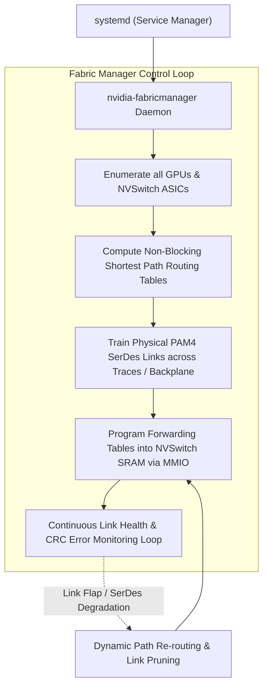
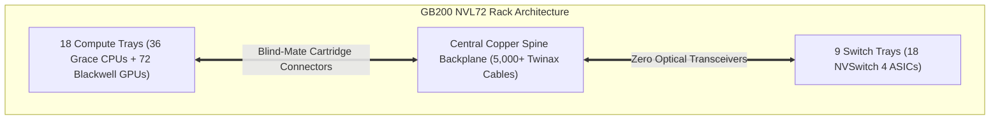

# Volume 17: NVSwitch Fabric Manager & Rack Topologies (NVL72 Spine)

```text
====================================================================================================
MODULE 17: FABRIC ROUTING DAEMONS, HGX BASEBOARDS & GB200 NVL72 COPPER BACKPLANES
PLATFORMS: NVIDIA HGX H100/B200 | DGX H100 | GB200 NVL72 | VERA RUBIN NVL72
====================================================================================================
```

While physical SerDes and copper cables establish the raw physical connections between GPUs and NVSwitches, high-speed fabrics cannot transmit a single packet without an intelligent software control plane to discover topology, compute non-blocking routes, train physical links, and dynamically isolate degraded SerDes lines.

That control plane is the **NVIDIA Fabric Manager (`nvidia-fabricmanager`)**. Furthermore, as AI infrastructure evolved from 8-GPU baseboards (HGX) to rack-scale superchips (**GB200 NVL72** and **Vera Rubin NVL72**), rack engineering underwent a fundamental shift—replacing power-hungry optical transceivers with massive **copper backplane spines**. This volume explores the architecture of the Fabric Manager daemon, HGX baseboard meshes, and the mechanical and electrical engineering of the NVL72 spine.

---

## 📑 Table of Contents
1. [The Role of the Fabric Manager Daemon](#1-the-role-of-the-fabric-manager-daemon)
2. [Fabric Manager Lifecycle & Topology Discovery](#2-fabric-manager-lifecycle--topology-discovery)
3. [Intra-Node Mesh Topologies: HGX H100 vs. HGX B200](#3-intra-node-mesh-topologies-hgx-h100-vs-hgx-b200)
4. [Hyperscale NVL Systems: The GB200 NVL72 Architecture](#4-hyperscale-nvl-systems-the-gb200-nvl72-architecture)
5. [The Copper Spine Backplane Engineering](#5-the-copper-spine-backplane-engineering)
6. [Multi-Dimensional Architecture Correlation](#6-multi-dimensional-architecture-correlation)
7. [Hands-On Fabric Manager & Topology Diagnostic Lab](#7-hands-on-fabric-manager--topology-diagnostic-lab)
8. [Practice Exercises & Verification Workbook](#8-practice-exercises--verification-workbook)

---

## 1. The Role of the Fabric Manager Daemon

In single-GPU or point-to-point PCIe systems, no external fabric coordinator is required. However, in any system with **NVSwitch ASICs** (such as HGX baseboards or NVL racks):

```text
WHAT HAPPENS WITHOUT FABRIC MANAGER:
┌────────────────────────────────────────────────────────────────────────┐
│ 1. NVSwitch crossbar routing tables remain unprogrammed.               │
│ 2. NVLink ports remain in a training / quiescent state.                │
│ 3. Any inter-GPU P2P transfer or NCCL collective FAILS with:          │
│    "cudaErrorPeerAccessUnsupported" or NCCL initialization timeouts!   │
└────────────────────────────────────────────────────────────────────────┘
```

The **Fabric Manager (`nvlink-fabric-manager`)** is a dedicated background system daemon running in host user space. It communicates with the kernel driver (`nvidia.ko`) and NVSwitch device nodes (`/dev/nvidia-nvswitch*`) to dynamically manage the routing fabric.



---

## 2. Fabric Manager Lifecycle & Topology Discovery

When `nvidia-fabricmanager.service` boots:
1. **Device Discovery**: Reads `/dev/nvidiactl` and `/dev/nvidia-nvswitch*` to detect all resident GPUs and NVSwitches.
2. **Topology Verification**: Matches detected connections against golden topology definitions in `/usr/share/nvidia/nvswitch/`.
3. **Partition Table Programming**: Programs crossbar ingress and egress forwarding tables so that every GPU can reach every other GPU in the fabric with uniform hop count.
4. **Link Training**: Initiates hardware training sequences on 112G/224G PAM4 SerDes, validating eye openings and locking clock recovery units.

```text
FABRIC MANAGER CONFIGURATION & LOG LOCATIONS:
┌─────────────────────────────────────────────────────────────────┐
│ Main Configuration File : `/etc/nvidia/fabricmanager.conf`      │
│ Target Topology Specs   : `/usr/share/nvidia/nvswitch/`         │
│ Runtime Event Log       : `/var/log/nvidia-fabricmanager.log`   │
│ Device Nodes Controlled : `/dev/nvidia-nvswitch[0-N]`           │
└─────────────────────────────────────────────────────────────────┘
```

---

## 3. Intra-Node Mesh Topologies: HGX H100 vs. HGX B200

```text
+--------------------------------------------------------------------------------------------------+
| HGX BASEBOARD ARCHITECTURAL COMPARISON                                                           |
+---------------------+-------------------------------+------------------------------------------+
| Specification       | HGX H100 / H200 (8-GPU)       | HGX B200 (8-GPU)                         |
+---------------------+-------------------------------+------------------------------------------+
| GPU Accelerators    | 8x SXM5 H100/H200 GPUs        | 8x B200 SXM GPUs                         |
| NVSwitch Count      | 4x NVSwitch 3 ASICs on board  | 4x NVSwitch 4 ASICs on board             |
| SerDes Rate         | 112 Gbps PAM4                 | 224 Gbps PAM4                            |
| Bandwidth per GPU   | 900 GB/s bidirectional        | 1.8 TB/s bidirectional                   |
| Aggregate Fabric BW | 7.2 TB/s bisection            | 14.4 TB/s bisection                      |
| Host Connections    | 8x PCIe Gen 5 x16 to Host CPU | 8x PCIe Gen 5/6 x16                      |
| Peak Thermal Load   | ~10.2 kW per chassis          | ~14.4 kW per chassis                     |
+---------------------+-------------------------------+------------------------------------------+
```

```text
HGX 8-GPU BASEBOARD CROSSBAR TOPOLOGY:
┌────────────────────────────────────────────────────────────────────────┐
│                             HGX BASEBOARD                              │
│                                                                        │
│   [GPU 0]   [GPU 1]   [GPU 2]   [GPU 3]   [GPU 4]   [GPU 5]  ... [GPU 7]│
│      │         │         │         │         │         │            │   │
│      └───┬─────┴────┬────┴────┬────┴────┬────┴────┬────┴──────┬─────┘   │
│          ▼          ▼         ▼         ▼         ▼           ▼         │
│     ┌─────────┐┌─────────┐┌─────────┐┌─────────┐                        │
│     │NVSwitch0││NVSwitch1││NVSwitch2││NVSwitch3│ (4 On-Board ASICs)    │
│     └─────────┘└─────────┘└─────────┘└─────────┘                        │
│          ▲          ▲         ▲         ▲                               │
│          └──────────┴─────────┴─────────┘                               │
│              Full Non-Blocking Crossbar Mesh (Zero Oversubscription)     │
└────────────────────────────────────────────────────────────────────────┘
```

In the HGX baseboard, the 8 GPUs connect to all 4 NVSwitches in parallel. Each GPU routes a fraction of its links to each switch, ensuring that any GPU can communicate with any other GPU with **exactly 1 switch hop** and zero bandwidth oversubscription.

---

## 4. Hyperscale NVL Systems: The GB200 NVL72 Architecture

With the Blackwell architecture, NVIDIA broke beyond the 8-GPU chassis limit to create the **GB200 NVL72**: a single, liquid-cooled, rack-scale supercomputer acting as **one giant logical GPU**:

```text
GB200 NVL72 RACK SPECIFICATIONS:
┌─────────────────────────────────────────────────────────────────┐
│ Rack Height & Form Factor   : 48U / 54U Custom High-Density Rack│
│ Total Weight (Populated)    : ~4,000 lbs (~1,814 kg)            │
│ Compute Trays               : 18x 2U Trays (2 Grace + 4 B200 ea)│
│ Total Processors            : 36 Grace CPUs + 72 Blackwell GPUs │
│ Switch Trays                : 9x 2U Trays (2 NVSwitch 4s each)  │
│ Total NVSwitch ASICs        : 18x NVSwitch 4 ASICs              │
│ Total Unified Fast Memory   : 13.8 TB HBM3e + 17.2 TB LPDDR5X   │
│ Scale-Up Fabric Bandwidth   : 130 TB/s aggregate bisection BW   │
│ Peak Inference Compute      : 1.44 EFLOPS (1,440 PFLOPS) NVFP4  │
│ Power Budget & Cooling      : 120 kW per rack (100% Liquid)     │
└─────────────────────────────────────────────────────────────────┘
```



---

## 5. The Copper Spine Backplane Engineering

In traditional multi-node clusters, scaling interconnects across 72 GPUs would require thousands of optical transceivers (OSFP/QSFP cages) and optical fiber cables.

```text
+--------------------------------------------------------------------------------------------------+
| OPTICAL CLUSTERING VS. NVL72 PASSIVE COPPER BACKPLANE                                            |
+---------------------+-------------------------------+------------------------------------------+
| Engineering Factor  | Traditional Optical Interconnect| GB200 NVL72 Passive Copper Spine       |
+---------------------+-------------------------------+------------------------------------------+
| Interconnect Medium | Optical Transceivers + Fiber  | 5,000+ Passive Twinax Direct-Attach Cable|
| Transceiver Power   | ~15 to 20 Watts per transceiver| 0 Watts (Passive physical copper)        |
| Power Overhead      | ~20,000 Watts (20 kW) wasted  | 0 kW power overhead (Saves 20 kW/rack!)  |
| Failure Points      | Thousands of optical lasers   | Solid copper wires (Near-zero failure)   |
| Latency Overhead    | Optical-to-electrical conversion| Pure speed of light in copper (<5 ns/m)  |
| Tray Serviceability | Fragile optical fiber bundles | Rigid blind-mate zero-insertion cartridges|
+---------------------+-------------------------------+------------------------------------------+
```

```text
COPPER SPINE BLIND-MATE REAR BACKPLANE ARCHITECTURE:
┌────────────────────────────────────────────────────────────────────────┐
│                        REAR OF NVL72 RACK                              │
│                                                                        │
│   Compute Tray Slide-In ──► [ Blind-Mate QD ] ──► Central Twinax Bus   │
│                             (Direct High-Speed    (Over 2 miles of     │
│                              Cartridge Mate)       copper wiring!)     │
│                                                          │             │
│   Switch Tray Slide-In  ──► [ Blind-Mate QD ] ───────────┘             │
│                                                                        │
│   (Engineers can pull out a compute tray from the front; the rear      │
│    disconnects and connects automatically without touching cables!)    │
└────────────────────────────────────────────────────────────────────────┘
```

---

## 6. Multi-Dimensional Architecture Correlation

```text
+--------------------------------------------------------------------------------------------------+
| MULTI-DIMENSIONAL CORRELATION: FABRICS & RACK INFRASTRUCTURE                                     |
+---------------------+----------------------------------------------------------------------------+
| Dimension           | Mechanism & Failure Manifestation                                          |
+---------------------+----------------------------------------------------------------------------+
| Fabric x Systemd    | If `nvidia-fabricmanager` service crashes or fails to start on boot, all   |
|                     | multi-GPU NCCL jobs abort with "P2P engine initialization failed".         |
| Fabric x Thermal    | Degradation of cooling in the switch trays increases NVSwitch junction     |
|                     | temperatures, inducing thermal throttling and link SerDes bit errors.      |
| Fabric x Electrical | The 18 switch trays draw massive 54V DC power; voltage fluctuations cause   |
|                     | SerDes retraining events, manifesting as transient cluster network hangs.  |
| Fabric x SRE        | A bent pin on a rear blind-mate cartridge connector causes persistent      |
|                     | XID 92 errors on all links terminating at that specific compute tray.      |
+---------------------+----------------------------------------------------------------------------+
```

---

## 7. Hands-On Fabric Manager & Topology Diagnostic Lab

### Lab Objective:
Inspect the Fabric Manager service, query inter-GPU interconnect topologies with `nvidia-smi topo`, interrogate NVSwitch device nodes, and diagnose routing failures.

### Step 1: Verify Fabric Manager Service Operational Status
Check that the systemd daemon is active and running cleanly:

```bash
# Verify Fabric Manager systemd service
systemctl status nvidia-fabricmanager.service --no-pager
```

*Expected Active Output:*
```text
● nvidia-fabricmanager.service - NVIDIA Fabric Manager
     Loaded: loaded (/lib/systemd/system/nvidia-fabricmanager.service; enabled)
     Active: active (running) since Mon 2026-09-28 05:30:00 UTC; 1h ago
   Main PID: 1245 (nv-fabricmanage)
      Tasks: 14 (limit: 1200000)
```

### Step 2: Inspect Multi-GPU Interconnect Matrix
Use `nvidia-smi topo -m` to inspect inter-GPU connectivity:

```bash
# Query complete interconnect topology matrix
nvidia-smi topo -m
```

*Expected Output Legend (HGX / NVL system):*
```text
        GPU0    GPU1    GPU2    GPU3    GPU4    GPU5    GPU6    GPU7
GPU0     X      NV18    NV18    NV18    NV18    NV18    NV18    NV18
GPU1    NV18     X      NV18    NV18    NV18    NV18    NV18    NV18
...
Legend:
  X    = Self
  NV18 = Connected via 18 NVLink 5 links (via NVSwitch Fabric)
  SYS  = Traverses Host System Memory / PCIe (Degraded State!)
```
*Critical Triage Alert*: If any cell reports `SYS` or `NODE` instead of `NV#` on an HGX/NVL node, the Fabric Manager is either unprogrammed or physical links have failed!

### Step 3: Inspect Fabric Manager Runtime Log
Triage link training errors and switch initialization via logs:

```bash
# Tail the runtime fabric manager log
sudo tail -n 50 /var/log/nvidia-fabricmanager.log
```

---

## 8. Practice Exercises & Verification Workbook

### Exercise 17.1: NVL72 Bisection Bandwidth Calculation
* **Scenario**: The GB200 NVL72 interconnects 72 Blackwell GPUs. Each GPU has 18 NVLink 5 ports, with each port delivering $100\text{ GB/s}$ bidirectional bandwidth ($50\text{ GB/s}$ TX + $50\text{ GB/s}$ RX). The rack uses a non-blocking full-bisection topology across 18 NVSwitch 4 chips.
* **Task**: Calculate the aggregate bidirectional scale-up bisection bandwidth of the entire rack fabric.
* **Solution**:
  1. *Per-GPU Bandwidth*:
     $$\text{BW}_{\text{GPU}} = 18 \text{ ports} \times 100 \text{ GB/s} = 1,800 \text{ GB/s} = 1.8 \text{ TB/s}$$
  2. *Total 72-GPU Raw Link Capacity*:
     $$\text{BW}_{\text{total}} = 72 \text{ GPUs} \times 1.8 \text{ TB/s} = 129.6 \text{ TB/s} \approx 130 \text{ TB/s}$$
  *Result*: The GB200 NVL72 delivers **$130\text{ TB/s}$** of non-blocking bisection bandwidth, allowing all 72 GPUs to exchange data at wire speed as a single unified accelerator.

### Exercise 17.2: Fabric Manager Failure Triage
* **Scenario**: An administrator adds a new node to a Slurm cluster. When users run PyTorch DDP training across the 8 GPUs in the node, the job crashes with:
  ```text
  RuntimeError: NCCL error in: .../ProcessGroupNCCL.cpp: Distributed collective failed: 
  remote process unhandled system error / P2P disabled.
  ```
  `nvidia-smi topo -m` shows `SYS` across all GPU pairs.
* **Task**: State the immediate diagnostic check and recovery command.
* **Solution**:
  1. *Root Cause*: The NVSwitches are unconfigured because `nvidia-fabricmanager` is not running.
  2. *Verification*:
     ```bash
     systemctl is-active nvidia-fabricmanager
     ```
  3. *Recovery*:
     ```bash
     sudo systemctl enable --now nvidia-fabricmanager
     ```
     Once active, verify with `nvidia-smi topo -m` that links transition from `SYS` to `NV18`.

---

## 📌 Summary Checklist: What You Have Mastered
- [x] The operational role of the `nvidia-fabricmanager` routing control plane.
- [x] Fabric Manager topology discovery, routing table programming, and link training.
- [x] Intra-node crossbar mesh design in HGX H100 and HGX B200 baseboards.
- [x] GB200 NVL72 rack-scale architecture: 36 Grace CPUs, 72 Blackwell GPUs, and 18 NVSwitches.
- [x] Passive copper spine backplane engineering and saving 20 kW of optical transceiver power.
- [x] Diagnosing fabric failures with `nvidia-smi topo -m` and `/var/log/nvidia-fabricmanager.log`.
