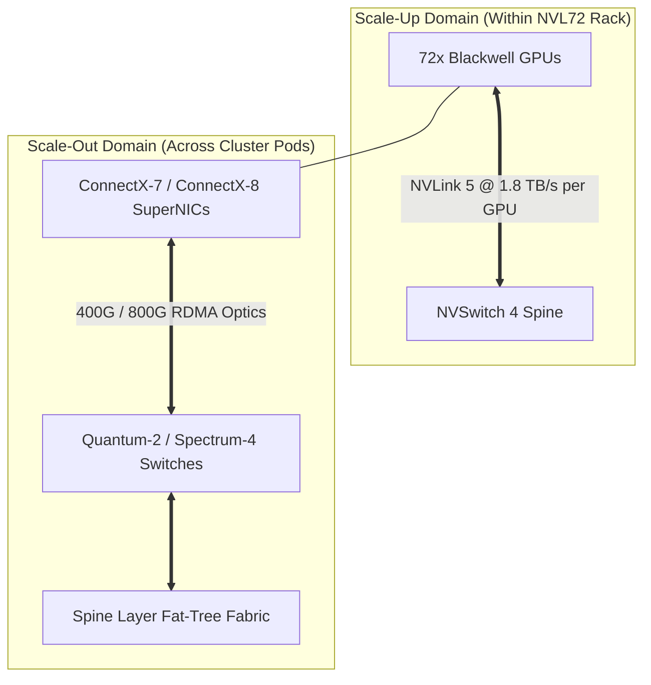

```mermaid
graph TD
    subgraph SpectrumX_Pipeline["Spectrum-X Dynamic Packet Spraying Engine"]
        BigFlow["Large AI Collective RDMA Flow (e.g., 10 GB AllGather)"] --> IngressNIC["ConnectX-7 SuperNIC"]
        IngressNIC --> Packetize["Divide into 4KB MTU Packets"]
        Packetize --> Spray["Spray Packets across ALL Available ECMP Paths (Path 1 to 8)"]
        Spray --> SwitchFabric["Spectrum-4 Switches (Dynamically Shared 160MB Buffers)"]
        SwitchFabric --> EgressNIC["Receiving ConnectX-7 SuperNIC"]
        EgressNIC --> ReorderBuffer["Hardware Reorder Buffer (Restores In-Order Alignment)"]
        ReorderBuffer --> DestinationHBM["Deliver Directly to GPU HBM via GPUDirect RDMA"]
    end
```

# Volume 18: Scale-Out Networks: Quantum InfiniBand vs. Spectrum-X RoCE

```text
====================================================================================================
MODULE 18: SCALE-OUT FABRICS, QUANTUM INFINIBAND & SPECTRUM-X AI ETHERNET
PLATFORMS: NVIDIA QUANTUM-2 (NDR) / QUANTUM-X800 (XDR) | SPECTRUM-4 / SPECTRUM-X800
====================================================================================================
```

While NVLink provides unprecedented bandwidth for scale-up computing within a single node or NVL rack, training frontier foundation models and deploying massive inference clusters requires scaling across hundreds of racks to **tens of thousands of GPUs**. At this scale, the interconnect fabric transitions from copper traces to high-speed **Scale-Out Networking**.

NVIDIA approaches scale-out networking through two complementary, high-performance platforms: **Quantum InfiniBand** (the gold standard for pure HPC and ultra-low-latency loss-free networks) and **Spectrum-X AI Ethernet** (engineered to bring InfiniBand-class loss-free performance to standard enterprise Ethernet clouds). This volume provides a deep-dive architectural comparison of both ecosystems, examining credit-based flow control, Dynamic Packet Spraying, RoCEv2, and rail-optimized network topologies.

---

## 📑 Table of Contents
1. [Scale-Up vs. Scale-Out Network Boundaries](#1-scale-up-vs-scale-out-network-boundaries)
2. [The Quantum InfiniBand Ecosystem (Quantum-2 & Quantum-X800)](#2-the-quantum-infiniband-ecosystem-quantum-2--quantum-x800)
3. [InfiniBand Flow Control, Adaptive Routing & SHARP](#3-infiniband-flow-control-adaptive-routing--sharp)
4. [Spectrum-X AI Ethernet: Reinventing RoCEv2](#4-spectrum-x-ai-ethernet-reinventing-rocev2)
5. [Rail-Optimized Interconnect Topologies](#5-rail-optimized-interconnect-topologies)
6. [Multi-Dimensional Architecture Correlation](#6-multi-dimensional-architecture-correlation)
7. [Hands-On Fabric Inspection & Link Verification Lab](#7-hands-on-fabric-inspection--link-verification-lab)
8. [Practice Exercises & Verification Workbook](#8-practice-exercises--verification-workbook)

---

## 1. Scale-Up vs. Scale-Out Network Boundaries

```text
+--------------------------------------------------------------------------------------------------+
| CLUSTER INTERCONNECT HIERARCHY                                                                   |
+---------------------+-------------------------------+------------------------------------------+
| Dimension           | Scale-Up Fabric (NVLink / NVSwitch) | Scale-Out Fabric (InfiniBand / Spectrum-X)|
+---------------------+-------------------------------+------------------------------------------+
| Physical Reach      | < 3 meters (Intra-Node / Rack)| Tens of meters to kilometers (Pod / Cluster)
| Transmission Medium | Passive Copper Spine / Traces | Active Optical Cables (AOC) / Transceivers
| Bisection Bandwidth | 1.8 TB/s to 3.6 TB/s per GPU  | 400 Gbps to 1.6 Tbps (50 to 200 GB/s)    |
| Protocol Type       | Memory Bus Protocol (Load/Store)| Message Passing / RDMA (Send/Recv/Put/Get)|
| Maximum Scale       | Up to 72 GPUs (NVL72)         | Up to 100,000+ GPUs                      |
| Primary Function    | Tensor & Pipeline Parallelism | Data, Sequence & Expert (MoE) Parallelism|
+---------------------+-------------------------------+------------------------------------------+
```



---

## 2. The Quantum InfiniBand Ecosystem (Quantum-2 & Quantum-X800)

**InfiniBand** is a native, hardware-offloaded networking architecture specifically designed for low-latency, high-throughput distributed computing:

```text
+--------------------------------------------------------------------------------------------------+
| QUANTUM INFINIBAND SWITCH ASICS                                                                  |
+---------------------+-------------------------------+------------------------------------------+
| Specification       | Quantum-2 (QM9700 / QM9790)   | Quantum-X800 (Q3400-LD)                  |
+---------------------+-------------------------------+------------------------------------------+
| Port Generation     | NDR (400 Gbps per port)       | XDR (800 Gbps per port)                  |
| Port Density        | 64x 400G ports (or 128x 200G) | 144x 800G ports                          |
| Aggregate Switching | 51.2 Tbps non-blocking        | 115.2 Tbps non-blocking                  |
| Packet Forwarding   | 66.5 Billion packets / sec    | > 140 Billion packets / sec              |
| Port-to-Port Latency| ~50 nanoseconds               | < 40 nanoseconds                         |
| Cooling System      | Air-Cooled or Liquid-Cooled   | Direct-to-Chip Liquid Cooling            |
| In-Network Compute  | SHARP v3 Hardware Offload     | SHARP v4 (FP8/FP4 In-Network Reduction)  |
+---------------------+-------------------------------+------------------------------------------+
```

---

## 3. InfiniBand Flow Control, Adaptive Routing & SHARP

### Credit-Based Flow Control (100% Loss-Free):
Unlike standard Ethernet, which drops packets when buffers overflow, InfiniBand uses **hop-by-hop credit-based flow control**:
* An upstream transmitter will **never transmit a packet unless the downstream receiver has explicitly issued a credit** guaranteeing buffer availability.
* **Result**: Zero packet drops due to congestion, completely eliminating TCP retransmission pauses and tail latency.

### Hardware Adaptive Routing (AR):
Traditional networks use ECMP (Equal-Cost Multi-Path) hashing, mapping an entire TCP/RDMA flow to a single physical path. If two large flows hash to the same link, an **incast congestion collision** occurs.
* In Quantum InfiniBand, the switch hardware breaks flows into individual packets and dynamically sprays them across all available non-congested paths (**Adaptive Routing**).
* The receiving ConnectX HCA reorders packets at wire speed with zero software overhead.

---

## 4. Spectrum-X AI Ethernet: Reinventing RoCEv2

Standard enterprise data centers often mandate Ethernet infrastructure. However, standard Ethernet running **RoCEv2 (RDMA over Converged Ethernet)** suffers from severe performance degradation under AI workloads due to **PFC deadlocks, hash collisions, and buffer saturation**.

NVIDIA created **Spectrum-X**: an end-to-end AI Ethernet platform combining **Spectrum-4/X800 switches** and **ConnectX-7/8 SuperNICs**:

```text
+--------------------------------------------------------------------------------------------------+
| STANDARD ROCEV2 VS. SPECTRUM-X ENHANCED AI ETHERNET                                             |
+---------------------+-------------------------------+------------------------------------------+
| Feature             | Standard Enterprise RoCEv2    | NVIDIA Spectrum-X Platform               |
+---------------------+-------------------------------+------------------------------------------+
| Path Selection      | Static Flow-Hash ECMP         | Hardware Dynamic Packet Spraying         |
| Congestion Control  | Reactive ECN / DCQCN          | Fast Congestion Notification (RTT Microsec|
| Packet Loss Protect | Priority Flow Control (PFC)   | Watchdog Timers & Deadlock Elimination   |
| Packet Reordering   | Software Drop & Resend        | SuperNIC Hardware In-Line Reorder Buffers|
| Buffer Architecture | Static Partitioned Buffers    | 160 MB Dynamically Shared Microburst Buf |
| Collective Effective| 50% - 60% of Line Rate        | > 95% Effective Network Bandwidth        |
+---------------------+-------------------------------+------------------------------------------+
```



---

## 5. Rail-Optimized Interconnect Topologies

In high-performance multi-node clusters (e.g., DGX SuperPODs with 8 GPUs per node):

```text
RAIL-OPTIMIZED NETWORK ARCHITECTURE:
┌────────────────────────────────────────────────────────────────────────┐
│ Node 0:   [GPU 0]  [GPU 1]  [GPU 2]  [GPU 3]  [GPU 4]  ... [GPU 7]     │
│              │        │        │        │        │            │        │
│              ▼        ▼        ▼        ▼        ▼            ▼        │
│           [HCA 0]  [HCA 1]  [HCA 2]  [HCA 3]  [HCA 4]  ... [HCA 7]     │
│              │        │        │        │        │            │        │
│ ═════════════╪════════╪════════╪════════╪════════╪════════════╪═══════ │
│              ▼        ▼        ▼        ▼        ▼            ▼        │
│ Fabric:   [Rail 0] [Rail 1] [Rail 2] [Rail 3] [Rail 4] ... [Rail 7]    │
│              ▲        ▲        ▲        ▲        ▲            ▲        │
│ ═════════════╪════════╪════════╪════════╪════════╪════════════╪═══════ │
│              │        │        │        │        │            │        │
│ Node 1:   [HCA 0]  [HCA 1]  [HCA 2]  [HCA 3]  [HCA 4]  ... [HCA 7]     │
│              │        │        │        │        │            │        │
│           [GPU 0]  [GPU 1]  [GPU 2]  [GPU 3]  [GPU 4]  ... [GPU 7]     │
└────────────────────────────────────────────────────────────────────────┘
```

* **The Rail Principle**: All GPU 0s across all cluster nodes connect to **Rail 0 switches**; all GPU 1s connect to **Rail 1 switches**, and so on.
* **Why This Matters**: During Tensor Parallel or Data Parallel AllReduce operations, traffic between corresponding GPU ranks never crosses different network rails, eliminating inter-switch oversubscription bottlenecks.

---

## 6. Multi-Dimensional Architecture Correlation

```text
+--------------------------------------------------------------------------------------------------+
| MULTI-DIMENSIONAL CORRELATION: SCALE-OUT NETWORKING                                              |
+---------------------+----------------------------------------------------------------------------+
| Dimension           | Mechanism & Failure Manifestation                                          |
+---------------------+----------------------------------------------------------------------------+
| Network x Thermal   | Optical transceivers operating above 70°C experience laser wavelength drift,|
|                     | triggering bit errors, link retraining, and sudden latency spikes.         |
| Network x Kernel    | Dropped packets on RoCE without Spectrum-X hardware reordering cause      |
|                     | kernel socket timeouts and distributed NCCL watchdog aborts.               |
| Network x Collective| A single slow link (straggler) on one network rail throttles the entire    |
|                     | cluster AllReduce, reducing effective GPU Model Flops Utilization (MFU).   |
| Network x SRE       | High `PortXmitWait` counters in InfiniBand indicate downstream congestion  |
|                     | or buffer credit exhaustion, pointing to failing switch ASICs.             |
+---------------------+----------------------------------------------------------------------------+
```

---

## 7. Hands-On Fabric Inspection & Link Verification Lab

### Lab Objective:
Inspect physical HCA port link states, verify active InfiniBand link speeds (NDR/XDR), query hardware error counters, and inspect RoCE PFC configurations.

### Step 1: Interrogate InfiniBand HCA Status
Use `ibstat` and `ibstatus` to inspect physical HCA adapters:

```bash
# Query InfiniBand port status, rate, and physical state
ibstat
```

*Expected Healthy Output (ConnectX-7 NDR 400G):*
```text
CA 'mlx5_0'
    CA type: MT4129
    Number of ports: 1
    Firmware version: 28.39.1002
    Port 1:
        State: Active
        Physical state: LinkUp
        Rate: 400 Gb/sec (4X NDR)
        Link layer: InfiniBand
```

### Step 2: Query Physical Port Error Counters with perfquery
Interrogate hardware error registers for link integrity degradation:

```bash
# Query port performance and error counters on mlx5_0 port 1
perfquery -C mlx5_0 -p 1
```

*Key Metrics to Validate:*
* `PortXmitWait == 0`: Indicates zero cycles where the port had packets ready to transmit but was blocked waiting for credits.
* `SymbolErrorCounter == 0`: Confirms zero physical SerDes bit errors on the optical cable.
* `PortRcvErrors == 0`: Confirms zero corrupted packets received.

### Step 3: Inspect RoCE Priority Flow Control (PFC) Mapping
On Spectrum-X / Ethernet clusters, inspect quality of service (QoS) mappings:

```bash
# Query active PFC priority queues and ECN configurations
mlnx_qos -i eth0
```

---

## 8. Practice Exercises & Verification Workbook

### Exercise 18.1: InfiniBand vs. TCP AllReduce Latency Math
* **Scenario**: A distributed cluster executes an AllReduce operation on an $8\text{ MB}$ tensor across 128 GPUs.
  * Over standard TCP/IP over Ethernet, software kernel stack transitions, memory copies, and flow hashing introduce an effective latency of $12.5\text{ ms}$.
  * Over Quantum-2 InfiniBand with GPUDirect RDMA and SHARP in-network compute, the AllReduce executes at line rate in $180\ \mu\text{s}$.
* **Task**: Calculate the speedup factor achieved by InfiniBand over TCP/IP.
* **Solution**:
  $$\text{Speedup} = \frac{T_{\text{TCP}}}{T_{\text{IB}}} = \frac{12,500 \ \mu\text{s}}{180 \ \mu\text{s}} \approx 69.44$$
  *Result*: InfiniBand accelerates the collective communication phase by **$\sim 69\times$**, transforming an unviable distributed job into a highly scalable training pipeline.

### Exercise 18.2: Spectrum-X Dynamic Packet Spraying Benefit
* **Scenario**: Two large 400 Gbps elephant flows must traverse a 2-tier leaf-spine network with 8 available equal-cost paths.
* **Task**: Explain what happens under standard ECMP flow hashing vs. Spectrum-X Dynamic Packet Spraying.
* **Solution**:
  * **Standard ECMP**: Uses a 5-tuple hash of the packet header. By probability ($1/8$), both elephant flows frequently hash to the *same* physical link. That link saturates at 400 Gbps while the other 7 links sit idle ($87.5\%$ bandwidth wasted), causing packet drops and PFC pause storms.
  * **Spectrum-X**: Breaks both elephant flows into individual 4KB MTU packets and sprays them across all 8 links simultaneously. All links operate at balanced utilization ($100\%$ efficiency), and the receiving SuperNIC reassembles packets in hardware.

---

## 📌 Summary Checklist: What You Have Mastered
- [x] The boundary between Scale-Up (NVLink) and Scale-Out (InfiniBand/RoCE) networks.
- [x] Quantum-2 (400G NDR) and Quantum-X800 (800G XDR) switch ASIC specifications.
- [x] InfiniBand hop-by-hop credit-based flow control and hardware Adaptive Routing.
- [x] Spectrum-X AI Ethernet innovations: Dynamic Packet Spraying and hardware reorder buffers.
- [x] Rail-optimized network topologies across GPU SuperPODs.
- [x] Inspecting fabric health with `ibstat`, `perfquery`, and `mlnx_qos`.
