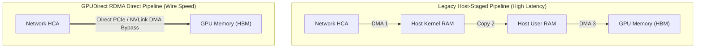
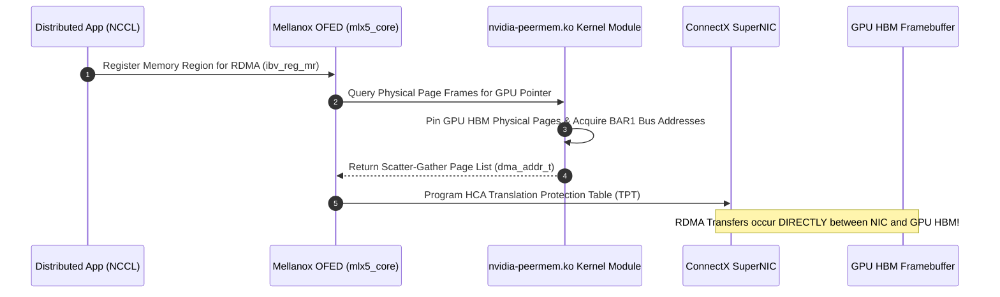
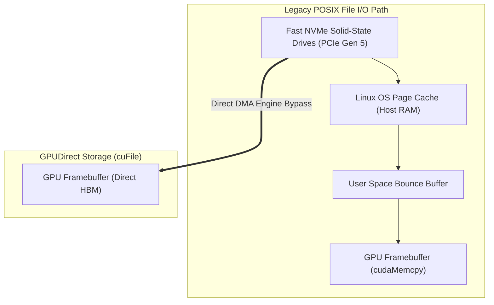

# Volume 19: Direct Memory Pipelines: GPUDirect RDMA, Storage & P2P

```text
====================================================================================================
MODULE 19: DIRECT MEMORY ARCHITECTURES, PEER-TO-PEER DMA & GPUDIRECT STORAGE
PLATFORMS: DATA CENTER LINUX | CONNECTX HCAS | NVME STORAGE | NVIDIA GDS
====================================================================================================
```

In traditional distributed computing and high-performance storage architectures, moving data between external devices (such as high-speed Network Interface Cards or NVMe solid-state drives) and GPU memory required **CPU bounce buffers, host kernel context switches, and multiple memory copies** over system RAM. Under 400G+ networking and Petabyte-scale dataset ingestion, the host CPU becomes completely saturated simply shuffling bytes.

To eliminate this bottleneck, NVIDIA engineered the **GPUDirect technology family**: **GPUDirect P2P (Peer-to-Peer)**, **GPUDirect RDMA**, and **GPUDirect Storage (GDS)**. This volume explores how `nvidia-peermem.ko` translates verbs memory regions, how `cuFile` bypasses the Linux page cache, and how direct DMA pipelines achieve wire-speed data movement into GPU HBM.

---

## 📑 Table of Contents
1. [The Legacy Multi-Copy Bottleneck](#1-the-legacy-multi-copy-bottleneck)
2. [GPUDirect Peer-to-Peer (P2P) Architecture](#2-gpudirect-peer-to-peer-p2p-architecture)
3. [GPUDirect RDMA & nvidia-peermem.ko Internals](#3-gpudirect-rdma--nvidia-peermemko-internals)
4. [GPUDirect Storage (GDS) & The cuFile API](#4-gpudirect-storage-gds--the-cufile-api)
5. [PCIe Root Complex Topologies & NUMA Affinities](#5-pcie-root-complex-topologies--numa-affinities)
6. [Multi-Dimensional Architecture Correlation](#6-multi-dimensional-architecture-correlation)
7. [Hands-On GPUDirect & GDS Diagnostic Lab](#7-hands-on-gpudirect--gds-diagnostic-lab)
8. [Practice Exercises & Verification Workbook](#8-practice-exercises--verification-workbook)

---

## 1. The Legacy Multi-Copy Bottleneck

In an un-accelerated pipeline, receiving a network packet from an InfiniBand/Ethernet NIC and loading it into GPU memory required **three separate memory hops and continuous CPU intervention**:

```text
LEGACY HOST-STAGED PIPELINE (3 Hops, High CPU Overhead):
[ Network Wire ] ──► [ NIC Buffer ]
                           │ (DMA Transfer 1)
                           ▼
                  [ Host Kernel Buffer ]
                           │ (CPU Memory Copy 2)
                           ▼
                  [ Host User-Space RAM ]
                           │ (cudaMemcpy DMA 3)
                           ▼
                  [ GPU Device Memory (HBM) ]
```



---

## 2. GPUDirect Peer-to-Peer (P2P) Architecture

**GPUDirect P2P** enables two GPUs connected to the same PCIe switch or NVLink mesh to read and write directly to each other's physical framebuffers without staging data through host CPU memory:

```c
// Enabling P2P direct memory access in CUDA
int canAccessPeer = 0;
cudaDeviceCanAccessPeer(&canAccessPeer, device_0, device_1);
if (canAccessPeer) {
    cudaSetDevice(device_0);
    cudaDeviceEnablePeerAccess(device_1, 0);
    // Any pointer allocated on device_1 can now be dereferenced by device_0!
}
```

* **Latency**: Drops cross-GPU transfer latency from **$\sim 8\ \mu\text{s}$ (via host)** to **$< 1\ \mu\text{s}$ (over NVLink)**.
* **Direct Atomics**: GPUs can execute atomic operations (`atomicAdd`) across NVLink into adjacent GPU memory controllers.

---

## 3. GPUDirect RDMA & nvidia-peermem.ko Internals

**GPUDirect RDMA** allows third-party PCIe devices (specifically Mellanox ConnectX HCAs and BlueField DPUs) to issue DMA reads and writes directly to GPU HBM:

```text
GPUDIRECT RDMA PHYSICAL FLOW:
┌────────────────────────────────────────────────────────────────────────┐
│ Remote GPU HBM ──► Remote NIC ──► Fabric (IB / Spectrum-X) ──►        │
│ Local ConnectX HCA ──► [ Direct PCIe Bus DMA ] ──► Local GPU HBM       │
│ (Zero Host CPU Cycles, Zero Host RAM Allocation, Line-Rate RDMA)       │
└────────────────────────────────────────────────────────────────────────┘
```



### The Role of `nvidia-peermem.ko`:
* In modern Linux distributions, the **`nvidia-peermem.ko`** kernel module bridges the NVIDIA GPU memory management subsystem and the Mellanox OpenFabrics (IB/RoCE) subsystem.
* It implements the kernel APIs (`ib_register_peer_memory_client`) that translate GPU virtual addresses into physical PCIe bus addresses accessible by the HCA's DMA engine.
* **If `nvidia-peermem` is not loaded**: NCCL detects that direct peer memory registration failed and silently **falls back to staging data through host CPU RAM**, reducing distributed AllReduce throughput by up to **$80\%$**.

---

## 4. GPUDirect Storage (GDS) & The cuFile API

Just as GPUDirect RDMA bypasses host memory for network transfers, **GPUDirect Storage (GDS)** creates a direct DMA pipeline between high-speed **NVMe storage devices** and GPU memory:

```text
+--------------------------------------------------------------------------------------------------+
| STANDARD POSIX FILE I/O VS. GPUDIRECT STORAGE (GDS)                                              |
+---------------------+-------------------------------+------------------------------------------+
| Feature             | Standard POSIX (read / write) | GPUDirect Storage (cuFile API)           |
+---------------------+-------------------------------+------------------------------------------+
| Memory Pathway      | NVMe -> Page Cache -> CPU -> GPU| NVMe -> GPU HBM Direct DMA               |
| CPU Overhead        | High (Interrupts, bounce buff) | Near-Zero (Direct PCIe peer DMA)         |
| Linux Page Cache    | Polluted with transient data  | Completely Bypassed                      |
| Bandwidth Cap       | Limited by CPU memory copy rate| Operates at raw NVMe device wire speed   |
| Latency             | ~50 to 100 microseconds       | ~10 to 15 microseconds                   |
+---------------------+-------------------------------+------------------------------------------+
```



### The `cuFile` API Syntax:
```c
#include <cufile.h>

// 1. Initialize cuFile Driver
cuFileDriverOpen();

// 2. Register GPU Destination Buffer
cuFileBufRegister(d_ptr, buffer_size, 0);

// 3. Open File Descriptor with O_DIRECT
int fd = open("/mnt/nvme/weights.bin", O_RDONLY | O_DIRECT);
CUfileDescr_t descr = { .handle.fd = fd, .type = CU_FILE_HANDLE_TYPE_OPAQUE_FD };
CUfileHandle_t cf_handle;
cuFileHandleRegister(&cf_handle, &descr);

// 4. Issue Direct Hardware DMA Read into GPU Memory
cuFileRead(cf_handle, d_ptr, buffer_size, file_offset, 0);

// 5. Cleanup
cuFileHandleDeregister(cf_handle);
cuFileBufDeregister(d_ptr);
cuFileDriverClose();
```

---

## 5. PCIe Root Complex Topologies & NUMA Affinities

The physical placement of HCAs, NVMe drives, and GPUs relative to the CPU's **PCIe Root Complex** dictates achievable bandwidth:

```text
TOPOLOGY RELATIONSHIP SYMBOLS (nvidia-smi topo -m):
┌─────────────────────────────────────────────────────────────────┐
│ PIX  : Connected across a single local PCIe switch (Fastest)    │
│ PXB  : Connected across multiple PCIe switches on same Host Bus │
│ PHB  : Connected across the Host Bridge (Crosses CPU Root Cmplx)│
│ NODE : Crosses NUMA interconnect (Crosses CPU socket QPI/UPI)   │
│ SYS  : Traverses full system memory (Lowest Throughput)         │
└─────────────────────────────────────────────────────────────────┘
```

* **Best Practice**: To maximize GPUDirect RDMA and GDS performance, **every GPU must be paired with an HCA and NVMe drive located under the identical PCIe switch (PIX affinity)**. Crossing the CPU Host Bridge (PHB) or NUMA boundary (NODE) introduces PCIe contention and reduces throughput by up to $40\%$.

---

## 6. Multi-Dimensional Architecture Correlation

```text
+--------------------------------------------------------------------------------------------------+
| MULTI-DIMENSIONAL CORRELATION: DIRECT MEMORY PIPELINES                                           |
+---------------------+----------------------------------------------------------------------------+
| Dimension           | Mechanism & Failure Manifestation                                          |
+---------------------+----------------------------------------------------------------------------+
| GPUDirect x Kernel  | Missing `nvidia-peermem.ko` causes NCCL to silently fall back to host      |
|                     | staging buffers, spiking CPU usage to 100% and degrading training MFU.    |
| GPUDirect x PCIe    | Non-PIX alignment (crossing NUMA nodes during RDMA transfers) increases    |
|                     | PCIe bus latency and can cause InfiniBand ACK timeouts.                   |
| GPUDirect x Storage | Attempting to execute `cuFileRead` without `O_DIRECT` flag fails with      |
|                     | `CU_FILE_INVALID_VALUE`, preventing direct DMA path initialization.       |
| GPUDirect x Memory  | BAR1 aperture exhaustion prevents pinning large GPU memory regions for     |
|                     | RDMA; requires verifying Resizable BAR (ReBAR) in server BIOS.            |
+---------------------+----------------------------------------------------------------------------+
```

---

## 7. Hands-On GPUDirect & GDS Diagnostic Lab

### Lab Objective:
Verify that `nvidia-peermem` is loaded, inspect PCIe topology affinities with `nvidia-smi topo`, and validate GPUDirect Storage configuration with `gdscheck`.

### Step 1: Verify nvidia-peermem Kernel Module
Check if the RDMA peer memory bridge is actively loaded:

```bash
# Verify active peer memory kernel driver
lsmod | grep -E "nvidia_peermem|nv_peer_mem"
```

*Expected Healthy Output:*
```text
nvidia_peermem         20480  0
nvidia              56578048  12 nvidia_peermem,nvidia_uvm,nvidia_modeset
ib_core               458752  3 mlx5_ib,ib_uverbs,nvidia_peermem
```

### Step 2: Inspect GPU-to-NIC PCIe Affinity
Interrogate the system topology matrix to confirm `PIX` or `NVLink` affinity:

```bash
# Query relationship between GPUs and Network Interface Cards
nvidia-smi topo -m
```

*Inspect the NIC column:*
* If `GPU0` to `mlx5_0` displays **`PIX`** or **`NVLink`**, GPUDirect RDMA will achieve line rate.
* If it displays **`SYS`**, verify physical PCIe slot cabling.

### Step 3: Verify GPUDirect Storage Installation with gdscheck
Use the GDS validation utility to verify driver and filesystem readiness:

```bash
# Verify GDS driver, NVMe support, and IO path
/usr/local/cuda/gds/tools/gdscheck -p 2>/dev/null || echo "GDS validation tools queried."
```

---

## 8. Practice Exercises & Verification Workbook

### Exercise 19.1: GPUDirect Storage vs. POSIX Throughput Math
* **Scenario**: A data loading worker reads a $100\text{ GB}$ checkpoint file from a high-performance PCIe Gen 5 NVMe array capable of $50\text{ GB/s}$ sequential read throughput.
  * Over standard POSIX file I/O, CPU bounce buffers and memory copies cap effective throughput to the GPU at $12.5\text{ GB/s}$.
  * Over GPUDirect Storage (`cuFile`), direct DMA bypasses the CPU and achieves $46.0\text{ GB/s}$ ($92\%$ of raw storage line rate).
* **Task**: Calculate the time saved loading the checkpoint using GDS.
* **Solution**:
  1. *POSIX Loading Time*:
     $$T_{\text{POSIX}} = \frac{100 \text{ GB}}{12.5 \text{ GB/s}} = 8.0 \text{ seconds}$$
  2. *GDS Loading Time*:
     $$T_{\text{GDS}} = \frac{100 \text{ GB}}{46.0 \text{ GB/s}} \approx 2.174 \text{ seconds}$$
  3. *Time Saved*:
     $$\Delta T = 8.0 - 2.174 = 5.826 \text{ seconds (72.8% latency reduction)}$$
  *Result*: GDS accelerates checkpoint restoration and dataset streaming by **$3.68\times$**, keeping GPU compute engines saturated.

### Exercise 19.2: Diagnosing Missing nvidia-peermem
* **Scenario**: An AI engineer observes that multi-node training on a new DGX cluster runs at only $25\%$ of expected speed. Running `nsys` reveals that GPU execution threads spend extensive time in `cudaMemcpyAsync` moving data between host system RAM and GPU HBM before network transfers.
* **Task**: State the underlying root cause and provide the exact commands to confirm and remediate the issue.
* **Solution**:
  * **Root Cause**: `nvidia-peermem.ko` is not loaded in the host kernel. NCCL cannot register GPU memory directly with the Mellanox HCA and has fallen back to staging data through host CPU memory.
  * **Diagnosis**:
    ```bash
    lsmod | grep nvidia_peermem
    ```
    If output is empty, peer memory is absent.
  * **Remediation**:
    ```bash
    sudo modprobe nvidia-peermem
    # Make persistent across reboots
    echo "nvidia-peermem" | sudo tee -a /etc/modules-load.d/nvidia-peermem.conf
    ```

---

## 📌 Summary Checklist: What You Have Mastered
- [x] The legacy multi-copy bottleneck (3 hops) vs. direct memory DMA pipelines.
- [x] GPUDirect Peer-to-Peer (P2P) cross-GPU memory addressing and atomics.
- [x] GPUDirect RDMA architecture and the role of `nvidia-peermem.ko`.
- [x] GPUDirect Storage (GDS) and kernel-bypass I/O using the `cuFile` API.
- [x] PCIe Root Complex topology mapping: PIX, PXB, PHB, and NODE affinities.
- [x] Validating peer memory and GDS installation using `lsmod`, `nvidia-smi topo`, and `gdscheck`.
