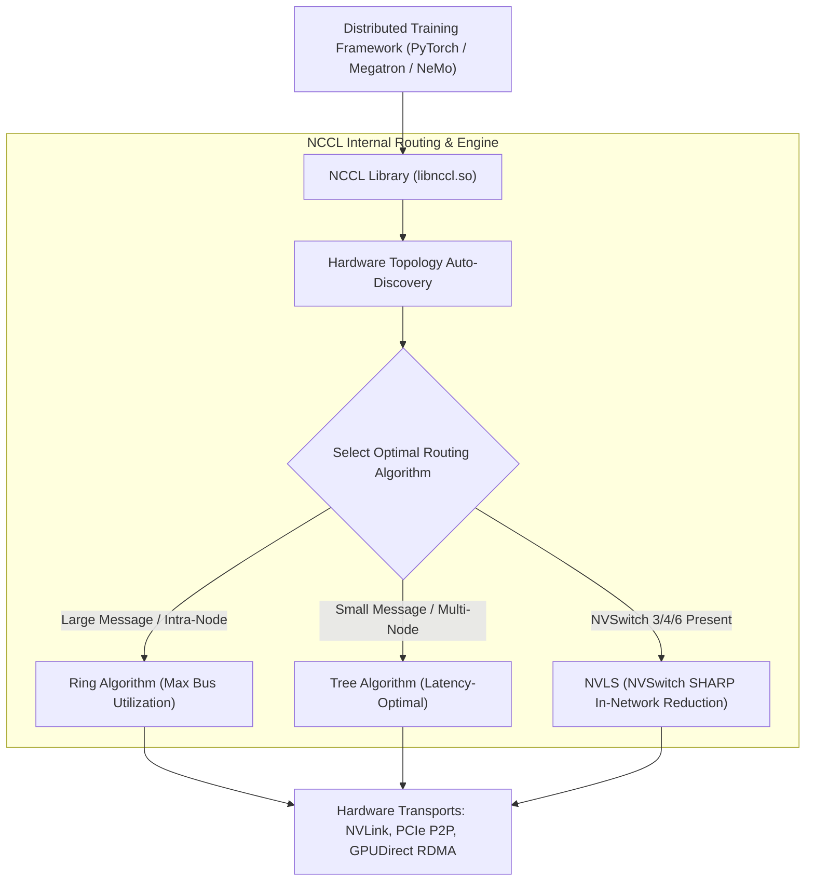
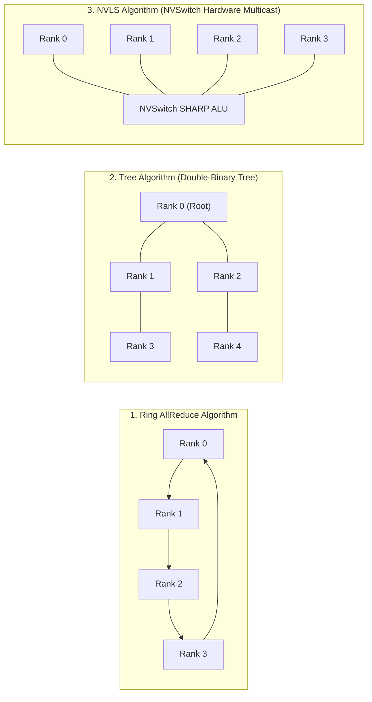

# Volume 20: NCCL Collectives (Ring, Tree, NVLS) & nccl-tests Tuning

```text
====================================================================================================
MODULE 20: DISTRIBUTED COLLECTIVES, ALGORITHM SELECTION & NCCL-TESTS BENCHMARKING
PLATFORMS: DATA CENTER LINUX | MULTI-NODE CLUSTERS | PYTORCH DDP / FSDP / MEGATRON
====================================================================================================
```

In distributed deep learning—whether performing data-parallel gradient synchronizations (AllReduce), pipeline-parallel tensor transfers (P2P), or tensor-parallel activations (AllGather/ReduceScatter)—application scaling is dictated by the efficiency of the **NVIDIA Collective Communications Library (NCCL)**.

NCCL automatically discovers the underlying hardware topology (PCIe switches, NUMA nodes, NVLink meshes, and InfiniBand/RoCE fabrics) and synthesizes optimal communication graphs. However, misconfigured buffer sizes, disabled GPUDirect RDMA, or suboptimal algorithm choices can cut collective throughput by up to $75\%$. This volume explores NCCL internal algorithms (**Ring, Tree, NVLS, CollNet**), critical environment tuning variables, and performance benchmarking using **`nccl-tests`**.

---

## 📑 Table of Contents
1. [The Role of NCCL in Distributed AI](#1-the-role-of-nccl-in-distributed-ai)
2. [Collective Routing Algorithms: Ring vs. Tree vs. NVLS](#2-collective-routing-algorithms-ring-vs-tree-vs-nvls)
3. [Dynamic Topology Auto-Discovery & Graph Construction](#3-dynamic-topology-auto-discovery--graph-construction)
4. [High-Performance NCCL Environment Tuning Flags](#4-high-performance-nccl-environment-tuning-flags)
5. [The Mathematics of Bus Bandwidth vs. Algorithm Bandwidth](#5-the-mathematics-of-bus-bandwidth-vs-algorithm-bandwidth)
6. [Multi-Dimensional Architecture Correlation](#6-multi-dimensional-architecture-correlation)
7. [Hands-On nccl-tests Benchmarking & Tuning Lab](#7-hands-on-nccl-tests-benchmarking--tuning-lab)
8. [Practice Exercises & Verification Workbook](#8-practice-exercises--verification-workbook)

---

## 1. The Role of NCCL in Distributed AI

```text
DISTRIBUTED COLLECTIVE TAXONOMY:
┌────────────────────────────────────────────────────────────────────────┐
│ • AllReduce    : Sums tensors across all GPUs; every GPU gets result.   │
│ • AllGather    : Concatenates tensor slices from all GPUs onto all GPUs.│
│ • ReduceScatter: Sums tensors and scatters disjoint slices to each GPU. │
│ • Broadcast    : Copies a tensor from a root rank to all other ranks.   │
│ • Send / Recv  : Point-to-Point direct transfers between two ranks.     │
└────────────────────────────────────────────────────────────────────────┘
```



---

## 2. Collective Routing Algorithms: Ring vs. Tree vs. NVLS

```text
+--------------------------------------------------------------------------------------------------+
| NCCL COLLECTIVE ALGORITHM COMPARISON                                                             |
+---------------------+-------------------+---------------------+----------------------------------+
| Algorithm           | Latency Scaling   | Bandwidth Efficiency| Ideal Payload Size               |
+---------------------+-------------------+---------------------+----------------------------------+
| Ring                | $O(N)$ hops       | $(N-1)/N \approx 1$ | Large Tensors (> 32 MB)          |
| Tree (Double-Binary)| $O(\log N)$ hops  | Lower bandwidth     | Small Tensors (< 4 MB)           |
| NVLS (NVLink SHARP) | $O(1)$ switch hop | $100\%$ wire speed  | Any Payload on NVSwitch Systems  |
| CollNet             | In-Switch Reduction| In-Switch Line Rate | Scale-Out InfiniBand Clusters    |
+---------------------+-------------------+---------------------+----------------------------------+
```



### 1. Ring Algorithm (Bandwidth-Optimal):
* Breaks the tensor of size $S$ into $N$ equal chunks.
* Chunks rotate through a ring of $N$ ranks in $2(N-1)$ steps ($N-1$ steps for Reduce-Scatter, $N-1$ steps for All-Gather).
* **Advantage**: Fully saturates all bidirectional physical links simultaneously.

### 2. Tree Algorithm (Latency-Optimal):
* Organizes ranks into a binomial or double-binary tree structure.
* Communication completes in $2 \log_2 N$ hops.
* **Advantage**: For small messages (e.g., synchronizing gradient norms or optimizer scalars), tree algorithms bypass the high latency of large rings.

### 3. NVLS (NVLink SHARP Engine):
* Deployed on Hopper, Blackwell, and Rubin NVSwitch systems.
* All GPUs stream data into the NVSwitch **SHARP ASIC**, which performs hardware reduction at line rate and multicasts the result back.
* **Advantage**: Cuts network hops to **$1$**, doubling effective AllReduce bandwidth.

---

## 3. Dynamic Topology Auto-Discovery & Graph Construction

When an application initializes NCCL (`ncclCommInitRank`):
1. **Topology Probe**: NCCL scans `/sys/bus/pci/devices` to discover PCIe switch trees, reads NVLink port counters via NVML, and detects all Mellanox HCAs.
2. **Channel Formulation**: NCCL constructs multiple parallel logical communication rings and trees (typically **8 to 32 parallel channels**) to saturate all physical links and SM execution pipelines simultaneously.
3. **Transport Selection**: For each link, NCCL dynamically assigns the fastest physical transport: `NVLink` $\rightarrow$ `PCIe P2P` $\rightarrow$ `GPUDirect RDMA` $\rightarrow$ `Shared Memory (SHM)` $\rightarrow$ `TCP Sockets`.

---

## 4. High-Performance NCCL Environment Tuning Flags

```text
+--------------------------------------------------------------------------------------------------+
| CRITICAL NCCL ENVIRONMENT TUNING FLAGS                                                           |
+---------------------+-------------------+--------------------------------------------------------+
| Variable Name       | Recommended Value | Purpose & Optimization Action                          |
+---------------------+-------------------+--------------------------------------------------------+
| `NCCL_DEBUG`        | `INFO`            | Prints detailed topology, ring count, and transports.  |
| `NCCL_DEBUG_SUBSYS` | `INIT,ENV,NET`    | Limits debug output to network and initialization.     |
| `NCCL_BUFFSIZE`     | `4194304` (4 MB)  | Increases intermediate ring pipeline buffer size.      |
| `NCCL_NET_GDR_LEVEL`| `SYS` / `PIX`     | Enforces GPUDirect RDMA across PCIe root complexes.    |
| `NCCL_CROSS_NIC`    | `1`               | Allows NCCL to balance traffic across secondary HCAs.  |
| `NCCL_ALGO`         | `Tree` / `Ring`   | Forces specific routing algorithm, bypassing heuristics|
| `NCCL_NVLS_ENABLE`  | `1`               | Forces hardware NVSwitch SHARP reduction offload.      |
| `NCCL_P2P_DISABLE`  | `0` (Normal)      | Disables NVLink/PCIe P2P (Used only for debug triage). |
+---------------------+-------------------+--------------------------------------------------------+
```

---

## 5. The Mathematics of Bus Bandwidth vs. Algorithm Bandwidth

When benchmarking with `nccl-tests`, the output reports two distinct bandwidth metrics: **Algorithm Bandwidth (`algbw`)** and **Bus Bandwidth (`busbw`)**:

```text
ALGORITHM BANDWIDTH VS. BUS BANDWIDTH:
┌──────────────────────────────────────────────────────────────┐
│ Algorithm Bandwidth (algbw) = Data Size (S) / Time (T)       │
├──────────────────────────────────────────────────────────────┤
│ Bus Bandwidth (busbw)       = algbw × Correction Factor (F)  │
└──────────────────────────────────────────────────────────────┘
```

### The Ring AllReduce Correction Factor:
In an $N$-rank Ring AllReduce, each rank sends and receives $\frac{N-1}{N}$ of the data during Reduce-Scatter and $\frac{N-1}{N}$ during All-Gather:

$$\text{Total Data Moved per Rank} = 2 \times \frac{N-1}{N} \times S$$

Therefore, the **Bus Bandwidth** formula is:

$$\text{Bus Bandwidth} = \text{Algorithm Bandwidth} \times \frac{2(N-1)}{N}$$

* For 8 GPUs ($N=8$):
  $$\text{Correction Factor } F = \frac{2 \times (8 - 1)}{8} = \frac{14}{8} = 1.75$$
* For large $N$ (e.g., 1024 GPUs):
  $$F \approx 2.0$$

*Benchmark Rule*: Always evaluate **`busbw`**, as it directly reflects the physical utilization of the underlying hardware interconnect.

---

## 6. Multi-Dimensional Architecture Correlation

```text
+--------------------------------------------------------------------------------------------------+
| MULTI-DIMENSIONAL CORRELATION: NCCL COLLECTIVES                                                  |
+---------------------+----------------------------------------------------------------------------+
| Dimension           | Mechanism & Failure Manifestation                                          |
+---------------------+----------------------------------------------------------------------------+
| NCCL x Kernel       | Missing `nvidia-peermem.ko` causes `NCCL_NET_GDR_LEVEL` to drop to disabled,|
|                     | reducing multi-node AllReduce `busbw` from 45 GB/s to under 8 GB/s.       |
| NCCL x Network      | Out-of-order packet arrival on RoCE without hardware reordering causes    |
|                     | NCCL ring channels to stall, generating "Call to connect timed out".       |
| NCCL x Buffer       | Increasing `NCCL_BUFFSIZE` too high consumes excessive GPU HBM; keeping it |
|                     | too low starves 400G SerDes pipelines, cutting line-rate utilization.      |
| NCCL x Straggler    | In a 1000-GPU Ring AllReduce, a single throttled GPU stalls all 1000 GPUs, |
|                     | dropping cluster-wide MFU to the speed of the slowest rank.                |
+---------------------+----------------------------------------------------------------------------+
```

---

## 7. Hands-On nccl-tests Benchmarking & Tuning Lab

### Lab Objective:
Clone and compile the official `nccl-tests` suite, execute an AllReduce benchmark across local GPUs, inspect NCCL topology logging, and calculate achieved bus efficiency.

### Step 1: Clone and Compile nccl-tests
Compile the benchmark targeting local CUDA and MPI installations:

```bash
# Clone official repository
git clone https://github.com/NVIDIA/nccl-tests.git
cd nccl-tests

# Compile targeting CUDA
make CUDA_HOME=/usr/local/cuda
```

### Step 2: Execute AllReduce Benchmark with Debug Diagnostics
Run an AllReduce sweep from $8\text{ MB}$ to $1\text{ GB}$ with `NCCL_DEBUG=INFO`:

```bash
# Run local 8-GPU AllReduce sweep
NCCL_DEBUG=INFO \
NCCL_DEBUG_SUBSYS=INIT,ENV \
./build/all_reduce_perf -b 8M -e 1G -f 2 -g 8
```

*Expected Diagnostic Initialization Logs:*
```text
[0] NCCL INFO Channel 00/08 : 0 1 2 3 4 5 6 7
[0] NCCL INFO Using internal NVLink-enabled collective primitives
[0] NCCL INFO Ring 00 : 0 -> 1 -> 2 -> 3 -> 4 -> 5 -> 6 -> 7 -> 0
[0] NCCL INFO Trees [0] 1/-1/-1->0->-1/-1/-1 ...
[0] NCCL INFO 8 coll channels, 8 p2p channels, 8 mapping channels
```

*Expected Performance Output snippet (HGX H100 SXM5):*
```text
#                                           out-of-place                       in-place          
#       size         count      type   op    time  algbw  busbw #wrong    time  algbw  busbw #wrong
#        (B)    (elements)                  (us) (GB/s) (GB/s)         (us) (GB/s) (GB/s)
  1073741824     268435456     float  sum  23840  45.04  78.82      0  23810  45.09  78.91      0
```

---

## 8. Practice Exercises & Verification Workbook

### Exercise 20.1: Bus Bandwidth Calculation from AlgBW
* **Scenario**: An engineer runs an 8-GPU AllReduce benchmark on a DGX B200 system using an $8\text{ GB}$ tensor. The test reports an elapsed duration of $36.0\text{ ms}$.
* **Task**: Calculate the raw Algorithm Bandwidth (`algbw`) and the corrected Bus Bandwidth (`busbw`).
* **Solution**:
  1. *Algorithm Bandwidth*:
     $$\text{AlgBW} = \frac{\text{Data Size}}{\text{Time}} = \frac{8.0 \text{ GB}}{0.036 \text{ s}} \approx 222.22 \text{ GB/s}$$
  2. *Bus Bandwidth Correction Factor for 8 Ranks*:
     $$F = \frac{2 \times (8 - 1)}{8} = \frac{14}{8} = 1.75$$
  3. *Bus Bandwidth*:
     $$\text{BusBW} = \text{AlgBW} \times 1.75 = 222.22 \times 1.75 \approx 388.89 \text{ GB/s}$$
  *Result*: The collective communication achieved an effective hardware bus utilization of **$388.9\text{ GB/s}$**.

### Exercise 20.2: Diagnosing Ring vs. Tree Crossover Point
* **Scenario**: On a 64-GPU cluster, an AllReduce on a $64\text{ KB}$ tensor takes $150\ \mu\text{s}$ under the Ring algorithm and $25\ \mu\text{s}$ under the Tree algorithm. On a $512\text{ MB}$ tensor, Ring takes $18\text{ ms}$ while Tree takes $32\text{ ms}$.
* **Task**: Explain why the optimal algorithm inverts as payload size scales.
* **Solution**:
  * **Small Payloads ($64\text{ KB}$)**: Latency dominates ($T = \alpha + \beta S$). In a 64-rank ring, data must traverse $2 \times (64 - 1) = 126\text{ hops}$. In a tree, data traverses $2 \log_2(64) = 12\text{ hops}$. Tree is **$6\times$ faster** because it minimizes serialization latency hops.
  * **Large Payloads ($512\text{ MB}$)**: Bandwidth dominates ($T \approx \beta S$). The Ring algorithm achieves $(N-1)/N = 98.4\%$ link efficiency by streaming equal chunks over all physical links concurrently. Tree leaves leaves and branches underutilized during phases, reducing effective bandwidth.

---

## 📌 Summary Checklist: What You Have Mastered
- [x] NCCL core collective primitives: AllReduce, AllGather, and ReduceScatter.
- [x] Ring vs. Tree vs. NVLS (NVLink SHARP) routing algorithm trade-offs.
- [x] NCCL dynamic topology auto-discovery and communication channel synthesis.
- [x] High-performance environment variables (`NCCL_BUFFSIZE`, `NCCL_NET_GDR_LEVEL`).
- [x] The mathematical formulation of Algorithm Bandwidth vs. Bus Bandwidth.
- [x] Compiling and running `nccl-tests` to benchmark multi-GPU fabrics.
