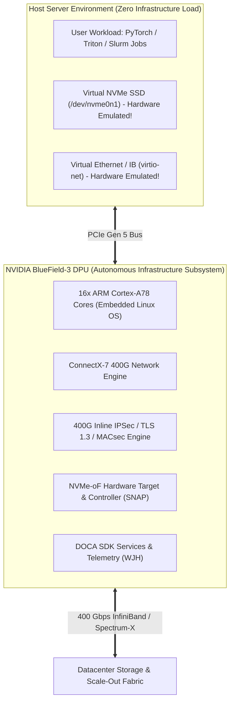
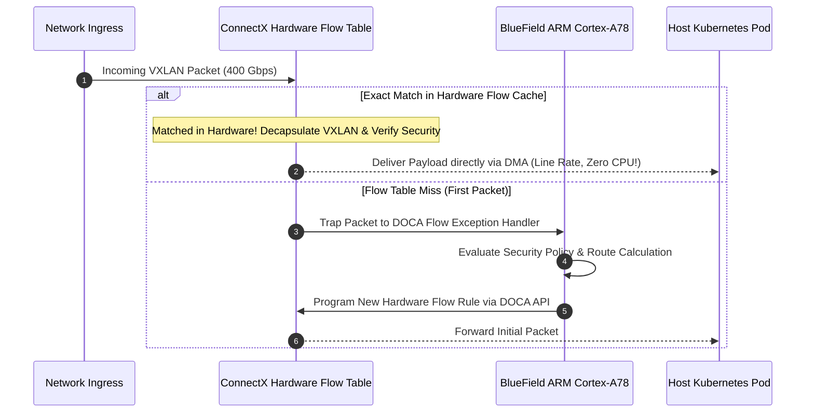

# Volume 21: DPUs & SmartNICs: BlueField-3/4 Architecture & DOCA SDK

```text
====================================================================================================
MODULE 21: DATA PROCESSING UNITS, EMBEDDED ARM COMPLEXES & DOCA PROGRAMMING
PLATFORMS: NVIDIA BLUEFIELD-3 | BLUEFIELD-4 | DOCA SDK | SUPER-NICS
====================================================================================================
```

As artificial intelligence clusters scale to thousands of nodes, host CPUs are increasingly burdened by non-compute infrastructure tasks: **software-defined networking (SDN), distributed storage virtualization, NVMe-over-Fabrics (NVMe-oF) target emulation, security isolation, and telemetry collection**.

To offload and isolate these infrastructure services, NVIDIA introduced the **Data Processing Unit (DPU)**: the **BlueField-3 and BlueField-4**. By uniting multi-core ARM compute clusters, high-speed ConnectX network silicon, inline cryptographic hardware, and the **DOCA (Data Center on a Chip Architecture)** SDK, the DPU operates as an autonomous computer-in-front-of-the-computer. This volume explores the silicon architecture of BlueField DPUs, the DOCA SDK execution model, hardware line-rate acceleration, and DPU-to-GPU memory pathways (**DOCA GPUNetIO**).

---

## 📑 Table of Contents
1. [The Paradigm Shift: CPU Offload to Infrastructure on a Chip](#1-the-paradigm-shift-cpu-offload-to-infrastructure-on-a-chip)
2. [BlueField-3 & BlueField-4 Silicon Microarchitecture](#2-bluefield-3--bluefield-4-silicon-microarchitecture)
3. [The DOCA SDK Architecture: Software-Defined Hardware-Accelerated](#3-the-doca-sdk-architecture-software-defined-hardware-accelerated)
4. [DOCA Flow: Hardware Match-Action Pipelines](#4-doca-flow-hardware-match-action-pipelines)
5. [Storage Virtualization: DOCA SNAP & NVMe-oF](#5-storage-virtualization-doca-snap--nvme-of)
6. [DOCA GPUNetIO: Zero-Copy DPU-to-GPU Pathways](#6-doca-gpunetio-zero-copy-dpu-to-gpu-pathways)
7. [Multi-Dimensional Architecture Correlation](#7-multi-dimensional-architecture-correlation)
8. [Hands-On DPU Administration & DOCA Diagnostics Lab](#8-hands-on-dpu-administration--doca-diagnostics-lab)
9. [Practice Exercises & Verification Workbook](#9-practice-exercises--verification-workbook)

---

## 1. The Paradigm Shift: CPU Offload to Infrastructure on a Chip

In traditional server architectures, the host CPU executes both user application payloads (training scripts, inference microservices) and cloud infrastructure services (firewalls, virtual switches, storage drivers, telemetry daemons):

```text
+--------------------------------------------------------------------------------------------------+
| HOST CPU TAX VS. DPU HARDWARE ISOLATION                                                          |
+---------------------+-------------------------------+------------------------------------------+
| Dimension           | Standard Server Architecture  | DPU-Accelerated Infrastructure (BlueField)|
+---------------------+-------------------------------+------------------------------------------+
| Host CPU Overhead   | 20% to 35% consumed by infra  | 0% CPU overhead (100% dedicated to apps) |
| Network Processing  | Host Kernel Software (OVS/IPT)| Hardware Line-Rate Flow Table (DOCA Flow)|
| Storage Access      | Host NVMe-oF Initiator Drivers| Hardware Emulated Local NVMe (DOCA SNAP) |
| Security Domain     | Host CPU controls security    | Isolated Hardware Root of Trust on DPU   |
| Telemetry & Audit   | Host CPU agent polling        | Out-of-Band Hardware Telemetry (WJH)     |
+---------------------+-------------------------------+------------------------------------------+
```



---

## 2. BlueField-3 & BlueField-4 Silicon Microarchitecture

```text
+--------------------------------------------------------------------------------------------------+
| BLUEFIELD GENERATIONAL HARDWARE SPECIFICATIONS                                                   |
+---------------------+-------------------------------+------------------------------------------+
| Specification       | NVIDIA BlueField-3 DPU        | NVIDIA BlueField-4 DPU                   |
+---------------------+-------------------------------+------------------------------------------+
| Embedded Processor  | 16x ARM Cortex-A78 Cores      | 64x Grace CPU Compute Die                |
| Embedded Memory     | Up to 32 GB DDR5-5600         | Up to 128 GB LPDDR5X (SCF Coherent)     |
| Host Interface      | Dual PCIe Gen 5.0 x16         | PCIe Gen 6.0 x16 / PAM4                  |
| Network Throughput  | Dual-Port 400 Gbps (NDR/400GbE)| 800 Gbps to 1.6 Tbps (XDR / 800GbE)      |
| Packet Processing   | 400 Million packets / sec     | > 800 Million packets / sec              |
| Inline Cryptography | 400 Gbps IPSec, TLS, MACsec   | 800 Gbps Line-Rate Crypto & Post-Quantum |
| Storage Engine      | NVMe-oF Target & Initiator    | Distributed KV-Cache Memory Engine       |
+---------------------+-------------------------------+------------------------------------------+
```

---

## 3. The DOCA SDK Architecture: Software-Defined Hardware-Accelerated

The **DOCA (Data Center on a Chip Architecture)** SDK is the software framework for programming BlueField DPUs—analogous to CUDA for GPUs:

```text
DOCA SDK FRAMEWORK TIERS:
┌─────────────────────────────────────────────────────────────────┐
│ DOCA Applications   : Turnkey solutions (DOCA Firefly, Telemetry│
├─────────────────────────────────────────────────────────────────┤
│ DOCA Services       : Microservices (DOCA SNAP, HBN, Flow Inspect│
├─────────────────────────────────────────────────────────────────┤
│ DOCA Device Drivers : DOCA Flow, DOCA DMA, DOCA GPUNetIO, SHA   │
├─────────────────────────────────────────────────────────────────┤
│ BlueField Hardware  : Accelerators for OVS, Crypto, PTP, NVMe-oF│
└─────────────────────────────────────────────────────────────────┘
```

---

## 4. DOCA Flow: Hardware Match-Action Pipelines

**DOCA Flow** provides a programmable C-API to compile software-defined networking rules (such as Open vSwitch, VXLAN encapsulation, and Stateful Firewalls) directly into the ConnectX hardware eSwitch:



*Result*: Up to **400 million packets per second** processed purely in hardware with sub-microsecond latency.

---

## 5. Storage Virtualization: DOCA SNAP & NVMe-oF

**DOCA SNAP (Storage, Network, and Architecture Acceleration)** virtualizes remote enterprise storage over NVMe-oF (RDMA/TCP) and presents it to the host operating system as a **physical, local NVMe SSD**:

```text
DOCA SNAP VIRTUAL STORAGE PIPELINE:
┌────────────────────────────────────────────────────────────────────────┐
│ Host Operating System sees standard local disk: `/dev/nvme0n1`         │
│ (Uses native in-box OS NVMe driver; requires zero client software!)    │
├────────────────────────────────────────────────────────────────────────┤
│ BlueField-3 DPU intercepts PCIe NVMe read/write register requests      │
│ └── DOCA SNAP translates to NVMe-over-Fabrics RDMA packets             │
│     └── Streams data across 400G network to remote NVMe-oF JBOF storage │
└────────────────────────────────────────────────────────────────────────┘
```

---

## 6. DOCA GPUNetIO: Zero-Copy DPU-to-GPU Pathways

In traditional network-to-GPU operations, incoming network packets are processed by the host CPU or DPU ARM core before payloads are transferred to the GPU.

**DOCA GPUNetIO** allows the DPU network engine to interact directly with **GPU memory and CUDA kernels**:
* Network packets are DMA-streamed directly into GPU HBM ring buffers.
* CUDA kernels running on the GPU can directly poll and ring DPU network doorbells without host intervention, enabling ultra-low-latency real-time inference and distributed sensor ingestion.

---

## 7. Multi-Dimensional Architecture Correlation

```text
+--------------------------------------------------------------------------------------------------+
| MULTI-DIMENSIONAL CORRELATION: DPU & SMARTNICS                                                   |
+---------------------+----------------------------------------------------------------------------+
| Dimension           | Mechanism & Failure Manifestation                                          |
+---------------------+----------------------------------------------------------------------------+
| DPU x Security      | `mlxprivhost` hardware locks prevent compromised host OS environments      |
|                     | from flashing DPU firmware or snooping network control planes.             |
| DPU x Storage       | If remote NVMe-oF targets become congested, DOCA SNAP queues fill, causing|
|                     | host I/O timeouts that stall GPU data loaders and crash training jobs.     |
| DPU x Thermal       | DPU PCIe add-in cards draw up to 150W; inadequate chassis airflow causes    |
|                     | ARM core throttling and drops network throughput from 400G to 100G.        |
| DPU x Telemetry     | Hardware WJH (What Just Happened) telemetry streams packet drops and queue |
|                     | latencies to monitoring collectors with nanosecond-precision timestamps.   |
+---------------------+----------------------------------------------------------------------------+
```

---

## 8. Hands-On DPU Administration & DOCA Diagnostics Lab

### Lab Objective:
Interrogate the BlueField DPU hardware environment, access the embedded ARM operating system via SSH/Rshim, inspect DOCA firmware packages, and verify PCIe virtualization.

### Step 1: Query DPU via Host PCIe Bus
Inspect the BlueField-3 controller from the host Linux system:

```bash
# Locate BlueField controller on PCIe bus
lspci -d 15b3: | grep -E "BlueField|ConnectX"
```

*Expected Output:*
```text
03:00.0 Network controller: Mellanox Technologies MT43244 BlueField-3 Integrated ConnectX-7 Network Controller
```

### Step 2: Access DPU ARM Subsystem via Rshim Virtual Console
NVIDIA provides `rshim` to establish virtual console and network connections into the DPU:

```bash
# Verify active rshim service
sudo systemctl status rshim.service --no-pager

# Connect to the BlueField DPU embedded serial console
sudo cat /dev/rshim0/console
```

### Step 3: Query DOCA Runtime Version & Flow Capabilities
Inside the DPU ARM shell:

```bash
# Check installed DOCA runtime version on DPU
doca_version 2>/dev/null || cat /etc/doca_version

# Query hardware eSwitch and offload capabilities
mst status
```

---

## 9. Practice Exercises & Verification Workbook

### Exercise 21.1: Host CPU Infrastructure Offload Savings
* **Scenario**: A 128-core x86 host server runs an enterprise Kubernetes cluster serving thousands of microservices. Software-defined networking (OVS-DPDK) and NVMe-oF storage drivers consume $28\%$ of total CPU capacity continuously.
* **Task**: Calculate the number of CPU cores liberated for customer AI applications by offloading these tasks to an NVIDIA BlueField-3 DPU.
* **Solution**:
  $$\text{Liberated Cores} = 128 \text{ cores} \times 0.28 = 35.84 \approx 36 \text{ cores}$$
  *Result*: Installing the BlueField-3 DPU frees **36 full physical x86 cores**, significantly increasing compute capacity without purchasing additional host servers.

### Exercise 21.2: DOCA SNAP Latency vs. Standard Host NVMe-oF
* **Scenario**: A host application reads $4\text{ KB}$ records from remote NVMe-oF storage.
  * Over standard host software drivers, context switches and interrupt processing require $45\ \mu\text{s}$.
  * Over DOCA SNAP with hardware offloaded RDMA translation, the transfer completes in $12\ \mu\text{s}$.
* **Task**: Calculate the percentage latency reduction delivered by DOCA SNAP hardware emulation.
* **Solution**:
  $$\text{Latency Reduction} = \frac{45 - 12}{45} \times 100\% = \frac{33}{45} \times 100\% \approx 73.3\%$$
  *Result*: DOCA SNAP cuts storage I/O latency by **$73.3\%$**, preventing GPU starvation during random-access dataset iteration.

---

## 📌 Summary Checklist: What You Have Mastered
- [x] The architectural shift from host CPU infrastructure tax to DPU isolation.
- [x] BlueField-3 and BlueField-4 silicon microarchitectures and ARM complexes.
- [x] The DOCA SDK execution model and software-defined hardware acceleration.
- [x] Hardware line-rate flow processing using DOCA Flow match-action rules.
- [x] Virtualizing remote storage into local NVMe devices using DOCA SNAP.
- [x] Zero-copy DPU-to-GPU pathways with DOCA GPUNetIO.
- [x] DPU administration, Rshim console access, and verification commands.
