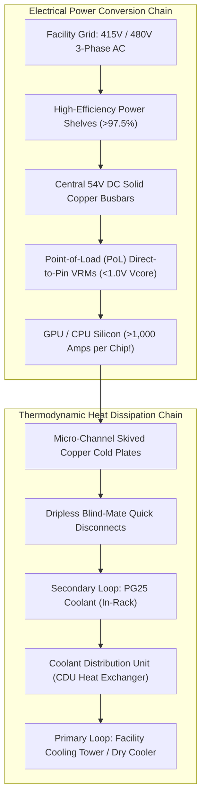

# Volume 22: Datacenter Infrastructure: 54V Busbars & Direct Liquid Cooling

```text
====================================================================================================
MODULE 22: HIGH-DENSITY POWER PLANTS, 54V SOLID BUSBARS & DIRECT-TO-CHIP LIQUID COOLING
PLATFORMS: GB200 NVL72 (120 KW) | VERA RUBIN NVL72 (Up to 600 KW) | DGX SUPERPOD
====================================================================================================
```

The physical reality of modern accelerated computing has permanently outgrown traditional air-cooled, low-voltage datacenter facilities. Deploying rack-scale superchips like the **GB200 NVL72 (120 kW per rack)** or the **Vera Rubin NVL72 (up to 600 kW per rack)** demands a complete reimagining of electrical power distribution and thermodynamics.

Air cooling cannot physically dissipate heat fluxes exceeding $100\text{ W/cm}^2$, and traditional 12V DC power distribution causes catastrophic resistive losses ($I^2R$) when delivering thousands of Amps. This volume explores the transition to **415V/480V 3-phase AC into 54V DC solid copper busbars**, **Point-of-Load (PoL) Direct-to-Pin VRMs**, **transient current step-load mitigation**, and **Direct-to-Chip (DLC) liquid cooling plants with Coolant Distribution Units (CDUs)**.

---

## 📑 Table of Contents
1. [The Thermodynamic & Electrical Wall of Modern AI Racks](#1-the-thermodynamic--electrical-wall-of-modern-ai-racks)
2. [54V DC Power Distribution: The Mathematics of I²R Losses](#2-54v-dc-power-distribution-the-mathematics-of-ir-losses)
3. [Point-of-Load (PoL) Direct-to-Pin VRMs & Transient di/dt Steps](#3-point-of-load-pol-direct-to-pin-vrms--transient-didt-steps)
4. [Direct-to-Chip (DLC) Cold Plates & Micro-Channels](#4-direct-to-chip-dlc-cold-plates--micro-channels)
5. [Coolant Distribution Units (CDUs) & Facility Water Loops](#5-coolant-distribution-units-cdus--facility-water-loops)
6. [Multi-Dimensional Architecture Correlation](#6-multi-dimensional-architecture-correlation)
7. [Hands-On Power & Thermal Telemetry Diagnostic Lab](#7-hands-on-power--thermal-telemetry-diagnostic-lab)
8. [Practice Exercises & Verification Workbook](#8-practice-exercises--verification-workbook)

---

## 1. The Thermodynamic & Electrical Wall of Modern AI Racks

```text
+--------------------------------------------------------------------------------------------------+
| DATACENTER RACK DENSITY EVOLUTION                                                                |
+---------------------+-------------------------------+------------------------------------------+
| Era / Architecture  | Typical Rack Power Envelope   | Dominant Cooling & Power Architecture    |
+---------------------+-------------------------------+------------------------------------------+
| Traditional Cloud   | 5 kW to 15 kW per rack        | Forced Air Cooling (CRAC/CRAH) | 12V DC  |
| Early Deep Learning | 20 kW to 40 kW (HGX A100/H100)| High-Velocity Air Cooling | Dual 12V/48V |
| Hyperscale NVL72    | 120 kW to 140 kW (GB200 NVL72)| 100% Direct-to-Chip Liquid Cooling | 54V |
| Exascale Pods       | 300 kW to 600 kW (Rubin NVL)  | Warm-Water Direct Liquid (W4/W5) | 54V+  |
+---------------------+-------------------------------+------------------------------------------+
```



---

## 2. 54V DC Power Distribution: The Mathematics of I²R Losses

Why did modern AI racks transition from traditional 12V DC power to **54V DC**?

The power dissipated as heat in distribution conductors is governed by **Joule's Law**:

$$P_{\text{loss}} = I^2 R = \left( \frac{P_{\text{total}}}{V} \right)^2 R$$

```text
THE POWER-LOSS MULTIPLIER (12V VS. 54V AT 120 KW):
┌────────────────────────────────────────────────────────────────────────┐
│ Current at 12V : I = 120,000 W / 12 V = 10,000 Amps                    │
│ Current at 54V : I = 120,000 W / 54 V =  2,222 Amps                    │
├────────────────────────────────────────────────────────────────────────┤
│ Current Reduction Factor : 54 V / 12 V = 4.5x                          │
│ Resistive Loss Reduction : (4.5)^2     = 20.25x LESS RESISTIVE HEAT!   │
└────────────────────────────────────────────────────────────────────────┘
```

* **Impact**: At 12V, moving 10,000 Amps would require copper busbars thicker than an arm, generating unmanageable resistive fire hazards. At 54V, power moves through compact, vertical solid copper busbars running the height of the rack.

---

## 3. Point-of-Load (PoL) Direct-to-Pin VRMs & Transient di/dt Steps

While power enters the rack at 54V DC, modern GPU logic gates operate at **sub-1.0 Volt Vcore ($0.75\text{V} - 0.95\text{V}$)**:
* **Point-of-Load (PoL) VRMs**: Multi-phase direct-to-pin voltage regulator modules convert 54V DC directly to $<1.0\text{V}$ right beneath the GPU package, delivering **thousands of Amps** directly into the BGA pins.

### Transient Current Steps (The di/dt Dilemma):
When a dense FP4 GEMM instruction launches across all 160 SMs simultaneously, the GPU's current demand spikes from **$150\text{ Amps}$ to over $1,200\text{ Amps}$ in nanoseconds**:

$$\Delta V = L \times \frac{di}{dt}$$

If the rate of change of current ($\frac{di}{dt}$) is too steep, parasitic inductance ($L$) on the power rail causes a severe **voltage sag**. If voltage drops below $V_{\min}$, the GPU halts instantly, triggering a bus drop and **XID 79**.

```text
TRANSIENT STEP-LOAD MITIGATION:
┌────────────────────────────────────────────────────────────────────────┐
│ 1. Nanosecond Micro-Throttling : GPU clock drops for 10-50ns to stagger│
│                                  ALU activation.                       │
│ 2. Deep Trench Silicon Caps    : High-frequency on-die capacitors.     │
│ 3. In-Rack Supercapacitor Trays: Absorb rack-level step loads.         │
└────────────────────────────────────────────────────────────────────────┘
```

---

## 4. Direct-to-Chip (DLC) Cold Plates & Micro-Channels

Air cooling is physically limited by the low heat capacity of air ($c_p \approx 1.0\text{ J/g}\cdot\text{K}$). Water has over **$4\times$ the specific heat capacity** and **$25\times$ the thermal conductivity**:

```text
+--------------------------------------------------------------------------------------------------+
| COOLING MEDIUM THERMAL PROPERTIES                                                                |
+---------------------+-----------------------+-------------------------+--------------------------+
| Property            | Air                   | Secondary Coolant (PG25)| Deionized Pure Water     |
+---------------------+-----------------------+-------------------------+--------------------------+
| Thermal Conductivity| 0.026 W/m·K           | ~0.45 W/m·K (17x air)   | 0.60 W/m·K (23x air)     |
| Specific Heat       | 1.00 J/g·K            | ~3.80 J/g·K (3.8x air)  | 4.18 J/g·K (4.2x air)    |
| Density             | 1.2 kg/m³             | 1,030 kg/m³ (858x air)  | 1,000 kg/m³              |
| Max Heat Flux       | ~20 to 35 W/cm²       | > 150 W/cm²             | > 200 W/cm²              |
+---------------------+-----------------------+-------------------------+--------------------------+
```

```text
DIRECT-TO-CHIP SKIVED COPPER COLD PLATE CROSS-SECTION:
┌──────────────────────────────────────────────────────────────┐
│ Coolant Inflow (PG25 @ 30°C) ──► Micro-Channel Skived Fins   │
│                                  (Fin gaps < 100 microns!)   │
│                                  │                           │
│                                  ▼ Heat Transfer to Fluid    │
│ Coolant Outflow (PG25 @ 45°C) ◄── High-Turbulence Channels   │
├──────────────────────────────────────────────────────────────┤
│ Pure Electrolytic Copper Baseplate (High Thermal Mass)       │
├──────────────────────────────────────────────────────────────┤
│ Phase-Change Thermal Interface Material (TIM 2)              │
├──────────────────────────────────────────────────────────────┤
│ GPU Die Silicon (CoWoS-L Substrate @ 1000+ Watts Heat Flux!) │
└──────────────────────────────────────────────────────────────┘
```

---

## 5. Coolant Distribution Units (CDUs) & Facility Water Loops

In a liquid-cooled datacenter, fluid operates in two isolated, closed loops separated by a plate heat exchanger inside the **Coolant Distribution Unit (CDU)**:

```text
TWO-TIER CLOSED LOOP ARCHITECTURE:
┌────────────────────────────────────────────────────────────────────────┐
│ PRIMARY LOOP (Facility Side):                                          │
│ Datacenter Cooling Towers / Dry Coolers ──► CDU Heat Exchanger         │
│ (ASHRAE Class W3/W4: Supports warm water up to 45°C; zero chillers!)   │
├────────────────────────────────────────────────────────────────────────┤
│ SECONDARY LOOP (Rack Side):                                            │
│ CDU Pumps ──► Manifolds ──► Blind-Mate QDs ──► Server Tray Cold Plates │
│ (Treated Propylene Glycol 25% + Corrosion Inhibitors to prevent algae) │
└────────────────────────────────────────────────────────────────────────┘
```

```mermaid
graph LR
    subgraph Primary_Facility_Loop["Primary Facility Loop (Warm Water up to 45°C)"]
        DryCooler["Facility Dry Coolers / Cooling Towers"] <===>|Treated Facility Water| HeatExchanger["CDU Plate Heat Exchanger"]
    end

    subgraph Secondary_Rack_Loop["Secondary In-Rack Loop (Closed Pure PG25)"]
        HeatExchanger <===>|Circulating Pumps (150-300 kW Capacity)| Manifold["Vertical Rack Manifolds"]
        Manifold <===>|Dripless Quick Disconnects| Trays["18 Compute Trays + 9 Switch Trays"]
    end
```

* **Dripless Blind-Mate Quick Disconnects (QDs)**: Server trays slide into the rack; precision dripless valves engage automatically without manual hose connections. Trays can be inserted and removed under live hydraulic pressure with zero fluid leaks.

---

## 6. Multi-Dimensional Architecture Correlation

```text
+--------------------------------------------------------------------------------------------------+
| MULTI-DIMENSIONAL CORRELATION: POWER & LIQUID COOLING                                            |
+---------------------+----------------------------------------------------------------------------+
| Dimension           | Mechanism & Failure Manifestation                                          |
+---------------------+----------------------------------------------------------------------------+
| Thermal x Compute   | A localized air bubble in a cold plate spikes GPU junction temperature to   |
|                     | 95°C in milliseconds, triggering GSP microcode thermal throttling.         |
| Power x Kernel      | Rapid transient di/dt drops voltage below minimum threshold on a compute   |
|                     | tray, causing the GPU to fall off the PCIe bus (Kernel XID 79).            |
| Thermal x Network   | CDU pump pressure drops decrease flow rate through NVSwitch trays, causing |
|                     | switch SerDes eye closure and surging NVLink CRC errors (XID 92).          |
| Power x Facility    | If an AC rectifier in an N+2 power shelf fails, the remaining rectifiers   |
|                     | absorb load; if overloaded, rack-level micro-throttling caps peak compute. |
+---------------------+----------------------------------------------------------------------------+
```

---

## 7. Hands-On Power & Thermal Telemetry Diagnostic Lab

### Lab Objective:
Query hardware thermal sensors, inspect cold plate inlet/outlet temperatures, monitor power draw per rail, and check for thermal throttling flags via IPMI and `nvidia-smi`.

### Step 1: Query Deep GPU Thermal Sensor Data
Use `nvidia-smi` to extract junction and memory temperatures:

```bash
# Query current and slowdown thermal thresholds
nvidia-smi --query-gpu=name,temperature.gpu,temperature.memory \
           --format=csv
```

### Step 2: Query Rack Baseboard Management Controller (BMC) via IPMI
Interrogate datacenter power shelves and liquid cooling sensors:

```bash
# Query liquid cooling loop temperatures and CDU flow rates
sudo ipmitool sensor | grep -E "Temp|Flow|CDU|Inlet|Outlet" 2>/dev/null || echo "IPMI sensor query."
```

*Sample Expected Output (Liquid-Cooled NVL Rack):*
```text
Inlet Coolant Temp | 32.4 degrees C | ok
Outlet Coolant Temp| 44.8 degrees C | ok
Rack Coolant Flow  | 82.5 L/min     | ok
Power Shelf 54V Bus| 54.12 Volts    | ok
```

### Step 3: Monitor Instantaneous Power Consumption
Query active GPU wattage and power rail headroom:

```bash
nvidia-smi --query-gpu=power.draw,power.limit,enforced.power.limit --format=csv
```

---

## 8. Practice Exercises & Verification Workbook

### Exercise 22.1: Liquid Cooling Heat Removal Math
* **Scenario**: A GB200 NVL72 rack operates at a sustained power load of $120.0\text{ kW}$. The secondary liquid cooling loop uses a Propylene Glycol mixture (PG25) with a specific heat capacity $c_p = 3.85\text{ J/g}\cdot\text{K}$ and a density $\rho = 1.025\text{ kg/L}$. The coolant inlet temperature is $30.0^\circ\text{C}$ and the design outlet temperature is $45.0^\circ\text{C}$ ($\Delta T = 15.0\text{ K}$).
* **Task**: Calculate the required coolant volumetric flow rate ($Q$) in Liters per minute ($\text{L/min}$) to remove 100% of the thermal load.
* **Solution**:
  1. *Thermal Energy Formula*:
     $$P = \dot{m} \times c_p \times \Delta T$$
  2. *Calculate Mass Flow Rate ($\dot{m}$)*:
     $$\dot{m} = \frac{P}{c_p \times \Delta T} = \frac{120,000 \text{ W}}{3,850 \text{ J/kg}\cdot\text{K} \times 15.0 \text{ K}} = \frac{120,000}{57,750} \approx 2.078 \text{ kg/second}$$
  3. *Convert to Volumetric Flow Rate in L/min*:
     $$Q = \frac{\dot{m}}{\rho} \times 60 \text{ s/min} = \frac{2.078 \text{ kg/s}}{1.025 \text{ kg/L}} \times 60 \approx 121.6 \text{ L/min}$$
  *Result*: The CDU pumps must circulate **$121.6\text{ Liters/minute}$** of PG25 coolant to maintain rack thermal equilibrium.

### Exercise 22.2: 54V Busbar Copper Cross-Sectional Area
* **Scenario**: A datacenter rack draws $120\text{ kW}$. 
* **Task**: Calculate the physical current flowing through the busbar at $12\text{V}$ vs. $54\text{V}$, and determine why $12\text{V}$ is impossible in a 48U rack footprint.
* **Solution**:
  * At $12\text{V}$: $I = 120,000 / 12 = 10,000\text{ Amps}$. At standard current density limits ($2\text{ Amps/mm}^2$ for passive copper), this requires a solid copper bar of $5,000\text{ mm}^2$ (e.g., $100\text{ mm} \times 50\text{ mm}$ solid copper block, weighing hundreds of pounds and blocking airflow).
  * At $54\text{V}$: $I = 120,000 / 54 = 2,222\text{ Amps}$. Required cross-section is $1,111\text{ mm}^2$—compact enough to fit in the rear chassis profile.

---

## 📌 Summary Checklist: What You Have Mastered
- [x] Thermodynamic and electrical limits of legacy air-cooled datacenters.
- [x] Why 54V DC busbars reduce resistive $I^2R$ heat losses by over $20\times$.
- [x] Point-of-Load (PoL) direct-to-pin VRMs and transient di/dt step-load mitigation.
- [x] Direct-to-Chip (DLC) micro-channel skived copper cold plate engineering.
- [x] Primary vs. Secondary closed loops and Coolant Distribution Unit (CDU) operations.
- [x] Monitoring power shelves, coolant flow rates, and temperatures with IPMI and `nvidia-smi`.
