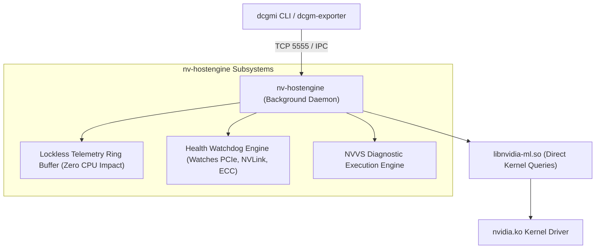

# Volume 23: Data Center GPU Manager (DCGM) & Production Monitoring

```text
====================================================================================================
MODULE 23: CLUSTER-WIDE TELEMETRY, HEALTH WATCHDOGS & DCGM PROMETHEUS EXPORTERS
PLATFORMS: DATA CENTER LINUX | KUBERNETES | PROMETHEUS / GRAFANA | SLURM
====================================================================================================
```

In large-scale AI infrastructure comprising hundreds of compute nodes and thousands of accelerators, polling `nvidia-smi` across the fleet is computationally prohibitive and architecturally unviable. An enterprise telemetry system must deliver **high-frequency, low-overhead hardware sampling, automated background health watchdogs, policy-based alerting, and native Prometheus integration**.

The **NVIDIA Data Center GPU Manager (DCGM)** is the official cluster telemetry engine engineered specifically for enterprise datacenters and Kubernetes clouds. This volume explores the client-server architecture of `nv-hostengine`, active health monitoring systems, low-overhead field ID profiling, and production deployment of the **`dcgm-exporter`** DaemonSet.

---

## 📑 Table of Contents
1. [The Architecture of DCGM: nv-hostengine & dcgmi](#1-the-architecture-of-dcgm-nv-hostengine--dcgmi)
2. [Active Health Watchdogs & Hardware Policy Monitoring](#2-active-health-watchdogs--hardware-policy-monitoring)
3. [Low-Overhead Metric Profiling (Field IDs)](#3-low-overhead-metric-profiling-field-ids)
4. [Cloud-Native Telemetry: dcgm-exporter & Prometheus](#4-cloud-native-telemetry-dcgm-exporter--prometheus)
5. [Automated Diagnostic Triggers & Node Draining](#5-automated-diagnostic-triggers--node-draining)
6. [Multi-Dimensional Architecture Correlation](#6-multi-dimensional-architecture-correlation)
7. [Hands-On DCGM Telemetry & Health Monitoring Lab](#7-hands-on-dcgm-telemetry--health-monitoring-lab)
8. [Practice Exercises & Verification Workbook](#8-practice-exercises--verification-workbook)

---

## 1. The Architecture of DCGM: nv-hostengine & dcgmi

DCGM is structured as a **client-server architecture**:

```text
DCGM TWO-TIER CLIENT-SERVER TOPOLOGY:
┌────────────────────────────────────────────────────────────────────────┐
│ DCGM Client Tools: `dcgmi` CLI | `dcgm-exporter` (Prometheus) | Slurm  │
│                                │                                       │
│                                ▼ Unix Domain Socket / TCP Port 5555    │
│ Background Daemon Engine: `nv-hostengine`                              │
│ ├── Persistent Telemetry Cache (Ring Buffers in Shared Memory)         │
│ ├── Autonomous Health Watchdog Polling Loops                           │
│ └── Policy Enforcement & Action Triggers                               │
│                                │                                       │
│                                ▼ C-API (libnvidia-ml.so)               │
│ Host Kernel & GSP Firmware: `/dev/nvidiactl` & NVLink Devices          │
└────────────────────────────────────────────────────────────────────────┘
```



### Why DCGM Outperforms nvidia-smi:
* **Zero Process Spawning Overhead**: `nv-hostengine` stays permanently resident in memory; queries read directly from internal shared-memory ring buffers without spawning child processes.
* **Lockless Metric Ingestion**: Samples hardware registers (power, clocks, SM utilization) at up to $100\text{ Hz}$ ($10\text{ ms}$ intervals) while consuming $<1\%$ of a single host CPU core.

---

## 2. Active Health Watchdogs & Hardware Policy Monitoring

DCGM can configure automated **Health Watches** that continuously monitor physical subsystems in the background:

```text
+--------------------------------------------------------------------------------------------------+
| DCGM HEALTH WATCH SYSTEMS                                                                        |
+---------------------+-------------------+--------------------------------------------------------+
| Health Watch Flag   | Bitmask / Name    | Target Physical Subsystem & Monitored Events           |
+---------------------+-------------------+--------------------------------------------------------+
| `PCIe`              | `DCGM_HEALTH_WATCH_PCIE`  | PCIe replay counters, link degradation, bandwidth drops|
| `NVLink`            | `DCGM_HEALTH_WATCH_NVLINK`| SerDes CRC errors, link recovery, NVSwitch flaps       |
| `Memory`            | `DCGM_HEALTH_WATCH_MEM`   | Page retirement, uncorrectable double-bit ECC errors   |
| `Power`             | `DCGM_HEALTH_WATCH_POWER` | Power supply rail failure, extreme power violations    |
| `Thermal`           | `DCGM_HEALTH_WATCH_THERMAL| Critical thermal trip points, slowdown triggers        |
| `Inforom`           | `DCGM_HEALTH_WATCH_INFOROM| Flash ROM corruption, calibration data degradation     |
+---------------------+-------------------+--------------------------------------------------------+
```

When an error condition occurs (e.g., an uncorrectable memory ECC error), the health watchdog immediately flags the GPU as **UNHEALTHY**, allowing cluster orchestrators (Kubernetes/Slurm) to cordon the node before a distributed training job crashes.

---

## 3. Low-Overhead Metric Profiling (Field IDs)

DCGM organizes all hardware telemetry into standardized numeric **Field IDs (FIDs)**:

```text
+--------------------------------------------------------------------------------------------------+
| CRITICAL DCGM TELEMETRY FIELD IDS                                                                |
+---------+------------------------------------+---------------------------------------------------+
| Field ID| Symbolic Constant Name             | Telemetry Metric Description                      |
+---------+------------------------------------+---------------------------------------------------+
| 100     | `DCGM_FI_DEV_SM_CLOCK`             | Real-time SM graphics clock frequency (MHz)       |
| 101     | `DCGM_FI_DEV_MEM_CLOCK`            | Real-time HBM memory clock frequency (MHz)        |
| 150     | `DCGM_FI_DEV_POWER_USAGE`          | Instantaneous board power consumption (Watts)     |
| 203     | `DCGM_FI_DEV_GPU_UTIL`             | SM execution activity percentage (0-100%)         |
| 204     | `DCGM_FI_DEV_MEM_COPY_UTIL`        | Memory copy engine utilization percentage         |
| 1001    | `DCGM_FI_PROF_SM_ACTIVE`           | Ratio of cycles where at least 1 warp was active  |
| 1002    | `DCGM_FI_PROF_SM_OCCUPANCY`        | Resident warps relative to theoretical maximum    |
| 1003    | `DCGM_FI_PROF_PIPE_TENSOR_ACTIVE`  | Ratio of cycles Tensor Cores executed MMA ops     |
| 1004    | `DCGM_FI_PROF_DRAM_ACTIVE`         | HBM memory controller cycle activity              |
| 1005    | `DCGM_FI_PROF_NVLINK_TX_BYTES`     | Total NVLink transmit bytes across all ports      |
| 1006    | `DCGM_FI_PROF_NVLINK_RX_BYTES`     | Total NVLink receive bytes across all ports       |
+---------+------------------------------------+---------------------------------------------------+
```

---

## 4. Cloud-Native Telemetry: dcgm-exporter & Prometheus

In Kubernetes environments, **`dcgm-exporter`** runs as a `DaemonSet` on every GPU worker node, scraping `nv-hostengine` and exposing OpenMetrics endpoints for Prometheus:

```yaml
# Sample Prometheus Scrape Target: http://<node-ip>:9400/metrics
# HELP DCGM_FI_PROF_PIPE_TENSOR_ACTIVE Ratio of cycles Tensor Cores were active
# TYPE DCGM_FI_PROF_PIPE_TENSOR_ACTIVE gauge
DCGM_FI_PROF_PIPE_TENSOR_ACTIVE{gpu="0",UUID="GPU-...",model="B200"} 0.842

# HELP DCGM_FI_DEV_POWER_USAGE Power usage in watts
# TYPE DCGM_FI_DEV_POWER_USAGE gauge
DCGM_FI_DEV_POWER_USAGE{gpu="0",UUID="GPU-...",model="B200"} 648.5
```

```mermaid
graph LR
    subgraph Node_DaemonSet["Kubernetes GPU Worker Node"]
        Driver["nvidia.ko Driver"] --> HostEngine["nv-hostengine Daemon"]
        HostEngine --> Exporter["dcgm-exporter Pod (Port 9400)"]
    end

    subgraph Monitoring_Cluster["Observability Cluster"]
        Exporter -->|Prometheus Scrape Interval (1-5s)| Prometheus["Prometheus Server"]
        Prometheus --> Grafana["Grafana Dashboards (Alerts: Stragglers, High Temp)"]
        Prometheus --> Alertmanager["Alertmanager: Automatic Node Cordon Webhook"]
    end
```

---

## 5. Automated Diagnostic Triggers & Node Draining

Using DCGM policy triggers, cluster administrators automate fault recovery:

```text
AUTOMATED SRE DRAIN WORKFLOW:
┌────────────────────────────────────────────────────────────────────────┐
│ 1. DCGM Health Watchdog detects uncorrectable Double-Bit ECC error.    │
│ 2. `dcgm-exporter` sets metric: `DCGM_FI_DEV_ECC_DBE_VOLATILE_TOTAL > 0`│
│ 3. Prometheus Alertmanager fires: `GPUHardwareFailureCritical`         │
│ 4. Kubernetes Node Problem Detector cordons and drains the node:       │
│    `kubectl cordon <node>` && `kubectl drain <node> --ignore-daemonsets│
│ 5. Automated Slurm / K8s controller restarts training job on healthy   │
│    spares; hardware engineers dispatch RMA replacement.                │
└────────────────────────────────────────────────────────────────────────┘
```

---

## 6. Multi-Dimensional Architecture Correlation

```text
+--------------------------------------------------------------------------------------------------+
| MULTI-DIMENSIONAL CORRELATION: DCGM TELEMETRY                                                    |
+---------------------+----------------------------------------------------------------------------+
| Dimension           | Mechanism & Failure Manifestation                                          |
+---------------------+----------------------------------------------------------------------------+
| Telemetry x Train   | A drop in `DCGM_FI_PROF_PIPE_TENSOR_ACTIVE` below 0.3 during training       |
|                     | indicates distributed pipeline stalls or host data-loader starvation.      |
| Telemetry x Thermal | Persistent divergence between GPU inlet and junction temperatures triggers |
|                     | thermal alerts before hardware microcode enforces clock reduction.         |
| Telemetry x Fabric  | Tracking `DCGM_FI_PROF_NVLINK_TX_BYTES` across all ranks detects routing   |
|                     | link imbalances caused by unprogrammed NVSwitch routing tables.            |
| Telemetry x SRE     | Monitoring volatile SBE error rates allows predicting double-bit failures  |
|                     | days in advance, enabling graceful scheduled maintenance windows.          |
+---------------------+----------------------------------------------------------------------------+
```

---

## 7. Hands-On DCGM Telemetry & Health Monitoring Lab

### Lab Objective:
Verify the `nv-hostengine` daemon, configure active health monitoring using `dcgmi health`, query real-time profiling metrics, and execute Level 1 validation.

### Step 1: Verify and Start the DCGM Host Engine Daemon
Check the systemd daemon status:

```bash
# Verify nv-hostengine systemd daemon
sudo systemctl status nvidia-dcgm.service --no-pager
```

*If inactive, enable and start:*
```bash
sudo systemctl enable --now nvidia-dcgm.service
```

### Step 2: Configure and Check Active Health Watches
Enable health monitoring across all subsystems:

```bash
# Enable all health watches across GPU 0
dcgmi health -g 0 -s a

# Query current health status
dcgmi health -g 0 -c
```

*Expected Healthy Output:*
```text
Group 0 contains 8 GPUs.
Overall Health: Healthy
  PCIe    : Healthy
  Memory  : Healthy
  Inforom : Healthy
  Thermal : Healthy
  Power   : Healthy
  NVLink  : Healthy
```

### Step 3: Query High-Frequency Profiling Metrics
Inspect live Tensor Core activity and HBM memory bandwidth:

```bash
# Query live profiling fields for GPU 0
dcgmi profile --pause
dcgmi profile -g 0 -e 1001,1003,1004,1005 -s 1000
```

---

## 8. Practice Exercises & Verification Workbook

### Exercise 23.1: Tensor Core Utilization Math
* **Scenario**: During a 24-hour training run on an H100 SXM5 cluster ($1,979\text{ TFLOPS}$ theoretical peak FP8 compute), Prometheus scrapes `DCGM_FI_PROF_PIPE_TENSOR_ACTIVE` at an average value of $0.62$ ($62\%$).
* **Task**: Calculate the average achieved compute throughput per GPU.
* **Solution**:
  $$\text{Achieved Throughput} = 1,979 \text{ TFLOPS} \times 0.62 = 1,226.98 \text{ TFLOPS}$$
  *Result*: The cluster achieves an average compute throughput of **$\sim 1,227\text{ TFLOPS}$** per GPU, delivering a Model Flops Utilization (MFU) of $62\%$.

### Exercise 23.2: Automated Node Drain Alerting Rule
* **Scenario**: An SRE writes a Prometheus alerting rule to detect failing memory before a node crashes.
* **Task**: Write the PromQL alert expression that triggers when any GPU registers more than 5 volatile double-bit ECC errors over a 5-minute window.
* **Solution**:
  ```yaml
  alert: GPUMemoryDoubleBitECCSurge
  expr: increase(DCGM_FI_DEV_ECC_DBE_VOLATILE_TOTAL[5m]) > 5
  for: 1m
  labels:
    severity: critical
  annotations:
    summary: "GPU {{ $labels.gpu }} on {{ $labels.instance }} has uncorrectable memory errors"
    description: "Node requires immediate draining and GPU replacement."
  ```

---

## 📌 Summary Checklist: What You Have Mastered
- [x] DCGM client-server architecture (`nv-hostengine` and `dcgmi`).
- [x] Setting up and checking automated hardware health watches.
- [x] High-frequency lockless profiling using numeric Field IDs (FIDs).
- [x] Deploying `dcgm-exporter` for Kubernetes and Prometheus monitoring.
- [x] Automated SRE node drain and cordon workflows based on hardware telemetry.
- [x] Interrogating live cluster health using the `dcgmi` command-line utility.
