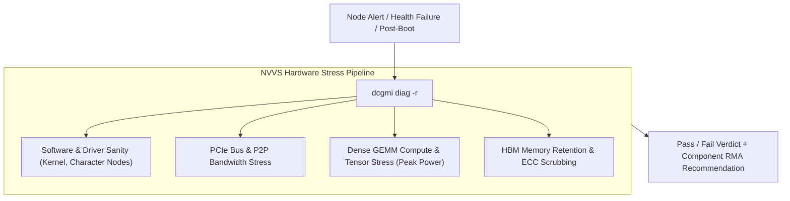
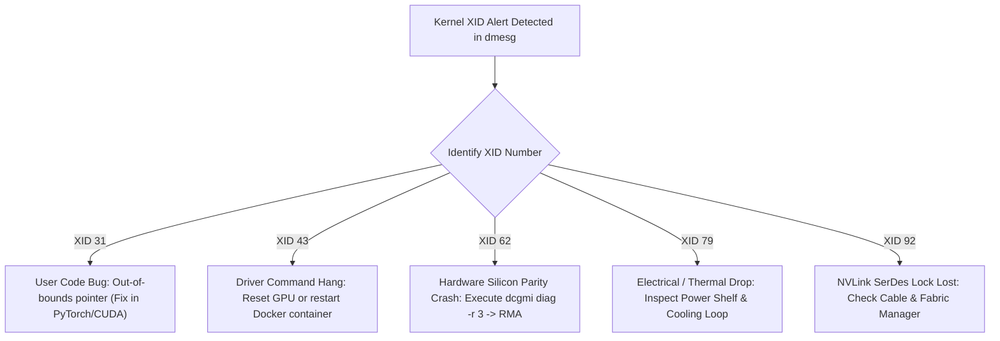

# Volume 24: Hardware Diagnostics (NVVS) & Kernel XID Error Forensics

```text
====================================================================================================
MODULE 24: HARDWARE VALIDATION SUITE (NVVS), KERNEL XID FORENSICS & SDC
PLATFORMS: DATA CENTER LINUX | NVIDIA HOPPER | BLACKWELL | VERA RUBIN
====================================================================================================
```

In hyperscale AI infrastructure, hardware failures are statistical certainties. With clusters containing tens of thousands of GPUs, millions of HBM memory cells, and miles of high-speed SerDes interconnects, components experience **thermal degradation, silicon bit-flips, SerDes lock failures, and power rail collapses**.

When a failure occurs, an infrastructure engineer must rapidly determine whether the root cause is a transient software bug, an environmental cooling/power failure, or permanent physical silicon damage requiring an RMA (Return Merchandise Authorization). This volume provides an exhaustive forensic breakdown of the **NVIDIA Validation Suite (NVVS)** diagnostic levels, the complete taxonomy of **Linux Kernel XID error codes**, and **Silent Data Corruption (SDC)** mitigation strategies.

---

## 📑 Table of Contents
1. [The NVIDIA Validation Suite (NVVS) Architecture](#1-the-nvidia-validation-suite-nvvs-architecture)
2. [NVVS Diagnostic Levels: Level 1 to Level 4](#2-nvvs-diagnostic-levels-level-1-to-level-4)
3. [The Anatomy of a Kernel XID Error](#3-the-anatomy-of-a-kernel-xid-error)
4. [Deep-Dive Forensic Root Cause Playbook for Critical XIDs](#4-deep-dive-forensic-root-cause-playbook-for-critical-xids)
5. [Silent Data Corruption (SDC) & Memory Page Retirement](#5-silent-data-corruption-sdc--memory-page-retirement)
6. [Multi-Dimensional Architecture Correlation](#6-multi-dimensional-architecture-correlation)
7. [Hands-On NVVS Diagnostics & Log Analysis Lab](#7-hands-on-nvvs-diagnostics--log-analysis-lab)
8. [Practice Exercises & Verification Workbook](#8-practice-exercises--verification-workbook)

---

## 1. The NVIDIA Validation Suite (NVVS) Architecture

The **NVIDIA Validation Suite (NVVS)** is the definitive hardware burn-in, qualification, and stress-testing tool:

```text
+--------------------------------------------------------------------------------------------------+
| NVVS INTEGRATION CHANNELS                                                                        |
+---------------------+-------------------------------+------------------------------------------+
| Access Channel      | Execution Command             | Primary Use Case                         |
+---------------------+-------------------------------+------------------------------------------+
| Standalone Binary   | `nvvs -c <test_config.yaml>`  | Bare-metal manufacturing & vendor triage |
| DCGM Diagnostic API | `dcgmi diag -r <1|2|3|4>`     | Production cluster automated diagnostics |
| Automated SRE Script| Automated post-reboot health  | Node acceptance testing before Slurm join|
+---------------------+-------------------------------+------------------------------------------+
```



---

## 2. NVVS Diagnostic Levels: Level 1 to Level 4

```text
+--------------------------------------------------------------------------------------------------+
| NVVS DIAGNOSTIC LEVELS & STRESS SPECIFICATIONS                                                   |
+---------+---------------------+-------------------+----------------------------------------------+
| Level   | Category            | Execution Time    | Subtests Executed & Physical Target          |
+---------+---------------------+-------------------+----------------------------------------------+
| Level 1 | Quick Sanity        | ~30 Seconds       | Driver sanity, device nodes, Inforom, basic  |
|         |                     |                   | PCIe link status, persistence daemon state.  |
| Level 2 | Medium Integration  | ~2 Minutes        | PCIe bus bandwidth test, P2P NVLink check,   |
|         |                     |                   | small GEMM test, memory allocation sanity.   |
| Level 3 | Hardware Stress     | ~10 to 15 Minutes | Full GEMM power stress, sustained memory     |
|         |                     |                   | bandwidth test, NVLink SerDes stress.        |
| Level 4 | Extended Burn-In    | Hours to Days     | Deep memory pattern retention, thermal cycle |
|         |                     |                   | burn-in, long-duration power shelf testing.  |
+---------+---------------------+-------------------+----------------------------------------------+
```

---

## 3. The Anatomy of a Kernel XID Error

When the NVIDIA Resource Manager encounters an unexpected hardware state or unrecoverable error, it writes a structured message to the Linux kernel ring buffer (`dmesg`):

```text
SAMPLE XID KERNEL MESSAGE:
NVRM: Xid (PCI:0000:0f:00): 79, pid='<unknown>', name=<unknown>, GPU has fallen off the bus.
```

```text
XID STRING DECONSTRUCTION:
┌──────────────┬────────────────────────────────────────────────────────┐
│ Field        │ Meaning & Forensic Information                         │
├──────────────┼────────────────────────────────────────────────────────┤
│ `NVRM`       | NVIDIA Resource Manager (Core driver tag)              │
│ `PCI Address`| `0000:0f:00.0` (Identifies the exact failing physical  │
│              | PCIe device in the server chassis)                     │
│ `Xid`        | The numeric error code (e.g., 31, 43, 62, 79, 92)      │
│ `pid / name` | The user-space process and command active during crash │
└──────────────┴────────────────────────────────────────────────────────┘
```

---

## 4. Deep-Dive Forensic Root Cause Playbook for Critical XIDs

```text
+--------------------------------------------------------------------------------------------------+
| CRITICAL XID ERROR FORENSIC PLAYBOOK                                                             |
+-----+-----------------------+-----------------------------+--------------------------------------+
| XID | Symbolic Meaning      | Physical Root Cause         | SRE Triage & Remediation Action      |
+-----+-----------------------+-----------------------------+--------------------------------------+
| 31  | GPU Page Fault        | Invalid pointer dereference | Application software bug. Run under  |
|     |                       | or unmapped address access  | `compute-sanitizer --tool memcheck`. |
| 43  | GPU Stopped Responding| Kernel timeout / hung kernel| Check for soft-lockups. Kill hanging |
|     |                       | or driver command buffer jam| PID; reset GPU via `nvidia-smi -r`.  |
| 45  | Preemptive Bus Error  | Engine arbitration or DMA   | Verify PCIe link integrity; update   |
|     |                       | channel synchronization fail| VBIOS firmware.                      |
| 62  | Internal Microcode /  | Uncorrectable bit-flip in   | Hardware silicon failure! Run NVVS L3|
|     | SRAM Parity Error     | internal SM cache/registers | diagnostics. If persistent: RMA GPU. |
| 79  | GPU Fallen Off Bus    | Power rail voltage collapse | Check 54V power shelf; inspect PCIe  |
|     |                       | or thermal shutdown trip    | slot seating; check BMC event logs.  |
| 92  | NVLink SerDes Failure | High-speed SerDes lock loss | Inspect SerDes eye/CRC errors; restart|
|     |                       | or CRC threshold exceeded   | fabric manager; inspect copper cable.|
+-----+-----------------------+-----------------------------+--------------------------------------+
```



---

## 5. Silent Data Corruption (SDC) & Memory Page Retirement

### The Danger of Silent Data Corruption (SDC):
Not all bit-flips crash a server. If a cosmic ray or transistor gate leakage flips a bit in a weight matrix without triggering an uncorrectable parity interrupt, the training loss degrades gradually over days without any error logs (**Silent Data Corruption**).

### Dynamic Page Retirement:
Modern HBM architectures continuously scrub memory:
1. **Single-Bit Errors (SBE)**: Corrected in hardware via Hamming code ECC at zero latency.
2. **Double-Bit Errors (DBE)**: Uncorrectable; immediately triggers an interrupt.
3. **Dynamic Page Retirement**: If an HBM memory address experiences recurring single-bit errors, the driver permanently **retires the 4KB memory page** in hardware, recording the retired address in non-volatile flash (Inforom) so it is never allocated again across reboots.

```bash
# Query retired memory pages count
nvidia-smi -q -d PAGE_RETIREMENT
```

---

## 6. Multi-Dimensional Architecture Correlation

```text
+--------------------------------------------------------------------------------------------------+
| MULTI-DIMENSIONAL CORRELATION: HARDWARE DIAGNOSTICS                                              |
+---------------------+----------------------------------------------------------------------------+
| Dimension           | Mechanism & Failure Manifestation                                          |
+---------------------+----------------------------------------------------------------------------+
| Diagnostics x Power | A weak power shelf rectifier causes voltage ripple under high current loads,|
|                     | triggering intermittent XID 79 crashes exclusively during dense GEMM runs. |
| Diagnostics x Thermal| Uneven cold plate pressure causes localized hot spots on HBM stacks,       |
|                     | resulting in a surge of SBE errors and premature page retirements.         |
| Diagnostics x Fabric| Loose blind-mate cartridges on the NVL72 spine trigger intermittent        |
|                     | XID 92 errors when thermal expansion flexes the copper backplane.          |
| Diagnostics x SRE   | DCGM automatically schedules NVVS Level 1 post-boot tests; if failed, the  |
|                     | node is kept in `NotReady` state, preventing broken hardware in production.|
+---------------------+----------------------------------------------------------------------------+
```

---

## 7. Hands-On NVVS Diagnostics & Log Analysis Lab

### Lab Objective:
Execute DCGM hardware diagnostics levels 1 and 2, interrogate retired memory pages, and search system logs for historic XID failures.

### Step 1: Execute Quick Level 1 Validation (Sanity Check)
Run a rapid system verification on local GPUs:

```bash
# Execute Level 1 sanity check across all GPUs
dcgmi diag -r 1
```

*Expected Diagnostic Summary Output:*
```text
+---------------------------+------------------------------------------------+
| Diagnostic                | Result                                         |
+===========================+================================================+
| Deployment                | Pass                                           |
| Blacklist                 | Pass                                           |
| NVVS                      | Pass                                           |
+---------------------------+------------------------------------------------+
```

### Step 2: Execute Level 2 Integration Check (PCIe & Memory Stress)
Run a medium integration test:

```bash
# Execute Level 2 integration test (runs PCIe and memory bandwidth validation)
dcgmi diag -r 2
```

### Step 3: Parse Kernel Ring Buffer for Historic XID Faults
Search system logs for past hardware crashes:

```bash
# Search for any historic XID error messages in dmesg
sudo dmesg -T | grep -E "NVRM: Xid" || echo "Zero XID errors found in kernel buffer."

# Search persistent syslog for historic XID events
grep -i "NVRM: Xid" /var/log/syslog* 2>/dev/null | tail -n 20 || echo "Zero syslog XIDs."
```

---

## 8. Practice Exercises & Verification Workbook

### Exercise 24.1: XID Forensic Triage Scenario
* **Scenario**: During a 512-GPU training job, Rank 42 crashes. The system administrator finds the following line in `/var/log/syslog`:
  ```text
  NVRM: Xid (PCI:0000:03:00): 62, pid='8412', name='python', Internal microcode error.
  ```
* **Task**: Detail the failure domain, determine if the job can be resumed on this node, and specify the SRE remediation protocol.
* **Solution**:
  1. *Failure Domain*: **XID 62** is an uncorrectable internal SRAM parity or microcode error in the GPU's on-chip cache or registers. It is a **permanent hardware silicon defect**, not a software bug.
  2. *Can the job resume on this node?*: **No**. The GPU silicon is physically compromised and will continue to corrupt computations.
  3. *SRE Protocol*:
     * Cordon and drain the node immediately: `kubectl cordon <node>` && `kubectl drain <node>`.
     * Run Level 3 validation to generate an official failure log: `dcgmi diag -r 3`.
     * Dispatch an RMA hardware ticket to replace the GPU module.

### Exercise 24.2: Page Retirement Threshold Math
* **Scenario**: An NVIDIA H100 GPU features an internal page retirement threshold. If an accelerator accumulates more than 60 retired pages or experiences an uncorrectable double-bit error (DBE), the driver flags the memory subsystem as degraded.
* **Task**: Write a bash one-liner using `nvidia-smi` to parse the number of double-bit retired pages and alert if greater than zero.
* **Solution**:
  ```bash
  DBE_RETIRED=$(nvidia-smi --query-gpu=retired_pages.double_bit --format=csv,noheader,nounits | head -n 1)
  if [ "$DBE_RETIRED" -gt 0 ]; then
      echo "CRITICAL: Detected $DBE_RETIRED uncorrectable retired memory page(s)! Dispatch RMA."
  else
      echo "OK: Zero double-bit retired pages."
  fi
  ```

---

## 📌 Summary Checklist: What You Have Mastered
- [x] NVIDIA Validation Suite (NVVS) architecture and diagnostic levels (1 to 4).
- [x] The anatomy and fields of Linux kernel NVRM XID error messages.
- [x] Forensic root cause triage for XID 31, 43, 45, 62, 79, and 92.
- [x] Silent Data Corruption (SDC) mechanics and dynamic memory page retirement.
- [x] Executing live hardware diagnostic sweeps using `dcgmi diag`.
- [x] Automated SRE triage runbooks for hardware replacement and RMA qualification.
