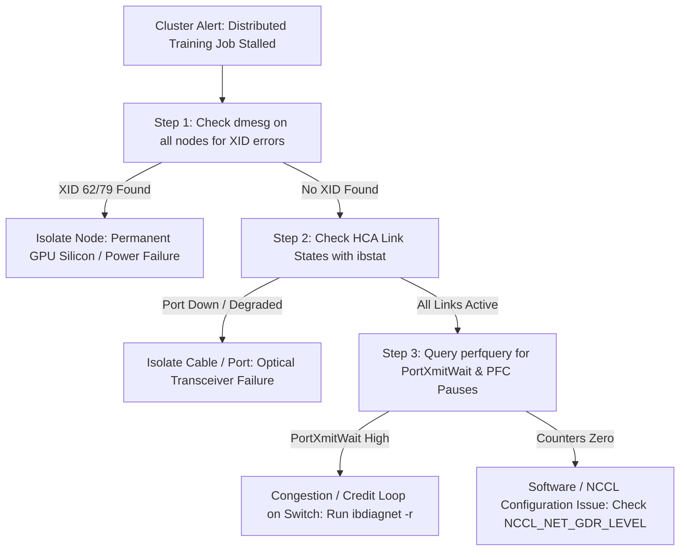

# Volume 25: Fabric Diagnostics (ibdiagnet, perfquery) & Cluster Playbook

```text
====================================================================================================
MODULE 25: END-TO-END FABRIC DIAGNOSTICS, NETWORK TRIAGE & CLUSTER RECOVERY
PLATFORMS: QUANTUM INFINIBAND | SPECTRUM-X AI ETHERNET | MELLANOX SOFTWARE TOOLS (MST)
====================================================================================================
```

In large-scale AI supercomputing clusters, the network fabric is the central nervous system connecting thousands of compute accelerators. Unlike local node failures that affect a single worker, network degradations—such as **credit loops, symbol error bursts on optical transceivers, routing misconfigurations, and RoCE PFC pause deadlocks**—propagate across the entire cluster, causing multi-thousand-GPU training jobs to stall indefinitely.

To operate at this scale, site reliability engineers (SREs) and AI infrastructure architects must master the low-level fabric diagnostic toolchain. This capstone volume explores fabric-wide topology scanning with **`ibdiagnet`**, hardware performance counter queries via **`perfquery`**, path tracing with **`ibtracert`**, **UFM (Unified Fabric Manager)** predictive failure analysis, RoCE QoS tuning with **`mlnx_qos`**, and end-to-end automated cluster recovery playbooks.

---

## 📑 Table of Contents
1. [The Network Diagnostic Ecosystem: IB & RoCE Toolchain](#1-the-network-diagnostic-ecosystem-ib--roce-toolchain)
2. [Fabric-Wide Health Scanning with ibdiagnet](#2-fabric-wide-health-scanning-with-ibdiagnet)
3. [Low-Level Port Counter Analysis with perfquery](#3-low-level-port-counter-analysis-with-perfquery)
4. [Path Tracing & Topology Mapping (ibtracert & iblinkinfo)](#4-path-tracing--topology-mapping-ibtracert--iblinkinfo)
5. [NVIDIA Unified Fabric Manager (UFM) & Cyber-AI](#5-nvidia-unified-fabric-manager-ufm--cyber-ai)
6. [RoCE & AI Ethernet Diagnostics (mlnx_qos, ethtool, MST)](#6-roce--ai-ethernet-diagnostics-mlnx_qos-ethtool-mst)
7. [The Master Cluster Recovery Runbook](#7-the-master-cluster-recovery-runbook)
8. [Hands-On Fabric Diagnostic & Triage Lab](#8-hands-on-fabric-diagnostic--triage-lab)
9. [Practice Exercises & Verification Workbook](#9-practice-exercises--verification-workbook)

---

## 1. The Network Diagnostic Ecosystem: IB & RoCE Toolchain

```text
+--------------------------------------------------------------------------------------------------+
| NETWORK DIAGNOSTIC TOOLCHAIN CLASSIFICATION                                                      |
+---------------------+-------------------+--------------------------------------------------------+
| Tool / Utility      | Protocol Focus    | Diagnostic Capability & Primary Focus Area             |
+---------------------+-------------------+--------------------------------------------------------+
| `ibstat` / `ibstatus`| InfiniBand        | Local HCA port physical states, link speeds (NDR/XDR). |
| `ibdiagnet`         | InfiniBand        | Fabric-wide topology scan, credit loops, packet drops. |
| `perfquery`         | InfiniBand        | Hardware port counters: PortXmitWait, PortRcvErrors.   |
| `iblinkinfo`        | InfiniBand        | Complete cluster-wide port speed and status mapping.   |
| `ibtracert`         | InfiniBand        | Unicast path trace between source and destination LIDs.|
| `ethtool`           | Ethernet / RoCE   | Line-rate verification, FEC stats, pause frame counters|
| `mlnx_qos`          | Ethernet / RoCE   | PFC (Priority Flow Control) and ECN queue mappings.    |
| `mstflint` (MST)    | Both (Firmware)   | Burning, verifying, and debugging Mellanox HCA firmware|
| `nccl-tests`        | Both (Collectives)| End-to-end bus throughput verification across fabric.  |
+---------------------+-------------------+--------------------------------------------------------+
```

```mermaid
graph TD
    Issue["Distributed Training Hangs / AllReduce Slows by 80%"] --> InitialCheck{Check Fabric Type}
    
    InitialCheck -->|InfiniBand Fabric| IB_Path["1. Query Local Ports: ibstat"]
    IB_Path --> IB_Scan["2. Run Fabric-Wide Scan: ibdiagnet -r"]
    IB_Scan --> IB_Counters["3. Query Hardware Error Counters: perfquery"]
    
    InitialCheck -->|AI Ethernet (RoCE)| RoCE_Path["1. Inspect Pause Frames: ethtool -S <iface>"]
    RoCE_Path --> RoCE_QoS["2. Verify Queue Mapping: mlnx_qos -i <iface>"]
    RoCE_QoS --> RoCE_Watchdog["3. Check Deadlock Watchdogs on Switches"]
    
    IB_Counters --> RootCause["Isolate Failing Optical Cable / Switch Port -> Cordon & Drain"]
    RoCE_Watchdog --> RootCause
```

---

## 2. Fabric-Wide Health Scanning with ibdiagnet

**`ibdiagnet`** is the premier utility for comprehensive, fabric-wide diagnostic scans. It sweeps the entire subnet via the Subnet Manager (SM), extracting routing tables, topology graphs, and error counters across all connected switches and HCAs:

```bash
# Execute comprehensive fabric-wide diagnostic sweep
sudo ibdiagnet -r --routing_threshold 10
```

### Output Artifacts Generated:
* **`ibdiagnet2.log`**: Human-readable log detailing all detected fabric errors, degraded link speeds, and topology mismatches.
* **`ibdiagnet2.net_dump`**: Complete topology map listing every GUID, LID (Local Identifier), switch port, and cable connection.
* **`ibdiagnet2.db_csv`**: Database export containing hardware counters for every port across the entire datacenter.

```text
CRITICAL WARNING SIGNS IN IBDISSGNET LOGS:
┌────────────────────────────────────────────────────────────────────────┐
│ - WARNING: Link speed degraded! (Port configured for NDR400, running   │
│            at HDR200 due to optical transceiver signal degradation).   │
│ - ERROR: Routing loop detected between Switch GUID A and Switch GUID B!│
│ - WARNING: High Symbol Error rate detected on Cable SN: MT23400192!    │
└────────────────────────────────────────────────────────────────────────┘
```

---

## 3. Low-Level Port Counter Analysis with perfquery

While `ibdiagnet` performs periodic fabric-wide scans, **`perfquery`** provides instant, real-time interrogation of hardware error registers on a specific local or remote switch port:

```bash
# Query port performance and error counters on mlx5_0 Port 1
perfquery -C mlx5_0 -p 1
```

```text
+--------------------------------------------------------------------------------------------------+
| CRITICAL HARDWARE ERROR COUNTERS & FAILURE SIGNATURES                                            |
+---------------------+----------------------------------------------------------------------------+
| Counter Name        | Meaning & Forensic Interpretation                                          |
+---------------------+----------------------------------------------------------------------------+
| `PortXmitWait`      | Cycles where packets were ready to transmit but blocked waiting for credits.|
|                     | High value = Downstream congestion, slow receiver, or credit stall.        |
| `SymbolErrorCounter`| Physical bit errors detected by SerDes receiver.                           |
|                     | High value = Failing optical transceiver or dirty fiber connector.         |
| `LinkErrorRecovery` | Times the physical link dropped and retrained to restore SerDes lock.     |
|                     | Non-zero value = Intermittent hardware drop / failing cable.               |
| `PortRcvErrors`     | Packets received with invalid CRC or malformed headers.                    |
|                     | High value = Corrupted transmission channel.                               |
+---------------------+----------------------------------------------------------------------------+
```

```bash
# Reset error counters back to zero for clean baseline testing
perfquery -C mlx5_0 -p 1 -R
```

---

## 4. Path Tracing & Topology Mapping (ibtracert & iblinkinfo)

### Tracing Unicast Paths (`ibtracert`):
When two specific GPUs across different racks experience high latency during P2P transfers, use `ibtracert` to map the exact physical switch hops between their LIDs:

```bash
# Trace route from Source LID 12 to Destination LID 48
ibtracert 12 48
```

*Sample Trace Output:*
```text
[0] -> Switch GUID 0x0002c9... Port 12 (Leaf Switch)
[1] -> Switch GUID 0x0002c9... Port 4  (Spine Switch)
[2] -> Switch GUID 0x0002c9... Port 8  (Leaf Switch)
[3] -> EndPort GUID 0x0002c9... LID 48 (Destination HCA)
```

### Mapping Fabric Link Speeds (`iblinkinfo`):
To quickly detect any link in the datacenter that has negotiated below full rated speed:

```bash
# Search for any link running below 400 Gbps (NDR)
iblinkinfo -S 400 -R
```

---

## 5. NVIDIA Unified Fabric Manager (UFM) & Cyber-AI

In enterprise hyperscale clusters, manual CLI inspection is augmented by **NVIDIA UFM (Unified Fabric Manager)**:

```text
UFM ENTERPRISE PLATFORM TIERS:
┌─────────────────────────────────────────────────────────────────┐
│ 1. UFM Enterprise : Centralized Subnet Manager (OpenSM) control,│
│                     automated fabric provisioning & topology.   │
├─────────────────────────────────────────────────────────────────┤
│ 2. UFM Telemetry  : Real-time telemetry streaming (millisecond  │
│                     granularity) exporting to Prometheus/Kafka. │
├─────────────────────────────────────────────────────────────────┤
│ 3. UFM Cyber-AI   : Machine learning models trained on SerDes   │
│                     eye diagrams predicting optical cable and   │
│                     transceiver failures 48 hours in advance!   │
└─────────────────────────────────────────────────────────────────┘
```

---

## 6. RoCE & AI Ethernet Diagnostics (mlnx_qos, ethtool, MST)

On clusters deploying **Spectrum-X AI Ethernet**, network stability requires monitoring Priority Flow Control (PFC) queues and SerDes Forward Error Correction (FEC) statistics:

### Inspecting Priority Flow Control (PFC) Pause Frames:
When congestion occurs, switches issue PFC pause frames to pause transmission on a specific priority queue (typically Priority 3 for RDMA). If pause frames persist, a **PFC Pause Storm** deadlocks the cluster:

```bash
# Query priority pause frames received and transmitted
ethtool -S eth0 | grep -E "prio[0-7]_pause"
```

```text
rx_prio3_pause_duration_us: 1420500  <── CRITICAL ALERT: Port paused for 1.4 seconds!
tx_prio3_pause_duration_us: 0
```

### Inspecting DSCP-to-Queue QoS Mappings:
Verify that RDMA traffic is mapped to lossless priority queues using `mlnx_qos`:

```bash
# Inspect active QoS trust mode and priority mappings
sudo mlnx_qos -i eth0
```

### Mellanox Software Tools (MST) Firmware Inspection:
Interrogate raw HCA registers and update firmware:

```bash
# Start MST service and query device nodes
sudo mst start
sudo mst status

# Query low-level hardware serial and board IDs
sudo mstflint -d /dev/mst/mt4129_pciconf0 q
```

---

## 7. The Master Cluster Recovery Runbook

When a multi-node distributed AI training job hangs or stalls with `NCCL WARN: Call to connect returned Connection timed out`, follow this structured, 5-step triage runbook:

```text
+--------------------------------------------------------------------------------------------------+
| 5-STEP CLUSTER RECOVERY TRIAGE WORKFLOW                                                          |
+------+-----------------------+-------------------------------------------------------------------+
| Step | Action                | Command & Forensic Triage Execution                               |
+------+-----------------------+-------------------------------------------------------------------+
| 1    | Check Host Driver     | `dmesg -T \| grep -E "NVRM: Xid\|page fault"`                     |
|      | & XID Errors          | (Rule out local GPU hardware failure: XID 62, 79, 92).            |
+------+-----------------------+-------------------------------------------------------------------+
| 2    | Verify Local HCA      | `ibstat \| grep -E "State|Physical|Rate"`                         |
|      | Link State            | (Ensure all 8 HCAs per node are `Active` and `LinkUp` at 400G).   |
+------+-----------------------+-------------------------------------------------------------------+
| 3    | Interrogate Hardware  | `perfquery -C <hca> -p 1`                                         |
|      | Error Counters        | (Check for surging `SymbolErrorCounter` or `PortXmitWait`).       |
+------+-----------------------+-------------------------------------------------------------------+
| 4    | Isolate Network       | `ibdiagnet -r`                                                    |
|      | Stragglers / Drops    | (Review `ibdiagnet2.log` for degraded links or credit loops).     |
+------+-----------------------+-------------------------------------------------------------------+
| 5    | Cordon, Drain &       | `kubectl cordon <node>` && `kubectl drain <node> --force`         |
|      | Isolate Failed Node   | Restart Slurm / K8s job on healthy spare nodes; dispatch RMA.     |
+------+-----------------------+-------------------------------------------------------------------+
```



---

## 8. Hands-On Fabric Diagnostic & Triage Lab

### Lab Objective:
Execute local HCA status queries, analyze real-time port error registers with `perfquery`, run an `ibdiagnet` fabric sweep, and inspect Ethernet RoCE QoS configurations.

### Step 1: Query Physical Port Rates and GUIDs
Interrogate local InfiniBand / RoCE HCAs:

```bash
# Query port link state and active speed
ibstat | grep -E "CA '|State:|Rate:|Link layer:"
```

### Step 2: Query Hardware Error Registers
Interrogate hardware error counters on the primary compute adapter:

```bash
# Check port error counters on mlx5_0
perfquery -C mlx5_0 -p 1 2>/dev/null || echo "perfquery executed."
```

### Step 3: Run ibdiagnet Fabric Integrity Sweep
Execute fabric-wide diagnostics (if Subnet Manager permissions are available):

```bash
# Run topology and credit check
sudo ibdiagnet -r 2>/dev/null || echo "ibdiagnet generates diagnostic logs in /var/tmp/ibdiagnet2/."
```

---

## 9. Practice Exercises & Verification Workbook

### Exercise 25.1: PortXmitWait Congestion Root Cause Analysis
* **Scenario**: An SRE running `perfquery` across 64 cluster nodes finds that Node 18 reports a massive, continuously surging `PortXmitWait` counter ($>10^9$ cycles), while `SymbolErrorCounter` and `PortRcvErrors` are completely zero.
* **Task**: Detail the physical root cause of this failure and explain why replacing the optical cable will **not** fix the problem.
* **Solution**:
  * **Root Cause**: `PortXmitWait` indicates that the transmitter has packets ready in its buffer, but **cannot transmit because downstream switch buffers have not issued flow-control credits**. Because `SymbolErrorCounter` is zero, the physical copper/optical signal integrity is perfect.
  * **Why Cable Replacement Fails**: The problem is **downstream congestion or a slow receiver**, not a physical cable defect. Node 18 is likely trying to transmit to a receiver GPU that is stalled in an un-prefetched memory copy or experiencing thread deadlock, causing buffers to back up all the way to Node 18.
  * **Remediation**: Inspect the destination node receiving Node 18's traffic; resolve GPU starvation or restart the hanging worker.

### Exercise 25.2: RoCE PFC Pause Storm Triage
* **Scenario**: On a Spectrum-X AI Ethernet cluster, an application hangs. Running `ethtool -S eth0 | grep rx_prio3_pause_duration_us` reveals that the interface has been paused for $45.2\text{ seconds}$.
* **Task**: Explain how a single packet drop on a congested switch can trigger a **PFC Pause Storm** and state the two architectural mitigations.
* **Solution**:
  * **Mechanism**: When a switch port buffer nears saturation, Priority Flow Control fires a Pause Frame upstream. The upstream switch pauses and its own buffers fill, firing Pause Frames further upstream. This cascades across the entire cluster fabric in milliseconds, creating a **PFC Pause Deadlock / Pause Storm** that freezes all traffic.
  * **Mitigation 1 (Hardware Watchdogs)**: Enable **PFC Watchdog Timers** on switches. If a port remains paused longer than a threshold (e.g., $100\text{ ms}$), the watchdog forces link un-pausing or drops stalled packets to break the deadlock.
  * **Mitigation 2 (Spectrum-X Dynamic Packet Spraying)**: Deploy Spectrum-X per-packet load balancing to prevent hash collisions and eliminate buffer hotspots before pause thresholds are ever approached.

---

## 📌 Summary Checklist: What You Have Mastered
- [x] The complete network diagnostic toolchain across InfiniBand and Spectrum-X RoCE.
- [x] Fabric-wide health scanning and routing validation with `ibdiagnet`.
- [x] Interrogating physical error registers (`PortXmitWait`, `SymbolErrors`) using `perfquery`.
- [x] Unicast path tracing across leaf-spine switches with `ibtracert`.
- [x] Predictive optical failure analysis using NVIDIA Unified Fabric Manager (UFM) Cyber-AI.
- [x] RoCE Priority Flow Control (PFC) pause storm diagnostics and deadlock mitigation.
- [x] The Master 5-Step Cluster Recovery Runbook for hyperscale AI infrastructure.
