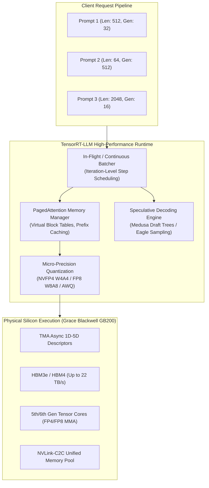

# Volume 26: Inference Engines: TensorRT, TensorRT-LLM & RAPIDS Architecture

```
====================================================================================================
MODULE 07: NVIDIA HARDWARE, SILICON INTERLINKS & LOW-LEVEL SYSTEMS ENGINEERING
VOLUME 26: INFERENCE ENGINES, TENSORRT-LLM & ACCELERATED DATA ANALYTICS (RAPIDS)
====================================================================================================
```

---

## 1. Executive Architecture Overview & Scaffolding

Serving generative AI models and executing large-scale data analytics at scale introduces fundamental computational bottlenecks that differ sharply from training workloads:
* **The Memory-Bandwidth Wall in LLM Generation**: During autoregressive decoding, batch generation generates one token per forward pass per sequence. The computational arithmetic intensity drops precipitously ($< 2 \text{ FLOP/byte}$), shifting the GPU from compute-bound execution into an extreme **HBM memory-bandwidth-bound regime**.
* **Static Batching Waste & Tail Latency**: Traditional deep learning serving batches queries statically. A sequence generating 1,000 tokens stalls all 50-token sequences in the same batch, stranding up to $70\%$ of SM compute capacity in idle bubbles.
* **KV-Cache Memory Fragmentation**: The Key-Value (KV) cache for multi-head attention grows dynamically with sequence length. Contiguous virtual memory allocation forces systems to pre-allocate maximum sequence lengths ($L_{\max}$), wasting $60\%\text{--}80\%$ of precious GPU HBM due to internal fragmentation.

The **NVIDIA TensorRT** platform, **TensorRT-LLM**, and the **RAPIDS Acceleration Suite** solve these fundamental bottlenecks directly at the hardware-software boundary.



---

## 2. TensorRT Core Compilation & Graph Optimization

**NVIDIA TensorRT** is an optimizing ahead-of-time (AOT) and just-in-time (JIT) compiler that transforms high-level computational graphs (ONNX, PyTorch Export) into highly specialized hardware execution plans (`.engine` / `.plan`).

### 2.1 Graph Fusion Taxonomy
Unoptimized deep learning execution launches individual CUDA kernels for every elementary mathematical operator. Every kernel launch incurs driver submission latency ($\approx 3\text{--}5\,\mu\text{s}$) and round-trips intermediate activations through high-latency global memory (HBM).

TensorRT performs three distinct classes of graph fusion:
1. **Vertical (Layer) Fusion**: Merges sequential memory-bound operations into the epilogue of a preceding compute-bound operation.
   $$\text{GEMM} \longrightarrow \text{Bias Addition} \longrightarrow \text{GELU} \longrightarrow \text{Quantize}$$
   Instead of writing intermediate matrices back to HBM, the activation is held directly inside SM registers or Shared Memory, reducing memory traffic by $4\times$.
2. **Horizontal Fusion**: Identifies parallel sibling kernels that share identical input tensors or independent parallel branches (such as the Query, Key, and Value projection linear layers $W_q, W_k, W_v$ in multi-head attention). TensorRT packs these independent weight matrices into a single fused multi-head GEMM kernel.
3. **Dead-Code Elimination & Constant Folding**: Evaluates constant subgraphs during engine compilation (e.g., dynamic shape calculations, rotary embedding cos/sin precomputations) and eliminates unused tensor outputs.

```text
UNOPTIMIZED COMPUTATION GRAPH (4 Global Memory Round-Trips):
[Input X] ──> [GEMM: X * W] ──> [HBM Out 1] ──> [Add Bias] ──> [HBM Out 2] ──> [GELU Activation] ──> [HBM Out 3]

TENSORRT VERTICAL FUSED KERNEL (1 Global Memory Round-Trip):
[Input X] ──> [ Fused SM Kernel: GEMM + Bias + GELU in Registers/SMem ] ──> [Final Output]
```

### 2.2 Tactic Selection & Hardware Auto-Tuning
TensorRT interrogates the target GPU microarchitecture at build time. For every layer in the graph, it runs a timing tournament across dozens of candidate implementation tactics:
* cuBLAS / cuBLASLt heuristic algorithms.
* Specialized CUTLASS 3.x warp-specialized persistent GEMMs.
* Custom hand-tuned SASS micro-kernels.
The tactic yielding the lowest execution latency for the target batch size and sequence length profile is burned permanently into the execution plan.

---

## 3. TensorRT-LLM Microarchitecture & Runtime Mechanics

### 3.1 Continuous / In-Flight Batching
In static batching, execution proceeds in lockstep across all batch elements. If request $A$ finishes in 20 tokens while request $B$ requires 500 tokens, request $A$'s SM resources remain allocated but completely idle for 480 token steps.

TensorRT-LLM implements **In-Flight Batching (Iteration-Level Scheduling)**:
* Rather than scheduling batches at the request level, the scheduler schedules work at the **single-token iteration level**.
* As soon as request $A$ emits its end-of-sequence (`EOS`) token, its memory pages are recycled immediately, and a newly arrived request $C$'s prefill (context) phase is scheduled into the next execution step.

```text
STATIC BATCHING (Massive Bubble Stranding):
Time ->
Slot 0: [=== Context ===][ Gen T1...T20 ][ .............. IDLE BUBBLE .............. ]
Slot 1: [=== Context ===][ Gen T1............................................T500 ]

IN-FLIGHT BATCHING (Continuous Fluid Scheduling):
Time ->
Slot 0: [=== Context A ===][ Gen T1...T20 ][== Context C ==][ Gen T1...T250 ] ...
Slot 1: [=== Context B ===][ Gen T1............................................T500 ]
```

### 3.2 PagedAttention & Dynamic KV-Cache Management
In multi-head attention, the KV cache footprint per token across $L$ layers, $H_{kv}$ key-value heads, and head dimension $D_{head}$ in 16-bit precision ($\text{FP16/BF16} = 2 \text{ bytes}$) is:
$$S_{\text{token}} = 2 \times 2 \times L \times H_{kv} \times D_{head} \quad \text{bytes}$$

For a model with $L = 80$, $H_{kv} = 8$, $D_{head} = 128$ (e.g., Llama-3-70B):
$$S_{\text{token}} = 4 \times 80 \times 8 \times 128 = 327,680 \text{ bytes} \approx 320 \text{ KB / token}$$
For a sequence length of 8,192 tokens, a single user session consumes:
$$320 \text{ KB} \times 8,192 = 2.62 \text{ GB of HBM}$$

Under traditional memory allocators (`cudaMalloc`), allocating $2.62 \text{ GB}$ contiguously causes severe virtual address fragmentation. TensorRT-LLM implements **PagedAttention**:
* Memory is divided into fixed-size physical blocks (e.g., 16 or 32 tokens per block).
* A **Virtual Block Table** maps contiguous logical token indices to non-contiguous physical HBM blocks, mirroring an OS virtual memory page table.
* **Prefix Caching**: If multiple prompts share an identical system prompt, their logical block tables point to the exact same physical memory blocks with copy-on-write semantics.

```text
LOGICAL SEQUENCE TO PHYSICAL PAGED-ATTENTION BLOCK MAPPING:
Logical Tokens [0..15]   ──> Block Table Entry 0 ──> Physical Block #42 (HBM Address: 0x7f00)
Logical Tokens [16..31]  ──> Block Table Entry 1 ──> Physical Block #108 (HBM Address: 0x9a20)
Logical Tokens [32..47]  ──> Block Table Entry 2 ──> Physical Block #12 (HBM Address: 0x1240)
```

### 3.3 Advanced Quantization: W4A4 NVFP4, W8A8 FP8, and AWQ
To maximize memory bandwidth utilization, TensorRT-LLM supports multiple precision formats:

| Format | Weight Precision | Activation Precision | Hardware Engine | Compression Factor | Blackwell Throughput |
| :--- | :--- | :--- | :--- | :--- | :--- |
| **FP16 / BF16** | 16-bit | 16-bit | 4th/5th Gen Tensor Core | $1.0\times$ (Baseline) | 2,250 TFLOPS |
| **W8A8 (FP8)** | 8-bit (E4M3) | 8-bit (E4M3) | 4th/5th Gen Tensor Core | $2.0\times$ | 4,500 TFLOPS |
| **AWQ / SmoothQuant** | 4-bit INT | 16-bit BF16 | Dequantizing GEMM | $3.5\times$ | Memory Bandwidth Bound |
| **NVFP4 (W4A4)** | 4-bit (E2M1) | 4-bit (E2M1) | 5th Gen Blackwell Engine | $4.0\times$ | **9,000 TFLOPS** |

**Blackwell NVFP4 Micro-Block Scaling Formulation**:
Rather than scaling entire tensor matrices by a single dynamic FP32 scalar (which loses dynamic range on activation outliers), NVFP4 partitions weights and activations into microscopic groups (e.g., 16 or 32 elements). Each micro-group has an independent 8-bit floating-point scale factor $S$:
$$X_{\text{approx}} = S \cdot \mathbf{q}_{\text{E2M1}}$$
The hardware Tensor Core multiplies the 4-bit matrices natively and applies the scale factor directly in the accumulation pipeline before FP32 summation.

### 3.4 Speculative Decoding: Medusa & Eagle Architectures
Autoregressive decoding generates one token per step. **Speculative Decoding** generates multiple candidate tokens concurrently and verifies them in a single forward pass:
1. **Medusa**: Adds multiple non-autoregressive decoding heads atop the final Transformer layer. Head $k$ predicts token $t + k + 1$ directly from the hidden state at step $t$.
2. **Tree Attention Verification**: The generated candidates form a directed tree of prospective sequences. TensorRT-LLM packs the entire tree into a single forward pass using a custom 2D attention mask:
   $$\text{AttentionMask}[i, j] = \begin{cases} 0 & \text{if token } j \text{ is an ancestor of token } i \\ -\infty & \text{otherwise} \end{cases}$$
3. The base model evaluates all candidate tokens in parallel. If $k$ tokens in the branch match the greedy distribution, all $k$ tokens are accepted in **a single forward pass**, achieving up to a $2.5\times\text{--}3.5\times$ speedup in wall-clock token generation.

---

## 4. RAPIDS Accelerated Data Analytics Suite

The **NVIDIA RAPIDS** suite brings GPU acceleration to end-to-end data science pipelines by standardizing on the **Apache Arrow** in-memory columnar format, eliminating expensive serialization and CPU-GPU copy bottlenecks.

```text
TRADITIONAL CPU PIPELINE (Massive Serialization Bottlenecks):
Disk (Parquet) ──> CPU Pandas (Parse) ──> IPC Pickle ──> CPU Scikit-Learn ──> CPU Memory

RAPIDS ACCELERATED PIPELINE (Zero-Copy GPU Columnar Pipeline):
Disk (Parquet) ──[GPUDirect Storage]──> GPU HBM (cuDF Arrow) ──[Zero-Copy Pointer]──> cuML / cuGraph
```

### 4.1 cuDF (GPU DataFrames)
* **Underlying Architecture**: Built on top of `libcudf`, a C++/CUDA library that executes relational operations (joins, group-bys, sorts, string filters) natively on GPU cores.
* **Arrow Format**: Columns are stored as contiguous arrays in GPU HBM with separate validity bitmasks for null values.
* **cuDF Pandas Accelerator Mode (`cudf.pandas`)**: Transparently intercepts standard `import pandas as pd` calls via Python module proxying. Operations that can be accelerated execute on GPU; unsupported fallback operations run on CPU seamlessly without code modifications.

### 4.2 cuML & cuGraph
* **cuML**: Implements machine learning algorithms (Random Forests, UMAP, k-Means, t-SNE, XGBoost) directly in CUDA. Replaces CPU linear algebra with cuBLAS and custom warp-level reduction primitives, delivering $10\times\text{--}50\times$ speedups.
* **cuGraph**: Operates on graph topologies (PageRank, Louvain community detection, Breadth-First Search). Utilizes CSR (Compressed Sparse Row) and COO (Coordinate) representations stored in GPU HBM, offloading neighbor traversals to massively parallel warp threads.

### 4.3 Spark RAPIDS Accelerator
A plugin for **Apache Spark** that replaces the standard Java-based Tungsten execution engine with native GPU kernels. Physical operators (Project, Filter, HashAggregate, SortMergeJoin) and data shuffling are executed on NVIDIA GPUs via UCX and GPUDirect RDMA.

---

## 5. First-Principles Mathematics: KV-Cache Sizing & In-Flight Speedup

### 5.1 KV-Cache Memory Capacity Equation
For a cluster running distributed inference with Tensor Parallelism $TP$ and Pipeline Parallelism $PP$, the total KV-cache memory $M_{\text{KV}}$ required to support batch size $B$ and sequence length $S$ across $L$ layers is:
$$M_{\text{KV}}(B, S) = \frac{2 \times 2 \times L \times H_{\text{kv}} \times D_{\text{head}} \times B \times S}{TP \times PP \times 10^9} \quad [\text{GB}]$$

Where:
* Factor of $2$ represents Key and Value matrices.
* Second factor of $2$ represents 16-bit floating-point precision ($2 \text{ bytes/element}$).
* $H_{\text{kv}}$ is the number of Key/Value heads. If Grouped-Query Attention (GQA) is used, $H_{\text{kv}} \ll H_{\text{query}}$.

### 5.2 Theoretical Throughput Speedup of In-Flight Batching
Let request lengths $L_i$ be uniformly distributed between $L_{\min}$ and $L_{\max}$.
In **static batching**, the execution time for a batch of size $N$ is dictated by the maximum sequence length:
$$T_{\text{static}} = \max(L_1, L_2, \dots, L_N) \approx L_{\max}$$
The compute wasted in idle bubbles across the batch is:
$$\text{Bubble Waste} = 1 - \frac{\sum_{i=1}^N L_i}{N \cdot \max(L_1, \dots, L_N)} \approx 1 - \frac{\frac{L_{\min} + L_{\max}}{2}}{L_{\max}} = \frac{L_{\max} - L_{\min}}{2 L_{\max}}$$

When $L_{\min} \ll L_{\max}$ (e.g., $L_{\min} = 50, L_{\max} = 2000$), static batching wastes:
$$\text{Bubble Waste} \approx \frac{2000 - 50}{4000} \approx 48.75\%$$
**In-flight batching** eliminates this bubble waste entirely by dynamically filling finished slots, yielding a theoretical throughput improvement:
$$\text{Speedup} = \frac{1}{1 - \text{Bubble Waste}} \approx \frac{2 L_{\max}}{L_{\min} + L_{\max}} \approx 1.95\times \quad (\approx 200\% \text{ Throughput Gain})$$

---

## 6. Concrete Production Lab: TensorRT-LLM Engine Construction & KV-Cache Sizing

### 6.1 KV-Cache Sizing and Throughput Validation Script
Save this script as `trtllm_kv_cache_calculator.py`:

```python
#!/usr/bin/env python3
"""
TensorRT-LLM Memory & PagedAttention KV-Cache Sizing Calculator
Validates exact memory allocations across model architectures and precision modes.
"""

from dataclasses import dataclass
from typing import Dict, Any

@dataclass
class LLMSpec:
    name: str
    num_layers: int
    num_kv_heads: int
    head_dim: int
    vocab_size: int
    hidden_dim: int

MODELS = {
    "Llama-3-8B": LLMSpec("Llama-3-8B", 32, 8, 128, 128256, 4096),
    "Llama-3-70B": LLMSpec("Llama-3-70B", 80, 8, 128, 128256, 8192),
    "DeepSeek-V3": LLMSpec("DeepSeek-V3", 61, 1, 128, 129280, 7168), # Multi-Head Latent Attention
}

def calculate_kv_cache_requirements(
    model: LLMSpec,
    batch_size: int,
    seq_len: int,
    precision_bytes: float = 2.0, # FP16/BF16 = 2, FP8 = 1, NVFP4 = 0.5
    tp_size: int = 1
) -> Dict[str, Any]:
    """Calculate exact KV-cache capacity and block allocation."""
    bytes_per_token_total = 2 * precision_bytes * model.num_layers * model.num_kv_heads * model.head_dim
    bytes_per_token_per_gpu = bytes_per_token_total / tp_size
    
    total_tokens = batch_size * seq_len
    total_kv_cache_gb = (total_tokens * bytes_per_token_per_gpu) / (1024**3)
    
    # PagedAttention Block Sizing (32 tokens per block)
    block_size_tokens = 32
    bytes_per_block = bytes_per_token_per_gpu * block_size_tokens
    total_blocks_needed = (total_tokens + block_size_tokens - 1) // block_size_tokens
    
    return {
        "model": model.name,
        "precision_bytes": precision_bytes,
        "bytes_per_token_gpu": bytes_per_token_per_gpu,
        "total_kv_cache_gb": total_kv_cache_gb,
        "block_size_tokens": block_size_tokens,
        "bytes_per_block_kb": bytes_per_block / 1024,
        "total_blocks_needed": total_blocks_needed
    }

if __name__ == "__main__":
    print("=" * 80)
    print("TENSORRT-LLM PAGEDATTENTION KV-CACHE SIZING ANALYSIS")
    print("=" * 80)
    
    # Scenario: Llama-3-70B running on 8x H100 GPUs (TP=8) at Batch=64, Context=8192
    llama70b = MODELS["Llama-3-70B"]
    
    for prec_name, prec_bytes in [("FP16 (2 bytes)", 2.0), ("FP8 (1 byte)", 1.0), ("NVFP4 (0.5 byte)", 0.5)]:
        res = calculate_kv_cache_requirements(
            model=llama70b,
            batch_size=64,
            seq_len=8192,
            precision_bytes=prec_bytes,
            tp_size=8
        )
        print(f"\nConfiguration: {prec_name} | TP=8 | Batch=64 | SeqLen=8,192")
        print(f" • Per-Token KV Cache per GPU : {res['bytes_per_token_gpu']:.1f} bytes")
        print(f" • Paged Block Size (32 tok)  : {res['bytes_per_block_kb']:.2f} KB")
        print(f" • Total Dedicated KV Memory  : {res['total_kv_cache_gb']:.2f} GB per GPU")
        print(f" • Total Physical Blocks Req  : {res['total_blocks_needed']:,} blocks")
```

---

## 7. Multi-Dimensional Correlation & Troubleshooting

Operating TensorRT and TensorRT-LLM in production requires diagnosing memory and scheduling failures across multiple system layers:

```text
┌─────────────────────────────┬───────────────────────────────┬─────────────────────────────────────────────────────────┐
│ Symptom / Failure Mode      │ Root Cause Layer              │ Diagnostic Triage & Remediation Command                 │
├─────────────────────────────┼───────────────────────────────┼─────────────────────────────────────────────────────────┤
│ Out of Memory during KV     │ Memory Fragmentation /        │ Inspect allocated vs free KV cache blocks:              │
│ Cache allocation (OOM)      │ Over-allocated free_gpu_mem   │ In config.json set kv_cache_free_gpu_mem_fraction: 0.85 │
│                             │ fraction                      │ Reduce max_batch_size or enable PagedAttention FP8.     │
├─────────────────────────────┼───────────────────────────────┼─────────────────────────────────────────────────────────┤
│ Severe token generation     │ Memory Bandwidth Throttling   │ Inspect memory clock and bus utilization:               │
│ throughput degradation      │ or HBM thermal throttling     │ $ nvidia-smi -q -d PERFORMANCE,TEMPERATURE              │
│                             │                               │ Lock clocks: $ nvidia-smi -lgc 2619,2619               │
├─────────────────────────────┼───────────────────────────────┼─────────────────────────────────────────────────────────┤
│ Low Tensor Core utilization │ Small batch size causing      │ Profile SM occupancy and instruction throughput:        │
│ (< 15% in decoding phase)   │ arithmetic intensity starvation│ $ ncu --metrics sm__pipe_tensor_op_hmma_cycles_active   │
│                             │                               │ Enable speculative decoding (Medusa/Eagle) or chunking. │
├─────────────────────────────┼───────────────────────────────┼─────────────────────────────────────────────────────────┤
│ High Time-to-First-Token    │ Context prefill phase         │ Enable Chunked Context / Prefill-Decode Disaggregation:  │
│ (TTFT) blocking generation  │ starving decoding tokens      │ Set chunked_context: true in runtime configuration.     │
└─────────────────────────────┴───────────────────────────────┴─────────────────────────────────────────────────────────┘
```

---

## 8. Summary & Technical Takeaways

1. **Memory-Bound Decoding**: Autoregressive LLM generation is fundamentally bounded by HBM memory bandwidth. TensorRT-LLM addresses this via **PagedAttention**, **FP8/NVFP4 quantization**, and **Speculative Decoding**.
2. **Elimination of Bubble Latency**: In-Flight Batching evaluates execution at the single-token iteration level, recycling completed sequence slots immediately to achieve nearly $2\times$ throughput improvements over static batching.
3. **Blackwell Micro-Precision Advantage**: 5th Generation Tensor Cores with native **NVFP4 (E2M1)** micro-block scaling unlock up to $9,000\text{ TFLOPS}$ of inference compute per B200 GPU, cutting KV-cache memory consumption by $4\times$.
4. **RAPIDS End-to-End Acceleration**: Standardizing on Apache Arrow columnar GPU representations eliminates CPU serialization bottlenecks, allowing dataframes, machine learning, and graph traversals to execute entirely in GPU HBM.
