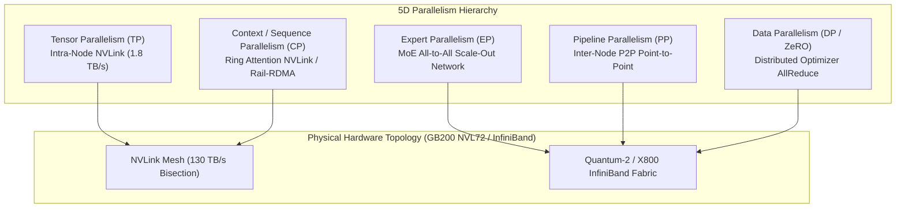

# Volume 27: Distributed Training: Megatron-Core, 3D/5D Parallelisms & NeMo

```
====================================================================================================
MODULE 07: NVIDIA HARDWARE, SILICON INTERLINKS & LOW-LEVEL SYSTEMS ENGINEERING
VOLUME 27: DISTRIBUTED TRAINING, MEGATRON-CORE PARALLELISMS & ENTERPRISE NEMO
====================================================================================================
```

---

## 1. Executive Architectural Overview & Scaffolding

Training frontier large language models (LLMs) with hundreds of billions or trillions of parameters exceeds the physical memory capacity of any individual GPU:
* A 70-billion-parameter model stored in 16-bit precision ($\text{BF16}$) requires $140\text{ GB}$ just for static weights.
* When trained with the Adam optimizer in mixed precision, each parameter requires:
  * $2 \text{ bytes}$ for model weights ($\text{BF16}$).
  * $2 \text{ bytes}$ for gradients ($\text{BF16}$).
  * $4 \text{ bytes}$ for FP32 master weights.
  * $8 \text{ bytes}$ for FP32 optimizer momentum and variance ($1\text{st}$ and $2\text{nd}$ moments).
  * **Total Model State**: $16 \text{ bytes per parameter} \longrightarrow 1,120 \text{ GB}$ of dedicated HBM, excluding dynamic activations!

Scaling training across thousands of GPUs requires composing multi-dimensional parallelisms into a coherent execution topology. **Megatron-Core** and the **NVIDIA NeMo** framework provide the reference implementations for **3D Parallelism** (Tensor, Pipeline, Data) and **5D Parallelism** (adding Context/Sequence and Expert Parallelism).



---

## 2. Megatron-Core 3D Parallelism Mechanics

### 2.1 Tensor Parallelism (TP)
Tensor Parallelism splits individual weight matrices and linear layers within a Transformer layer across multiple GPUs connected via high-speed NVLink.

Megatron-Core partitions the Transformer Multi-Head Attention (MHA) and Feed-Forward Network (FFN) using a complementary **Column-Parallel and Row-Parallel** strategy that minimizes collective communications:

```text
COLUMN-PARALLEL LINEAR (SPLIT WEIGHT BY COLUMNS):
Input X [b, s, h] ──┬──> [ W1_1: h x (4h/TP) ] ──> Y1 [b, s, 4h/TP] ──┐
                    └──> [ W1_2: h x (4h/TP) ] ──> Y2 [b, s, 4h/TP] ──┴──> Concat / Activation

ROW-PARALLEL LINEAR (SPLIT WEIGHT BY ROWS):
Input Y1, Y2 ───────┬──> [ W2_1: (4h/TP) x h ] ──> Z1 [b, s, h] ──┐
                    └──> [ W2_2: (4h/TP) x h ] ──> Z2 [b, s, h] ──┴──> [ AllReduce ] ──> Output Z
```

1. **Self-Attention Sub-Layer**:
   * The projection weights $W_q, W_k, W_v$ are column-parallel. No communication is needed before or during the attention computation.
   * The output projection matrix $W_o$ is row-parallel. Its output requires an **All-Reduce** across the TP group to sum partial activations.
2. **MLP / SwiGLU Sub-Layer**:
   * The gating and up-projection matrices ($W_{\text{gate}}, W_{\text{up}}$) are column-parallel.
   * The down-projection matrix ($W_{\text{down}}$) is row-parallel, followed by an **All-Reduce**.
3. **Communication Overhead**:
   * Exactly **two All-Reduce operations** per Transformer layer in the forward pass, and two All-Reduces in the backward pass.
   * Because of this high communication frequency, TP is strictly restricted to **intra-node NVLink domains** ($TP \le 8$ on HGX or $TP \le 72$ on NVL72).

---

### 2.2 Pipeline Parallelism (PP) & 1F1B Scheduling
When a model is too large to fit across the GPUs of an NVLink domain, the model's sequential layers are partitioned across $P$ pipeline stages:
$$\text{Stage } p \text{ contains } \frac{L}{P} \text{ layers}$$

#### The Pipeline Bubble Problem
Naive sequential execution results in severe pipeline bubbles where GPUs sit idle waiting for earlier stages. Megatron-Core implements **1F1B (One-Forward-One-Backward)** scheduling:
1. **Warmup Phase**: Stage 0 injects micro-batches until the pipeline is primed.
2. **Steady-State Phase**: Each GPU alternates strictly between computing one forward micro-batch and one backward micro-batch ($1\text{F}1\text{B}$).
3. **Cooldown Phase**: Completes remaining backward micro-batches.

```text
1F1B PIPELINE SCHEDULE TIMELINE:
Stage 3 (Final):        [F1][F2][F3][F4][B1][B2][B3][B4]
Stage 2:            [F1][F2][F3][F4][B1][B2][B3][B4]
Stage 1:        [F1][F2][F3][F4][B1][B2][B3][B4]
Stage 0 (Input):[F1][F2][F3][F4][B1][B2][B3][B4]
                |<--- Bubble --->|
```

#### Pipeline Bubble Fraction Formula
For a pipeline with $p$ stages and $m$ micro-batches per batch, the theoretical idle bubble fraction $F_{\text{bubble}}$ is:
$$F_{\text{bubble}} = \frac{p - 1}{m + p - 1}$$
To keep the bubble under $10\%$ ($F_{\text{bubble}} < 0.10$), the number of micro-batches must satisfy:
$$m \ge 9 \times (p - 1)$$

**Interleaved 1F1B**: To further reduce bubble waste, each physical GPU hosts multiple non-consecutive virtual pipeline stages (e.g., GPU 0 hosts Stage 0 and Stage 4). This shrinks the bubble by a factor of $v$ (the interleaving factor):
$$F_{\text{bubble, interleaved}} = \frac{p - 1}{v \cdot m}$$

---

### 2.3 Data Parallelism (DP) & ZeRO Distributed Optimizers
In standard Data Parallelism, every GPU holds an identical copy of model weights, processing independent mini-batches and averaging gradients across ranks via `AllReduce`.

The **ZeRO (Zero Redundancy Optimizer)** family eliminates redundant state storage across data-parallel ranks:
* **ZeRO-1 (Optimizer State Partitioning)**: Optimizer states ($12 \text{ bytes/param}$) are partitioned across $N_{\text{DP}}$ ranks. Memory reduction: $4\times$. Communication overhead: Zero additional communication (AllReduce gradients, update local partition, AllGather updated weights).
* **ZeRO-2 (Gradient Partitioning)**: Both optimizer states and gradients are partitioned. Memory reduction: Up to $8\times$. Communication overhead: Uses `ReduceScatter` instead of `AllReduce`.
* **ZeRO-3 (Parameter Partitioning)**: Model weights are also partitioned. Each layer fetches weights dynamically before computation via `AllGather` and frees them immediately afterward. Memory reduction: Linear with $N_{\text{DP}}$. Communication overhead: Increases communication volume by $1.5\times$.

---

## 3. Advanced Parallelisms: Context, Sequence & Expert (MoE)

### 3.1 Sequence & Context Parallelism (CP / SP)
When processing extreme context windows (e.g., 128k to 1M tokens), intermediate activations in self-attention explode quadratically with sequence length $S$.
* **Sequence Parallelism (SP)**: In a TP group, operations outside self-attention (LayerNorm, Dropout) are identical across GPUs. SP splits activations along the sequence dimension $S / TP$ during LayerNorm, replacing the TP All-Reduce with an `AllGather` / `ReduceScatter` pair. This reduces activation memory by $TP\times$ with zero communication overhead!
* **Context Parallelism (CP)**: Shards the sequence dimension across independent nodes using **Ring Attention**. Each GPU computes local Query-Key attention on its chunk, then concurrently shifts Key-Value chunks to the adjacent GPU along a ring topology using non-blocking P2P communication overlapped with FlashAttention computation.

```text
RING ATTENTION CHUNK PASSING (CONTEXT PARALLELISM):
GPU 0: [ Q0, K0, V0 ] ──(Send KV0)──> GPU 1: [ Q1, K1, V1 ] ──(Send KV1)──> GPU 2 ...
  │         ▲                               │         ▲
  └─────────┴── FlashAttention GEMM overlap ┴─────────┴──
```

### 3.2 Expert Parallelism (EP) for Mixture-of-Experts (MoE)
In MoE architectures (e.g., Mixtral, DeepSeek-V3), feed-forward layers are replaced with $E$ sparse experts, where a routing gate dispatches tokens to top-$k$ experts:
* **Token Dispatch**: Tokens from all data-parallel ranks must be routed to the specific GPU hosting their designated expert. This requires a global **All-to-All** communication primitive:
  $$\text{All-to-All Dispatch: } [B, S, H] \longrightarrow [E, C, H]$$
* **Expert Execution**: Each expert computes its feed-forward GEMM locally on its routed tokens.
* **Token Combine**: A second **All-to-All** routes computed token embeddings back to their originating ranks for residual summation.
* **Network Impact**: EP saturates the inter-node scale-out fabric (Quantum InfiniBand / Spectrum-X), demanding maximum bidirectional bisection bandwidth.

---

## 4. Activation Checkpointing: Full vs. Selective

During backward backpropagation, gradients require intermediate activations computed during the forward pass. Retaining all activations consumes gigabytes per GPU:
* **Full Activation Checkpointing**: Discards all intermediate activations during the forward pass. During the backward pass, an entire forward pass is re-executed for that layer.
  * *Trade-off*: Cuts activation memory by $80\%$, but adds a **$33\%$ compute overhead** (1 extra forward pass).
* **Selective Activation Checkpointing (Megatron-Core Standard)**: Discards only memory-intensive, low-compute operations (Softmax, Dropout, GELU activations), while retaining the outputs of heavy GEMMs.
  * *Trade-off*: Eliminates $70\%$ of activation memory spikes with **less than $3\%$ computational overhead**!

---

## 5. First-Principles Mathematics: Model State & Memory Sizing

### 5.1 Megatron 3D Parallel Memory Consumption Formula
For a model with $\Phi$ total parameters trained across a cluster with Tensor Parallelism $TP$, Pipeline Parallelism $PP$, and Data Parallelism $DP$:

$$\text{Memory}_{\text{model\_state}} = \frac{2\Phi + 2\Phi + 4\Phi + 8\Phi}{DP_{\text{ZeRO-1}} \cdot TP \cdot PP} = \frac{16 \cdot \Phi}{DP \cdot TP \cdot PP} \quad [\text{bytes}]$$

Where:
* $2\Phi$: BF16 Model Weights
* $2\Phi$: BF16 Gradients
* $4\Phi$: FP32 Master Parameters
* $8\Phi$: FP32 First and Second Adam Moments ($m_t, v_t$)

### 5.2 Tensor Parallel Communication Volume Formula
For a Transformer layer with hidden dimension $h$, sequence length $s$, and batch size $b$, the total bytes communicated across NVLink per layer in the forward pass is:
$$\text{Comm}_{\text{TP, forward}} = 2 \times \left( 2 \cdot \frac{TP - 1}{TP} \cdot b \cdot s \cdot h \cdot 2 \text{ bytes} \right)$$
For $TP = 8$, the bus factor $\frac{TP - 1}{TP} = \frac{7}{8} = 0.875$.

---

## 6. Concrete Production Lab: Megatron-Core Memory & Topology Sizing

Save this script as `megatron_3d_topology_planner.py`:

```python
#!/usr/bin/env python3
"""
Megatron-Core 3D/5D Parallelism & Cluster Topology Planner
Calculates parameter distribution, memory breakdown, and pipeline bubble fractions.
"""

from dataclasses import dataclass
from typing import Dict, Any

@dataclass
class ClusterSpec:
    total_gpus: int
    gpu_memory_gb: float # e.g. 80.0 for H100, 192.0 for B200
    tp_size: int
    pp_size: int
    cp_size: int
    ep_size: int
    dp_size: int

def validate_and_plan_topology(
    model_params_billions: float,
    cluster: ClusterSpec,
    micro_batch_size: int,
    num_micro_batches: int,
    zero_stage: int = 1
) -> Dict[str, Any]:
    """Validate 3D/5D parallelism topology and compute exact memory state."""
    # Verify GPU product
    parallel_product = cluster.tp_size * cluster.pp_size * cluster.cp_size * cluster.dp_size
    if parallel_product != cluster.total_gpus:
        raise ValueError(
            f"Topology mismatch: TP({cluster.tp_size}) * PP({cluster.pp_size}) * "
            f"CP({cluster.cp_size}) * DP({cluster.dp_size}) = {parallel_product} != Total GPUs ({cluster.total_gpus})"
        )
    
    phi = model_params_billions * 1e9
    
    # Static model state calculations (bytes)
    weight_bytes = 2 * phi
    grad_bytes = 2 * phi
    master_weight_bytes = 4 * phi
    opt_state_bytes = 8 * phi
    
    # Apply parallel partitions
    # TP and PP shard weights and gradients
    tp_pp = cluster.tp_size * cluster.pp_size
    
    sharded_weights = weight_bytes / tp_pp
    sharded_grads = grad_bytes / tp_pp
    
    if zero_stage == 0:
        sharded_opt = opt_state_bytes / tp_pp
        sharded_master = master_weight_bytes / tp_pp
    elif zero_stage == 1: # Shard optimizer across DP
        sharded_opt = opt_state_bytes / (tp_pp * cluster.dp_size)
        sharded_master = master_weight_bytes / (tp_pp * cluster.dp_size)
    elif zero_stage >= 2: # Shard grads + opt across DP
        sharded_grads = grad_bytes / (tp_pp * cluster.dp_size)
        sharded_opt = opt_state_bytes / (tp_pp * cluster.dp_size)
        sharded_master = master_weight_bytes / (tp_pp * cluster.dp_size)
        
    total_model_state_gb = (sharded_weights + sharded_grads + sharded_master + sharded_opt) / (1024**3)
    
    # Pipeline bubble calculation
    p = cluster.pp_size
    m = num_micro_batches
    bubble_fraction = (p - 1) / (m + p - 1) if p > 1 else 0.0
    
    memory_headroom_gb = cluster.gpu_memory_gb - total_model_state_gb
    
    return {
        "model_params_b": model_params_billions,
        "total_model_state_gb_per_gpu": total_model_state_gb,
        "memory_headroom_for_activations_gb": memory_headroom_gb,
        "pipeline_bubble_percent": bubble_fraction * 100,
        "is_feasible": total_model_state_gb < cluster.gpu_memory_gb
    }

if __name__ == "__main__":
    print("=" * 85)
    print("MEGATRON-CORE 3D PARALLELISM CLUSTER TOPOLOGY PLANNER")
    print("=" * 85)
    
    # Scenario: Training Llama-3-70B on 64x H100 (80GB) GPUs
    # Topology: TP=8 (Intra-node NVLink), PP=4, DP=2, Total = 8 * 4 * 2 = 64 GPUs
    spec = ClusterSpec(
        total_gpus=64,
        gpu_memory_gb=80.0,
        tp_size=8,
        pp_size=4,
        cp_size=1,
        ep_size=1,
        dp_size=2
    )
    
    res = validate_and_plan_topology(
        model_params_billions=70.0,
        cluster=spec,
        micro_batch_size=1,
        num_micro_batches=32,
        zero_stage=1
    )
    
    print(f"\nConfiguration: 70B Model | 64x H100 (80GB) | TP=8, PP=4, DP=2, ZeRO-1")
    print(f" • Model State Memory / GPU    : {res['total_model_state_gb_per_gpu']:.2f} GB")
    print(f" • Activation Memory Headroom  : {res['memory_headroom_for_activations_gb']:.2f} GB")
    print(f" • Pipeline Bubble Fraction    : {res['pipeline_bubble_percent']:.2f}% (m=32 micro-batches)")
    print(f" • Topology Feasibility Check : {'✅ PASSED (Fits in HBM)' if res['is_feasible'] else '❌ OOM'}")
```

---

## 7. Multi-Dimensional Correlation & Troubleshooting

```text
┌─────────────────────────────┬───────────────────────────────┬─────────────────────────────────────────────────────────┐
│ Failure Signature           │ Root Cause Layer              │ Diagnostic Triage & SRE Remediation Command             │
├─────────────────────────────┼───────────────────────────────┼─────────────────────────────────────────────────────────┤
│ NCCL Timeout during         │ Inter-node IB link stall or   │ Identify straggling rank with NCCL debug:               │
│ All-to-All MoE Dispatch     │ asymmetric RoCE congestion    │ $ export NCCL_DEBUG=INFO NCCL_DEBUG_SUBSYS=COLL,NET     │
│                             │                               │ Check PFC drops: $ ethtool -S <eth> | grep prio_pause  │
├─────────────────────────────┼───────────────────────────────┼─────────────────────────────────────────────────────────┤
│ GPU Out of Memory (OOM) at  │ Activation memory explosion   │ Enable Selective Activation Checkpointing:              │
│ sequence length boundary    │ due to un-checkpointed ops    │ Set --recompute-activations --recompute-granularity     │
│                             │                               │ selective in Megatron arguments.                        │
├─────────────────────────────┼───────────────────────────────┼─────────────────────────────────────────────────────────┤
│ Pipeline Bubble exceeds 20% │ Insufficient micro-batches    │ Increase micro-batch count relative to PP stages:       │
│ of execution step time      │ ($m < 4 \times PP$)           │ Ensure num_micro_batches >= 8 * pp_size or enable       │
│                             │                               │ interleaved 1F1B with --num-virtual-pipeline-stages 2.  │
├─────────────────────────────┼───────────────────────────────┼─────────────────────────────────────────────────────────┤
│ NaN / Inf gradient collapse │ Mixed-precision dynamic       │ Inspect FP8 delayed scaling amax history or revert to   │
│ during FP8 training step    │ scale underflow or overflow   │ BF16 master weights. Check loss scale factor.           │
└─────────────────────────────┴───────────────────────────────┴─────────────────────────────────────────────────────────┘
```

---

## 8. Summary & Technical Takeaways

1. **Orthogonal Scaling Planes**: Modern foundation model training relies on mapping parallel dimensions to matching physical interconnect hierarchies: **TP within NVLink**, **PP across point-to-point IB**, and **DP/ZeRO across the global rail network**.
2. **Elimination of State Redundancy**: ZeRO-1 reduces Adam optimizer memory by $DP\times$ with zero communication overhead, freeing precious HBM for dynamic training activations.
3. **Sequence & Context Parallelism**: Ring Attention shards long contexts across independent nodes, overcoming the $O(S^2)$ attention memory wall for million-token sequences.
4. **Selective Checkpointing Efficiency**: Selective activation checkpointing recomputes low-FLOP pointwise layers during backpropagation, eliminating $70\%$ of memory overhead with under $3\%$ compute penalty.
