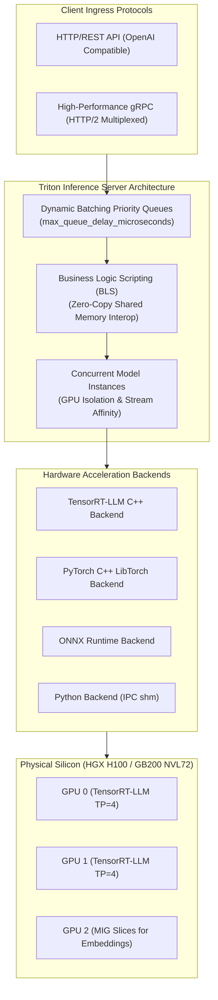

# Volume 28: Serving Microservices: Triton Inference Server & NVIDIA NIM

```
====================================================================================================
MODULE 07: NVIDIA HARDWARE, SILICON INTERLINKS & LOW-LEVEL SYSTEMS ENGINEERING
VOLUME 28: PRODUCTION SERVING MICROSERVICES, TRITON ARCHITECTURE & NVIDIA NIM
====================================================================================================
```

---

## 1. Executive Architectural Overview & Scaffolding

Deploying deep learning models to production introduces rigorous engineering constraints that cannot be satisfied by standard development runtimes (such as native Python Flask/FastAPI servers):
* **The Single-Threaded GIL Bottleneck**: Python's Global Interpreter Lock (GIL) serializes concurrent HTTP/gRPC requests, failing to feed modern accelerators capable of thousands of concurrent tensor operations.
* **Heterogeneous Model Pipelines**: Enterprise AI workflows rarely execute a single model in isolation. A modern pipeline combines tokenizers, vector embedding models, cross-encoders, large language models (LLMs), and safety guardrails. Copying tensors across process boundaries introduces tens of milliseconds of serialization latency.
* **Under-Utilized Hardware**: Individual inference queries under-saturate GPU Tensor Cores. Without high-concurrency dynamic batching, GPU utilization remains below $15\%$.

The **NVIDIA Triton Inference Server** and **NVIDIA NIM (Inference Microservices)** provide high-throughput, low-latency microservice architectures that interface directly with hardware acceleration backends.



---

## 2. Triton Inference Server Microarchitecture

### 2.1 Multi-Backend Architecture
Triton is engineered as a modular C++ execution daemon that decouples request routing, dynamic batching, and memory staging from backend model execution:
1. **TensorRT-LLM Backend**: Directly interfaces with the C++ TensorRT-LLM runtime, orchestrating in-flight batching and PagedAttention across multi-GPU Tensor Parallelism ($TP$) ranks.
2. **LibTorch Backend**: Directly executes TorchScript and AOTInductor compiled artifacts without launching a Python interpreter, eliminating the GIL.
3. **ONNX Runtime Backend**: Provides cross-platform inference with automated Graph Optimizations (Constant Folding, Node Fusion).
4. **Python Backend**: Executes custom preprocessing, tokenization, or postprocessing scripts. Inter-process communication (IPC) between Triton Core and Python worker stubs occurs via **Shared Memory (`/dev/shm`)**, eliminating TCP socket serialization overhead.

---

### 2.2 Dynamic Batching Scheduler
Individual inference requests arrive asynchronously from independent users. Launching a GPU kernel for every request yields poor compute efficiency.

Triton's **Dynamic Batcher** aggregates independent requests into a single tensor batch before dispatching to the execution backend:
* **`max_queue_delay_microseconds`**: Dictates the maximum duration the scheduler will wait to assemble a full batch before launching execution.
* **`max_batch_size`**: The upper limit of elements packed into a single kernel execution.

```text
DYNAMIC BATCHING TIMELINE:
Client 1: ──[Req 1]─────────────────────────────┐
Client 2: ───────[Req 2]────────────────────────┤
Client 3: ────────────[Req 3]───────────────────┴──> [ Packed Batch: Size 3 ] ──> GPU GEMM Execution
          |<-- max_queue_delay (e.g. 5ms) -->|
```

If `max_batch_size` is reached before `max_queue_delay` expires, the batch is dispatched to the GPU immediately. This guarantees that tail latency never exceeds $T_{\text{queue}} + T_{\text{compute}}$.

---

### 2.3 Business Logic Scripting (BLS) & Ensembles
Enterprise pipelines often chain multiple models sequentially (e.g., SentencePiece Tokenizer $\longrightarrow$ TensorRT Embedding Model $\longrightarrow$ TensorRT-LLM $\longrightarrow$ Safety Guardrail).
* **Triton Ensemble**: A declarative DAG defined in `config.pbtxt` where output tensors of model $A$ are routed directly into model $B$'s input memory buffers without leaving GPU VRAM.
* **Business Logic Scripting (BLS)**: Allows writing custom Python or C++ logic that dynamically orchestrates model execution branches, loops, and conditional routing using **zero-copy GPU pointers**:
  ```python
  # Triton BLS Zero-Copy Pointer Execution
  import triton_python_backend_utils as pb_utils
  
  def execute(self, requests):
      # Tensor is passed by reference in GPU HBM without host-device transfers
      gpu_tensor = pb_utils.get_input_tensor_by_name(requests[0], "EMBEDDINGS")
      infer_request = pb_utils.InferenceRequest(
          model_name="tensorrt_llm",
          inputs=[gpu_tensor]
      )
      infer_response = infer_request.exec()
      return [infer_response]
  ```

---

## 3. NVIDIA NIM (Inference Microservices) Architecture

**NVIDIA NIM** packages complex AI models (Llama-3, Mistral, DeepSeek) into production-ready, standardized OCI (Open Container Initiative) microservices.

```text
NVIDIA NIM CONTAINER RUNTIME STACK:
┌────────────────────────────────────────────────────────────────────────┐
│ OpenAI-Compatible API Gateway (REST HTTP/2 & gRPC Streaming)           │
├────────────────────────────────────────────────────────────────────────┤
│ Microservice Orchestration Engine (KServe / vLLM / Triton Core)        │
├────────────────────────────────────────────────────────────────────────┤
│ Optimized Model Execution Backend (TensorRT-LLM / vLLM C++ Engines)   │
├────────────────────────────────────────────────────────────────────────┤
│ Model Weight Cache Engine (/opt/nim/.cache with Parallel Flash Loading)│
├────────────────────────────────────────────────────────────────────────┤
│ NVIDIA Container Toolkit & CDI (Direct Device Access /dev/nvidia*)     │
└────────────────────────────────────────────────────────────────────────┘
```

### 3.1 Hardware-Aware Model Profile Selection
When a NIM container boots, it interrogates the host system using NVML:
1. Detects GPU architecture (Hopper GH100, Blackwell B200, or Grace Blackwell GB200).
2. Interrogates available HBM capacity and interconnect bandwidth (PCIe Gen 5 vs NVLink 5).
3. **Automated Profile Selection**: Downloads or activates the optimal pre-compiled TensorRT-LLM engine tailored specifically for that exact hardware configuration (e.g., activating native NVFP4 on Blackwell, or FP8 on Hopper, with tuned TP sizes).

### 3.2 Standardized Monitoring & Telemetry
Every NIM microservice natively exposes standard Prometheus metrics on port `8002`:
* `num_requests_running`: Current in-flight concurrent requests.
* `num_requests_waiting`: Queued requests waiting for KV-cache allocation.
* `gpu_cache_usage_factor`: Percentage of PagedAttention KV-cache blocks currently utilized.
* `time_to_first_token_seconds`: Time-to-First-Token (TTFT) latency histogram.
* `inter_token_latency_seconds`: Inter-token generation latency histogram.

---

## 4. Industrial & Domain-Specific AI Platforms

NVIDIA extends accelerated computing into domain-specific SDKs built upon the same core CUDA/TensorRT runtime:

| Platform | Primary Domain | Core Architectural Stack | Hardware Interlinks |
| :--- | :--- | :--- | :--- |
| **Omniverse** | Industrial Digital Twins, 3D Simulation | OpenUSD (Universal Scene Description), RTX Path Tracing, PhysX 5 | High-speed multi-GPU NVLink for real-time ray-tracing acceleration. |
| **Isaac Robotics** | Autonomous Robots & Manipulation | Isaac Sim, Isaac Lab (RL locomotion), Isaac ROS / Perceptor (vSLAM) | Jetson Orin / Thor embedded SoCs and DGX cluster training. |
| **BioNeMo / Clara** | Drug Discovery & Healthcare | AlphaFold2, ESMFold, MONAI medical imaging pipelines | cuBLAS, cuFFT, and multi-node NCCL distributed training. |
| **NVIDIA DRIVE** | Autonomous Vehicles | DRIVE OS, DRIVE AV, DriveWorks SDK, DRIVE Thor ASIL-D safety | Dual Vera/Thor automotive SoC with hardware functional safety. |

---

## 5. First-Principles Mathematics: Queuing Delay & Dynamic Batching Sizing

### 5.1 The Latency-Throughput Optimization Problem
Let client requests arrive following a Poisson process with arrival rate $\lambda$ (requests/second).
Let the GPU computation time for a batch of size $B$ be modeled linearly as:
$$T_{\text{compute}}(B) = \alpha + \beta \cdot B$$
Where:
* $\alpha$: Fixed kernel launch and base latency overhead ($\text{seconds}$).
* $\beta$: Marginal computation time per batch element ($\text{seconds/element}$).

If the dynamic batcher waits for a maximum queue delay $D_{\max}$ to accumulate batch size $B$, the expected batch size assembled is:
$$\mathbb{E}[B] = \min(B_{\max}, \lambda \cdot D_{\max})$$
The total request turnaround latency $T_{\text{turnaround}}$ is the sum of queuing delay and execution time:
$$T_{\text{turnaround}} = \frac{D_{\max}}{2} + \alpha + \beta \cdot \min(B_{\max}, \lambda \cdot D_{\max})$$
The system throughput $\Theta$ (requests processed per second) is:
$$\Theta = \frac{\mathbb{E}[B]}{T_{\text{compute}}(\mathbb{E}[B])} = \frac{\lambda \cdot D_{\max}}{\alpha + \beta \cdot \lambda \cdot D_{\max}}$$

**The SRE Tuning Rule**:
* As $D_{\max} \longrightarrow \infty$, throughput approaches the asymptotic hardware limit $\frac{1}{\beta}$, but latency degrades linearly.
* To optimize the throughput-to-latency trade-off, set $D_{\max}$ such that the marginal queue delay equals the compute latency:
  $$D_{\max}^* \approx \frac{\alpha}{\beta \cdot \lambda}$$

---

## 6. Concrete Production Lab: Triton Configuration & Latency Benchmark

### 6.1 Triton `config.pbtxt` Production Model Configuration
Save this file as `model_repository/transformer_ensemble/config.pbtxt`:

```protobuf
name: "transformer_ensemble"
platform: "ensemble"
max_batch_size: 64

# Expose standard FP16 input and output tensors
input [
  {
    name: "INPUT_IDS"
    data_type: TYPE_INT32
    dims: [ -1 ] # Dynamic sequence length
  }
]
output [
  {
    name: "LOGITS"
    data_type: TYPE_FP16
    dims: [ -1, 32000 ]
  }
]

# High-Performance Dynamic Batching Tuning
dynamic_batching {
  max_queue_delay_microseconds: 5000 # Wait up to 5ms to assemble a batch
  preferred_batch_size: [ 8, 16, 32, 64 ]
  preserve_ordering: false
  priority_levels: 2
  default_priority_level: 1
}

# GPU Instance Placement
instance_group [
  {
    count: 2
    kind: KIND_GPU
    gpus: [ 0, 1 ]
  }
]
```

### 6.2 Triton Client Latency & Throughput Benchmark Script
Save this script as `triton_serving_benchmark.py`:

```python
#!/usr/bin/env python3
"""
Triton Inference Server Dynamic Batching & Concurrency Benchmark
Simulates multi-threaded asynchronous client ingress and measures tail latency.
"""

import time
import math
import statistics
from dataclasses import dataclass
from typing import List, Dict

@dataclass
class BenchmarkResult:
    concurrency: int
    throughput_rps: float
    p50_latency_ms: float
    p95_latency_ms: float
    p99_latency_ms: float

def simulate_dynamic_batching_serving(
    arrival_rate_rps: float,
    max_queue_delay_ms: float,
    max_batch_size: int,
    base_kernel_ms: float = 8.0,
    per_req_kernel_ms: float = 0.5,
    duration_sec: float = 5.0
) -> BenchmarkResult:
    """Simulate queuing delay, batch aggregation, and execution times."""
    latencies = []
    current_time = 0.0
    end_time = duration_sec
    
    queue = []
    
    # Generate arrivals
    inter_arrival = 1.0 / arrival_rate_rps
    
    while current_time < end_time:
        # Request arrives
        queue.append(current_time)
        current_time += inter_arrival
        
        # Check if queue delay expired or max batch size reached
        oldest_req = queue[0]
        queue_duration = (current_time - oldest_req) * 1000.0 # ms
        
        if len(queue) >= max_batch_size or queue_duration >= max_queue_delay_ms:
            batch_size = min(len(queue), max_batch_size)
            batch_reqs = [queue.pop(0) for _ in range(batch_size)]
            
            # Compute execution time for this batch
            compute_time_ms = base_kernel_ms + (per_req_kernel_ms * batch_size)
            batch_completion_time = current_time + (compute_time_ms / 1000.0)
            
            for req_arrival in batch_reqs:
                turnaround = (batch_completion_time - req_arrival) * 1000.0
                latencies.append(turnaround)
                
    latencies.sort()
    p50 = statistics.median(latencies)
    p95 = latencies[int(len(latencies) * 0.95)]
    p99 = latencies[int(len(latencies) * 0.99)]
    throughput = len(latencies) / duration_sec
    
    return BenchmarkResult(
        concurrency=int(arrival_rate_rps * (p50 / 1000.0)),
        throughput_rps=throughput,
        p50_latency_ms=p50,
        p95_latency_ms=p95,
        p99_latency_ms=p99
    )

if __name__ == "__main__":
    print("=" * 85)
    print("TRITON DYNAMIC BATCHING PERFORMANCE SIMULATION")
    print("=" * 85)
    
    # Sweep arrival rates from 50 to 500 RPS
    for rps in [50, 150, 300, 500]:
        res = simulate_dynamic_batching_serving(
            arrival_rate_rps=rps,
            max_queue_delay_ms=5.0,
            max_batch_size=32
        )
        print(f"\nArrival Rate: {rps:3d} RPS | Max Queue Delay: 5ms | Max Batch: 32")
        print(f" • Measured Throughput: {res.throughput_rps:.1f} req/sec")
        print(f" • P50 Latency        : {res.p50_latency_ms:.2f} ms")
        print(f" • P95 Latency        : {res.p95_latency_ms:.2f} ms")
        print(f" • P99 Tail Latency   : {res.p99_latency_ms:.2f} ms")
```

---

## 7. Multi-Dimensional Correlation & Troubleshooting

```text
┌─────────────────────────────┬───────────────────────────────┬─────────────────────────────────────────────────────────┐
│ Failure Signature           │ Root Cause Layer              │ Diagnostic Triage & SRE Remediation Command             │
├─────────────────────────────┼───────────────────────────────┼─────────────────────────────────────────────────────────┤
│ Triton reports 503 Service  │ Queue timeout exceeded        │ Increase queue capacity or autoscale instances:         │
│ Unavailable / Overloaded    │ under load spike              │ In config.pbtxt increase max_queue_delay_microseconds   │
│                             │                               │ or scale instance_group count across GPUs.              │
├─────────────────────────────┼───────────────────────────────┼─────────────────────────────────────────────────────────┤
│ Python Backend IPC memory   │ /dev/shm shared memory        │ Check host shared memory allocation:                    │
│ crash (std::bad_alloc)      │ exhausted by large tensors    │ $ df -h /dev/shm                                        │
│                             │                               │ Launch container with: --shm-size=16g                   │
├─────────────────────────────┼───────────────────────────────┼─────────────────────────────────────────────────────────┤
│ High P99 tail latency       │ Asymmetric dynamic batching   │ Configure priority queues in Triton dynamic_batcher.    │
│ with erratic TTFT spikes    │ or CPU thread starvation      │ Pin Triton worker threads to NUMA cores:                │
│                             │                               │ $ numactl --cpunodebind=0 --membind=0 tritonserver ... │
├─────────────────────────────┼───────────────────────────────┼─────────────────────────────────────────────────────────┤
│ NIM container fails to      │ Insufficient GPU memory or    │ Inspect container logs:                                 │
│ boot or download weights    │ HuggingFace token missing     │ $ docker logs <nim_container_id>                        │
│                             │                               │ Check weight cache: $ ls -lh /opt/nim/.cache            │
└─────────────────────────────┴───────────────────────────────┴─────────────────────────────────────────────────────────┘
```

---

## 8. Summary & Technical Takeaways

1. **Elimination of the GIL**: Triton executes model backends in compiled C++ (TensorRT, LibTorch), bypassing Python interpreter contention and maximizing GPU throughput.
2. **Dynamic Batching Optimization**: By waiting a controlled microsecond window (`max_queue_delay`), Triton packs independent requests into dense GEMMs, delivering multi-fold throughput improvements without violating SLAs.
3. **Zero-Copy Business Logic Scripting**: Ensembles and BLS pipelines exchange activations directly in GPU VRAM or `/dev/shm`, eliminating inter-process serialization.
4. **NVIDIA NIM Portability**: Standardized OCI containers encapsulate hardware-tuned TensorRT-LLM runtimes with automated GPU profiling and drop-in OpenAI-compliant APIs.
