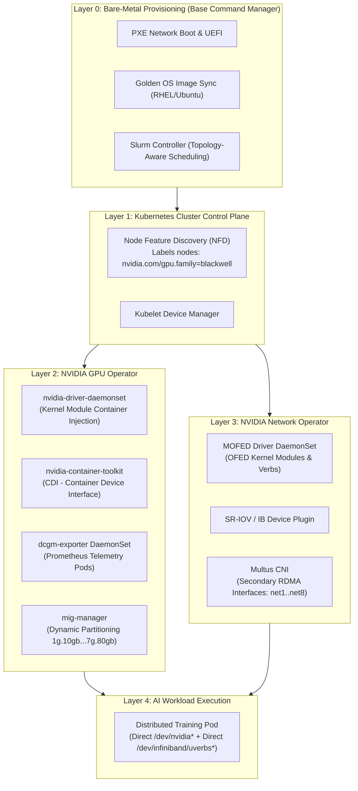

# Volume 29: Cloud-Native Orchestration: GPU Operator, Network Operator & BCM

```
====================================================================================================
MODULE 07: NVIDIA HARDWARE, SILICON INTERLINKS & LOW-LEVEL SYSTEMS ENGINEERING
VOLUME 29: CLOUD-NATIVE ORCHESTRATION, KUBERNETES OPERATORS & BASE COMMAND MANAGER
====================================================================================================
```

---

## 1. Executive Architectural Overview & Scaffolding

Managing thousands of GPUs in production introduces complex lifecycle and container orchestration hurdles:
* **Host Kernel vs Container Driver Mismatch**: Containers require access to the host GPU character devices (`/dev/nvidia*`). If host kernel modules desynchronize from userspace CUDA driver libraries (`libcuda.so`), jobs crash instantly with `CUDA driver version is insufficient for CUDA runtime version`.
* **Secondary High-Speed Networking in Containers**: Kubernetes default networking (Flannel, Calico) routes traffic through a single virtual Ethernet interface (`veth`) backed by the Linux TCP/IP stack. High-speed InfiniBand and RoCE fabrics require **kernel-bypass RDMA devices** injected directly into pods.
* **Bare-Metal OS Drift**: In hyperscale clusters (10,000+ GPUs), bare-metal node images inevitably experience configuration drift, stale firmware, and uncoordinated driver patches.

The **NVIDIA GPU Operator**, **NVIDIA Network Operator**, and **Base Command Manager (BCM)** automate the full lifecycle from bare-metal provisioning to cloud-native Kubernetes workloads.



---

## 2. NVIDIA GPU Operator Architecture

The **NVIDIA GPU Operator** manages the full lifecycle of NVIDIA software components on Kubernetes worker nodes using declarative Custom Resource Definitions (CRDs).

### 2.1 The Container Device Interface (CDI) Pipeline
Historically, Docker relied on custom runtime hooks (`nvidia-container-runtime`). Modern Kubernetes adopts the **Container Device Interface (CDI)** specification:
1. When `nvidia-container-toolkit` installs, it discovers all host physical GPUs, NVLink devices, and MIG partitions.
2. It generates a static JSON/YAML CDI specification at `/etc/cdi/nvidia.yaml`:
   ```yaml
   cdiVersion: "0.5.0"
   kind: "nvidia.com/gpu"
   devices:
     - name: "0"
       containerEdits:
         deviceNodes:
           - path: "/dev/nvidia0"
           - path: "/dev/nvidiactl"
           - path: "/dev/nvidia-uvm"
   ```
3. When Kubelet schedules a pod requesting `nvidia.com/gpu: 1`, the CRI runtime (containerd/CRI-O) injects only the designated device nodes directly into the pod's Linux cgroup and namespace, enforcing strict multi-tenant isolation.

### 2.2 Operator DaemonSet Components
The GPU Operator reconciles several essential daemonsets:
* **Node Feature Discovery (NFD)**: Probes PCI buses and labels nodes automatically:
  `nvidia.com/gpu.present=true`, `nvidia.com/gpu.count=8`, `nvidia.com/gpu.product=NVIDIA-H100-80GB-HBM3`.
* **Driver Container**: Compiles and inserts `nvidia.ko`, `nvidia-uvm.ko`, and `nvidia-modeset.ko` directly into the running host kernel without requiring a host reboot.
* **NVIDIA Device Plugin**: Exposes GPU capacity to Kubelet (`Allocatable: nvidia.com/gpu: 8`).
* **DCGM Exporter**: Scrapes GPU hardware metrics (SM utilization, HBM temperature, NVLink errors) and exports them to Prometheus on port `9400`.
* **MIG Manager**: Dynamically re-slices physical GPUs into Multi-Instance GPU partitions without manual sysadmin intervention.

---

## 3. NVIDIA Network Operator & Secondary RDMA Networks

Standard Kubernetes CNI plugins encapsulate traffic in VXLAN/Geneve overlays, incurring CPU kernel processing and packet fragmentation that destroy distributed training performance.

The **NVIDIA Network Operator** deploys the components required for line-rate GPUDirect RDMA inside containers:

```text
KUBERNETES CONTAINER NETWORKING ARCHITECTURE:
┌────────────────────────────────────────────────────────────────────────┐
│ Kubernetes Pod                                                         │
│   ├── eth0: Default Pod Network (Calico/Flannel for K8s Control Plane) │
│   ├── net1: RDMA Interface 1 (/dev/infiniband/uverbs0 -> mlx5_0)       │
│   ├── net2: RDMA Interface 2 (/dev/infiniband/uverbs1 -> mlx5_1)       │
│   └── ... up to net8 for 8-Rail Distributed Training                   │
└────────────────────────────────────────────────────────────────────────┘
```

1. **MOFED Container**: Injects Mellanox OpenFabrics Enterprise Distribution drivers (`mlx5_core`, `mlx5_ib`, `ib_uverbs`) into the host kernel.
2. **Multus CNI**: Enables pods to attach to multiple network interfaces simultaneously. Pods use `eth0` for Kubernetes API traffic and `net1..net8` for high-speed multi-rail RDMA.
3. **InfiniBand / SR-IOV Device Plugin**: Injects character device nodes (`/dev/infiniband/issm*`, `/dev/infiniband/umad*`, `/dev/infiniband/uverbs*`) into the pod container with locked memory limits (`IPC_LOCK`).

---

## 4. Base Command Manager (BCM) & Slurm Architecture

For large-scale AI supercomputers, **NVIDIA Base Command Manager (BCM)** (formerly Bright Cluster Manager) provisions and manages thousands of bare-metal servers.

### 4.1 Automated Bare-Metal Provisioning Pipeline
1. **Network Boot**: Discovers un-provisioned nodes via DHCP/PXE and boots a minimal Linux RAM-disk image.
2. **Hardware Validation**: Runs burn-in diagnostics (DCGM Level 1, PCIe link enumeration, SerDes link speed check).
3. **Image Provisioning**: Synchronizes a bit-exact "Golden Software Image" to local NVMe drives using high-speed BitTorrent/rsync protocols, ensuring zero OS drift across 10,000 nodes.
4. **Firmware Enforcement**: Automatically verifies and flashes matching firmware across GPU VBIOS, NVSwitch, and BlueField DPUs.

### 4.2 Topology-Aware Slurm Scheduling
In a large fat-tree network fabric, cross-rack communication traverses spine switches, incurring higher latency and potential bisection oversubscription.

BCM integrates with **Slurm** using a hierarchical topology configuration (`topology.conf`):
```text
# Slurm Topology Configuration (topology.conf)
SwitchName=spine1 Switches=leaf[1-4]
SwitchName=spine2 Switches=leaf[1-4]
SwitchName=leaf1 Nodes=node[001-032]
SwitchName=leaf2 Nodes=node[033-064]
```
When a multi-node distributed training job requests 32 nodes, Slurm's topology engine allocates nodes that share the **same physical leaf switch**, guaranteeing zero spine traversals for latency-sensitive AllReduce operations!

---

## 5. First-Principles Mathematics: Scheduling Locality & RDMA Injection Overhead

### 5.1 Topology-Aware Network Penalty Equation
Let $T_{\text{comm}}$ be the collective communication latency for a job spanning $N$ nodes.
If $k$ of those nodes reside across a spine switch with oversubscription ratio $R$ and additional hop latency $\Delta t_{\text{hop}}$:
$$T_{\text{comm}} = T_{\text{local}} + \left( \frac{k}{N} \right) \cdot \left( \Delta t_{\text{hop}} \times 2 + \frac{\text{Payload}}{\text{Bandwidth}_{\text{spine}} / R} \right)$$
In an un-coordinated scheduler where $k = \frac{N}{2}$ (nodes scattered randomly across racks), inter-node latency spikes by $3\times\text{--}5\times$, causing distributed NCCL training steps to degrade linearly.

---

## 6. Concrete Production Lab: GPU Operator & CDI Configuration

### 6.1 ClusterPolicy CRD for NVIDIA GPU Operator
Save this file as `gpu_operator_cluster_policy.yaml`:

```yaml
apiVersion: nvidia.com/v1
kind: ClusterPolicy
metadata:
  name: gpu-cluster-policy
spec:
  operator:
    defaultRuntime: containerd
    use_cdi: true
  
  driver:
    enabled: true
    version: "550.54.15"
    useOpenKernelModules: true
    repoConfig:
      configMapName: ""
    
  toolkit:
    enabled: true
    version: "v1.15.0-centos7"
    
  devicePlugin:
    enabled: true
    config:
      name: ""
      default: "any"
      
  dcgm:
    enabled: true
    
  dcgmExporter:
    enabled: true
    serviceMonitor:
      enabled: true
      interval: "15s"
      
  migManager:
    enabled: true
    defaultConfig: "all-disabled"
```

### 6.2 Slurm Topology Verification Script
Save this script as `slurm_topology_auditor.py`:

```python
#!/usr/bin/env python3
"""
Slurm Topology & Fabric Locality Auditor
Validates that allocated nodes reside within optimal leaf switch boundaries.
"""

from typing import Dict, List, Set

TOPOLOGY_MAP: Dict[str, List[str]] = {
    "leaf_switch_01": [f"dgx-node{i:02d}" for i in range(1, 9)],
    "leaf_switch_02": [f"dgx-node{i:02d}" for i in range(9, 17)],
    "leaf_switch_03": [f"dgx-node{i:02d}" for i in range(17, 25)],
    "leaf_switch_04": [f"dgx-node{i:02d}" for i in range(25, 33)],
}

def audit_job_allocation(job_nodes: List[str]) -> Dict[str, Any]:
    """Audit node distribution across physical leaf switches."""
    switch_distribution: Dict[str, List[str]] = {}
    
    for node in job_nodes:
        assigned_switch = "UNKNOWN"
        for sw, nodes in TOPOLOGY_MAP.items():
            if node in nodes:
                assigned_switch = sw
                break
        switch_distribution.setdefault(assigned_switch, []).append(node)
        
    num_switches = len(switch_distribution)
    is_optimal = num_switches == 1
    
    return {
        "job_node_count": len(job_nodes),
        "switches_spanned": num_switches,
        "is_single_switch_locality": is_optimal,
        "distribution": switch_distribution
    }

if __name__ == "__main__":
    print("=" * 80)
    print("SLURM TOPOLOGY & LOCALITY AUDITOR")
    print("=" * 80)
    
    # Test Scenario A: Optimal allocation (all 8 nodes on Leaf 1)
    alloc_a = [f"dgx-node{i:02d}" for i in range(1, 9)]
    res_a = audit_job_allocation(alloc_a)
    print(f"\nScenario A (Contiguous Allocation):")
    print(f" • Switches Spanned : {res_a['switches_spanned']}")
    print(f" • Locality Status  : {'✅ OPTIMAL (Single Switch)' if res_a['is_single_switch_locality'] else '⚠️ CROSS-SWITCH'}")
    
    # Test Scenario B: Fragmented allocation (nodes split across Leaf 1 and Leaf 3)
    alloc_b = ["dgx-node01", "dgx-node02", "dgx-node18", "dgx-node19"]
    res_b = audit_job_allocation(alloc_b)
    print(f"\nScenario B (Fragmented Allocation):")
    print(f" • Switches Spanned : {res_b['switches_spanned']}")
    print(f" • Locality Status  : {'✅ OPTIMAL (Single Switch)' if res_b['is_single_switch_locality'] else '⚠️ CROSS-SPINE TRAVERSAL (High Latency)'}")
```

---

## 7. Multi-Dimensional Correlation & Troubleshooting

```text
┌─────────────────────────────┬───────────────────────────────┬─────────────────────────────────────────────────────────┐
│ Failure Signature           │ Root Cause Layer              │ Diagnostic Triage & SRE Remediation Command             │
├─────────────────────────────┼───────────────────────────────┼─────────────────────────────────────────────────────────┤
│ Pod fails to start:         │ CDI specification missing or  │ Verify CDI JSON generation on worker node:              │
│ "unrecognized CDI device"   │ nvidia-container-toolkit crash│ $ cat /etc/cdi/nvidia.yaml                              │
│                             │                               │ Re-generate CDI: $ nvidia-ctk cdi generate --output=... │
├─────────────────────────────┼───────────────────────────────┼─────────────────────────────────────────────────────────┤
│ GPU Operator Driver         │ Linux kernel headers missing  │ Install exact kernel header package on host:            │
│ DaemonSet in CrashLoopBackOff│ on host OS (RHEL/Ubuntu)     │ $ apt-get install -y linux-headers-$(uname -r)          │
│                             │                               │ Check pod logs: $ kubectl logs -n gpu-operator -l ...   │
├─────────────────────────────┼───────────────────────────────┼─────────────────────────────────────────────────────────┤
│ Pod cannot access secondary │ Multus CNI NetworkAttachment  │ Verify Multus CRD definition in namespace:              │
│ RDMA net1 interface         │ Definition missing            │ $ kubectl get network-attachment-definitions            │
│                             │                               │ Check SR-IOV device plugin allocation logs.             │
├─────────────────────────────┼───────────────────────────────┼─────────────────────────────────────────────────────────┤
│ BCM node fails PXE boot     │ DHCP/TFTP lease exhausted or  │ Query BCM management daemon:                            │
│ during cluster scale-out    │ MAC address desynchronization │ $ cmsh -c "device status <nodename>"                    │
│                             │                               │ Verify switch port VLAN configuration.                  │
└─────────────────────────────┴───────────────────────────────┴─────────────────────────────────────────────────────────┘
```

---

## 8. Summary & Technical Takeaways

1. **Automated Lifecycle Management**: The NVIDIA GPU Operator eliminates manual driver and runtime maintenance on Kubernetes worker nodes using declarative ClusterPolicy CRDs.
2. **Container Device Interface (CDI)**: Standardized CDI JSON schemas replace legacy Docker hooks, enabling secure, isolated device injection into container namespaces.
3. **Multi-Rail RDMA via Multus**: High-speed AI training pods require secondary network interfaces (`net1..net8`) managed by Multus CNI and the Network Operator to achieve kernel-bypass GPUDirect RDMA.
4. **Topology-Aware Orchestration**: Base Command Manager and Slurm enforce leaf-switch locality, preventing latency-degrading spine switch traversals in massive scale-out clusters.
